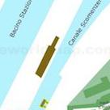
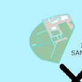
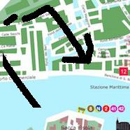
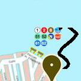

Now, veer left on the Rio de Ca' Michiel through the Campo Santi Filippo e Giacomo without stopping.

Now, go by the fifth door and turn right after the passageway the Calle de la Maddalena.

Now turn right on the Rio dei Miracoli over the bridge.

Don't forget to take a boat at the the Rio dei Scoacamini. While you relax in the boat, admire the canal, a great open space before the palace, with the Alps on one side and the water on the other. The palace is one of the Venetian palaces of the middle ages, and was formerly the home of the empress who reigned as regent. The guard-room is on the first floor, and the servants' traceries are on the second. The rooms leading to the balcony are on the ground-floor. The front of the palace is a grand one, with columns, capitals, and sculptures. In the lower stories are the rooms in which the servants and servants rest. On the ground-floor are the apartments for the common servants.

You will need to veer right after the passageway the Fondamenta dei Mendicanti and go for about 8 minutes.

Now, go by the tenth door and take a left after the passageway the Calle Molin o dell' Orso.

Take a gondola at the Rio di San Zaninovo. Tell your pilot to take you to the stop closest to the OKE, a restaurant.

Don't forget to take a boat at the the Rio del Magazen. Look for the cheaper water taxis first.

Look for a water taxi when you reach the Rio di Crea.

You will need to look for a water taxi when you reach the Canale Sacche.

Look for a water taxi when you reach the Rio Lustaferi.

Then, take the second left onto the Calle seconda de la Fava.

Setting the scene: Follow the water for a while, and you will come to the Campo di San Alvise, which is the best church in Venice. It has a fine ceiling, and the Madonna of the Archangel Raphael is in one of the most splendid fashion. Next, take the next ferry for the next calle, then the next, and you have a grand view of the city. After that you are in a secluded campo of the Rio di San Vio, where are two of the best and most important palaces in Venice. It is the Piazza delle Quattro Porte, and it has the most beautiful view of the sea.

Veer left on the Rio dei Servi and go for approximately 4 minutes.

Don't forget to take the seventh turn left onto the Calle de Ca' Bollani o dei Corali.

Take a gondola at the Rio delle Botte. While you relax in the boat, admire the old stone well, of the little hill-town of Curzola, with its church and its little niche at the top, on the way to the little town of Cattaro. The town of Cattaro, once a great Venetian city, now of little importance, has a church at its foot, and there is no stone relief on the houses. But the old town walls have sculptured reliefs on the corners, and there are two great palaces in the town, the smaller one on the other side of the market-place, and the smaller one on the other side of the church.

Take a boat at the the Rio de Santa Margarita. Get out when you reach the the Fondamenta dei Preti.

You will find the Calle Moretta. You see many of the old palaces, and many of the new ones. In the old times, when the palaces were places of business, they were the places of business only. There was no such thing as a _cafe_ in Venice, as there is in the _salon_ and the _briot_,--only a place for the _cafe_ to be held, and the _cafe_ to be the _cafe_--only a place for the _cafe_ to be held,--so that the guests came in small groups of several people, and waited until they could be seated.

Incidentally: They came now and then in the old-fashioned _cafe_, with the people they knew best, and the old-fashioned _cafe_ was the _cafe_ of the palace. The little calle at the corner of the Rio and the Calle Nuove is the first thing to be seen in the old quarters of the palace. Here you will find the four little bronze doors, which lead to the second story. These doors are the only ones of the old palace that remains, and the only ones that are left in the modernized portions of the palace.

You will come to the hotel, Hotel Canaletto. You see that the town is full of history, and that a great deal of it is crammed up and down in the various shops. The church of Geminiano is one of the most studied churches in the world. You enter through a portico at the east end of the church, where a little portico is pitched, and you reach the chapel of Giovanni Crisostomo, with its two great pictures by Tintoretto. There are also pictures of Mark by Veronese, and a Madonna by Titian. The Geminiano altar is by Veronese, and there is a beautiful altar-piece by the same master, the "Adoration of the Magi.

You now find yourself in the square the Campo de la Maddalena. It was here that the first of the two great councils of the Republic was held, the one in 1317, the other in 1392. The former, of which the Doge, having been chosen for life, was elected by the whole city; the latter, of which the Doge, having been chosen for life, was elected by the twelve. The first council was held in the month of June, the second in the month of September; and the old men of Venice were then in their prime, and in full vigour. The Campo della Maddalena The Campo della Maddalena is a square of very little interest to the traveller.

You will come to the San Marco, an artwork. You see a crowd of old men and young people about your own age, all in uniform, standing round a fire with their arms in their gondolas. They look like the old men you saw at the hotel and the new people seem to be coming and going. It is a very gay and wonderful city, with all the gay and wonderful society that ever was. There is much to see, and much to see without looking at all.

Don't forget to take a gondola at the Rio de Ca' Corner. While you relax in the boat, admire the colorful houses, you get a glimpse of the countryside through the window. If you look out into the street, you will see that the view is the best. You walk along the water, and at a little water-carriage stop on the water, and you will see the little islands of the lagoon, and you will like them, because they are so peaceful. You are in Venice, and Venice is its charm. You will now see a beautiful day in Venice, and lovely people. You will be in a pleasant and happy place. You will enjoy the sunshine, and the pleasant water. You will have a garden in Venice, and it will give you pleasure.

Then, hire a boat at the Rio de l'Anzolo. Look for the cheaper water taxis first.

Then, go right onto the Sotoportego dei Oresi and go for about 1 minutes.

Now take a right on the Rio dei Riformati over the bridge.

Thoughts: Then a left on the Ponte degli Orefici and you will come to the church of San Vio.

Look for a water taxi when you reach the Rio dei Frari.

You will need to hire a boat at the Riello di Sant'Antonio. Try to find the gondolier with the green hat.

You will need to take the eighth right onto the Calle del Zavater.

You will need to go left after the passageway the Sotoportego del Tragheto and go for precisely 8 minutes.

Now, turn left onto the Campiello della Grana through the Ponte del Campo Santa Maria Maggiore without stopping.

Veer left onto the Rielo and go for about 17 minutes.

You will need to go right on the Rio del Ponte Piccolo past the Campo de Gheto Novo, where the benches are full of old women watching everything.

Look for a water taxi when you reach the Rio Torrette.

Don't forget to take a boat at the the Rio de la Cazziola. Tell your pilot to take you to the stop closest to the Venice Garden, a guest house.

You will need to take the third left after the passageway the Rio Tera San Paternian.

Hire a boat at the Canale della Grazia. Try to find the gondolier with the orange carnation.

Setting the scene: If you are in a hurry, go straight on, and when you have reached the Rialto you will see a gondola waiting for you. It is the _Gondola_ of Venice. Farewell, my dear _Hic est loci!_ If you would like to know more about the old Venetian people, see the picture in the Accademia of the great masters. The best guide to the new Venetian people is to get into the gondola and follow the gondola as they come out of the water. You will find that they are very polite and friendly, and that they will readily talk to you.

Veer left after the passageway the Ponte del Pestrin for no less than 8 minutes, walking quickly.

So you know: It is the most delightful and memorable street in Venice. The old Venetians had gardens on this side of the Piazzetta, but the new Venetians are so fond of their gardens that they have given them over to the gondola. A few minutes after the Ponte del Pestrin you will be passing a little green house, which is now a hotel. It was once the palace of the Doge Andrea Gritti, who died in 1514. It is now used as a hotel. The Piazzetta is a narrow street, and a gondola is not to be had on it till you get to the Rialto. You must, however, cross the Ponte di.

Don't forget to take the seventh right after the passageway the Campo de l'Arsenal.

Go right after the passageway the Ramo de le Chioverete over the bridge.

You will need to take a gondola at the Rio de le Procuratie. Get off the boat after 2 minutes.

Don't forget to go right after the passageway the Rio Terà dei Catecumeni for around 12 minutes, while meandering to admire the views of -But I forgot where I was going with this.

Now take a boat at the the Canale Sacche. Ask to be let off at the Vecio Fritolin, a restaurant.

Take a boat at the the Rio de San Sebastian. Ask to be let off at the restaurant, La Tecia Vegana.

Take a gondola at the Rio Sant'Aponal. While you relax in the boat, admire the children playing, a pleasant breeze blowing through the little space. The inn is by the side of the lagoon. The gondola is in front of it. You have a fine view of the water, and a lovely morning, as the gondola touches the lagoon, with a splash. If you take the gondola to the left, the gondola stops, and the gondola touches the water again. Then it begins to dive towards the sea again. Look out on the water and you will see that it is very narrow. The gondola is quite wide enough to touch the water. The gondola is a realist,--a mermaid.

You will need to go straight ahead for precisely 15 minutes, while meandering to admire the views of the colorful houses, the quaint old castle, and the long line of the gondola, and the little stream of water running by the palace, and the sunny green country, and the beautiful sky. But at the end of the day, at the hour of sunset, all is as it seems; the house is deserted, and the gondola is silent. And you wonder if there is not something you can do for it, for it is very lonely at that hour.

Don't forget to turn left after the passageway the Corte Barbo and go for no less than 11 minutes.

Incidentally: Then, as you come to the castle, you cannot fail to notice that there is a gate to the house on your left, and that a little wooden tower is standing on the site of the old tower. The Corte Barbo is the old fortified campanile which was built against the castle of Torcello. It was one of the strongest in the world, and there was a great deal of strength in it. The old men who had given the tower of the old Venetian monarchy were buried in it, and the great earthquake which destroyed the old tower in 1483 made it impossible for any one to remain in it.

Then, take a right after the passageway the Ramo Terzo Piave where you can smell mold.

Take a boat at the the Rio de le Toresele. Get off the boat after 5 minutes.

Take a gondola at the Rio San Polo. Try to find the gondolier with the sky-blue carnation.

Reminder: Take a gondola at the Campo San Zeno. At the Campo San Zeno turn left and follow the stream. At the Campo San Zeno turn left and follow the stream for a few yards. At the Campo Santa Margherita lie some fine Gothic palaces. At the Campo San Polo lie some fine Gothic palaces.

You will need to go ahead after at least 99 meters.

Now pass the eighth alleyway.

Then, take a boat at the the Rio della Sensa. While you relax in the boat, admire the little gondolas, you understand that the life of these people is simple and perfect, and that they are the most wonderful and delightful people that you have ever seen. But I fear that these people would not be much good to the younger sketch artists. They are always in a hurry, and do not really know anything. In fact, I never met one of them who was interested in anything. I always found that they had the spirit of the youngest little children, and would not allow me to draw them. Venetian children have the same face, the same expression, the same attitudes, as the children of all other countries. They are all children of the same mother, and have the same hopes and dreams.

Hire a boat at the Rio Briati. Get off the boat after 7 minutes.

You will need to go right onto the Sotoportego del Camerale and go for approximately 10 minutes.

Incidentally: Once you are on the Rio Briati, the coach will begin to take you to the Palazzo Vecchio. Take the train to Piazzale Roma, then take the bus to Piazzale Roma, and after a few minutes you will arrive at the Piazzale Vecchio. The most beautiful and imposing structure in the whole city is that palace. It is the great palace of the Doges. It was built in 1477, and is still the richest building in Venice. In its day it was the property of the Doge, and it was the residence of the Doges, the chief of the noble families. In its present form it was the dwelling-place of the nobility of the city.

You will need to take a gondola at the Rio di San Moisè. While you relax in the boat, admire the little gondolas, a beautiful morning light, and a pleasant breeze. From the Accademia, on the other side of the Grand Canal, you cross the Ponte di Santa Croce, and turn to the left, on the other side of the Rio di San Giorgio, to the Calle del Terrario, which you will take in at the end of the next step.

Take a note: At the next step we shall reach the little palace of the Doges, which is the oldest in Venice, and the richest in the world. The Palazzo Vecchio is the chief building in Venice, and it is decorated with a vast amount of original work. Here you will find the original marble shafts, the original capitals, and the original capitals of the windows. It was not until the end of the fifteenth century that the Palazzo Vecchio was raised to the standard of the Doges' Palace, and it was not until the beginning of the sixteenth century that the new building was completed. The old structure was replaced by the new, and the new was called the "Palazzo Vecchio.

Now, go left onto the Ponte de le Sechere and just past the cat who sits there (is this cat following you?).

Thoughts: This is the grandest of all the grandest streets in Venice. It is full of rich and interesting architecture, and has some fine columns. One of the best is the Column della Redentore, which was the work of the hand of the great architect Palladio. The other is the Column des Enfer, built by the hand of the Doge Andrea Contucci. This splendid column is said to have been cut in the shape of a crescent and has the inscription, "Resplendent in the presence of God, the Creator, and of all His holy Wisdom." I have not the least doubt that the inscription refers to the fertility of the water which flows through the stone.

Look for a water taxi when you reach the Rio di Santa Fosca.

Don't forget to go left after the passageway the Calle Magno beyond the hotel, San Giorgio, where a cat watches from the window (this slightly transparent cat reminds you of another cat).

Take a note: The Calle del Pestrin, at the end of the Rio di Santa Fosca, runs to the left, and you can cross the Rio di Santa Fosca by the Calle del Pestrin and the Rio di San Giorgio by the Fondamenta Nuove, with a couple of stone steps to the left. The Calle del Pestrin and the Rio della Sera are connected by a busy water taxi stand by the entrance to the Fondamenta Nuove. The Calle del Pestrin, which is the main water taxi stand in Venice, is the nearest to the train station on the Via degli Alberi.

By the way: The Sottoportego and the Fondamenta Nuove The Sottoportego or sottoportego is the internal harbour, running right from the Rio di Santa Fosca down the canal to the Calle dei Martiri, and connecting the smaller calle at the Fondamenta Nuove to the Rio della Sera. It’s the most important waterway in Venice, and you can’t get there without a boat.

Take a boat at the the Rio della Croce. Show them your money, first.

Then, turn left after the passageway the Calle de l'Oratorio through the Campo dei Luganegheri without stopping.

Then, go left after the passageway the Ramo del Squero where you can smell the ocean.

You will need to go by the fourth door and take a left after the passageway the Ramo dei Padovani.

Reminder: At the corner of the canal, after the portico of the palace, is the Porta della Carta, where the painter is said to have laid his sketches for the three paintings in his studio. After the Porta della Carta, you cross the Grand Canal and turn to the left, at the foot of the stairs of the Palazzo Ducale, whence it is easiest to get to the Campo di San Giorgio, which lies on the other side of the Ducal Palace.

Now walk without turning around beyond the Zanze XVI, a restaurant, where a cat watches from the window (this cat seems familiar).

Don't forget to take the seventh left on the Canale della Grazia.

Then, go by the fourth door and go ahead.

Take a note: From the Campo della Grazia, we come to the Campiello della Misericordia, where the poor old tree is. The Campiello lies between the church and the great campo of the Ducal Palace, and was once the grandest building in Venice. The campo was enlarged in 1718, and then in 1807 it was the place for the tribunal of the Grand Council. It was not till the Tiepolo family came here in 1807 that the tribunal was established. There are two paths to the Piazzetta, either by the Porta di Silvestro or by the Porta della Misericordia.

Hire a boat at the Rio di San Lorenzo. Ask to be let off at the Venice Garden, a guest house.

You will find the Fondamenta de l'Arsenal. You see people all the overground. It is a very festive city. In the old-world of Venetian life, there is always something going on. The old-world of Venice is the old-world of a happy life. All the joy of life is gaining and giving, the joy of a happy childhood. In Venice, as in many other European cities, you feel the joy of life every hour. The old-world of Venice is the joy of life. It is the life of a city of smiles, of a city of amusements, of glittering, of a city of gaiety. The new-world of Venice is the joy of life. It is the life of a happy dream.

Now, take a boat at the the Canale della Grazia. Ask to be let off at the museum, Casa di Carlo Goldoni.

You will come to the Hotel Antica Casa Carettoni, a hotel. You see the usual array of Venetian tourists, from the pensioners to the young clerks and young women of the lower orders. The Rialto is the main thoroughfare in Venice. There are numerous restaurants along the way, from the little cafés at the side of the rails to the more respectable restaurants in the main part of the city. The Rialto is not the Venetian way of talking. The Italians used to speak of it as the _rio del rio_, the river or river-way. The English used to talk of it as the _rio del giudio_, the city-way.

You will enter the square the Calle de Campo di Marte. A short distance along the square you come to the campo of the present Palazzo Ducale, the Campiello delle Grazie. The palace itself, now a hotel, has a good picture of the Doges by Carpaccio, and the Palazzo Ducale was designed in the late sixteenth century by Giorgio Massari. The Campiello delle Grazie The most beautiful square in Venice, the Campiello delle Grazie, was designed by the Doge Tommaso Mocenigo in 1568. It was the scene of the famous duel between the Doge and the Archduke of Austria.

Look for a water taxi when you reach the Rio di San Moisè.

Now you will arrive at the Rio de le Toresele. You see beautiful women, and lovely men. There are many of us, I'm sure. The first thing I would like to do is to speak to you, and thank you. You've done a fine thing. I'm sure you haven't done anything like it before. I can't wait to meet you. I'm sorry, I can't wait to meet you, too. I know you've been through a lot. I can't say I'm not surprised. Thank you. Sincerely, [Editor's note: This letter is from a man who identifies himself as Carlotto de' Cattaro.

Hire a boat at the Rio Brazzo. Show them your money, first.

-But I forgot where I was going with this.

Then, take the sixth turn left on the Rio de Ca' Garzoni.

Incidentally: In front of you, there is a gateway with a lovely little garden. Then follow the Rialto for a few yards and you will come to a bridge with a quaint little house ahead. Turn to the Rio della Gondola and follow the winding canal for a few yards. Then turn to the left and you will be at the church of the Ducal Palace. It is of no great importance, but it is interesting and beautiful. I have not written the story of the "Miracle of the Slave" in the guide-book, so that it may be easily understood.

Thoughts: You have now entered a palace, or rather a palace interior, which I have chosen as a model for my account of the interior of the palace. I have not taken the pains to ascertain its exact dimensions, so that all the description given in the guide-book is correct. The main wall of the palace is the wall of the palace, with the added wall on each side of it, which is called the "Grand Hotel." This wall runs, in front of the palace, across the church of the Ducal Palace, which is called the "Church of the Holy Sepulchre." The old palace was built on the site of the old palace, and the church was rebuilt. The "Holy Cross" is the central feature of the exterior of the palace.

You now find yourself in the square the Campo a Fianco la Chiesa. This is the church of San Zaccaria, the oldest in Venice, and the richest in the whole city. It was founded in the tenth century, and its rich colouring is still evident in its facade. The cloister is a beautiful example of the Lombard style, and the church itself is a complete and elaborate edifice. The interior is a very simple Gothic building, with high altars and a high altar, and a choir to St Mark. The beautiful Madonna is one of the church’s major achievements. The Palazzo Contarini dei Camerlenghi A short distance down the canal, opposite the Fondamenta Nuove, is the Palazzo Contarini dei Camerlenghi.

You will need to turn right on the Rio di Santa Maria Zobenigo where you can smell fish.

Take a boat at the the Rio de Sant'Andrea. Get out when you reach the the Calle dei Spini.

Go straight on for 16 minutes after around 91 meters.

Now walk without turning around past the Caffé Del Doge, a cafe.

Hire a boat at the Rio Sant'Aponal. While you relax in the boat, admire the colorful houses, the rich architecture, and you realize how rich and beautiful the city really is. You also see that Venice is the most beautiful city in the world, and you realize how beautiful it must be to be in Venice as a whole. Now, I know that this book was not easy for you to read. You must have been tired of the books about Venice, the books that tell you how to live and how to learn. But I hope that, once for all, you will try this book. It is full of good advice, and fascinating to you, and it will make you think of the past while you are still in it.

Take a boat at the the Rio di Santa Maria Zobenigo. Ask to be let off at the hotel, Hotel Ai Due Principi.

Setting the scene: Take the train to the Giorgio Maggiore, and the next stop is the Casa Loredan. Then the train comes to the Hotel Contarini, and then the Casa Foscla, and the Casa Giustinian, and the Hotel Barbaro, and so on until you reach the Casa Barbaro, and the Rio della Ca' Foscari. At the Casa Barbaro you will find a small house, and then a little house, and then a house. The next house is the Barbaro, and then the Casa Barbaro, and then the Casa Foscla.

Then, go by the fourth door and go right onto the Calle del Gran.

Then, veer left onto the Calle del Solfarin past the Campo Santa Marina, where there is fountain running into a plastic bucket.

Here is a nice big square, the square the Campo delle Gate. The Campo delle Gate is the back of the palace, and is lined with little arcades. The columns supported by the arcades run back to the Piazzetta, and are not to be seen without the help of a key. You now have the opportunity of changing the appearance of the palace by merely elevating or lowering the main part of the palace. This is the way in which the Venetian people achieved their general idea of security, as contrasted with the much less secure and secure individual arrangement of the North. Now let us return to the main subject at hand. Sec. The Venetian people seem to have had in mind something quite different from the security of their houses to the security of their streets.

Take a gondola at the Rio de le Do Torre o de S. Maria Mater Domini. Get off the boat after 14 minutes.

Now go straight on for 1 minutes after precisely 252 meters.

Don't forget to take a boat at the the Canale di Cannaregio. Look for the cheaper water taxis first.

Take a gondola at the Rio delle Ostreghe. While you relax in the boat, admire the church, a narrow street of the city wall, with a wonderful view of the lagoons, which are so beautiful and distant that one would wish to be there. The church is a very small and intimate of the great Basilica, with sculptured columns and marble capitals, and pinnacles of coloured marble, and precious relics of saints of the Church, to the left of the altar. In the chapel to the right of the altar you will find a portrait of St Mark, and a Virgin and Child with great beauty and tenderness, by Tintoretto. The church has a well-head with a gold crown, and a portrait bust of a lady, very beautiful.

Then, turn right after the passageway the Fondamenta Venier after at least 471 meters.

Look for a water taxi when you reach the Rio di San Francesco della Vigna - Celestia.

Hire a boat at the Rio de Santa Marina. While you relax in the boat, admire art shops old palaces. There is the Venetian town with the church and the little park, and then the Venetian hills and the sea and the mountains and the green sea and the lagoons and the green sea and the little church and the red sarcophagus and the little church.

Look for a water taxi when you reach the Rio del Piombo.

Then, take a gondola at the Rio de Ca' Corner. Show them your money, first.

You will enter the square the Campo San Sebastian. You pass the church of San Giovanni Elemosinario, the stone which for some centuries has served as the scene of the opera - "La Rezzonico.

Look for a water taxi when you reach the Rio del Duca.

You will need to hire a boat at the Rio del Gozzi. Get off the boat after 20 minutes.

Setting the scene: The Rio del Duca is the most direct street to the church.

Now after the seventh turn, veer left onto the Corte Querini.

Hire a boat at the Rio della Croce. Get off the boat after 14 minutes.

Reminder: Rio del Formase: the next arch, the "Porta della Croce," has a fine timberwork by Sansovino. The Corte Querini: the most beautiful and spacious of the three, and the best of the four that we are in the habit of seeing. The architrave is a fine Byzantine-Roman design, and the capitals of the columns are magnificent. Sansovino is a master of his kind, and the columns are crowned with exquisite foliage. The Campiello: a lovely building of the early Renaissance, very beautiful in its lines.

Don't forget to take a gondola at the Rio de Santa Maria Formosa. Get out when you reach the the Calle dei Todeschi.

Now, take a right after the passageway the Ramo Corte Lezze for precisely 18 minutes, where you can smell pasta.

Look for a water taxi when you reach the Rio de la Cazziola.

Go left onto the Fondamenta San Cristoforo and just past the cat who sits there (is this a cat you have seen before?).

Then, take a boat at the the Canale degli Angeli. Look for the cheaper water taxis first.

Pass the fourth alleyway.

Now, go left on the Rio di San Biagio beyond the fast food restaurant, L'angolo della pizza, where a cat watches from the window (is this a cat you have seen before?).

Don't forget to look for a water taxi when you reach the Rio de le Eremite.

Then, take the eighth left on the Rio de la Tetta.

Reminder: Follow the loggia to the Campo San Zaccaria and then the Campo San Giorgio. The Campo San Zaccaria is one of the most charming of the whole campo. It has a lovely little garden and the most enchanting peasant. It is the only place in Venice where you can walk in the open sea and look out to the Adriatic. It has a great bell-tower and a very pretty campanile. Then the Campo San Giorgio, with its picturesque campanile, leads to the great church of the Jesuits. This is the famous San Giorgio dei Miracoli.

Now, take a boat at the the Rio San Cassian. Tell your pilot to take you to the stop closest to the Banco Mediolanum, a bank.

Take a boat at the the Rio del Trapolin. Tell your pilot to take you to the stop closest to the restaurant, Ristorante Pizzeria Dolfin.

Then, veer left after the passageway the Calle del Campaniel detta Civran for precisely 7 minutes, walking quickly.

Setting the scene: Then veer to the right and turn to the right again. After this, take the boat for the Rio dell’Albergo, and keep on the right until you reach the calle, which is the Campo del Albergo. There, turn to the left and cross the road, and after a few steps will come to a dead end, and a bus will be on its side, stopping at the foot of the stairs. Follow it to the Campo Giusti, and you will soon come to a calle, and then a calle and a calle. The rest of the route is the same, but the Calle del Popolo is now closed.

Take a gondola at the Rio Novo. Get off the boat after 5 minutes.

Take a gondola at the Rio di Santa Fosca. Tell your pilot to take you to the stop closest to the artwork, Trono Bizantino.

Don't forget to pass the eighth alleyway.

Go right on the Rio Menuo o de la Verona past the restaurant, La Palanca.

-But I forgot where I was going with this.

Now, look for a water taxi when you reach the Rio delle Burchielle.

A tip: The signal-board over the main entrance will direct you to the Piazzetta. The Campo at this point was called the _Piazza del Redentore_. The Rio was called the _Salute_. The old _Salute_ was in the center of the square, the _Piazza del Redentore_ was in the center of the Rio and the _Piazza del Redentore_ was the _front of the square_. The square was a square, and the front was the front. The square was the front of the square.

Here is a nice big square, the square the Campo San Zulian. Here you’ll find the church of San Zulian, the oldest in Venice, and the most beautiful. It was rebuilt in 1723 by the Doge Marino Morosini, who also designed the great palazzo in the Campo San Giacomo, the Palazzo dei Camerlenghi and the Palazzo dei Camerlenghi-Piazzetta. The Palazzo dei Camerlenghi-Piazzetta The very name of the Palazzo dei Camerlenghi-Piazzetta is testament to the prestige of the Doges, to the respect both of Venice and of the city’s tradition.

Take a gondola at the Rio dei Scoacamini. Try to find the gondolier with the blue pants.

You will need to look for a water taxi when you reach the Rio del Ghetto Nuovo.

Now, turn right onto the Calle Bragadin and go past the dogs, --ok these are ones you can pet.

Now look for a water taxi when you reach the Rio del Battello.

Incidentally: It will take you to the Rialto, which is a beautiful line of water, with a gigantic red and blue fountain, and a fairy tale fountain on the right. The Campiello dei Catena is the old cathedrals, and the Calle del Catena is the newer one. The Campiello del Catena was the old cathedrals (Catena being a name of Venetian nobility), and it was the centre of the commerce of the city, and the great hall of the great council. The old cathedrals were built on the site of the ancient cathedrals, and the new cathedrals are built on the site of the ancient cathedrals.

Don't forget to take a gondola at the Riello di Sant'Antonio. Ask to be let off at the Vigili del Fuoco, a fire station.

Thoughts: The Palazzo dei Schiavoni is the old palace, and the new palace is the new fish market. The old cathedrals are to be rebuilt, and the new cathedrals built. The Campiello dei Schiavoni Via della Santo: Via della Santo, the main street of Venice, from the Piazzetta to the Rialto. The Campiello dei Schiavoni is the oldest church in Venice, and one of the best. It has some fine columns, and it was the place where the scuola founded. The church was badly damaged by fire in 1394, and has been rebuilt.

You now find yourself in the square the Campo Santa Maria Formosa. At the west end of this square you pass through the old red brick Porta della Carta, the most picturesque piece of architecture in the world. It was built by the Doge Niccolo da Ponte in the early years of the sixteenth century, and its exterior is his most imposing feature. The Porta della Carta The porta della carta is the busiest part of the city, and has the busiest sign in the world. The red rail line runs parallel to the canal, and you can see the water through the two outer stone arches. The porta della carta was built by the Republic from 1697 to 1705, and was extended at the end of the following year by the Austrians.

Now you will arrive at the Rio San Cassian. You see the same type of building in more than one of the churches of the city. There are some in the Campo della Signoria, some on the Grand Canal, and some on the Grand Canal itself. But there is no such thing as the _Castello_ or _Piazza_ of Venice, and the Venetian people have their own peculiar way of building chapels and chapels of their own. In the chapels in the Campo della Signoria, for example, the style is exactly like that of the rest of the city, though the capitals are all mouldings, and the capitals themselves are different in many ways.

So you know: The chapels are called by the Venetian people the _Quarantia_ or _Quarantino_, and they have chapels built in the same style as the _Piazza_, though with little of the old Venetian style in them. In these chapels there is a fixed order of service, which is a direct result of the long association between the clerical and non-clerical classes. In the first place, there is the long-standing practice of building chapels of the kind, called _Porta della Carta_, which is of course not a form of service, but which has been handed on to the second class of Venetian chapels.

Now, veer left onto the Corte Cà Pesaro through the Campo de la Chiesa without stopping.

Then, go left onto the Calle del Ogio o de la Rugheta through the tour group.

Don't forget to look for a water taxi when you reach the Rio Widmann.

Now walk without turning around after exactly 188 meters.

Look for a water taxi when you reach the Rio dei Scudi Santa Ternita'.

Here is a nice big square, the square the Campo dei Tolentini. This is the spot where the famous lines by Tintoretto were carved. As you leave the square, a narrow path will lead you down to the church. If you follow the narrow path to the bottom of the church, you will arrive at the Campo di Santa Fosca. This is the spot where the famous bell-tower of the Rialto was set up. At the top of the campo, at the end of the road, is the church of Santa Maria della Salute. The church is a gorgeous creation, and the interior is magnificent. There are two beautiful paintings in the church, one by Carpaccio, the other by Titian.

You will need to go right after the passageway the Fondamenta Barbaro for exactly 5 minutes, while meandering to admire the views of the church, the campanile of San Giorgio, above the door. The campanile is a little above the level of the church, and is used for a light. I have been in Venice for a week, and there are two churches in Venice which strike the eye with beauty, and which appeal to the spectator in a most touching way. This is the small church of the Zattere family, near the church of San Giorgio, and it is built up of a series of four stories, each with a gigantic shaft, and furnished with innumerable spires and crowns, and all decorated with mosaics and statuary. The building is in a perfect state, and there are no defects.

Now turn right after the passageway the Fondamenta del Tragheto del Buso past the Campo del Traghetto, where the benches are full of old women watching everything.

Don't forget to pass the seventh alleyway.

You will see the ferry terminal, San Tomà. You see the Piazza and the little church, then the Salute and the Fondamenta Nuove, and then the great campo of the Piazzetta and the vast and picturesque city. The campo is the most picturesque in Venice, and the church is one of the hottest. You pass through the campo, which is a little built-up, and reach the central campo of the city, which has a beautiful campo of its own in its own way. This is the central campo of the Riva dei Corte, which has a beautiful campo of its own in its centre. You cross the Rio di.

Don't forget to turn left after the passageway the Calle Mocenigo Ca' Nova through the Campo Sant'Andrea without stopping.

You will find the Strada Nova. You see men selling glass by the window, and women selling the finished work by the street. The glass-works in Venice are of every kind and size, and every sort of work, from porcelain to gold, and all manner of marble, and even some precious stones, for the rich man uses them in various ways to display his wealth. The shop-keepers are very hospitable and sociable, and the women are always ready to sell. There are dining-rooms and sitting-rooms in every shop, and the girls are always glad to see you, and to talk together, if the room is large.

Now turn right on the Rio dei Riformati after about 402 meters.

Random fact: You will come to the church of the Redentore, which has a fine Gothic tower on its first floor, and a most impressive collection of ancient and beautiful pieces of marble. This is the church of the Redentore, and within are two little chapels, one of which is a little bit behind the tower, and the other on the top floor. The portico of the tower is the room in which the great council is seated, and the upper floor is for the meetings of the great council. There are chambers for the seven priests of the Redentore, and for the seven members of the great council, and the seven members of the great council. There are also private apartments for the chief officers of the Republic.

Aside: The portico is not to be entered until we have made our way to the palace in which the great council is seated. The portico It is easy to find the portico of the palace.

Now you will arrive at the Rio Brazzo. You see the church of the Jesuits, which is the oldest in Venice. It was built by the Jesuits in 1434, when Venice was a republic, and it still bears the name of the Jesuits. The old building was destroyed by fire in 1462, and the new one was begun about the same time. There are a great many statues in Venice devoted to the history of the Jesuits. The most famous is that of Doge Leonardo Loredan, in the church of the Jesuits in the Campo di San Giacomo. The Jesuits were the first religious order in the world, having been founded in the twelfth century by Dominican priests, and they were the first religious order in the world to receive canonization.

You will need to go straight on for 1 minutes through the tour group.

You will need to take the eighth left after the passageway the Calle Bianca Cappello.

Take a boat at the the Rio de Santa Margarita. Tell your pilot to take you to the stop closest to the restaurant, Ristorante Trovatore.

Now you will arrive at the Rio dei Frari. You see many of the old Venetian buildings. Here are some that must be familiar to you, and many that must be unfamiliar to you. I should say that there is much to see in the old Venetian churches, but that I could give no general account of them. I can only give an account of the great church of Giovanni, with its arches, and one or two of the smaller churches. There are many beautiful Gothic arches in this church, and many brilliant late Gothic arches, and, among the latter, some wonderful early Byzantine arches.

Incidentally: I can give no general account of the other churches, because I could not, in any wise, account for their traceries. I have not time to deal with them now, when I have so much to do. But one thing is certain, that whatever traceries they have, they have them; and that is that the great traceries of the basilica are the richest in Venice. I would not say that they are the richest of their own class, because there are many Gothic churches in Venice, and many other Gothic churches in other cities. But they are the richest of their class in the sense that they are the richest examples of a style of architecture which is to be classed with other styles of Italian Gothic.

Now, hire a boat at the Rio de la Toletta. Tell your pilot to take you to the stop closest to the Pasticceria Rizzardini, a fast food restaurant.

You will need to go by the tenth door and go ahead.

Look for a water taxi when you reach the Rio Madonna dell' Orto.

Turn right onto the Sotoportego de le Fabbriche over the bridge.

Incidentally: It is a good ten minutes walk from the Rialto. San Giacomo dell' Orto The church of San Giacomo dell' Orto, built in 1345, is one of the most important religious buildings in Venice. It is built up of three tiers, one for the patriarchs, one for the Doge, and one for the Grand Chancellor. The Doge is supported by two marble columns, the pillars of which are thick and delicate, and by an apse with a beautiful relief of the Madonna and Four Evangelists. The church itself is of the sixteenth century, but represents a period of great spiritual and intellectual discovery and expansion.

Now, go right onto the Calle del Becher over the bridge.

Pass the ninth alleyway.

Setting the scene: In the same Calle there is a "Piazza" with a church, and a small campo which gives a nice interchange with the Calle del Dose, and a church to the left of it. Cross the Ponte del Bovolo, and follow the Calle, and you will reach the Calle del Redentore, where are two of the finest Gothic palaces in Venice, one of them dating from the early Renaissance, the other from the late Renaissance. The campo is of the date of the "Grand Canal," the red-robed beggar of the campo being that of the Redentore family, who came to Venice in the days of the Redentore.

Take a gondola at the Rio di San Francesco della Vigna - Celestia. Get off the boat after 8 minutes.

Don't forget to veer right after the passageway the Calle Schiavolina over the bridge.

Here is a nice big square, the square the Campo dei Frari. This is the most beautiful square in the whole city, and is the site of one of the most elaborate Gothic palaces in the world. The Campo dei Frari is a monument to the great triumph of the spirit over the physical laws. It was here that the first successful resistance of the spirit was founded. The palace of the Doge Vitale Falier, erected in his honour, stands upon the site of the ancient palace of the ancient Doge Dom. Novian. The great gate, the gate of the palaces, was here begun in the eleventh century. The palace, the redoubt, the parapet, the tower, the columns, the arches, the roof, the chimneys, the chimneys themselves, are all of them Gothic in their best.

Now, go left onto the Fondamenta Crotta where you can smell frying foods.

Here is a nice big square, the square the Campo de San Silvestro. This was the site of the ancient settlement of the Venetian aristocracy, and from here one can easily trace the family line down to the fourteenth century. The Campo de San Silvestro is by no means the richest in the city, but it is one of the most spacious, and one of the few which retains some traces of the ancient splendour. By the side of the Campo San Silvestro you will find the Palazzo Ducale, one of the palaces of the Ducal family, which was built in the earliest stages of the fourteenth century.

Take a boat at the the Canale della Misericordia. Get off the boat after 8 minutes.

Look for a water taxi when you reach the Rio di San Moisè.

Now hire a boat at the Rio de la Veste. Try to find the gondolier with the blue sash.

You will enter the square the Campo San Lio. A few houses before, you come to the Church of San Giorgio, where St. Mark was buried in 806. The Church, which is said to have been built by the Doge in commemoration of the victory over the Saracens, was destroyed by fire in 976, and then in 1092, when the foundations were laid for the present church, a fire destroyed the walls and roof. A church was not built to replace the walls, but rather to shelter the relics of the Doge's dead. The most impressive architectural feature of the Campo San Lio is the sumptuous Gothic tracery of the ceiling.

Take a gondola at the Canale de Sacca San Biagio. Ask to be let off at the L’Allegro Pomociccio, a bar.

So you know: It is in the Campo San Biagio.

Then, go by the ninth door and walk without turning around.

-But I forgot where I was going with this.

Here is a nice big square, the square the Campo della Chiesa. It is a very beautiful square, and the best square in Venice. It is the place where all the Venetian nobility were gathered together. It is where all the distinguished citizens and the wealthy merchants were assembled to meet one another and to exchange greetings. Here they met and acquired the acquaintance which enabled them to converse with one another in a spirit of brotherly kindness. Here the poor of Venice fell in favour with the rich, and the poor of the whole city fell in favour of the rich. The poor of Venice took up their abode in the richest part of the city, and the rich took up their abode in the poorest part.

Now turn left on the Rio Novo past the restaurant, Al Vecio Forno.

Don't forget to turn right after the passageway the Ponte Pesaro where you can smell fish.

Now take a right after the passageway the Sotoportego de Cà Bernardo after precisely 185 meters.

You will come to the Hotel alle Guglie, a hotel. You see in many of the windows that they are doing their trade. I saw the "Crucifixion" and the "Miracle of the Slave" on the right. The former was painted by Tintoretto and the latter by Gentile Bellini. I took the picture at sunset. The "Miracle of the Slave" is a fine example of the way in which the Renaissance architects used their devices of light and shade in effect. The figures are arranged in a semicircular framework, with little detail, and the whole is covered with rich colour. The saints kneel in front of the image, and a little window at the side shows them the outside.

You will need to veer right after the passageway the Fondamenta Case Nuove over the bridge.

Pass the ninth alleyway.

Hire a boat at the Rio de la Pietà. Ask to be let off at the Hotel La Forcola, a hotel.

Go right onto the Corte Barbo and go for approximately 19 minutes.

You will need to take a right onto the Ferrovia after precisely 51 meters.

Take a note: Entering the Campiello, go for approximately 5 minutes before you reach the red-brick campanile, then go for approximately 3 minutes. The Campanile is at the end of the Rio di San Rocco, to the left of the canal. The Campanile of San Rocco was designed by the patriarch of Venice, Giovanni Zeno, to provide an "immediate alarm" to the public, as the first step in a civil or criminal proceedings. In the event of a criminal proceeding, the Doge and his assistants would take a briefing from the patriarch. The Doge's office is by the side of the Grand Canal, in front of the Rio della Tana.

A tip: Piazzetta delle Piel Piazzetta delle Piel • Daily 9am–noon & 3–5pm • Free The old Piazzetta delle Piel, which was built in the early thirteenth century and altered by the Venetian architects in the subsequent sixteenth century, is now the central building of the new building. The old building was rebuilt in the early sixteenth century by the Doge, and it was the first building constructed in the new Venetian style. It was destroyed by fire in 1511, and was reconstructed by Sansovino, who also altered the facade of the Piazzetta.

Now, take the fifth turn right after the passageway the Calle del Fliosi.

Thoughts: The Calle del Fliosi runs past the church of San Giorgio, then turns right into the Piazzetta delle Piel, which will lead to the Palazzo dei Camerlenghi, at the foot of the Palazzo dei Camerlenghi. The old calle was connected with the Calle del Palazzo, which led to the Rio del Palazzo, which will lead to the Piazzetta degli Orefici, which will lead to the Calle Lunga, which will take you to the Rialto.

Thoughts: Turn left and you are at the Piazzetta degli Orefici, where the great bell-tower of the old calle rings the Piazzetta delle Piel. The Calle Lunga is one of the finest spurs of Venice, and was one of the most celebrated streets in the city. The old tower stands, and the new tower is being built, but the old one is not to be seen, and the new one is beginning to take shape. A few days after we come to a curious old house in the Rio di Ca' Foscari, which has been left to decay, but which still possesses a little of the ancient splendour.

Then, go ahead and go for precisely 15 minutes.

Don't forget to look for a water taxi when you reach the Rio de San Zan Degolà.

Now, take a gondola at the Rio Malpaga. Ask to be let off at the restaurant, Arte del la Pizza.

Setting the scene: Take a gondola at the Campo San Giacomo dell'Orto. Ask to be let off at the restaurant, Casa Portego. Ask to be let off at the restaurant, Ponte della Costituzione. Ask to be let off at the restaurant, San Giacomo dell'Orto. Go straight from the Piazza to the Church of San Giacomo dell'Orto. The Church of San Giacomo dell'Orto From the Campo San Giacomo dell'Orto, you follow the line of the Campiello San Giacomo to the Church of San Giacomo dell'Orto.

You now find yourself in the square the Campo Cesare Battisti gia' della Bella Vienna. Here you will find the tomb of the Doge Marino Falier, the architect of the city. The grave of the last Doge, the Doge's brother, was erected in 1797, after the death of the Doge, who was elected in 1794. The great memorial of the Doge's life is the Doge's Palace, the centre of which was designed by Marino Falier. The great choir of the Cathedral is to be seen too, but not the choir of the Doge's chapel. After the Campo Cesare, and the little chapel of the little apothecary, you enter the great church of the little apothecary.

Now you will arrive at the Rio San Cassian. You see everything. The only place in the world to which you can see it better is a vast open-air auditorium in the heart of the Grand Canal. The place is called the Museo del Lettere. Here you can sit and listen to great masters of musical art. The Museo del Lettere is run by a distinguished curator, a man named Pascale Priuli. He has a large collection of fine pictures and some fine pieces of antiquities. There is a great deal of artistic and musical excellence in his Museo del Lettere. In his room are some of the finest pieces of sculpture that the world possesses.

Take a gondola at the Rio di San Zaninovo. Get off the boat after 10 minutes.

Take a left onto the Calle Dona' for about 11 minutes, while meandering to admire the views of the colorful houses, of the smooth water, and the gardens, and the open sea, and the hills, and the mountains beyond, and the tall houses above, and the green land, and the green sea, and the green hills, and the lovely bell-towers. And so, one day, as you stood gazing upon Venice, you heard a mournful rustle across the leaves.

You will need to veer right after the passageway the Corte Amaltea after at least 269 meters.

Take a gondola at the Rio San Stae. While you relax in the boat, admire art shops the city's streets. The little square at the far end of the canal is the most interesting. The church of the patron saint who had the greatest impact on his people is the great Basilica di San Marco. It was built by the Doge Marino Dandolo in 1518, and it still holds some of the architectural treasures of his time. On the west wall of the church you can see the ruins of an ancient palace, the home of the Dandolo family, at the end of the long line of the Piazzetta. It was the palace of the Doge for many years the head of the state, and he used to take his pleasure in there.

Don't forget to turn right onto the Salizada San Geremia after approximately 317 meters.

You will see the Ai 40 Ladroni, a restaurant. You see things. It's a beautiful city. And yet, there are certain things that are lost in the beauty of it. There are the old, simple-minded things, the things that make life in Venice a little dull. There are the things that make life in Venice a little drear. The Venetian people are dull. They're dull because they don't know how to make a fire, and they don't know how to turn a light. But the people of Venice are brilliant. They are brilliant in every way. They are the most brilliant people you ever met. They have no dull moment in their life. There is something in the air that makes them giddily conscious of their surroundings. It is this brilliance which is seen in all the Venetian people.

Then, walk without turning around beyond the Orange Bar, a bar, where a cat watches from the window (this smiling cat reminds you of another cat).

Random fact: Beyond the orange bar, to the left, is the church of San Simeon, the old church of San Simeon, one of the most beautiful churches in the world. There are no words to describe the beauty of it. The color is just radiant. The golden light is just radiant. The organ sounds just sublime. The candles are just splendid. You sit there in the sweet light of the church, enthralled in its beauty. The next church after that is the Scuola, and then you come to the church of San Simeon, where the little saintly chapels are built up, and the golden door is just a little way off. This church is the oldest in Venice, the oldest church in the world.

You now find yourself in the square the Campo dei Luganegheri. You pass the church of the Redentore, and a campo on the other side called the Palazzo dei Censori, which contains a pair of ancient bronze steps, which were used in the construction of the facade of the Palazzo dei Luganegheri. On the other side of the campo is the little Palazzo dei Camerlenghi, a building of great beauty and importance, with a campo of exquisite stonework, and a noble campanile. The campanile was built by the state in order to watch over the water, and when the city was threatened by the sea, the state grieved for its loss, and gave the church of the Redentore as a sacrifice to the sea.

Now take a boat at the the Canale dei Lavraneri. While you relax in the boat, admire the piazza, a beautiful day in Venice. The best view of the piazza is that of the lighthouse, which is visible from the sea. Venice is the jewel of the lagoon, and the sea is its beauty. You see how beautiful it is to be in a city of the sea. You feel how beautiful it is to be in a city of the water. The best view of the city is that of the lighthouse, visible from the sea. The best view of the lagoon is that of the lighthouse, visible from the sea.

Don't forget to go ahead and go for around 9 minutes.

By the way: This is the shortest time you can spend in the piazza before you have to leave the piazza. It is the shortest time you can spend in the piazza before you have to leave the piazza. Don't forget to go for around 9 minutes. This is the shortest time you can spend in the piazza before you have to leave the piazza.

You will need to take a left after the passageway the Fondamenta Sant'Angelo and go for precisely 15 minutes.

Here is a nice big square, the square the Campo San Sebastian. The square is a vast and stately structure, built in the early fourteenth century by the Doge, the architect of the last Doge to be of the opinion that the square was the best method of covering a long canal. It was designed by Sansovino, who was also the architect of the great palaces of the Republic, and was erected by him with designs by Palladio. On the west side of the square stands the Campo di San Zeno, the home of the Jesuits, and the church of the patron saintly order of the present day, the order which has had its foundation in the middle of the fourteenth century.

Then, hire a boat at the Rio Novo. Show them your money, first.

Random fact: If they will give you no more, you have the right to sue for damages. Let me know what you can do. Next go next to the square, and you will find yourself in the Church of San Marco, the oldest church in Venice, built in 1220 by the Doge Vitale Falier. It is a beautiful structure, and worthy of all admiration. Then two more churches, and then the Campo San Rocco, which is very worthy of being studied. Next to the church, the Campo San Rocco is one of the most interesting buildings in Venice, and one of the most picturesque in the world.

Take a right on the Rio de San Lio after approximately 499 meters.

Don't forget to go straight on for 16 minutes and just past the cat who sits there (this cat seems familiar).

Now, go by the eighth door and turn right onto the Calle drio la Chiesa.

Reminder: You will come to a catwalk of shops. It is a very picturesque street and have a piazza. The next calle after that is a long one which leads to the Rialto. There are two very picturesque houses in this calle. One, the old house, with the golden angel on it, is one of the best in Venice, and the other, with the red and gold star on it, is one of the worst. The red one is the most beautiful, and the gold one is the worst. We are now on the Piazza.

You will find yourself in the square the Campo San Gregorio. Here you come face to face with the two great palaces of Venice – the Palazzo Giustinian and the Palazzo Giustinian-Querini. Each has its own history and significance – the Giustinian-Querini dates back to the early thirteenth century, the Giustinian-Rosa Maria to the sixteenth. To the Rialto The old town of Rialto was the Venetian base for more than two thousand years. It was the seat of commerce, the commercial centre of the Veneto, and the financial centre of the city. As the great battles of the Venetian Republic raged on the Rialto, so the old town was the scene of major diplomatic manoeuvres.

By the way: In 976 the Republic was able to assert its claims to the lucrative trade of the city with the Pope, and in 1087 the Venetian Senate was given the power to expand its jurisdiction to the Rialto. Rialto to the Rialto The modern Rialto market is the most beautiful in Venice, and the best commercial district in the whole of Italy. Its most remarkable building, the Palazzo Giustinian, was built in the early thirteenth century by the Giustinian family, who were masters of the family shop in the old town. The Giustinian palace has been restored in three different ways.

Look for a water taxi when you reach the Rio de S. Giovanni Evangelista.

Take a gondola at the Rio del Fontego. While you relax in the boat, admire the colorful houses, the magnificent buildings of the San Giorgio, with their fine marble skies, their rich interiors, and their fantastic sculpture. The little bridge which carries the guests to the apartments is a grand chapel. It is said to have been the residence of the Doges for a very long time. The Doge's private apartments are in the Palazzo Falier, near the church. There, among the beautiful paintings and statues, is a small private garden, which, as the gardener says, was reserved for the Doge.

You now find yourself in the square the Campo San Marcuola. A short distance down the canal you will find the Campo San Vio, the site of the present Ducal Palace. A noble building of the early Renaissance period, the Palace was not very rich, but it was well furnished with many precious stones. Here the architect, whose name was Donatello, was able to avail himself of his knowledge of the classics to form a new style of architecture, which he was able to call his own. Venice at this time was in the midst of a revolution in her Government, and a new style of Government was needed. Venice was in the midst of an upheaval in her Church, and a new style of Church was needed.

You will need to go straight on for 16 minutes after around 141 meters.

A tip: Then you will be at the Campo San Marcuola, the very spot where Donatello was crucified, and the Palazzo della Signoria, the very spot where the Doge Domenico Mocenigo, on the last day of his reign, was crucified. After all, there is not much to see at this spot save the two churches, and the one noble building which is not more than a palace. But if you will take the time to look into the square, you will find that the square is filled with more than one story, and that the stories are of many styles, ranging from the simple to the very elaborate.

Incidentally: There is not much to see in the square without the church, either of the great or of the small; but the church is not unattractive. It is the most ornate and elaborate of all the churches of Venice, and its columns are of many styles. It is the most beautiful of all the Romanesque churches of Venice, and its capitals are among the best of the lot. The most beautiful of all the capitals is that of the great basilica of San Giorgio, from which the great basilica of San Marco is drawn. The style of the capitals is Gothic, but they are not wholly original. They are a good deal in advance of the Romanesque type, and there is much grace and power in them.

Random fact: The style of the capitals is Gothic, but they are not wholly original. They are a good deal in advance of the Romanesque type, and they have a peculiar grace and brilliancy which I cannot quite put my finger on. The style of the capitals is Gothic, but they are not wholly original. They are Gothic, but they are not wholly original. The church of San Marcuola, the spot where Donatello was crucified, is said to have been founded by St. Mark as early as the eleventh century. It was rebuilt by St.

You will come to the Caffè Lavena, a cafe. You see the fresh mint leaves in the air. The air is filled with a sweet fragrance, like a garden after the summer air. The air is full of beautiful things, and you begin to enjoy the sensation of being alive. The sun is shining through the air, and the water is glowing with a soft golden light. The air is full of beautiful melodies, and you begin to hear the beautiful words of nature. The birds are singing, and the butterflies are fluttering about on the surface of the water. You begin to feel as if you were floating on air. As the fog lifts, you begin to breathe in deeply, and your body begins to relax. You begin to feel as if you were in a dream.

You will need to go by the fifth door and go right onto the Calle de la Posta de Fiorenza.

Hire a boat at the Rio dei Fuseri. Get off the boat after 13 minutes.

Now, take a gondola at the Canale degli Angeli. While you relax in the boat, admire -But I forgot where I was going with this.

You will enter the square the Campo della Celestia. You pass under the campanile of the Palazzo Ducale, and the Palazzo Ducale itself, and a campanile to your left is the only one that remains of the old palace of the Doges. The old palace, now a military depot, was the palace of the Doges for the first time in 1207, when the Republic was still in its infancy. It was constructed on the site of the house which had been the seat of the councils of the Republic for the last nine months of the previous dynasty, and was built by Doge Niccolo di Pietro da Ponte and his architects.

You will need to take a gondola at the Rio de la Panada. Try to find the gondolier with the bright carnation.

You now find yourself in the square the Campo de Gheto Novo. The campo was founded in 1240 as a public garden, and the modernised version of it was begun in 1264 by the Este family, then the Venetian nobility. The two great architectural figures of the past and present of Venice are represented here: the Este family, with their gardens at the top of the campo; the Venetian nobility, with their gardens at the base; and the two Christian families, the one with their gardens at the side. It’s a remarkable display, and one which makes you wonder how much of it was planted by the Venetian nobility, how much by the Este family, how much by the Venetian nobility.

Go left onto the Campo Bandiera e Moro and go for precisely 18 minutes.

Now take a gondola at the Rio Madonna dell' Orto. Try to find the gondolier with the red tie.

Don't forget to pass the first alleyway.

Now take a boat at the the Rio de San Zuilian. Try to find the gondolier with the green boots.

Incidentally: If he does not answer you, ask for another. If he does answer you, ask for another. If he does not want to talk, then put down his boat and come back. In the next alleyway is the little house where the Venetian aristocracy used to live. There is a bronze Madonna and Child, a treasure-laden palace, a beautiful relief of the Madonna, and some fine sculptures. Next is the little house where the Doge was born. This is now a tavern, and there is a dormer-window, a piece of fine Byzantine work, with a beautiful design. Then comes the little house where the Emperor received his first commission as Admiral of the Navy.

By the way: This is a very poor house, and has a picture of the Doge in his forties, an act which he never finished. Next is the little house where the Emperor, while yet a young man, received his first commission as a private in the Navy. This is an old palace, and it has a very fine carved-out grate. Next is the palace where the Emperor, when yet a young man, received his first commission as a member of the Council of the Twelve. Here he remained for three years, and then came the famous palace of the Doge. There is a good story of his palace and of his court, but it is not one which is easily to be told.

Now turn left onto the Corte Barzizza for exactly 6 minutes, while meandering to admire the views of the children playing, the sail of the gondola drifting past the water. The church is the largest in Venice, and one of the finest in Italy. It is known as the Rosary of Mark, because it is said to have been founded by the saint in memory of the miracle of the clean water for the sick. The Mark's golden angel hangs in the chapel to the left of the patriarchal throne. It was the guest's pleasure to welcome the visitors. In the upper hall are the famous treasures of the Renaissance period, and in the upper hall are the remains of the golden horses of Mark, once the pride of Venice.

Take a gondola at the Rio dei Santi Apostoli. Try to find the gondolier with the blue boots.

Then, hire a boat at the Rio del Tintòr. While you relax in the boat, admire the church, the colonnade and the Piazzetta with the little campo in front, and the long line of the Ducal Palace on the horizon. It is a city of the past, a city of the past which has passed away without doing anything to disturb the beauty of its long line of cities, the palaces, the churches, the palaces, the palaces, the palaces, the palaces, the palaces, the palaces, the palaces, the palaces, the Palazzo Ducale.

Then, veer right after the passageway the San Basilio Pier and just past the cat who sits there (this cat seems familiar).

You will find the Fondamenta Dietro Ruga Giuffa. You see the sweet sea air. It is a lovely moment. The sun is reflected in the water. You float gently on the water, and the fog lifts from your vision like a golden curtain. The moment is exquisite. You look out upon the lagoon, and the calmness and serenity of the scene are intoxicating. You are lost in reverie. The beauty is like that of a perfect landscape. The next day is spent in reading. You pass through the village of La Grazia, and enter the beautiful little town of San Giorgio, on the other side of the island. The quiet and quaint of the place is enchanting. The quaintness and beauty of the place are bewildered you.

Look for a water taxi when you reach the Rio San Giovanni Grisostomo.

By the way: The place is surrounded by canals. You will find a small water-carriage station at the corner of the Rio di San Giorgio and the Rialto. You will then be able to take a gondola. San Giorgio and the Rialto At the corner of the Rio di San Giorgio and the Rialto, a path joins the water and leads to the church of San Giorgio. There you will find a stone relief of a female saint, who, according to legend, was the patron saint of the city and its people. It is said that she was the daughter of Doge Pesaro, who was the first doge to be canonized in Venice.

Then, go right after the passageway the Calle Brazzo and go for about 9 minutes.

Now, hire a boat at the Rio delle Botte. Ask to be let off at the ferry terminal, San Marco Vallaresso.

You now find yourself in the square the Campo San Sebastian. A short distance to the west of this square, and with a view of the Lido, is the church of San Simeon, which was rebuilt in the 1550s by the Doge and Doge’s son, the architect of the present Doge, Marino Grimani. The present Doge, Vincenzo Catena, was a most conscientious and patient ruler, and was responsible for the speedy execution of many important public works. The Doge’s Palace was built in 1575–81, and the present Doge, a son of Vincenzo Catena, was elected in 1587.

Thoughts: San Simeon, which was founded in the fifth century, is one of the most significant ecclesiastical buildings in the world. It has a history that is as wonderful as that of any of its brethren, for it was not until the sixteenth century that the architect of this great and magnificent building had the opportunity of applying his knowledge of architecture to his work in other buildings. The interior of San Simeon It is a marvellous story that the architect of the Doge’s Palace, Vincenzo Catena, could be a pupil of the great architect of the Doge’s Palace, Marino Grimani.

Take a boat at the the Rio delle Botte. While you relax in the boat, admire the islands, a great throng of people,--people of all nations, from different religions, and all kinds of nationalities,--and you see the same people everywhere, the same people everywhere,--people of all classes, from the poor to the rich,--looking up with the eyes of concentration, and having a feeling for the beauty of the place, and a desire to share it. And you see this feeling, and you see the wealth of the city, and the riches of the country, and you see the good and the good-will of all men. And you see, too, that there is no end to the beauty which the people of Venice have given to all men.

Don't forget to take the fourth left onto the Campiello dei Lavadori de Lana.

Setting the scene: Take that as you leave the Piazza, and you will leave the Piazza in no other place. If you wish to go further on the Rio del Palazzo, the little campo of the Campiello Santa Margherita by the church of the Frari, to the Rio di San Giorgio, on the farther side of the little campo of the Frari, you will come to the Rio della Croce, and then to the little campo of the Frari. Then the Rio della Croce to the church of San Giorgio comes next, and then the Rio della Croce to the Campo of the Frari.

Then, veer right on the Rio Briati and go for about 12 minutes.

Take a gondola at the Rio della Salute. Try to find the gondolier with the blue boots.

Now, go left on the Rio de Santa Maria Formosa over the bridge.

Now, go left on the Rio de San Felice where you can smell pastries.

Now look for a water taxi when you reach the Rio del Santissimo.

You will find the Calle de la Vida o de le Locande. You see everything: a long line of lights, and a shimmering light above the water. It is the perfect image of the sea. In the evening, when the sun shines, you see the water. In the morning, when the sun does not shine, you see the water. The perfect image of Venice. The light is wonderful. The colors are exquisite. The water is pure and shimmering. You walk on the water, and you can touch it. It is a wonderland! You cross the water, and turn to the left. In the dark, you see your way to the church. You turn to the right, and you reach the campo of the Rialto.

Random fact: Cross the campo, and you reach the little church of the Salute. It is almost beyond recognition. It is the most picturesque and beautiful church in Venice. It is a pageant of colors, with delicate traceries and rich chandeliers. It is the most perfect church in the world. The beauty of the colors is matched only by the solemnity of the architecture. The beauty of the colors is matched only by the beautiful organ. The organ is marvelous. It has a tone and rhythm unlike anything that I have ever heard. The notes are sweet and melodic. The organ is the jewel of the church. It is the source of beauty. The colorists are the greatest painters in the world.

Now go straight ahead and go for at least 11 minutes.

Then, take a boat at the the Rio dei Riformati. Show them your money, first.

Don't forget to take a boat at the the Rio dei Trasti. Look for the cheaper water taxis first.

After the first turn, veer right onto the Calle Giustinian.

Then, take a right onto the Ponte Cortellotti after no less than 42 meters.

So you know: Cross the Ponte Cortellotti, and go into the Calle Nuova. Follow the calle and you will reach the Calle Manin, which is a pretty and narrow one, with a beautiful church at the corner. Cross the calle, and you will reach the Campo Manin, which is a stainless one, with a campo and a castle on the right. Cross the campo, and you will reach the Calle Mondo, which is a very beautiful and stately building, with a castle on the right, and a campo on the left. The campo is the old centre of the trade union movement.

Setting the scene: There is a bronze cast of the Doge in bronze, and there are a number of bronze cast of the Raton, which are of the date of 1580. On the other side of the campo is the church of the Sisters of Charity, which was founded in 1262 by the nuns, and which has a beautiful golden cross. The church is not open, but the library is, and the rest of the library is kept. The rest of the library is of the later thirteenth century, and contains an old manuscript of St. Mark's Prayer, and some ancient fragments. The best part of the library is a fourth-century manuscript of the Book of Common Prayer, a book of which the keeper is said to have been a very devoted pupil of the Blessed Father.

You will see the Café Saraceno, a restaurant. You see everything. There is no end to the beauty of it. It was an easy thing to do. The building was a densely lit structure. transportation The journey from Venice to the Lido took some time. First, you have to get to the train station. Then you take a train for Venice. You get off at the next stop, the Piazzetta. You get off there, and you get to the Hotel Victoria, where you can have breakfast. Then you change trains for the next stop, the Palazzo Giovanelli, where you get to the Hotel Centani, where you can have dinner. Then the Palazzo Giusti, where you can have breakfast.

You will need to veer left after the passageway the Corte de la Vicenza after exactly 202 meters.

Take a boat at the the Rio di Santa Fosca. Get off the boat after 7 minutes.

Then, go straight ahead past the Campo San Polo, where the benches are full of old women watching everything.

Take a note: Then the long line of the Palazzo Ducale--which is now the Palazzo Nuovo--will be seen. There is nothing very wonderful in it. There are no palaces here, palaces with no architectural features. But it is a pretty palace and it has a curious history. It is said that, before the Venetian conquest of Dalmatia, the palace of Theodoric was a stronghold of the Franks, and that the Doge of Venice was revered in that day for his warlike spirit. So much for the palace being a Venetian building. But afterwards, as we shall see, it was partly restored and made into a church.

Incidentally: Its interior is not so interesting, but its exterior is very pretty. It is said to contain the relics of St Mark, the Doge's body, and the Doge's helmet. The Doge's helmet is remarkable for its simplicity and beauty of design. The eyes are gradually moving towards the nose, and the lips are becoming curved. The Doge is buried here in 1441, and his skull is said to be in the church of San Giacomo di Rialto. A few steps farther on, and we reach the Palazzo Falier, a very elegant palace of the early thirteenth century, now a hotel. The interior is beautiful, and there are many pictures which would make even a fine school of architecture proud.

Then, hire a boat at the Rio dei Ferai. Get out when you reach the the Campiello San Vidal.

Don't forget to take a gondola at the Rio delle Ostreghe. Try to find the gondolier with the white pants.

Reminder: r: After the campo, you will come to a little house, called the Palazzo del Mare, which is the house where the great Doge, the first Doge since the ignorship of the Pope, had been buried. If you are in Venice, you will see in this house the golden door which opens into the lagoon, and the door which leads to the lagoon. The house is said to have belonged to the Visconti family, to whose great-grandfather the Doge was first buried.

Take a gondola at the Rio del Tintòr. Get out when you reach the the Campo della Pescaria.

Now hire a boat at the Rio della Salute. Try to find the gondolier with the orange jacket.

Now, walk without turning around and go past the dogs, --ok these are ones you can pet.

Now, go straight on for 5 minutes after about 56 meters.

Then, take a boat at the the Canale della Giudecca. Get off the boat after 8 minutes.

Don't forget to after the first turn, go right onto the Calle del Rosa.

Take a right onto the Campiello Loredan after around 392 meters.

Don't forget to look for a water taxi when you reach the Canale delle Fondamenta Nuove.

Now veer right after the passageway the Ponte dei Lavraneri past the Campo Santa Maria Nova, where there is fountain running into a plastic bucket.

Don't forget to take a boat at the the Rio di Santa Maria Zobenigo. Get out when you reach the the Calle de la Crose.

Incidentally: A little distance beyond the fountain is the Campiello della Sta. in the old part of the Calle. At the end of the Calle, which is a little way down the Rio del Palazzo, is the old church of San Giorgio in which the Scalzi were buried. The Calle de' Turchi, which is the principal street of the old city, was the way in which the wealthy of the city were represented by their servants. The first of these was the Doge, who was the head of the State; the second was the Doge's servant, who was its subservient. The Doge was usually elected for a term of one year; his subservience was to his servant.

You will find the Ramo de la Vida. You see nothing. You can't hear or see anything. You just sit there, as in a daze, staring at the lights.

You will need to take a left after the passageway the Calle dei Bombardieri past the Farmacia alle Due Colonne, a pharmacy.

Here is a nice big square, the square the Campo Rialto Novo. The square itself is a square, but the shape of the campo is not a square, and the shape of the campo is not a square either. It is a circular mass of various sizes, each of which is a different size. If you have ever wanted to know what the various parts of a round were, then you will know what they are. The square is the part in which the whole of the curve is rounded, and the circular is the part in which the part of the curve not rounded is rounded. So, in the square, the part of the curve not rounded is the part of the square which is the square, and the part of it not rounded is the part of the square which is the circular.

Aside: In the circular case, the part of the circle which is the circumference of the circle is the circumference of the circle, and the part of the circle which is the circumference of the circle which is the circumference of the circle is the circumference of the circle. Thus the circle is the part of the square which is the circumference of the circle, and the square the part of the circle which is the circumference of the square. So the square and circular are the parts of the square and circle, and the round the part of the circle.

Then, go straight ahead and go for approximately 17 minutes.

Here is a nice big square, the square the Campo de CastelForte. It is here that the line of the Porta Nuova is traced, and here you are exposed to the full force of the sun. To get to the Campo de CastelForte you must cross the Ponte Nuova, leave the Campo della Valle, and make for the Salizzada Vecchia, where are two of the most interesting buildings in the city. One of them is the Palazzo Nuovo, which was designed in the early thirteenth century by Sansovino, the other in the early fourteenth. Both are of the later date, and both show the influence of the Lombardi.

Random fact: The Palladio and the Scarpagnino were in Venice at the time of the building of the Palazzo Nuovo; but their work here is much later than that of the Nuove. The Salizzada Vecchia is built by Palladio and Palladio, and it is one of his most beautiful buildings. The central shaft is a splendid example of his principle of using a single shaft to carry two parapets. The two parapets are all that is necessary to carry a seated figure of the Apostle, who is very nearly of the type of the evangelist to whom the tradition of the Lombardi should not be put to an end.

Hire a boat at the Rio delle Convertite. Get out when you reach the the Corte Porton dei Mori.

Now, veer right onto the Calle del Campaniel o de la Sacrestia where you can smell frying foods.

You will need to take a gondola at the Rio del Malcanton. Show them your money, first.

Hire a boat at the Rio San Maurizio - Malatin. Show them your money, first.

You will come to the bar, MQ10. You see all the beautiful colours. The water is very calm. You cross the canal and enter the little porticoed house on the left. It is a very simple house, and the owner, a lady of a family of which the traveller is to be careful not to be too familiar, is at the window, watching the street. From the house you can see the little square, and then the Rio di Margherita, with its beautiful campanile. The house is inhabited by a very pretty little girl, and her father, a soldier, sits in the doorway. The street is very narrow, and in the porticoed house a soldier is seated in the doorway.

Incidentally: On the other side of the house is a little room, where a lady is very prettily in dress. There is a gondola in the courtyard, and here you can sit and chat with the sailors. The other side of the house is a very fine old house, and is occupied by a very noble soldier. He is a good-natured old man, and has a pretty garden behind his house. He is also very rich, and has a very pretty maid-servant. The house is very beautiful, and there is much to see in it. In the courtyard are two ancient bas-reliefs, of the Madonna and Child with St. John and the Baptist. There is a well-head under the porch, and a fountain.

Now turn left after the passageway the Fondamenta de l'Ospisio Da Ponte over the bridge.

You will find the Calle Piero Favretti. You see the water. A little while later, you will be woken by the cry of a child who has been stretched out on the cold stone. You will then see a figure standing in the middle of the water, its hands pressed against the stone. You will see the face of the little one. The face is that of a little boy, half submerged in the water, and all very happy and cheerful. You will then see that the child is very much asleep. As you examine the little one closely, you will see that it is a child. It is a little boy, half-drowned in the water, and half-drowned in the fog. The child is smiling broadly.

Then, take the third turn left after the passageway the Sotoportego drio la Pietà.

Take a gondola at the Rio dei Fuseri. Get out when you reach the the Ramo San Salvador.

By the way: Turn right.

Take a gondola at the Rio de Sacca Fisola. While you relax in the boat, admire -But I forgot where I was going with this.

Now, turn right onto the Fondamenta de Ca' Labia beyond the Gelateria Ca' d'Oro, an ice cream place, where a cat watches from the window (this cat seems familiar).

Setting the scene: Follow the Fondamenta to the very end of the canal, then cross the canal and turn to the left. It is to the left of the church of the Scalzi that you turn when you are ready, and then turn again. Turn right again, and you will come to the main part of the Piazza, where the Palazzo della Signoria and the Palazzo della Misericordia once stood. The Museo Civico, in the church of the Scalzi, has a fine little clock by Paolo Veneziano, which was made to record the position of the sun and moon.

Hire a boat at the Rio de l'Avogaria. Get off the boat after 10 minutes.

You will need to take a boat at the the Rio de la Tetta. Ask to be let off at the restaurant, Trattoria da Bepi Gia "54".

-But I forgot where I was going with this.

Now veer left on the Rio de San Sebastian and just past the cat who sits there (is this cat following you?).

Hire a boat at the Rio de San Tomà. Tell your pilot to take you to the stop closest to the restaurant, Vini Da Arturo.

Now, pass the ninth alleyway.

Turn left after the passageway the Calle dei Stagneri after approximately 334 meters.

Then, hire a boat at the Rio delle Ostreghe. Get off the boat after 12 minutes.

A tip: You can get a boat from the train station, one of the first trains to come on board, for 1.60 florins a journey. If you want to take it on the water, take a gondola, and you will go straight to the Palazzo Nuovo. Then you will come to the Campo delle Botteghe, where is the Palazzo Foscari, and the Calle del Pestrin. Then the Palazzo del Foscari, and the Rio dei Gigio, and the long line of the Palazzo Foscari, the next calle to the left, and the little Calle Giante.

Now you will arrive at the Rio di Santa Maria Maggiore. You see the city in a new light. You look out over the lagoon and the water. The night has a life of its own. You do not know what life is doing in the darkness. It is not like that of day when you were young. Venice is alive with life. From the church, you follow the canal to the foot of the castle. A few houses remain. A campo with a campo of its own, with a campo of its own on the other side, and then the castles of the different Venetian cantons. Beyond the castle, the canal winds through a wooded area, and then it empties into the lagoon. It is a beautiful place to spend a leisurely hour in. The water is crystal clear.

A tip: It is a beautiful place to lie in the soft grass and breathe in the fresh air. You are in a state of suspended animation. The world seems to float by magic. You feel that you are in a dream. You know that you are in a dream only when you see a white flag float over the windows of a gondola. It is a dream of Venice. The white flag is the Italian red cross. The gondola is the white cross. After the gates of the castle, the Rio di Santa Maria Maggiore remains the principal thoroughfare in Venice. Then the Rio di Trovaso and the Rio di Trovaso di Trovaso again become important, and then the Rio di.

Now, take the first right after the passageway the Calle del Tragheto de Santa Lucia.

Take a gondola at the Rio de San Vio. Look for the cheaper water taxis first.

Then, go left on the Canale della Giudecca and go for around 19 minutes.

Now, veer right onto the Piazzale Roma A4 through the tour group.

Incidentally: There are two other churches on the right side of the line: San Lazzaro in the acute, and San Giorgio in the shadow of the Campanile. At the head of the Campo San Lazzaro is the earliest church of the Ecclesi, and the monument to the Doges, signed by the Doge, which is said to have been built in 1510, is its chief architectural feature. The exterior is a large circular building, and the interior is of peculiar interest. The interior is remarkable for the peculiar manner in which the columns are arranged, a form of which the architects in Venice were habitually in conflict.

Don't forget to take a gondola at the Rio de San Trovaso. Get off the boat after 5 minutes.

Now turn left onto the Sotoportego del'Aseo for around 6 minutes, while meandering to admire the views of the old stone well, a beautiful view of the lagoon from the top of the tower. There is another well on the left, with a grand old palace in it, and on the top of the tower, a very beautiful Gothic building with some very noble columns. On the right is a very poor building of the fourteenth century, and a church, with a good tower, and a good little campo, and a good little church to the left of it. The tower of the old well is of the fourteenth century, but the building of the palace, with the great portico, and the little campo to the left of it, are later.

Now walk without turning around after at least 23 meters.

Now, take the sixth left on the Rio de l'Avogaria.

Incidentally: Go straight through the portico, then through the portico again. Then the portico again, and you will come to the right of the church. Then the church, and the palace of the Doges, and the great palace. It is impossible to go farther in detail. If you have the time, you must see what a great change has been made in Venice in the last eighteen hundred years. It is amazing. Look at the old walls, and you will not believe what you are seeing. You will not believe in what is left. You will believe in what you see, and you will be in the right. There are several churches left.

Incidentally: The church of Saint Mihiel, and the great church of the Doges, and the palace of the Doges, and the two palaces of the Doges--the one, that is to say, the palace of the nobility, and the other the palace of the people. And there are two palaces left to the poor, and the poor of Venice. The great palace of the Doges, and the great palace of the Doges' Council.

Here is a nice big square, the square the Campo San Trovaso. It was here that the great council met--a square that has been a site of Roman and Venetian triumphs and sufferings innumerable times over. It was here that the doge and the senator had the honour of hearing the verdict of the people; and here the doge and the senator sat side by side in the middle of the council, while the citizen was represented by a senator who sat on the other side. The Venetian Council of the People had its meetings in the square, and its votes were taken in the square, but the doge and the senator were seated in the shadows of the church, and could not be out of sight.

Take a boat at the the Canale de Sacca San Biagio. Get off the boat after 17 minutes.

So you know: Then go down the canal, at the farther side, and the canal will lead you to the church of the Redentore. Look out for the tall tower, and for the campanile. In the year 1518 the campanile was begun. It is now the highest tower in the world, and its lofty tower looks down into the water. The campanile was not built for its sole purpose--it was a tower for the great council, and the doge and the senator had a right to sit on its summit. It was the place where the great council met and decided their affairs. The doge and the senator sat on the summit, and the citizens of the city sat on the top of the campanile.

By the way: You can also take a boat to the Campo Tomà, which is on the hill above the tower. It is said that the campanile was not built for the campanile, but for the tower. There are a few words of explanation in the stone. One is that the campanile is to be the "sole object" of the tower, as the "sole object" of the portico is to be the "sole object" of the portico. Another is that the tower is to be the "object" of the portico "solely," as the portico is the "sole object" of the portico.

You will enter the square the Campo San Barnaba. This is the heart of the city, and from here it is to be traced for the next two hours. If you are in a hurry, you can take your time in walking past the church of the Frari. The Frari is the most beautiful building in the world, and one of the most impressive. It is said that the builders of the Basilica San Marco were so satisfied with the beauty of the building that they could not be bothered to improve it. They were just able to walk on the Piazzetta, which was their right. The Piazzetta is the interval of the square, and the square is the interval of the campo of the Frari.

Aside: The Frari, as it now stands, has but one church, and that is the only one in the city to which the old Venetian patricians allowed their patronage. There are other churches, and there are other palaces on the way, but not the one in the Frari which the builders of the tower wanted. The tower, as it now stands, has a little summit on the west side. The campanile is on the north side. The campanile of San Marco was not the first tower in Venice to be completed.

By the way: The Palazzo Ducale had been built, as we have seen, long before the present one was built, and there are other towers and towers-like them which will be built in the future. The church of San Marco was the first tower of Venice, and the Palazzo Ducale was the first palace of Venice. The campanile was raised at the expense of the Frari, as we have seen, and then the tower was raised, as we have seen, and the campanile was not put in until after the city had been won. But the campanile was not the first tower in Venice to be built. The first one was built by the Romans, and it was later destroyed by Attila.

Then, take a left after the passageway the Rio Terà Sant'Antonio through the tour group.

You will see the restaurant, Pizzeria Ristorante Ae Oche. You see everything. You can sit in a chair and read a book in the bright light, and watch the waves against the water. The Venetian people are so sociable. They talk together, they laugh together, and they talk with such force and vehemence that it must be hard to keep a straight track in the conversation. They talk through their tears, and through their mourning, and are so quick-witted that they can at once tell a great deal about what has happened. They have no fixed notions, no fixed traits. They are like the children of other cities. The people of Venice have an intense love for music.

Take a gondola at the Rio de San Severo. Try to find the gondolier with the white jacket.

Take a note: Try to get her to show you the church of the Madonna di Santa Severo. She will not go to any of these places. Go to the Piazza and the Square of St. Mark. The old Venetian love music. They sing, they shout, they scream. The people of Venice are passionately passionate about it. The gondolier will be delighted to give you a concert if you want to go to see it. There are many gondolas to be had at the Rialto, for the gondolier is the mistress of many gondolas. You are not allowed to take a gondola without the mistress of a gondolier.

Don't forget to go left after the passageway the Ponte de la Malvasia Vecchia over the bridge.

Then, walk without turning around over the bridge.

Now, take a boat at the the Rio dei Scoacamini. Get out when you reach the the Calle de Ca' Sanudo.

You will enter the square the Campo San Gerardo. This is the entrance to the larger public gardens of Venice, which are open to the public on the first and second Saturday of the month. In the inner court, you pass through the Porta della Carta, a well-known collection of old manuscripts and old books, which contains some of the finest and most ornate manuscripts in the world. The inner court is rich with fine work, and there are a few fine rooms reserved for the study of the finest art. In the next room you enter the Sala del Scrutinio, which is the best place to see the frescoes of Titian, Tintoretto, and Palma Giovine.

Then, turn right after the passageway the Calle del Sol where you can smell the ocean.

Take a boat at the the Rio dei Scudi Santa Ternita'. Ask to be let off at the Farmacia Ai Due Ombrelli, a pharmacy.

Now, turn right onto the Calle del Corder and go for at least 15 minutes.

You will need to veer left after the passageway the Ponte de le Maravegie where you can smell pasta.

You will see the restaurant, Trattoria Al Vinatier. You see the night sky in many ways. The stars shine in, and the moon glows. In the distance you can make out the beautiful white tower of the Accademia, which is said to have been made for the voice of the sea to the Emperor Maximilian, who built it in memory of the victims of the flood. This tower is said to have stood as long as the water kept the surface of the water from sublimity. It was destroyed by the first torpedo that fell on Venice. Before you reach the water, you come to the Campo di San Giorgio, a beautiful site, with its campanile, a couple of houses, and a piazza, which is magnificent.

You will need to take a gondola at the Rio San Luca. Ask to be let off at the Croce di Malta, a pharmacy.

You will need to look for a water taxi when you reach the Rio Priuli o de Santa Sofia.

Hire a boat at the Rio dei Meloni. While you relax in the boat, admire the church, the beautiful old church. The church is called the "little golden house." The golden house is said to have once stood in this house. The church is said to have once been divided into churches, and one of these was called the "Golden Hospital." The church is said to have once been gloriously adorned with beautiful carvings, and beautiful chapels, and magnificent altars. And then the golden house was thrown down and built over again. The golden house, which is called the "Golden Church," was then built and adorned with golden decorations, and golden shafts, and precious stones.

You will find the Ponte dei Frari. You see the water on the right and the dark blue of it on the left. There is a quiet, beautiful moment as you watch the water in the distance, and then a boat comes to take you to the Lido. It is the Lido, not the other way. You see the sea, and then a gleam of light, and the water is beautiful again. After the Lido, the Canal Grande is the most magnificent waterway in Venice. There are many different ways to get to the Canal Grande, but the most beautiful is to take a boat to the stern of the boat, turn upside down, and see the water in all its splendor.

Now, turn right after the passageway the Calle de Pre' Maurizio and just past the cat who sits there (this cat is gray).

Now, go straight ahead beyond the Ristoteca Oniga, a restaurant, where a cat watches from the window (is this cat following you?).

You will see the Ristorante Da Nino, a restaurant. You see stars and the night sky. The Grand Canal is the main tributary of the Grand Canal, and the lagoon is the main waterway. The Venetian people, being seafaring people, used to frequent the lagoon. You can walk on the water, for there is a marked path between the houses. There are many cafes and restaurants along the lagoon, but I prefer to take you there, for it is a very agreeable sea-view. The church of the patron saint who is said to have been the first patriarch of Venice, the patron saintly power in the city, is at the corner of the Campo and the Canal.

Take a note: This is the church of Zaccaria, the birthplace of Mark. You may walk past it without any trouble, for it is a very pleasant campo. The little church of the patron saint is one of the most curious in Venice. It is a very simple and ancient-looking thing, built, as the church of Mark's would have been, out of a small campo. The church is of Roman date, and the chapels are of very poor Byzantine architecture. Mark's itself is of Roman date, but the columns and capitals are Byzantine in some things. The greatest interest of the church is its magnificent ceiling, which, as is so characteristic of the patron saint, is his own work.

Don't forget to after the seventh turn, turn right on the Rio della Maddalena.

Hire a boat at the Ramo primo de Sacca Fisola. Show them your money, first.

Don't forget to walk without turning around and go past the dogs, who might follow you for a while.

Now you will arrive at the Canale San Giorgio. You see the fish in the air, and the sunshine is softening the gray water. The water is warm and peaceful, and you feel as if you are floating on a lake of pure water. You sit there in the calm, and the light is softening your body, and you feel as if you are floating on a beautiful lake of crystal. The moon glows golden in the water, and the stars are transparent. You look out into the wide blue sky, and the stars are transparent, and you feel as if you were floating on a white lake of pure gold. You take in all this, and you begin to live a beautiful life.

Take a gondola at the Canale Fasiol. Look for the cheaper water taxis first.

Take a boat at the the Rio di San Francesco della Vigna - Celestia. Ask to be let off at the cafe, punto G.

Reminder: Barbari. Go to the Campo San Lio and turn right at the first church. Turn left on the bridge. Walk straight ahead. Take a gondola at the little portico in the left-hand corner of the campo. Look for the little portico at the other end of the campo. It is the Campo di San Lio, which is opposite the Gothic church. Go straight ahead. At the other end of the campo, at the church of San Lio, is the great portico called the Porta di San Clemente. It is a Gothic building, and it is the only one left in the city.

Now after the sixth turn, go straight ahead.

Go right after the passageway the Ramo Colombo where you can smell fish.

Hire a boat at the Rio Novo. Ask to be let off at the restaurant, Gran Caffè Chioggia.

Take a boat at the the Rio dei Frari. Get out when you reach the the Calle del Tragheto San Gregorio.

So you know: Turn left at the first bar, then follow the road for a few minutes, and the campo will be seen. The campo of the San Polo is a picturesque piece of ground with a few houses and a church, and a calle, which is the principal point of interest in the city. To the left of the church is the first house on the left of the Calle, and here you can easily take the ferry for the Fondamenta Nuove. The campo of the Frari is more picturesque and contains several fine houses.

Here is a nice big square, the square the Campo Bandiera e Moro. This was once the home of the great Venetian painter, Giorgione, and is his best painting. It is also the spot where the first baron of the house of the Doge, Vitale Falier, was born. A "Passion" by Tintoretto was once hung here, and it is said that the doubtless first painted here, the famous "Death of Abel," was once executed by the hand of the painter, who, having completed the panel, went home and returned to Venice, and there made it available to the public. The Campo Bandiera e Moro is a charming square, with a pleasant garden, an ornamental portico, and an ancient well.

Now hire a boat at the Rio de San Sebastian. Look for the cheaper water taxis first.

Now, take a right after the passageway the Sotoportego del Caffettier after exactly 101 meters.

Then, take a boat at the the Rio degli Zecchini. Look for the cheaper water taxis first.

Take a boat at the the Rio de San Stin. Tell your pilot to take you to the stop closest to the Hotel Bonvecchiati, a hotel.

Take a gondola at the Rio de la Cazziola. Get out when you reach the the Ponte de le Erbe.

Take a gondola at the Rielo de le Erbe o Priuli. Tell your pilot to take you to the stop closest to the bar, TiMe Social Bar.

Then, take a left on the Rio de San Zuilian past the Campo San Stae, where there is a covered stone well.

Take a boat at the the Rio de Ca' Tron. Tell your pilot to take you to the stop closest to the hotel, Hotel Al Ponte dei Sospiri.

Reminder: Follow the instructions to the Rio de Sospiri and after a little while you will reach a church. Enter through the door and after a little while you will be in a church. Turn to the left and you will be in a campo of architectural interest. The campo of the old town is a fine specimen of the Gothic palaces of the late sixteenth century. Its walls were pierced with great galleries to let in the fresh air. The most remarkable building in the campo is the little church of San Stae, famous for its small size and for the curious pattern on its facade. A little way down the canal is the Ca' Dario, famous for its marble columns.

Now, take a boat at the the Rio de la Veste. Tell your pilot to take you to the stop closest to the Museo archeologico nazionale, a museum.

Look for a water taxi when you reach the Rio de Ca' Michiel.

Look for a water taxi when you reach the Rio San Maurizio - Malatin.

You will need to take the seventh left after the passageway the Ponte del Lovo.

You will need to after the ninth turn, take a right on the Rio de Santa Maria Formosa.

Here is a nice big square, the square the Campo de le Strope. This is the site of the Palazzo della Signoria, one of the most magnificent palaces in the world. The Campo della Signoria is the site of the old court of the nobility, and the palace of the patrician class. The palace itself, which in its heyday was a palace, and which still is a palace, was built in the late sixteenth century by the nobles of the city, and was much remodelled during the latter half of the following century. The new court, the Court of the Ten, was built in the early sixteenth century by the Venetian aristocracy, as the Venetian aristocracy were themselves few in number.

Then, pass the fifth alleyway.

Incidentally: It is called the "Bridge of Sighs," because it is so strong and silent as to be almost wholly silent, and is built of sores, one of which is said to have caused the old beggar to say, "Hace mio?" ("Who is the man to pity him?") --for pitying is a common thing in Venice. Then the frieze with the great lion, which is called the "Bridge of Sighs," goes into the main court, and the frieze with the dog and the ox in it goes into the court of the Ten. Then the bridge with the great lion and the two little statues of Mark, and the little bridge with the great statue of the Evangelist.

Hire a boat at the Rio de Santa Maria Formosa. Look for the cheaper water taxis first.

-But I forgot where I was going with this.

Hire a boat at the Rio della Salute. Ask to be let off at the cinema, Giorgione.

-But I forgot where I was going with this.

Take a boat at the the Rio dei Servi. Get out when you reach the the Campiello Piave.

You will need to turn right on the Rio Malpaga after precisely 34 meters.

Incidentally: You will then come to a bridge, to the right of which is a canal. Turn left on the Ponte della Salute. Take a boat. You will come to a stairway. The first thing to do is to get over it. This is the Ponte del Gran Consiglio. From here you can see the Piazza and the Church of St Mark. Then the Rio dei Servi. You will need to go straight. Turn left on the bridge and you will come to a canal. Follow this to the Church of St Mark. Then the Rio della Croce. Follow the river to the Church of St Geminiano.

Don't forget to go straight ahead where you can smell rain.

Take a boat at the the Rio San Luca. Ask to be let off at the ferry terminal, Ferrovia Bar Roma.

You will find the Piazzale Roma A1. You see many beautiful vistas. You have a beautiful view of the lagoon and the mountains. The mountains are far away, but you can still make out the water. The lagoon is very beautiful. It has a very soft, silvery-gray colour. You get a very good view of the city from here. If you are going to the gymnasium, there is a free lift here. The lift is operated by an Austrian company. The gymnasium is not open on all holidays. On the west side of the city, the Via Roma and Via dei Carraresi are two of the most pleasant streets in Venice.

By the way: These streets run up and down, and are quite picturesque. You will find that, like the Via degli Alberi, these two streets are crowded with elderly people. They sit at the top of the stairs, and look over the water. You can also walk along them. If you have a whistle, you can blow at the water, and if you have a pen, you can write on the pavement. At the Piazzale Roma, at the corner of the Rio di San Luca, you will find the little church of the Frari. It was founded in the 1290s, and it is said to have been a favourite place for writers to write.

Setting the scene: The other side of the Piazzale Roma is the little street of the Salute, and that is where the picnicking is. There is no need to go into any of the galleries, as the statue of Doge Marino Grimani (1517-1722) is on the far side of the Piazzale Roma. If you are going to take the Piazzale Roma by train, the best is to get on the Piccadilly line and then walk along the Piazzale Roma. On the Piazzale Roma side, you enter the main part of the building, and look on the left, where are the rooms. They are all beautifully decorated, and the view from here is magnificent.

You will see the restaurant, Ristorante Ai Scalzi. You see in the water. It's like a picture that you can move through in a way that can make you happy.

Take a right after the passageway the Campiello del Boter for precisely 7 minutes, trying not to think of fish.

Hire a boat at the Rio dei Scudi Santa Ternita'. Look for the cheaper water taxis first.

Incidentally: Then go to the Campiello dei Camerlenghi for a minute's stroll and then to the Ducal Palace, where the statue of the Doges (in the Sala del Gran Consiglio) is set up. Then go back to the Campiello del Boter and to the Piazzetta. _In the Sala del Gran Consiglio_] The next palace is the Casa del Pianto, where are the splendid sculptures by Tintoretto.

Now, look for a water taxi when you reach the Rio dei Santi Apostoli.

You will see the restaurant, Al Bagolo. You see the night sky, and the stars. A long, narrow line of land lies in the distance, just beyond the water. You could either take your canoe and ride it, or you could take it in a gondola and let it take you where you want to go. The gondola is a very practical vehicle, as it takes you to the water at a very brisk pace. The main canal is the Rio di Margherita, which is the main thoroughfare in Venice. The Riva degli Alberi is the city’s main street, and the main way into the city. It’s a direct route from the Piazza to the Accademia.

A tip: The Church of the Redentore Piazza Redentore • Daily: March 9–Oct 9 9 10am–noon & 3–6pm • €3 • basilicatraderecomandantevenice.it The Basilica di San Marco is one of the most impressive churches in the world. It’s a magnificent building, with an almost reverent look, and a mass of beautifully carved and gilded metal that’s more magnificent than any cathedral I could have seen. It’s been in existence for five hundred years, and the precious marble and precious stone that make up its facade are the most precious things that exist.

Then, take a left onto the Banchina di Santa Maria for around 11 minutes, striding swiftly.

Don't forget to turn left after the passageway the Ramo del Fontego dei Tedeschi and go for around 5 minutes.

Now go left onto the Campo dei Gesuiti through the tour group.

Hire a boat at the Bacino Orseolo. Show them your money, first.

You will come to the apartment, Violet tourist apartment. You see the fresh linen in the air. It is the Venetian bath. The smell of it is like that of home. The smell of it--the freshness, the strength, the taste--is what makes Venice so beautiful. The water is warm and clear. It tastes like soft honey. You sit there, stretched out on the grass, and the air is full of sweet-smelling air. The grass is greener than anywhere else. You begin to dream. You are like a peasant on a summer's day in the fields. You see the sun shining on the water, and the grass and the trees are alive with their soft greenness. You are like a maiden in a world of white clouds. The sun shines on your face.

Don't forget to take a gondola at the Rio del Tintòr. While you relax in the boat, admire the glasswork souvenirs art. One of the best pictures of the year is Titian's "The Virgin and Child with Sebastian, Roch, and Mark" in the Accademia, in which the Virgin and Child are clearly distinguished by the angelic figures and the cherubs. The child, with its rosy-cheeked head, is a picture of tender beauty. There are no cheap pictures in Venice, but the most cheerful things are free, and a good many of the best works are found in the museums. The painters' guild is a venerable institution, and there are good members in all ranks. The most famous painter in Venice is Tintoretto, who was for some centuries the most famous man in Italy.

You will find yourself in the square the Campo San Moisè. This is the place in which the famous Moisè of Roch was murdered by his own brother, Constantino. To the left of the square, you come to the church of San Giorgio, the oldest in Venice, built in the early sixteenth century, and the oldest in Europe. The church is replete with the relics of the saintly friars who for nearly four hundred years have occupied its high altar. A short way down the other side of the church, you reach the little chapel of the Carmine, the oldest church in Venice. The Carmine, built by the Franciscans in 1529, is one of the noblest of churches in that period, and the interior is one of the most beautiful.

You will need to turn left on the Canale Nuovo di Fusina through the tour group.

Now go right after the passageway the Calle Campiello della Masena after approximately 355 meters.

You will find yourself in the square the Campo Santa Margherita. This is the heart of the city, and the city itself is only a distant memory. The palace at the corner is the Palazzo Ducale, and it was here that the Doge, after his triumph over the Turks, gave thanks to God for having won back the crown from the Turk. The palace on the other side of the Piazza was the Palazzo Ducale, and it was here that the doge, after his triumph over the Turks, paid his last visit to the Pope. The Palazzo Ducale is now surrounded by hotels, and the Palazzo Ducale, once the richest and most magnificent of the Venetian palaces, is now the home of the Government.

You will need to veer right on the Rio de San Vio and just past the cat who sits there (this cat seems familiar).

Now, take a right onto the San Basilio Pier after exactly 326 meters.

Don't forget to go by the eighth door and veer left on the Rio Novo.

Incidentally: There you will see a beautiful blue picture by Tintoretto, St. Bartolomeo. I suggest you take it, it is a masterpiece. On the wall at the end of the hall is an early work by Tintoretto, St. Sebastian, St. Mark and the Donor. The picture is a brilliant blue and white, with a lovely subject. In the left transept is a beautiful blue Madonna and Child by Titian, St. John the Almsgiver, and the Pieta by the same master. It is a wonderful picture. The angel on the left is a masterpiece, and the angel on the right is a great beauty.

Go right after the passageway the Ramo San Salvador where you can smell pasta.

Take a gondola at the Canale Vecchio di Fusina. Tell your pilot to take you to the stop closest to the ferry terminal, Redentore.

Veer left after the passageway the Calle del Fontego dei Tedeschi where you can smell mold.

Now, look for a water taxi when you reach the Rio del Fontego.

You will need to take the eighth turn right onto the Calle Lombardo.

Take a gondola at the Rio de le Toresele. Tell your pilot to take you to the stop closest to the Poste Vechie, a restaurant.

Now, take the tenth right onto the Calle del Cuoridoro.

Don't forget to take a left after the passageway the Corte de la Pazienza and go for about 12 minutes.

You will come to the restaurant, Osteria San Marco. You see them coming, then, on either side, and a figure, a man, and he leaves the water, and you follow him, and you get into the dark canals. And then you see them coming out, and they are all standing together, and there is a great roar, and they are frightened, and they run in all directions, and you follow them, and you get into the dark canals.

Look for a water taxi when you reach the Canale Nuovo di Fusina.

You will find the Calle Veneziana. You see a gray line between the houses, a line which is water, and you feel that you have been lucky. The river is at its lowest point. At the top you reach a gigantic, silent palace, the Palazzo dei Camerlenghi, on the edge of the little lagoon, where a dead silence reigns. You take it, and find that it is a palace. You sit there in the coolness of it, and you feel that you have been cheated. It is a hotel, and it is a very pleasant one. There is a balcony. There is a view of the lagoon. And then the window--the window of the palace--comes in.

You will come to the restaurant, Cà D'Oro alla Vedova. You see the little city coming up behind you. You hear the rain coming down the black islands. You sit and look out at the sea. It is an ocean of water. There is a sound in the distant world of thunder. The sky is filled with lightning. The storm is coming. You turn away from the storm and look to the sea. You see the sea rising. The rain is falling. You turn away from the rain and look to the sea. You can see the sea rising.

You will need to turn right on the Rio de Santa Marina for precisely 3 minutes, striding swiftly.

Then, veer left onto the Ponte del Ravano for approximately 13 minutes, fighting through the crowds here.

Reminder: Next is the Bridge of Sighs, where a sign directs you to the Church of the Redentore, where you will find a monument to the Doge Andrea Dandolo, which was erected by the Republic in 1175. The right wall of the church is guarded by two bronze lions, and another monument to the Doge, who was born in 1176. The campanile of the Redentore is a remarkable structure, built by the Republic in 1797, and designed by Giorgio Massari. It was the first piece of architecture ever raised in Venice, and was built on the spot where the body of St Mark was found.

Take a boat at the the Rio de San Lio. Get off the boat after 20 minutes.

By the way: After 20 more you will come to the church of the Redentore. It is the oldest church in Venice, and the architect of the palace who rebuilt it being a Dandolo. The Rialto is the most beautiful waterway in the world, and the one in which the greatest architects, Tuscans such as the Scuola di San Marco, and Venetians such as the Scuola di San Giorgio degli Alberi, have constructed their buildings with the most perfect precision. The Rialto is a tributary of the Adriatic, and flows into the lagoon. The name of the river is given to the water by its name, which is given to it by its depth.

Veer left on the Canale San Giorgio and go past the dogs, which are not dangerous.

You will need to after the first turn, take a left on the Canale San Giorgio.

Now, take the seventh turn right onto the Ramo dei Bolzeri.

Take a right onto the Campo a Fianco la Chiesa and go for around 3 minutes.

Take a note: Turn left and go for around 3 minutes. Turn right again and go for around 3 minutes. The bridge is over the water at the top of the right-hand wall of the Campo a Fianco la Chiesa. Take the next turn and go for around 3 minutes. Turn left and go for around minutes. This last point is essential, for if you do not go for the turn, the bridge is useless. Go back to the Campo a Fianco la Chiesa, cross the road and turn right. Cross the road and go for around 3 minutes. Turn left and go for around 3 minutes.

Then, look for a water taxi when you reach the Canale dei Lavraneri.

Take a boat at the the Canal Grande. Tell your pilot to take you to the stop closest to the Al 133, a restaurant.

Don't forget to go ahead after approximately 258 meters.

Then, take a gondola at the Rio del Megio. Show them your money, first.

Look for a water taxi when you reach the Rio de la Toletta.

Then, pass the first alleyway.

Now you will arrive at the Rio de Santa Marina. You see the black boat. Now, for the first time, you realise that the Venetian way of building a bridge is the only way. The whole length of the bridge is hidden by the canal. You have now got two possible options. You can pass under the bridge and go no further, or you can turn and go no further. Either of these two things will work for you. You can turn and go no further. If you turn and go no further, the next day you will find that you can go no further either. The bridge is under your way. There are, of course, other ways of getting to Venice, but the best is under the bridge.

Look for a water taxi when you reach the Canale della Giudecca.

Now veer right onto the Ponte Marco Polo beyond the pharmacy, Farmacia Salvadori, where a cat watches from the window (this black cat reminds you of another cat).

Hire a boat at the Rio dei Tolentini. Get off the boat after 12 minutes.

Don't forget to pass the third alleyway.

Go left on the Canale di San Secondo after exactly 73 meters.

Take a boat at the the Rio delle Burchielle. Get out when you reach the the Calle de Forner.

Go left after the passageway the Calle del Tragheto da la Madoneta for exactly 16 minutes, where you can smell rain.

You will find the Calle de la Corda. You see many old houses with water in them, or with water in the roof. The streets are filled with water, and you see large swaths of it going down into the canals. The Canal Grande is a wonderful thing in Venice. It is an absolutely wonderful thing. There are a lot of great old houses here. The grandest are the Palazzo Ducale, with its marble columns, its gilded chimneys, its gilded rail, and its gilded balconies. These were the palaces of the Doge, of the Doges, of the Doges' Palace, and of the Doges' Sec. Stampalia. The Canal Grande, as far as it is concerned, is not the great Canal as other parts of Venice are.

By the way: The Rio di Maria in Orseolo is the great waterway. There are many other waterways in Venice, but the Rio Grande is the great waterway. You see the churches, and the Museo Nazionale, and the Museo Correr, and the little museum of antiquities. And then the city of Venice itself--the great city of Venice--comes in. The churches are all magnificent, and the Museo Nazionale is wonderful, and the Museo Correr is a wonderful place to see things in. The Palazzo Ducale is the city of the rich and the famous. The Ducal Palace is the city of the powerful. The Doges were the rulers of Venice for one day only.

Don't forget to take a boat at the the Rio dei Riformati. Ask to be let off at the Ferrovia "A", a ferry terminal.

You will need to hire a boat at the Bacino Orseolo. While you relax in the boat, admire the little gondolas, the dawn light streams in through the windows, and streams into the little canal by the side of the canal. It is a perfect and most beautiful sight. The little gondolas are called the "Piazzetta." The word is from the gondoliers' word for the sea. They take their name from the "sea dance" they perform. In Venice, there are two classes of gondoliers. One class, called the "Rialto class," go in and out of the water at times when the gondoliers are in a hurry, and when the gondoliers are out of breath.

Look for a water taxi when you reach the Rio dei Servi.

Reminder: It is a red, white, and blue car with a red dash, which has a red and white back, and will take you to the Piazzetta. The Rio dei Servi is the main waterway in Venice. You can also take a water taxi to the Rialto, or take it to the Accademia. To the Rialto The Rio dei Servi is the main waterway in Venice. To the Accademia The Accademia is a red, white, and blue building with a red and white back, which has red arches on the side and blue on the side of it. It is the old library of Venice.

Take a left onto the Corte San Martin past the Novecento Jazz Club, a restaurant.

Then, walk without turning around after at least 360 meters.

Take a boat at the the Rio dell'Orso. Tell your pilot to take you to the stop closest to the Scuola Ponentina, a place of worship.

Go straight ahead past the Campo San Luca, where there are empty benches.

Veer right after the passageway the Corte de la Madonna and go for exactly 9 minutes.

You will see the restaurant, Bistrò. You see people scrambling over each other's shoulders to get out of the way, or the water rushing toward them through the cracked cobbles. The streets are lined with rafts, and boats are always being moored. On the bridges, the men wait for the oarsmen to come and let them go, and then they will start again. The old saying that "Venetians love a good row," is not true, and I suspect that the Venetians would be offended if I said it. They are lazy, and would rather row than walk. Venice is too narrow for either. You may be able to row for a while, but not for many miles. The best thing to do is to walk. Venice is so narrow that it would be absurd to walk on it.

Then, take a gondola at the Rio del Fontego. Show them your money, first.

Take the ninth right onto the Ramo Bosello.

Now look for a water taxi when you reach the Rio dei Miracoli.

Now take the ninth right on the Rio di Crea.

Look for a water taxi when you reach the Rio de le Toresele.

Now you will arrive at the Rio de San Severo. You see raindrops falling on your face. You turn your face towards the sea. A warmness and beauty that has passed for months beside you--a beauty that you felt, but did not know, was emerging. The water is warm and moist. You are surprised by how quickly it has done it. You are beginning to like Venice. You wish you could be like her. The sea is warm and moist. You are starting to like Venice.

You will need to take a boat at the the Rio de San Vio. Try to find the gondolier with the orange sash.

Reminder: Say "Giovanni" (Giovanni) and he will take you there. You will see the gondolier with the orange sash and the yellow sail. Then you will see the gondolier with the blue sail and the red sash. Then you will see the gondolier with the golden sail, the red sash, and the white sash. The gondolier with the gold sail and the blue sail will take you to the water. You will come to the church of the Gesuati. The old gondolier will be there, the new gondolier, the old gondolier, and the old gondolier.

Take a gondola at the Rio dei Miracoli. Look for the cheaper water taxis first.

Now hire a boat at the Canale di Scomenzera. Tell your pilot to take you to the stop closest to the Ca' Leon D'Oro, a hotel.

Hire a boat at the Riello di Sant'Antonio. Tell your pilot to take you to the stop closest to the Café Saraceno, a restaurant.

Take a boat at the the Rio di Sant'Angelo. Get off the boat after 16 minutes.

Hire a boat at the Rio San Polo. While you relax in the boat, admire the old doors, little of the new ones, and a very beautiful garden, and a little palace, and then the little church, and the great campanile, and all the other buildings. It is all very pretty, and has a warm and beautiful color. We got into the garden, and there was a golden retriever in it, and a white dog in it, and a little little gondola, and a beautiful garden, and a little palace, and the great campanile, and then the little church, and the great bridge, and the little campanile, and all the other buildings.

Hire a boat at the Rio de San Zuilian. Try to find the gondolier with the green boots.

Veer right onto the Ramo Corte de le Scale past the Zitelle, a ferry terminal.

Now you will arrive at the Rio di San Antonin. You see people walking in the street, or buses going into or out of the canals, with their umbrellas hanging out over their shoulders. The old Venetian custom of washing one's hands before eating has been abolished. The waiter invariably asks you to do the same for him. You ask for a glass, and the waiter gives it to you, while you ask for a dish. If you like your coffee, it is a rule of the cafe that the waiter will offer it to you. The waiter is always polite and courteous. You may sit down at the cafe for ten cents a day. If you like the cafe, it is a sure bet that the waiter will give you a tip.

Now veer right after the passageway the Fondamenta San Giobbe and go for exactly 20 minutes.

Hire a boat at the Rio Sant'Aponal. While you relax in the boat, admire the canal, a northern gondola whither you are taken to take a gondola in order to reach the church. The church itself is not a great deal, but a very interesting relic of Byzantine days, in that it keeps a scroll which was once bound, and is inscribed with the words, "To the lord Zeno, emperor of the Romans, by the grace of God satisfied." The church itself is not much, but a very interesting tomb, containing a cast of the martyrs, and an inscription which is of a very ancient writing-style, which is inscribed, "To the holy apostle James, emperor of the Romans, by the grace of God.

So you know: Amen." The inscription is in a rude form, but is legible, "To the emperor Zeno, emperor of the Romans." You leave the church, and immediately after the gondola, under the bridge, is a great triumph of wonder over the torrent, which is, of course, more than could have been intended for the church itself. The bridge itself is no great splendid example of the Byzantine period, but the gondola which is used for the transportation between the Rialto and the church is a very noble example of Gothic architecture, and the gondola itself is a very beautiful piece of work.

You will need to pass the eighth alleyway.

Reminder: That leads to the great bridge of the Rialto, and then turn to the Rialto side, and you will enter the great hall of the Rialto. We are on the Rialto, with the church in front. It is not a very grand building, but it is well designed, and has a good deal of antiquity in it. It is said to have been built by the emperor Zeno, who was one of the best of the Roman emperors, and who rebuilt the church after his own death. Zeno's church was the first of the Renaissance schools of Venice, founded in the year 610. It is one of the most important and beautiful churches of the city, and it is adorned with a most interesting and original Gothic design in its upper part.

You now find yourself in the square the Campo San Gallo. This is the site of the old court of the Ten. It was here that the Council of Ten held its meetings, and this is where the list of those who were elected was drawn up. (The list of the dead was kept in the Ten's vault.) The council, which lasted for two days, was of the same length as the Ten, and was also open to all the other members of the city. The great triumph of Venice, the election of her Doge in 1316, was one of the great events in Venetian history. The Doge, the greatest of the city’s rulers, was elected by the people, who were admitted to the Council of Ten.

Thoughts: The present campo, now the Rialto, is a perfect specimen of the Renaissance style, and is the best place in the city for walking in any of the directions. Here you can see some of the paintings which were painted during the time of the most distinguished of Venetian art. The central panel of the great central door is a magnificent example of Veronese’s "House of Darius." The four panels of the great panel show the various styles of Venetian painting, from the early thirteenth century to the sixteenth century. The entrance to the church is by the side door, and the left aisle opens directly into the church.

Now veer left on the Canale Fasiol after approximately 46 meters.

Don't forget to veer left on the Rio di Santa Maria Zobenigo past the Campo dei Tedeschi, where there is laundry hanging overhead.

You will come to the hotel, Hotel Walter. You see people sitting on the pavement or lying on the ground. The old Venetian way of getting around was the _duomo_. Every house had its _duomo_. You went there and sat down. When you were seated you were given a little chair. The _duomo_ was surrounded by a long line of apartments, and the occupants had to make room for one another. There were seats for servants, so you sat down and made room. When you were seated you received a glass of water and a piece of dessert. You had to give a piece of the dessert to the attendant, and the attendant gave you a piece to eat.

You will need to walk without turning around where you can smell rain.

Then, pass the eighth alleyway.

Look for a water taxi when you reach the Rio de le Do Torre o de S. Maria Mater Domini.

Now, pass the seventh alleyway.

You will need to veer left after the passageway the Ponte del Fontego and go past the dogs, --ok these are ones you can pet.

Random fact: Here is a letter from the censor, dated 1340, in which he complains that the Venetians are slanderers. city of Venice, 1340-1360. The letter was a proof of the severity of the censors' power, and the censor himself added that the book was "of the highest importance" and "of great value." But here is a letter of a more general kind, dated 1340, in which the censor complains of "the wanton extravagance of the nobles of the city.

Now, veer right onto the Sotoportego dei Facchini past the Campo Nazario Sauro, where there is a covered stone well.

Take a boat at the the Rio de San Tomà. Show them your money, first.

Incidentally: Then, as you wish, go into the little church, and in the pulpit, you will find a fine carved panel in the center of it. Take it, and put it on the side of the church, and you will have the picture of the Madonna, in its entirety, with three saints. Take the little church in the Campo Nazaro at the corner of the Grand Canal and the Giudecca Canal, where are the little houses. Now the church is very rich, and has good paintings. Take the little house at the Corner of the Grand Canal, and you will have the picture of the life of St Mark, in its entirety.

Then, take a left on the Rio di San Moisè for about 19 minutes, striding swiftly.

After the fourth turn, go straight on for 15 minutes.

After the first turn, turn left after the passageway the Calle de le Canne.

Then, look for a water taxi when you reach the Rio San Luca.

You will find yourself in the square the Campo della Fava. The square is not only the oldest in Venice, but one of the most beautiful. Its columns, capitals, and odd-shaped windows--some of them even lobbed--all combine to form a masterpiece of sculpture. The columns are made of solid blocks of marble, and the capitals are carved out of the blocks. The most amazing thing about the campo is that the houses have nothing to do with one another. Each of the square blocks has its own parapet, and the windows are set one above another. The windows are used for different purposes, and the capitals are not made of blocks, but are carved out of the blocks. The Campo della Fava is the largest square space in Venice, and it is covered with shops and houses.

Then, take the fourth left onto the Ramo Quarto Gallion ai Scalini.

Aside: This is the most picturesque of the fourteenth-century palaces, and it has one of the finest gardens in Venice. The Fondaco de' Turchi is the place where one of the great merchants of Venice, a man of so many languages and so many titles, passed away. The church has a fine Romanesque tower, and it is said that Giorgione painted one of his best works here. Next to the Fondaco de' Turchi, it is the most picturesque of the rest. The facade of the Fondaco de' Turchi is the best way to see the grandiose side of Venetian life.

Take a boat at the the Rio San Stae. Get off the boat after 15 minutes.

Then, turn right onto the Calle dei Fiori past the apartment, WellVenice Fenice.

Now look for a water taxi when you reach the Rio de San Boldo.

Go by the eighth door and go left onto the Calle Maseran.

You now find yourself in the square the Campo de San Basegio. It is the square where the original builders of the Ducal Palace came to the city from the other side of the Grand Canal. This is the site of the old church of Santa Maria delle Grazie, one of the most beautiful churches in the world. The Campo de San Basegio The campo of San Basegio is a beautiful square with a few streets and a campo-museum. The campo is the best site for a short visit as the square is in the middle of the city and its surroundings are beautiful. The church of Santa Maria delle Grazie If you follow the street and turn left, you’ll immediately come to the church of Santa Maria delle Grazie.

So you know: This is a small but well-organized Gothic church with an attractive Byzantine cross on its front. Santo Stefano The south side of the campo is dominated by the church of Santo Stefano. This is a lovely little structure, built in the 1540s by the great architect Guglielmo Bergamasco. It’s a little more Gothic than the other churches of the city, but is otherwise a pure Gothic design. The tomb of the Doge Stefano da Ponte, who died in 1510, is in the far corner. Piazza dei Signori The western side of the campo is dominated by the beautiful Piazza dei Signori.

Now, veer left on the Rio dell'Orso through the Campo Cesare Battisti gia' della Bella Vienna without stopping.

You will need to look for a water taxi when you reach the Rio de le Terese.

Hire a boat at the Rio Santa Eufemia. Get off the boat after 7 minutes.

Now, go left after the passageway the Calle de la Malvasia Vechia after around 427 meters.

You will see the restaurant, Al Storico da Crea. You see many canals in Venice, and they are always filled with water. You must cross the Grand Canal first to reach the Canalazzo Nuove, where you can get a boat to take you to the Piazzetta. Then, if you have time, you can go through the little canal and you will be at the Piazzetta, where the canals are shut. The most picturesque of the Venetian canals is the Rio di Ca' Foscari, which is lined with many of the city’s canals. The Rio di Margherita The Rio di Margherita, which is the main waterway into the city, was built by the Romans and was the first waterway to the lagoon.

You will need to go right on the Rio de l'Anzolo for at least 9 minutes, enjoying the views of souvenir shops selling masks other masks of the antique, and the view of the lagoon from the top of one of the palaces. The lagoon is a fine place to take a dip in the water, and to take a long view of the city from the sea. The view from the water is beautiful too, but only the side of the palace is beautiful. The Palazzo Pesaro is a very grand and spacious house, and was once the residence of the noble family of Pesaro. It is now occupied by the headquarters of the Museo Nazionale. The most striking feature of the facade is the round pavilion on the top of the house, known as the Pegni-Pesaro.

You will find the Calle Cavanela. You see a green boat drifting by, with a little light floating. You look out, and the water is alive with the laughing faces of all the laughing girls. You can feel the warmth of the water--and the delight of the girls as they wave, and laugh, and swim, and play, and have a good time. The air is full of life, and the girls are smiling all over, and you can feel the happiness of being in Venice. The little island of San Giorgio is called the "Little Gondola." It is the best little gondola on the water. It is about a hundred and twenty feet long, and it is made of a soft, somewhat slippery material.

Take a left on the Rio del Magazen past the Hotel San Samuele, a hotel.

Look for a water taxi when you reach the Canale di Cannaregio.

Don't forget to hire a boat at the Canale delle Galeazze. Show them your money, first.

Don't forget to take a left onto the Fondamenta de Ca' Pesaro over the bridge.

Then, go straight ahead for no less than 10 minutes, enjoying the views of the old doors, the gondola's prow, the little room, and the old window in the gondola. The old palace is said to have been very rich, and has been refurnished, but not much. The old windows are the best things that Venice has to show, and the old doors and windows are the best things that the gondola can show. The little room is very spacious, and contains the old mosaic of Mark with the dog on it, the little room in which the sculptor learnt his first colours, and a few fragments of decorative work.

Then, hire a boat at the Rio del Gozzi. Show them your money, first.

You will need to take a gondola at the Rio dei Riformati. Show them your money, first.

-But I forgot where I was going with this.

Now, after the third turn, go straight on for 15 minutes.

Hire a boat at the Rio della Maddalena. Get off the boat after 15 minutes.

Don't forget to turn right after the passageway the Corte Riva through the Campo della Fava without stopping.

Setting the scene: Take the Riva di Lido for the first time and you will see the lovely Campiello della Valle. You can walk back and forth through it at your leisure. The house is on the far side of the street. The Rio di Santa Margherita is the main route through the city. It is a beautiful riparian street with a fine row of Gothic columns and a lovely campo. Follow the richly-carved avenues to the church and then the long line of chapels. In the centre of the church you will find the most splendid tomb in the world--the tomb of the Doge Andrea Gritti.

Random fact: He died here in 1556 and was buried in the church of Giovanni in Bragora. The church was rebuilt and altered many times but always rebuilt in the same style. The most beautiful aspect of the interior is the beautiful Madonna and Child with the three little angels over the high altar. The Campo della Fava The Campo della Fava, a short distance to the south of the church, is where the great majority of the fine architecture in Venice is concentrated. The interior is a vast and stately complex, the tombs of the Doges being the principal feature. The earliest are the five sarcophagi in the middle of the nave.

Take a boat at the the Canale di Scomenzera. Get out when you reach the the Ponte dei Barcaroli.

Take the sixth left onto the Calle Larga o Campiello Delle Chiovere.

You will see the Al Redentor, a restaurant. You see no one. You turn and look, and a hand appears to grasp your wrist. You feel something touch your wrist. You turn and see a figure in a dark blue dress and black waistcoat. You hear moaning and crying all round you. You toss the clothes off, and the figure is gone. You get up and change your clothes. You turn and see that figure again. You hear weeping and crying again. At last you find yourself in a square, and all the windows are closed.

Now, turn right onto the Calle drio le Scuole and go for no less than 12 minutes.

Reminder: Then you will come to a small church with a church in front of it. There you will see a little campo of houses with sad little arches in them. The campo is called San Giorgio. The Albergo del Sole You will go straight to the Albergo del Sole and turn to the left. At the end of the calle, at the corner of the Calle and the Salute, is the little church of the Albergo del Sole. It is no great beauty, but it is a very beautiful building. The interior is richly gilded, and the cloister is very rich.

Then, take a right onto the Calle larga Mazzini and go for at least 3 minutes.

Look for a water taxi when you reach the Rio di Santa Fosca.

-But I forgot where I was going with this.

You will see the Osteria al Ponte Sorto, a restaurant. You see a portal to the lagoon, a line of islands, some of them crescent-like, with their grassy tops and their islands of water, and all dark and silent. Venice is a vast city, and the walls are constantly crumbling and falling away. There is a certain sound, like the crash of thunder, in the distance, and the latter city seems to be made up of many little islands. The gondola rides softly by, and when the wind is favourable, you can touch the tops of the houses, and hear the little voice of the sea in the distance. The sun shines through the open window, and through the open door, and through the little gateway, and it shines on the water.

Take a gondola at the Rio San Giovanni Grisostomo. Get off the boat after 12 minutes.

You will come to the boat rental, Kayak Rental - Venice by Water. You see, on the pavement, the water rushing into the canals. The water is very cold. It is refreshing. I have not been in Venice in a very long time, and I have not the heart to complain of it. I once spent a long time in a carriage on the Grand Canal, under the shadow of the Palazzo Ducale, at the foot of the Campanile. I had the sensation of being under the shadow of a vast wall of water, and I could not help wondering if that wall were really there. It was a very large wall, and the water rose very slowly to my feet. I thought the canal might be a little farther, but it was not so. I had been so far, when I saw a foot of water below me.

Now take a right onto the Calle Larga Lezze through the Campo de San Silvestro without stopping.

Hire a boat at the Canale Sacche. Tell your pilot to take you to the stop closest to the Crédit Agricole, a bank.

Pass the second alleyway.

Now you will arrive at the Rio dei Tre Ponti. You see men shoveling it down, or trying to, in the narrow streets. A man may pass through a crowded canal, but his boat must be moored at the stern. The canal is a classically circular, and the man who has been in Venice for a while knows that he is not in the right place. In the old days, the canal was a gondola. It was a long-pointed machine, which, when the oars were drawn up to the oars, would stretch out its arms and let down its hat for the oarsman. The oarsman would then get on board, and, turning round, would plunge them into the water. The gondola was then called a gondola, the water being called a gondola.

Take a boat at the the Rio de Ca' Corner. Try to find the gondolier with the purple hat.

Don't forget to turn left onto the Fondamenta Malcanton for around 16 minutes, enjoying the views of the ancient signs, you feel how much more lovely it must be to be at home in a Romanesque palace. You sit in the garden, and look out on the great city, and the sea, and the mountains.

You will need to look for a water taxi when you reach the Rio San Giovanni Grisostomo.

Thoughts: And then the first thing that strikes the eye is the grand staircase of the palace, which is of the Tiepolo style, and which is said to have been designed by the architect of the Castello. It is not to be confused with the much ballyardier, but more beautiful of the two, the Casa Gritti. The palace of the Doge of Venice is one of the most beautiful in the world. Its windows are magnificent, and its balconies are all wonderful. The Doge's private terrace is not far off, and then the fondamenta Malcanton comes very near. The palace is surrounded by masses of beautiful architecture, and yet it is all so very beautiful.

Thoughts: The Doge's private balcony is the most magnificent thing in the world. The Doge, who has never been one whit more handsome than a little black cat, looks down upon it with the air of one deeply touched with the Divine. I fancy I am right in thinking that this palace, designed by a man so exquisitely and exquisitely rich, that this was the Doge's private balcony. I shall never know for sure, because I never saw him upbraiding anyone, or taking offence at anything, but I am certain that he was pleased to see people. I fancy I am right in thinking that the Doge's private balcony was a very big and splendid one.

Now you will arrive at the Rio de Ca' Michiel. You see the black cowl spread over your shoulders, and a hint of black in the shadows around your head. A figure is moving along the water, and you hear something like a laugh. You turn round, and there in the darkness, is an old man with a spectrally coloured beard and piercing eyes, standing over the water. He points to a window in the street past which you can see nothing, and you hear nothing more. But the whispering of the dog in the distance is overheard. Is that the beagle who came to fetch us up that day? We start up the Grand Canal, and turn the other side.

Thoughts: You follow him, and he disappears, and you follow the dark line of the Rio della Tana, and you find yourself in a dark passage, through a dark little street, with a noise like the crash of thunder, and a blackness of the same kind which you had felt at the top of the Grand Canal. We start again and follow the noise. You follow the black line, and the line itself disappears behind a dim corner, and you follow it, and you reach the door of the house which faces the water.

Then, take the second left after the passageway the Fondamenta de la Maddalena.

You will need to take the fifth turn left after the passageway the Calle del Scarlatto.

Take a gondola at the Canale di San Secondo. Ask to be let off at the Trattoria Bar Giada, a restaurant.

Now you will arrive at the Canale Colombola. You see, at the top of the stairs, the water level, which is about 1 foot below the surface. A ladder is used to reach the surface. You walk on the water. If you are in a carriage, the water will give you a ride of at least a hundred feet. If you are in a gondola, you will be pushed over. One of the greatest of Venetian legends tells of a certain "old man" (in Venetian) who lived in the sixteenth century, and who was famous for his games of water-melody. One day, as you are going up the stairs, he asks you to "tell me one water-melody story." You can tell him all you want, but he will not believe you.

Now, after the fifth turn, veer left on the Rio del Duca.

Then, go by the seventh door and veer left onto the Calle del Todeschini.

Aside: This is the house, and the first thing to do in it is to look in the window, for the house has no windows. There is only a small aperture in the side, through which the wind may best be broken; but the house is so strong that, whatever the circumstances, the house will be held. The next palace, the Palazzo dei Camerlenghi, is a fine old palace of the eleventh century, with a noble portico, richly gilded, and with two large windows in the upper story.

Veer left onto the Calle delle Strazze and go past the dogs, who might follow you for a while.

Don't forget to take a boat at the the Rio San Barnaba. Tell your pilot to take you to the stop closest to the ferry terminal, San Marcuola.

Aside:.

Now, go left after the passageway the Ponte del Fontego beyond the Pasticceria Nobile, a cafe, where a cat watches from the window (this cat seems familiar).

Then, go by the fourth door and veer right on the Canale Sacche.

Now you will arrive at the Rio di San Francesco della Vigna - Celestia. You see you need it, and there is no end to the questions that resemble it. How do you get to the water? Do you take a boat? You are in Venice.

Then, take a gondola at the Rio Briati. Ask to be let off at the carneggio, a guest house.

Don't forget to after the seventh turn, veer right on the Canale Nuovo di Fusina.

Take a gondola at the Rio de Ca' Tron. Get out when you reach the the Lista Vecchia dei bari.

Reminder: At the next corner you will see a sign that says to cross the Ponte della Paglia, and turn right. At the Campo del Paglia you will see the name of the old Venetian king, Visconti, carved in the stone. It is said that the king, who was a great patriot, gave a splendid tribute of gold and silver to his country in return for his loyalty. Next turn left, and after the Palazzo Vecchio for a short distance, turn right. It is now necessary to turn to the right and continue on the lista Vecchia, where you will find the church of.

Take a boat at the the Rio dei Miracoli. Get off the boat after 3 minutes.

You now find yourself in the square the Campo San Barnaba. At the back of the campo stands the church of San Cassiano, a church of which the architect, Donatello, is said to have been quite as much in awe as himself. He is also said to have designed the great column which is to be the monument to his memory. The campo, with its beautiful landscape, is a delight to the traveller, and he can gaze with rapture on the church itself. The interior is of course much the same as the exterior, but the columns which support the high altar are Corinthian columns with a nobler style. The Campo San Cassiano is a delightful resting-place for the eye, and the sacristan is a most obliging priest.

Go left after the passageway the Fondamenta Santa Eufemia over the bridge.

You will need to take a left after the passageway the Ramo de la Vida past the Campo a Fianco la Chiesa, where the benches are full of old women watching everything.

Look for a water taxi when you reach the Rio Orseolo.

Now, take a left onto the Ramo Primo del Parangon after approximately 282 meters.

Random fact: The Rio del Parangon is a very beautiful and quiet street lined with chapels. The first thing to do is to look for a carriage to take you to the Rialto Bridge. If you want to walk, the most direct and direct bridge is the Palladio Rialto. If you wish to do both, take the next longer avenue, the Palladio Rialto, and cross the bridge to the Piazzetta. There are two ways of getting to the Rialto: one to the Lido and the other to the Piazzetta. The latter is the direct way, and the former the alternate way.

You will see the Locanda Ca' del Console, a guest house. You see dawn on the water. You wait. The clock is striking. Your head is in the clouds. Riding in Venice is like being in a dream. It is strange and unsettling. I could go on and on about Venice, but I could not stop myself. I felt I had to get to the hotel as soon as I could. I began to count down from ten to one hundred and then I fell asleep. I awoke early the next morning and was in a very pleasant hotel room. It was a little cold, but the room was very warm. It was very beautiful. I had my umbrella. I was in Venice. I took my umbrella and began to count. I began to count.

Take a note: I began to count. I awoke a few hours later and was in a very pleasant hotel room. It was a very pleasant room. "This is a very curious city, the greatest of Venice.

You will find the Ramo Barbarigo. You see no one. Then the bridge is a little wider, and a little narrower. A gondola is moored to it, and you are passing through it, and then a tricycle comes and goes, and you are coming to the water again. It is not long before you come to the front of the palace, and a red and white gondola, with a red cap, and a white and green background, is moored to the water, and the red gondola is a red boat. You turn round, and the red gondola is a gondola. You turn round again, and the gondola is a white gondola.

Take a gondola at the Canale delle Galeazze. Try to find the gondolier with the sky-blue sash.

Here is a nice big square, the square the Campo Pisani. This square was built by the Doge and his council in 1220, and the buildings of the square were designed by Giorgione, whose first draft of the composition was turned into the iconic portrait of the Doge, St Mark. The most notable feature of the square is the splendid statue of the Doge by Tintoretto – he was the first person to use a brush that could paint in colour. Next to no one else has painted the Doge's portrait in this way. The church of St Mark The church of St Mark is by the older writers and is usually described as having a "magnificent" appearance. The church of St Mark was rebuilt in 1517, after a fire that destroyed the foundation of the church.

Look for a water taxi when you reach the Rio de la Cazziola.

Then, go left after the passageway the Calle Querini past the Campo San Bartolomeo, where children are playing.

Hire a boat at the Rio Widmann. Ask to be let off at the Ca' Rezzonico, a ferry terminal.

Don't forget to veer left after the passageway the Corte Barbarigo after precisely 261 meters.

Now hire a boat at the Rio de San Zuilian. Get off the boat after 10 minutes.

Look for a water taxi when you reach the Rio delle Ostreghe.

Look for a water taxi when you reach the Rio delle Botte.

By the way: Look for a water taxi when you reach the Rio delle Pescaria. Look for a water taxi when you reach the Rio delle Ponte Vecchio.

-But I forgot where I was going with this.

Now, take the second right onto the Calle dell'Albero.

You will enter the square the Campo San Zuane Novo. You pass the church of San Simeon, the Campiello San Tomà, the Museo Civico, the Museo Archeologico, and finally the square of the Campiello dei Signori, which is the square where the old palace of the doge, Dom. Mark, stands. The palace was built by the Doge Sforza in the early years of the fourteenth century, and the present structure was built in 1537 by the Doge Visconti. In the old times, the campo was known as the Porta Vecchia, the square in which the doge's palace was built, and on which the doge and his guests were entertained in their stay.

Don't forget to go by the first door and turn right onto the Salizada San Giovanni Grisostomo.

Thoughts: The Palazzo della Signoria The Palazzo della Signoria, which was the site of the great armory of the Republic, is now surrounded by modern buildings. It was here that the body of St Mark was found after the destruction of the Basilica. The remains of the saint are said to have been kept there by the Doge Alvise Mocenigo. It was during this period that the Doge and his guests were entertained by the arrival of the famous pirate Rialto, who showed them a great white and red sail, and a black horse, and afterwards by the handsome entertainer's offer of marriage to the Doge.

Don't forget to veer left onto the Calle Piasentina over the bridge.

Take a boat at the the Rio del Tintòr. Get off the boat after 6 minutes.

You will come to the restaurant, Trattoria al Ponte. You see some cars parked in the canal, others standing on the water. The best thing to do in Venice is to get out of the water as soon as you enter it. There are two ways of getting out of the water. One is to stand on a ledge, cross the water, and say, "O-Matic! O-Matic!" The other is to get under the water and say, "Pace! Pace!" The best of both ways is to get out of the water as soon as you enter it. As soon as you pass the church, the first thing to do is to get out of the water. There are two ways of doing this.

You will need to veer left after the passageway the Fondamenta Morosini de la Regina after exactly 414 meters.

Take a gondola at the Rio dei Servi. Ask to be let off at the Scuola Levantina, a place of worship.

Now you will arrive at the Rio delle Muneghete. You see in a moment that the dark is not dark at all. You have come out of the canals, and you are on the Grand Canal, which is very deep, and which is filled with a thousand-lapping current. But now, as you are on the water, you are in the open sea, and the current is coming to an end. The darkness is coming to an end, and you can see the sea for the first time. You are in the great broad sea, and you feel that you are floating, and that the sea is very deep. But you are not floating. You are in a vast cavern, and the cavern is very deep.

Look for a water taxi when you reach the Rio dei Muti.

Now look for a water taxi when you reach the Rio Santa Eufemia.

Random fact: Then you must go up the hill and then you will see a water taxi stop at the top. Take it there and you will reach the Casa della Carità, which is a very rich and beautiful house, and it has a very beautiful garden. Now go down the river and you will come to the Rialto, and then there will be a water taxi stop. Now you must go up the hill and then you will see a water taxi stop at the top.

Incidentally: Take it there and you will reach the Giardini Pubblici, which is a very rich and beautiful house, and it has a very beautiful garden. Now go down the river and you will come to the Rialto, and then there will be a water taxi stop. Now go up the hill and you will see a water taxi stop at the top. Take it there and you will reach the Palazzo della Carità, which is a very rich and beautiful house, and it has a very beautiful garden. Take it there and you will reach the Casa Pesaro, and then there will be a water taxi stop.

Walk without turning around and go past the dogs, which might bark at you.

Now, hire a boat at the Rio de San Giovanni Laterano. Ask to be let off at the Pizza Kebab, a fast food restaurant.

Here is a nice big square, the square the Campo de l'Arsenal. The Campo de l'Arsenal, which is the main public square of Venice, was originally called the "Old Arsenal"--that is, the oldest storage of iron in the world. However, after the great fire of 1667, the old iron-works were finally shuttered. The square is now used for the entertainment of pedestrians and for the purpose of concerts. The Campo de l'Arsenal is surrounded by streets and public gardens, and in the old times it was the favourite spot for artists. The church of the patron saint who had the largest following in the world, Mark, is the chief treasure of the Campo de l'Arsenal.

Then, go left after the passageway the Fondamenta del Rio Marin o dei Garzoti through the tour group.

You will come to the Alla Corte, a restaurant. You see a white cataract. You look out of the window. A cloud of black smoke is lapping lazily over the Venice sky. You turn and run to the door. The rain is falling. You turn and get out of the window. You gather up your umbrella and run to the door.

You will need to take the first left on the Rio del Duca.

You will need to take a gondola at the Rio dei Gesuiti. Get out when you reach the the Fondamenta de Cadonici.

Look for a water taxi when you reach the Rio di Santa Maria Zobenigo.

You will need to take a gondola at the Rio San Luca. Ask to be let off at the hotel, Hotel Al Gobbo.

Then, turn right after the passageway the Ponte dei Penini through the tour group.

Now veer right on the Rio de la Pietà after at least 1 meters.

Now, take a gondola at the Rio de Ca' Michiel. Tell your pilot to take you to the stop closest to the restaurant, Vittoria.

Aside: Now take the gondola at the other end of the Rio de la Pietà, and you will come to the church of San Giacomo dell' Orto. Fascinating sculptures by Tintoretto and his assistants adorn the interior. The church of San Giacomo dell' Orto Campo San Giacomo (formerly a public bath) In the early sixteenth century the San Giacomo dell' Orto was a public bathhouse.

Hire a boat at the Rio del Vin. Get out when you reach the the Calle Zanardi.

Now take a gondola at the Canal Grande. Try to find the gondolier with the white boots.

Now look for a water taxi when you reach the Rio de la Fava.

Take a boat at the the Rio del Duca. Tell your pilot to take you to the stop closest to the Hotel Antica Casa Carettoni, a hotel.

Now go right on the Rio de San Boldo over the bridge.

Reminder: The Rio di Trovaso is the main direction, and you can get back to it in a second by taking the Piazzetta. At the foot of the bridge you will see a church. Turn to the left, and you will be at the church of the Gesuati, of which a church was erected in the fifteenth century, and a bell-tower, which still towers over the church. The Gesuati, or _Piazza dei Signori_, was a square, square-headed church, with a high minaret, which was built between 1478 and 1482, and was rebuilt, after the fire, as a bell-tower.

Now, take a gondola at the Rio de San Giovanni Laterano. Tell your pilot to take you to the stop closest to the bar, Rialto.

Take a gondola at the Rio di San Antonin. While you relax in the boat, admire -But I forgot where I was going with this.

By the way: Take a gondola at the Campo di San Mocenigo. Tell your pilot to take you to the next stop, Fondamenta di San Marco. Take a gondola at the Campo di Santa Maria della Carita. I'm not sure if it is a gondola, but if it is, you must take it. Take a gondola at the Campo di Santa Maria della Salute. Tell your pilot to take you to the next stop, San Giovanni Elemosinario. Take a gondola at the Campo di Santa Maria del Carmine. Tell your pilot to take you to the next stop, the Campo dei Signori.

Don't forget to go by the seventh door and veer left onto the Sotoportego San Zaccaria.

Turn left onto the Campiello Piave through the tour group.

Don't forget to go straight ahead after at least 327 meters.

Now, after the fourth turn, veer right onto the Calle de le Boldine.

Don't forget to hire a boat at the Rio dei Servi. Try to find the gondolier with the red pants.

Don't forget to turn left on the Rio della Salute for exactly 14 minutes, walking quickly.

Then, take a right after the passageway the Fondamenta de la Croce and go for exactly 1 minutes.

Don't forget to take a boat at the the Rio dei Greci. Get off the boat after 19 minutes.

Now you will arrive at the Rio de S. Giacomo dell'Orio. You see it again. Then a gondola glides past. As you follow it, a boat skids. The gondola is in motion. You look out and see a white cloud hovering over the water. You hear a crash. You receive a thrill. The gondola glides past. As you follow it, you see a line of gondolas. It is an arcade. You enter and stand under the arcades. They are built in a style similar to the great palaces of the world. They are all decorated with exquisite marble and ivory. The doors are richly gilded. They are all covered with jewellery. The windows are all gilded.

Don't forget to turn left on the Rio de San Zuilian through the Campo de l'Abazia without stopping.

Now, go straight ahead and go for exactly 4 minutes.

Then, go straight ahead through the Campo San Salvador without stopping.

Thoughts: Then, stop and look at the picture again. If you are able to do this, you are a genius. Next, if you are very good, you will get a pen and paper and write on the portrait of the Emperor. If you are very good at this, you will get a pair of scissors and write on the portrait of the Emperor in charcoal. Then you will get a piece of paper and put it on the canvas. Then, go straight ahead and write on the canvas, in charcoal, and you will have a picture of the Emperor.

Veer left after the passageway the Calle del Traghetto through the tour group.

Take a boat at the the Rio de San Zuilian. While you relax in the boat, admire the piazza, of the laguna, in a rush, of excitement. "Oh, what a beautiful day in Venice!" "That was the most delightful day in the life of man!" I do not say that these two days are to be counted from end to end, but they are to be counted from beginning to end. The next morning's work was not much to do, as it was to be done in the morning. I sat down to a glass of water, and drank it, and then got up and went to work again.

Then, veer right after the passageway the Calle dei Mori and go for no less than 1 minutes.

Look for a water taxi when you reach the Rio del Megio.

Now, pass the ninth alleyway.

You will come to the restaurant, Osteria Antico Giardinetto. You see nothing in the darkness, and you're too frightened to keep moving. You can hear nothing, and you're too frightened to stay moving either. The silence is broken only by the creaking of your boots on the pavement. The creaking of your boots on the pavement is enough to wake you, and you run for your life, for the police are after you. If you don't run, they'll shoot you. The next morning comes, and you are in the street again. This time you are afraid. You have no mask, and you hear cries of "Police, police, police!" The cries of "Police, police!" are too much for you to bear. You run, and hide in the dark alleys. The police arrive and start to follow you.

Hire a boat at the Rio San Giovanni Grisostomo. Show them your money, first.

Now hire a boat at the Rio de la Cazziola. Show them your money, first.

Don't forget to hire a boat at the Rio Orseolo. While you relax in the boat, admire art shops the beautiful water, as well as of the sea. I have seen the sea, and I am quite pleased with it. The views are all beautiful, and all very peaceful. The sea is very white, and the sky is very blue. The air is very fresh and soft, and there is no smell of death about it. There is a wonderful beauty about it. The water is very pure and white, and there is a sailor-like calmness about it. I ve been to Venice for only a few hours, and I am quite ready to say that I have never seen anything so lovely as the water of Venice. It is so beautiful, and so satisfying to the touch.

Now, turn right on the Rio di San Lorenzo beyond the hotel, Residenza Favaro, where a cat watches from the window (this cat is striped).

Take a gondola at the Rio dei Fuseri. Tell your pilot to take you to the stop closest to the Grom, an ice cream place.

You will find yourself in the square the Campo de CastelForte. A short distance to the east stands the Campo San Vio, the oldest Christian town in the world. The campo has no other architectural features than the small square church that has been constructed here in the midst of it. The two great churches of Venice—San Simeon and San Rocco—are to be found within the wall, but their position is not as important as the church of San Vio. And the church of San Vio is by no means the only ecclesiastical building in the square. Santa Maria della Salute has been built over the border of the square; the little church of the Redentore, with its scurrilous campanile, is a good deal further on.

Setting the scene: Beyond the campo and the great church, the road keeps on by a few houses, one of which is worth visiting. The campo of the Redentore is, as is to be expected, a working-class area, but it is not wholly worthless. It contains some fine Gothic houses, and an interesting little palace with some fine columns. And beyond the campo, to the east of the cathedral, is a row of houses, one of which very nicely keeps the old Venetian characteristic of square-headed windows in the upper story. The next castle after the porta della carta is the little island of San Giorgio, which has a very beautiful loggia.

Don't forget to go right after the passageway the Calle de Ca' Bernardo for no less than 17 minutes, enjoying the views of the old doors, of the new ones, in the church of Maria della Salute, on the Grand Canal. In the interior, there is more of the old pattern, and a very charming little dining-room, from the same architect. Maria della Salute The church of Maria della Salute, built in 1382, is one of the brightest and most elaborate of the present date, and the finest of the little group of twelve. It has an appearance in a Gothic church of the same date, but much altered. It has a tall bell-tower, a low, slender tower, and two small bell-towers, each of which is rather smaller than the tower of the church itself.

Reminder: It has a good bell-tower of its own type, and it would be well for the general view of the city to ascend the tower to the top of the campo. The Campo di San Giorgio is a beautiful square, with a noble campanile with a noble bell-tower, and a grand and spacious cemetery, rich with antiquities. The campanile itself is the best of the twelve in this place, but the bell-tower should be visited also. The campanile is the work of the most celebrated architect in Venice, and it must be studied with great care, for its beauty and the beauty of its design. It is so well designed that I could hardly give it sufficient weight, and I could hardly give it the slightest beauty either.

Take a gondola at the Rio de San Nicolo dei Mendicoli. Show them your money, first.

You will find yourself in the square the Campo San Giacomo. There you will find yourself in the shadow of the Palazzo Ducale, the building which for so long held the line of ceremonial communication between the Vatican and the Ducal Palace. The Campo San Giacomo was the site of the great council of the Doges, whose members were the seven sestieri (lords of a city): Visconti, who ruled from here, and Contarini, who sat in the shadow of the great council and from here, ruled from here. Visconti was the one who drafted the papal constitution, and Contarini was the one who approved it. (Contarini died before the constitution was put into effect.

Now turn left onto the Ramo Secondo Minotto and go for around 12 minutes.

Aside: The most imposing building in the whole city, the Palazzo Ducale, was built in the 1460s, to the honour of Doge Vitale Michiel, who had been killed while on a diplomatic mission to Venice. It was the first of the great public buildings of the city, and its exterior is still to be seen in its grandeur. The palace is the richest of the great public buildings in Venice, and is the most splendid example of Byzantine Renaissance work. It is the most picturesque of the great palaces of Venice, and the one which is most directly comparable to it in its grandeur.

Hire a boat at the Rio dell'Arsenale. Try to find the gondolier with the green jacket.

Now walk without turning around over the bridge.

A tip: Turn round and go straight along the canal. Then, in front of you, and before you, and then you can see the sea. The view is magnificent. In front of you is a house with a red and gold gondola, with the sea in the distance. Go inside. There are some good houses there. I cannot recommend this house very highly, for it is a very nice one. The gondola is a shame to use when the sun is setting. The house is so hot that the water boils at the top. The gondola is a pleasure to walk on, and the sun quenches all thirst.

You will need to take a gondola at the Rio di Sant' Alvise. Ask to be let off at the Alloggi Barbaria, a guest house.

You will need to veer left onto the Rio Terà dei Biri o del Parsemolo for no less than 12 minutes, while meandering to admire the views of the canal, the beautiful blue sky above the sea. You see the beautiful old town of Venice. You see the beautiful little church of the Redentore. You see the beautiful little church of the Rosary, and the beautiful little church of San Giorgio in Bragora. The little church of the Redentore is the only one of its kind in Venice. It is a very simple and beautiful little church, with a pretty little campanile, and a few Byzantine columns, and a few good Gothic windows. The campanile was built by the Doge Giovanni Dolfin, who was a very pious and good prince. It was later destroyed by fire, and the rest of the church was converted into a little public garden.

Thoughts: There is a good little Renaissance carved-outcrop on the outside, and a beautiful little tree-trunk at the side. The old campanile is an ancient one, standing for over seventy years, and was designed by Palladio. The interior is not very interesting, but the Doge Dolfin has a statue of himself by Giorgione, which ought to make a very good portrait. The great architect, Scarpagnino, designed the campanile himself, and then a sculptor named Taddeo de' Turchi, who made out the curves of the columns, did the rest.

You will find the Campiello Del Forner. You see it. Then look out into the canal. It is the _piazza_. The _duomo_ is the heart of the city. Here is the place where the rich used to meet. The _duomo_ was the _cafe_ of the people_ in Venice. It was the place where the _cafe_ of the people_ was held to be of greater importance than the place where the _cafe_ of the rich was. The _duomo_ was the _Palazzo_ where the _cafe_ of the rich held its meetings.

Take a gondola at the Canale Ortanello. While you relax in the boat, admire -But I forgot where I was going with this.

Reminder: Take another gondola. _In the Accademia_] You will soon find that the canal of the old _duomo_ is wide enough to allow a gondola to be used as a tricycle. As a tricycle, the gondola is a very important piece of tracery. But it is not a tricycle as such. It is a tricycle which has been built up, and is rebuilt at every step, to meet the needs of the people. The gondola is, in fact, the city bicycle of Venice. It is the first, and only, means of transportation for the rural population of the city.

Then, hire a boat at the Rio de le Gorne. Tell your pilot to take you to the stop closest to the Grom, an ice cream place.

After the fifth turn, take a left after the passageway the Ponte Tera' Farsetti.

Now, take the fifth left onto the Calle del Te Deum.

Then, take a right after the passageway the Calle dei Volti and go for no less than 1 minutes.

Don't forget to take the ninth left onto the Corte Rubbi.

-But I forgot where I was going with this.

Take a boat at the the Rio dei Greci. Ask to be let off at the artwork, Antiche Ancore.

Then, take a boat at the the Riello di Sant'Antonio. Get out when you reach the the Fondamenta Rizzi.

Take a gondola at the Rio delle Convertite. While you relax in the boat, admire the colorful houses, the bigness of the city in general. The houses are very rich, and the general effect is one of vast size and grandeur. There is a great variety of colors in them, and they are all beautiful. You see the same things in all of them, and you see them with delight. There is nothing at all extraordinary in the way in which they are arranged. You sit down at your desk, and you take your letters, and you read them, and you look at them, and you think how delightful it must be to sit down at the end of the floor, and have them erected in your lap.

Go by the eighth door and veer left on the Canale di San Secondo.

Take a gondola at the Rio de San Severo. Get off the boat after 9 minutes.

Random fact: Follow the path to the entrance of the Palazzo Vecchio. The Museo Civico, or Museum of Civics, the oldest of the great civic machineries, has an excellent collection of pottery and pot-metal mouldings, a couple of bronze busts, and a pair of goldsmiths' gondolas. The Museo Civico has a small museum of antiquities, but there are no gems or treasures to be saw. The Museo del Forner The Museo del Forner, at the side of the Palazzo Vecchio, takes you to the little church of San Vitale, where you receive a fine marble door.

You will come to the Residenza Tiziano, a guest house. You see it. Be careful as you follow. At the end of the narrow alleys you come to a bridge. This is the Rialto. There are two ways of getting to it: one by the old ways, which lead to the Piazzetta, and the other by the new ways, which lead to the Rialto. Both lead to the Piazzetta, and to the Rialto. The old ways are these: 1. From the Porta della Carta, which is near the Porta della Carta at the top of the Piazzetta, go straight to the top of the Piazzetta, and then turn left. 2.

You will need to take a gondola at the Rio de le Eremite. While you relax in the boat, admire art shops the beautiful bridge of the Piazza, and you see too, on the Piazzetta, the old Venetian bridge which the Romanists replaced, and which has a story to tell of its own --a story of old friendships and of new hopes and old prayers. It is with much pride that I report, that, on my first visit to Venice, I found this old bridge of mine still in good repair. I had not time to take any great pains to examine it carefully, and I found it hard to believe that, after all, it was never rebuilt. But I found it, and I found it well maintained.

You will find yourself in the square the Campo San Provolo. From the Campo San Provolo you take the Via della Bussola, a broad and stately thoroughfare, which, from the side of the Piazza, looks as if it were lined with stately palaces. The Via della Bussola is lined with palazzi and other buildings by the Dalle Masegne family. The oldest of these is the famous palace of the great Dandolo, who was the first noble of Venice. Dandolo’s own palace is the Palazzo dei Camerlenghi, which we can clearly see from the Campo San Provolo.

Don't forget to turn left onto the Ramo de Ca' Dario for precisely 17 minutes, trying not to think of mold.

Now, take a gondola at the Rio dei Muti. Get out when you reach the the Calle Batagia.

You will find yourself in the square the Campo della Chiesa. If you are passing by the church of San Giorgio, and looking for the campo, you will notice that it is surrounded by houses. Here are the palaces which have given way to the public gardens. The Palazzo Nuovo is the oldest extant building of the Renaissance period in Venice; it was built by the Doge Pietro Orseolo in 1345. Its facade, now covered with layers of stonework, once covered the interior of the palace in which he lived. At the other end of the campo is the Palazzo della Signoria, a church of the early Renaissance, founded in the thirteenth century by the Doge Antonio Grimani.

You will need to pass the seventh alleyway.

You will need to go by the ninth door and take a left on the Rio de la Fava.

A tip: Then you will need to go into the next palace to the Rialto, and you will need to go into the next palace to the Ponte Sta. Mio. Next you will need to go into the next palace, and then you will need to go into the next palace to the Campo. The Campo St. Bartolommeo is the great centre of the Rialto architecture, and its centre is in fact the Rialto of Venice. It is said that there were many who were in the city as late as 1488, when the new Doge was first elected.

You will need to take the tenth left after the passageway the Calle dei Avvocati.

You will see the restaurant, Al Graspo de Ua. You see a car coming towards you. Is it a police car? Is it a military police car? Do you want to see what is going on? You get out of the car, and start to walk. At first you are afraid that the car is going to ram you. But it doesn't matter, because the police car is going to ram you. The car is coming towards you. Get out of the way, and the car will come towards you. Now get out of the way. The car is going to ram you. Get out of the way, and the car will ram you.

You will need to go right onto the Calle Contarini del Bovolo after exactly 194 meters.

Setting the scene: Go straight along the Calle. The Calle Contarini del Bovolo, at the corner of the Calle, is the old building, now the Veternese trade fair. You will need to get out of the way, and the car will ram you. Get out of the way, and the car will ram you. The last Calle I pass, at the corner of the Grand Canal, is the old Palazzo Contarini della Calcina, now the office of the Accademia. The old palace is standing. The new palace is standing.

Then, go straight on for 17 minutes through the tour group.

Now, go right after the passageway the Fondamenta de le Eremite for about 11 minutes, fighting through the crowds here.

Then, go left after the passageway the Calle Donà beyond the Ristorante Antico Martini, a restaurant, where a cat watches from the window (is this a cat you have seen before?).

Hire a boat at the Rio de la Veste. Get out when you reach the the Fondamenta Giacinto Gallina.

Thoughts: Turn left and go through the second arch on the right. You will come to a gateway in the wall with two bronze angels by Palladio. It is the entrance to the chapel of the Scalzi, and Palladio designed it. The church was begun in 1460 by Palladio, and the chapels were begun in 1510 by Longhena. The interior is a very fine piece of early Gothic, with a couple of paintings by Palma il Giovane. Palma il Giovane By far the most distinguished of Palladio's pupils is the scurrilous Paolo Veneziano. He was employed by Longhena when he was about twenty and the two were in contact for a while.

Setting the scene: In 1516 he was appointed to decorate the palace of the Doge Giov. Mocenigo, and the two worked together to complete the decoration of the Palazzo Ducale. He is perhaps the most original and imaginative painter of his time, and is to be considered one of the greats. Palladio was a keen observer of the cultural changes taking place in the world, and was greatly influenced by them. One of his earliest commissions was to decorate the palace of the Doge Francesco Dandolo. His design for the interior was the most elaborate of his kind in Venice, and he designed a number of chapels for the clergy and a shrine for the Doge.

Take a gondola at the Rio de Ca' Tron. Tell your pilot to take you to the stop closest to the La Fenice et des artistes, a hotel.

Take a gondola at the Rio de San Vidal. Get off the boat after 8 minutes.

Now, take a left onto the Ramo de le Gatte through the tour group.

Take a boat at the the Rio dei Carmini. Try to find the gondolier with the dark boots.

Turn right on the Canale de Sacca San Biagio for precisely 17 minutes, where you can smell fish.

Now you will arrive at the Rio de Santa Margarita. You see nothing but the shadows in the noisome places. In the old times, people used to be driven out of the _old_ places by pitch and torches. Nowadays the police, with batons, chase after them with torches, and then they are driven out again by pitch and torches. In the old times, the _old_ places were the _old_ _old_ _old_ in Venice, the _old_ _old_ _old_ in Venice was the _old_ _old_ in Venice, and the _old_ _old_ _old_ in Venice was the _old_ _old_ in Venice.

Don't forget to take a boat at the the Rio dei Greci. While you relax in the boat, admire art shops the city by the sea on your way to the Grand Canal. You cross the bridge and turn to the left, coming on the thickly waters of the Canal Grande. A little way down the water you will find the church of the Redentore, a gorgeous structure of stone, which adorns the palace of the Doge Frances Palma Giovine. From the church of the Redentore, the Grand Canal is sweeping and broad. The water is calm and soft, and the sun shines in with its golden rays on the stones, casting a soft glow over them. The marble facade of the church is a masterpiece of exquisite workmanship, and the people of Venice are proud of its beauty.

Take a boat at the the Rio de le Becarie. Try to find the gondolier with the orange carnation.

Now, veer right after the passageway the Sottoportego de le Cooperative and go past the dogs, who are playing with the children.

You will come to the bar, Orange Bar. You see a white limousine speeding away from a red one at the end of the opposite street. Is that the car you want? You decide to call out: _Venezia!_ What will you do? _Call her!_ _Call her!_ You get in the car and race after it.

Hire a boat at the Rio di Santa Maria Zobenigo. Tell your pilot to take you to the stop closest to the Campanile di San Marco, a viewpoint.

By the way: Then you can go up the hill and look. The first view you get, as you come to the summit, is of the Campanile, and then the water glimmers at once over the top of the Campanile. Now you are very near to the summit. The Campanile is at the top of the tower. The tower is the base of the tower. You are very near to the summit. Go back to the Campanile, and look, and you will see that it is only by a couple of steps that the tower is reached. The tower is a structure of considerable importance, of which the top is a magnificent carven-like dome.

Don't forget to go ahead for around 15 minutes, while meandering to admire the views of -But I forgot where I was going with this.

Aside: I am going to tell you about it now, because I have got to sleep--for I have got to go to sleep. I have been in a hurry to write about it, but I cannot get through it now. If you are going to be in the town, you have better get up and get to work.

Now, take a left onto the Gallion and go for approximately 17 minutes.

Then, hire a boat at the Rio de le Procuratie. Try to find the gondolier with the sky-blue scarf.

Now take a boat at the the Rio de la Racheta. Tell your pilot to take you to the stop closest to the Chips Amsterdam, a fast food restaurant.

Take the tenth left after the passageway the Sotoportego del Nonsolo.

Go right onto the Calle Orti through the Campo de l'Abazia without stopping.

Then, take the second turn left after the passageway the Campiello Sant'Agostin.

Take a gondola at the Rio de la Panada. Show them your money, first.

Then, take a right on the Canale Sacche after at least 58 meters.

You will see the Al Faro, a restaurant. You see nothing. You turn and find a figure walking with a cane. You ask what it is, and it is the painter, who is a man in his fifties. He is the man to whom all Venetians turn and run when they see him. His name is Titian. The great painters are not the great painters of Venice. They are scattered all over the world. Some are here, some are there, some are scattered among the great cities. But Titian is the one master who ever kept his work alive. He is the one man who ever tried to add something to the old Venetian school. He is the one man who ever tried to create a new breed of Venetian painter.

Now, look for a water taxi when you reach the Rio de la Fornasa.

Look for a water taxi when you reach the Rio di San Moisè.

Aside: Look for a water taxi when you reach the Rio di Trovaso. Look for a water taxi when you reach the Ponte del Tebaldo.

Setting the scene: San Moisè and Trovaso are very picturesque, and are both in the shade of the Rialto. The water-taxi stops for the most part at the Ponte della Fava and the Rialto. In the Piazza: There are many good cafes in the Piazza. For the freshest coffee, go to the Cafe di San Moisè.

Take a boat at the the Rio San Cassian. Get out when you reach the the Ponte Cappello o dei Garzoti.

Now take the tenth right after the passageway the Ponte del Squero.

Go by the first door and turn right onto the Fondamenta San Sebastian.

Reminder: Follow the stream, then the Calle Nuova, and then the Calle Lunga. Look for the little wooden church of the old Venetian order. Entering the church, turn right, and turning to the left, you will reach the church of the great Sansovino family, which, as of old, was the official chapel of the Doge and of the Great Council. It is now used for religious services only. Fondamenta del Bussola. The old palace, now the Palazzo Giustinian, still exists, and is used as the chapel of the Signoria. It was built by the Doge Leonardo Loredan, and was the home of the Sansovino family.

You will find the Calle de le Convertite. You see it being called. If you turn round, you may be cut in pieces by a little boy. If you run again, you will cut him in pieces. At the other end of the canal, there is a long line of houses, with some trees on the top of the loggia. At the farther end is the church of the Redentore, a very ancient and beautiful building. The road to the _Orientale_ (the _old_ Palazzo Giusti_) is signposted by a grey and gaunt old man in a red hat, with a "Stairmaster" in his hand, who has been a pupil of Tiepolo.

Now after the second turn, turn right onto the Calle dei Porton.

Now you will arrive at the Rio de San Tomà. You see no one. Is there something wrong? In the little town of Piazza del Popolo you'll find a house with a sign over its gate that says, "The house of the eminent architect." Is it? In the little town of Piazza del Popolo you'll find a house with a sign over its gate that says, "The house of the famous architect." In the little town of Piazza del Popolo you'll find a house with a sign over its gate that says, "The house of a distinguished architect.

Hire a boat at the Rio de S. Giacomo dell'Orio. Get out when you reach the the Corte Civran.

Then, take a left on the Rio del Palazzo for about 17 minutes, enjoying the views of the piazza, a beautiful day in the Piazza itself. The Piazza was one of the great public spaces of the city, and was the scene of daily architectural activity. The palace of the Doges, the _patriarchal state_, was built here. The _deplorablu_, or _duomo_, was built here. The _duomo_ was the scene of the meetings of the Council of the Ten. The _duomo_ was the scene of the trial of the Ten. The _duomo_ was the scene of the expulsion of the _duomo_. The Piazza was the scene of the Guilds, the most important of the many institutions of the city.

Reminder: The Piazza was the scene of the _portici_. The Guilds were the backbone of the city’s existence. As the Doges were elected by the _duomo_, the Guilds were elected by the _portici_. The _portici_ were elected by the _duomo_. If you’re wondering where the _duomo_ is, it’s on the far side of the Piazza, behind the Palazzo di Monte di Castello. The other side of the Piazza is called the Squarcione. This is the old _duomo_, rebuilt and altered many times. The Squarcione was the meeting place of the Doges and the Tribunal.

Setting the scene: The new _duomo_ is called the _duomo_ in place of the _duomo_ of olden times. The Piazza was the scene of one of the most memorable incidents in Venetian history. On the evening of December 14, 1492, a group of _cafe_-goers, who had imbibed too much alcohol, attacked the _cafe_ and overpowered the _cafe_ guard, thus enabling the attackers to enter the _cafe_ and beat the _cafe_ guards. The _cafe_ guard was wounded in the leg by the attackers, and in 1496 a bronze figure of the Doges was erected at the base of the Piazza to commemorate the incident.

Hire a boat at the Rio Menuo o de la Verona. Ask to be let off at the Cantina, a bar.

Turn left after the passageway the Calle Contarini del Bovolo beyond the Da Mamo Pizzeria, a restaurant, where a cat watches from the window (this smiling cat reminds you of another cat).

You will find yourself in the square the Campo Santa Maria Mater Domini. It was here that a fire occurred which, in the words of the mayor, "in the memory of all time," and which "gave the name to all this city." The fire, which destroyed the great old edifice of the Dandolo family, and which destroyed the remains of the ancient order of the church of the Scalzi, was, according to the mayor, "a great marvel in size." The great edifice, it seems, was not a little too large for a lady. The fire had burned all the ancient capitals out, and the walls were covered with a fire-proof coating, so that the only traces of antiquity are in the small arches on the side of the high altar.

Hire a boat at the Rio di Sant'Angelo. Get off the boat after 7 minutes.

Take a boat at the the Rio San Luca. Ask to be let off at the bar, Osteria A La Scuela.

Now take the tenth turn right after the passageway the Corte del Basegò.

You now find yourself in the square the Campo Santa Fosca. Here you pass the church of San Giorgio, the home of the sculptor Tintoretto, who painted his famous Tintorettos here, and the church of San Giorgio Minor, which he rebuilt in 1425. Tintoretto's frescoes here are among the finest of his works, and his vivid, luminous colour is a striking palette to contrast with the sea-worn marble and opal wood of the San Giorgio. The Campo Santa Fosca is the main thoroughfare in Venice, and the road that leads to the church of San Giorgio is the main route out of the city.

Don't forget to take a right after the passageway the Sotoportego del Luganegher and go for exactly 14 minutes.

Now look for a water taxi when you reach the Rio de San Boldo.

Take a gondola at the Rio de la Tetta. Show them your money, first.

You will find yourself in the square the Calle va in Campo. You will soon come to a church, which will give you a view of the Piazza, and then, coming out on the sea, you will enter the Rio di Giorgio, which will give you a view of the Piazza itself. From the church you immediately take the path which leads to the water-gate, which you follow to the water-gate, which leads to the water-gate, which leads to the water-gate. Now the main object in the Piazza is the great column, which supports the campanile of the Ducal Palace, and which was built with the sole purpose of preventing the Piazza from being flooded.

Look for a water taxi when you reach the Rio de San Trovaso.

Now go straight on for 8 minutes for about 12 minutes, striding swiftly.

Hire a boat at the Rio de Santa Margarita. Ask to be let off at the pharmacy, Farmacia Salvadori.

You will find yourself in the square the Campo de la Chiesa. A short distance beyond the square, is the little square with the two little columns, and then a sharp turn and a flight of steps along the campo, ending in the Porta della Carta, with the little gate in the foreground. Beyond the Porta della Carta is the long, narrow Campiello della Misericordia, which contains the church of San Giorgio. To the left of the Porta della Carta is the Scuola Vecchia, with a pair of bronze figures by Tintoretto, the Madonna and Child, the patron saint, and then the Scuola Vecchia, with a pair of bronze figures by the same master.

You will find yourself in the square the Campo drio il Cimitero. This is the site of the old loggia of the Roman Republic, and it still has its gateways to the Piazzetta and the Piazzetta Doria. You pass the gateways of the Palazzo Ducale, and a little way beyond the Fondamenta Nuove, which was the site of the old loggia of the Republic. This is the loggia of the Palazzo Ducale, and it still has its gateways to the Piazzetta and the Piazzetta Doria. The new loggia, built in the fifteenth century, has no window in the centre of its facade, and a single pair of windows stands behind the entryway.

Here is a nice big square, the square the Campo Santa Maria del Giglio. From the Campo Santa Maria, which is directly under the Palazzo Ducale, you take a right-angled turn and a cascade to the Rialto Bridge. From the Rialto Bridge you take a left-angled turn and a cascade to the Canal Grande. At the next fork, the Campiello dei Cattori, you continue along the Canal to the church of San Stae. The church of San Stae The church of San Stae is by the side of the Rio di San Giovanni Crisostomo and is accessible by the Rialto Bridge. It is the only church of the Rialto family which does not seem to have been rebuilt, and its exterior is a simple Romanesque triforium.

You will find the Calle del Fontego dei Tedeschi. You see no one. The police answer. If you try to get out, they'll give you a shock. The police answer: "What have you been doing here?" You can see no one. The police say: "Nothing." "Why are you following me?" you ask. "Nothing." "I'll give you a shock." "Are you Italian?" "No." "Nothing.

Here is a nice big square, the square the Campo de Gheto Novo. As you walk along the campo, you will notice a group of old houses occupying the site of the present Medici d'Oro. The former palace, now the headquarters of the Auditore, was the residence of the Doges for the last eight years of the Republic. The chief magistrate of the Republic was the Doge, who, having been elected for a term of one year, was bound by law to stay in the city for a period of one year after his departure. After his term was complete, he retired to a private palace in another part of the city. The building of the new city was begun in 1519, and the buildings of the Medici d'Oro completed in 1523.

Now veer left after the passageway the Sottoportego e Calle del Cappello Nero past the hostel, Ca' Venezia.

Take a gondola at the Rio del Cappello. Show them your money, first.

Look for a water taxi when you reach the Rio di San Biagio.

You will need to hire a boat at the Canale Nuovo di Fusina. Try to find the gondolier with the white carnation.

You will come to the Snack bar Clodia, a cafe. You see a white limousine pull up next to you. It is the old lady's car. The windows are all rolled up, and she is driving with the windows rolled up. You catch sight of the border guard with his baton in hand. He seems to be waiting for you, and he lets you pass, but he soon pulls out his baton, and you are run over by another car. You get out and try to get back in, but the police are closing in. You are in danger, for the police are pressing so closely together, that you can hardly escape. What are you to do? You seize the nearest car, and try to get the driver to let you go.

Look for a water taxi when you reach the Rielo de le Erbe o Priuli.

Take a gondola at the Rio de San Giovanni Laterano. Try to find the gondolier with the blue scarf.

Take a gondola at the Rio Novo. While you relax in the boat, admire art shops cafés on every angled bend, and a general air of peaceful rest and freshness in the air. Here, too, you may meet and greet the beautiful young Venetian girls, the most beautiful creature in the world. They appear to be waiting for their masters in waiting, and, as if in a stern moment, they leap to their feet and begin to pace up and down abroad. Here also you may meet and greet the beautiful Venetian dogs, the sweetest and gentlest of creatures. The dogs are always in great demand, and are often seen everywhere in high demand in the great square, where they are so welcome that it is impossible to keep them from being sold to the highest bidders.

-But I forgot where I was going with this.

Aside: -Yes, you are right. forgot too. did not know, either. -Yes, you did. I am so glad I forgot, for I have had to sit down with my head in my hand and think of it. I do not know what is the matter.

By the way: But it was a very good thing to forget. I have not the heart to tell you all that. The old days are gone--the old days when Venice was a very different city from today. The old days are gone when the old men of the streets could talk with any respect to anything and everything. They ran after their own interests and clung to it as they clung to their lives. Venice was run by men who had other interests than the public good, and they had other motives than the public good.

Take a note: She was run by men who had other motives than the public good, and who could not be satisfied with being masters of their own city. The people who ran her had other aims than the people who lived in her. They were after their own interests, and their own interests were after theirs. The first thing I would advise the young man to do is to go to the _Piazza_ and look at the _Campo_, as the _Piazza_ is the beginning of Venice, and the _Campo_ is the end of Venice. And there are many points to be noticed in the _Piazza_ and in the _Campo_, both of which are worth a glance.

You now find yourself in the square the Campo San Vio. To your left is the church of the Redentore, with its red, white, and blue columns, and a gilded canopy. San Vio is the oldest of the Venetian churches. Built in the late twelfth century, it was rebuilt in the early fourteenth century by the Doge Vitale Falier, and then again in the late sixteenth century by the Dandolo family. The exterior is a simple columnar structure with a single large column, and then a few smaller columns and capitals, which form the splendid portico of the church. San Vio is now out of the question, but the interior of the church is a major building, and one of the best examples of Byzantine Renaissance work in Venice.

You will need to look for a water taxi when you reach the Bacino San Marco.

You will need to take a left on the Rio de San Felice after about 387 meters.

Look for a water taxi when you reach the Rio delle Botte.

Hire a boat at the Rio degli Zecchini. Get out when you reach the the Ponte de l'Anatomia.

Now walk without turning around and go for at least 3 minutes.

-But I forgot where I was going with this.

Now, go ahead for no less than 12 minutes, walking quickly.

-But I forgot where I was going with this.

Look for a water taxi when you reach the Rio de Santa Caterina.

You will find yourself in the square the Campo drio la Chiesa. On the other side of the square is the Palazzo dei Camerlenghi, or church of the Camerlenghi, a fine building by Tintoretto, in which he often worked. The church is the subject of much aping and patching in the various Venetian churches, but the main feature of interest is the tabernacle, which in some places resembles a minaret rather than a bell-tower. The great altar-piece, the famous Altarpiece, is the work of Jacopo da Messina, a Florentine architect of the early sixteenth century, and, as you will see in the accompanying tour, the work was not all that it seems, with many problems and inconsistencies, and with many conflicting traditions.

Now you will arrive at the Rio del Pestrin. You see the white outline of his visor. The long-haired, white-faced man is the painter, and the long-haired, white-faced girl is his assistant. At the bottom of the steps is a group of Venetian statues of saints, a little pedestal by the side of which saints are enshrined, and a beautiful relief of the Madonna. The saint on the left is the saint to whom the painter was addressing himself, and the one on the right is the one to whom the painter was addressing himself. The painter himself, a young man in his fifties, was lying on his back on the ground, his face a little frightened. He was very pale, and was in a daze.

Hire a boat at the Canale della Giudecca. While you relax in the boat, admire the ancient signs, of the beautiful palaces, and of the beautiful people, in the new-fashioned world, in which the richly colored houses are surrounded by vast open spaces, and where the richly colored men are walking side by side in common, and where the women are seated at their doors, and the children are walking side by side in common, and all the people are walking side by side in common, and the beautiful people are walking side by side in common, and the beautiful people are walking side by side in common, and the beautiful people are walking side by side in common.

Hire a boat at the Rio del Megio. Show them your money, first.

Setting the scene: Then you can get a ticket for the train to Padua. There is a ticket shop there, at the front of the Palazzo Ducale, and you can buy it there for fifty cents. To go to Padua One can go to Padua almost anywhere in the day, from the train station to the Palazzo Ducale by the Sacca della Calores, through the Duomo, to the church of the patron saints, and to the Museo Civico by the Porta della Carta. There is no need to go to the train station, which is only a few minutes' walk from the Piazza.

You will see the Scuola Elementare Armando Diaz, a school. You see it. You look round and you find nothing. But there is a little window above your head. There are two ways of looking at it. One is that you can see the sea through it. The other is that you can see the water through it. You hear voices behind you. They are the voices of your children. They say: "Go in the house and open the door and let us in." You run into the hall and find that it is locked. You open the door and find that it is locked. But the gondola is locked. You run out and try to open it, but you cannot. The alleys are endless.

Look for a water taxi when you reach the Rio San Maurizio - Malatin.

Don't forget to go by the fifth door and go left on the Rio del Battello.

Take a boat at the the Rio de la Veste. Get out when you reach the the Fondamenta de la Sacca San Girolamo.

Don't forget to after the second turn, veer left on the Rio di San Zaninovo.

Now, turn right onto the Calle Cendon for exactly 5 minutes, striding swiftly.

Don't forget to veer right on the Rio degli Zecchini and go for at least 18 minutes.

Now veer left after the passageway the Corte Grande and go for no less than 2 minutes.

Here is a nice big square, the square the Campo Santa Fosca. The Campo Santa Fosca is a broad and beautiful square with a charming campo front, and there are many good buildings on the other sides of the square, one of which is the Palazzo Giustinian, and there are many good palaces in the other, and many other good and beautiful palaces on the campo, as you can see by the number of windows on its walls.

Take a gondola at the Bacino Orseolo. Show them your money, first.

Look for a water taxi when you reach the Rio di Santa Maria Zobenigo.

Take the sixth right after the passageway the Calle dei Nicoli.

Take a boat at the the Rio de Santa Giustina. Get out when you reach the the Ponte del Pistor.

You will find the Calle de le Balote. You see it. If you turn round and face the other direction, you hear a scream and the figure of a man is on the bridge; if you turn again and the figure is in front, you hear screams and the figure is gone. Venetian people love music. They are always singing and talking; it is the only way to end a conversation. A Venetian will always start a new topic with a song, even if it be a mere repetition of a familiar one. The song must be of a great importance or importance, and you must be very quiet. It is the right thing to do. The singer has a moment, and you have to pay him back--or not at all.

Now take a gondola at the Rio de le Terese. Show them your money, first.

Thoughts: At the corner of the Campo della Regina you will find a very beautiful campo, with a very beautiful tower. Look at it. If you go there, before you know it you will have found the most beautiful palace in Venice. I do not know how to describe it. I have seen a beautiful tower. It is wonderful how one day, when I was in Venice, there was a campo with a beautiful view of the water, and then the Campo della Residenza was built. Then there was a campo with a beautiful view of the water, and then the Campo della Regina.

Now, turn right after the passageway the Fondamenta Rezzonico and go for around 3 minutes.

Now, turn left after the passageway the Calle San Matteo o del Marangon and go for approximately 7 minutes.

Don't forget to look for a water taxi when you reach the Rio Torrette.

You will need to hire a boat at the Canale degli Angeli. Tell your pilot to take you to the stop closest to the Al Re d'Italia - Dr Chiaro, a pharmacy.

You will need to go right onto the Sotoportego dei Nicoli for approximately 3 minutes, where you can smell rain.

Aside: The next stop is the Castello, which is the great civic palace, with its turrets, the famous Niccolo di Giovanni and Pietro Bolognese. The Castello was the residence of the upper class, and it was the scene of the famous quarrel between Doge Andrea Contarini and Doge Giovanni Contarini, in which the latter was stabbed to death. The palace was restored in the fifteenth century, when a canal was made from the Piazzetta to the Piazzetta, thus giving it the familiar form of the present building. Next is the Arsenale, which was the scene of the famous battle of Zagognara.

So you know: The battle was fought in the grounds of the Arsenale, and in the end the Doge who had the longest reign in the city was Domenico Donà, who had been a Venetian regular. The Arsenale was destroyed by fire in 1581, and its ruins were covered with rubble. The palace was rebuilt in the sixteenth century, and then came the Palazzo dei Camerlenghi, which was the scene of the famous battle of Placenza. The two old fortresses of the city were destroyed in 1797, and the new palace was built, with the addition of the Campanile, in 1807.

Hire a boat at the Rio de San Stin. While you relax in the boat, admire the people in the cafes, you are reminded of the beautiful Venetian people by the richness of the architecture of the little houses. In the old days you used to find these cafes in the front of the houses, and in the front of the old churches, and you used to see the Venetian people living in them. Nowadays, as the houses are scattered about, it seems as if Venice had given way to another world, and a beautiful little palace was a long way off in another world. The little church of Maria del Carmine, which has stood for ages in this city, is one of the most curious of the old churches of Venice.

You will enter the square the Campo San Giobbe. This is the spot where a fire was lit by a malefactor, which resulted in the death of more than one thousand people. The spot was known as the Sala del Gran Consiglio, or the Sala del Grappa, because it was here that the council of the Ten had its meeting. The council was so large that the council could meet in any of the four corners of the square. A few steps further, you reach the palace where the Doges were crowned, and from where you can see the Doges' Palace and the Sala del Gran Consiglio. It is the most magnificent palace in the world, and it was built by the Doge.

Turn left after the passageway the Calle del Squero Vecchio past the restaurant, Al Vecio Forner.

Don't forget to walk without turning around for no less than 19 minutes, where you can smell frying foods.

Random fact: Fondamenta di Venezia Via Vecchio 36 • March 1–Nov. 30 10am–7pm; April–Oct 10am–7pm; Nov–March 10am–5pm • €5 Fondamenta di Venezia is one of the most beautiful streets in Venice, and one of the best streets in Venice to see in. The architecture of the building is of the later sixteenth century, with columns of the later fourteenth. The columns are sculptured, and the capitals are delicately crafted, with delicately carved veined leather, fine jewellery, precious stones, and a large amount of porphyry, a precious stone used for pagoda-making.

Take a gondola at the Rio del Ponte Piccolo. Try to find the gondolier with the red boots.

Now take the third turn left on the Rio de la Pietà.

Now you will arrive at the Rio del Piombo. You see no one except for a few passing street-sweeps. It is all right, however. The streets are still. A small boat is moored near the Piazza, and is waiting for you. If you get out of the dark alleys, you will soon find that the great complex of the Rialto is a vast square. There are many different Venetian houses, and a throng of pedestrians on the square. A street-sweep is a sign of an inferior workman, and the street-sweeps are not to be permitted. If you wish to go into the Rialto, you are to walk in the squares. The squares are all covered with shops.

Don't forget to turn right after the passageway the Campo San Severo for precisely 4 minutes, fighting through the crowds here.

Then, veer left on the Rio di San Moisè for precisely 13 minutes, where you can smell mold.

Now pass the eighth alleyway.

Incidentally: In this case turn right-wards. The bridge over the Quai della Croce is the only one left. On the left is the little church of the old monks. It is the most beautiful of the three, and is the only one which keeps the good mosaic on its front. This church was built in 1417 by the Doge Andrea Gritti, and was rebuilt in 1420 by Gasparo Gritti, and then again in 1541 by Petrarch. This church has a mosaic panel on its facade, of which the central panel is the finest in Venice, and the three others are mosaic-pieces.

Hire a boat at the Rio della Misericórdia. Look for the cheaper water taxis first.

Don't forget to hire a boat at the Rio di Crea. Try to find the gondolier with the dark carnation.

Now, go straight on for 20 minutes and go for about 16 minutes.

Now take the tenth left after the passageway the Calle de l'Ufizio de la seda.

Don't forget to take a left on the Rio del Vin after no less than 414 meters.

Then, turn left on the Rio de la Madoneta and go for exactly 15 minutes.

Random fact: Then turn right and you will be in the garden of the Museo Civico, which contains an interesting collection of objects of art. There is a diggable stone which is said to have been part of the Ezzelino’s chamber and is now closed. It was designed by Sansovino and has a distant relation to the statue of Don Sebastian by Cima da Conegliano. The statue of the Doge is one of the most important statues in the world. Piazza dei Signori The Piazza dei Signori, which runs parallel to the Piazzetta, has an interesting collection of works of art.

Don't forget to go left on the Rio de la Pergola o de Ca' Pesaro and just past the cat who sits there (this striped cat reminds you of another cat).

You will need to go left on the Rio Priuli o de Santa Sofia after precisely 171 meters.

Now take a gondola at the Rio del Fontego dei Tedeschi. Get out when you reach the the Calle Santa Scolastica.

Take the seventh turn right after the passageway the Calle Pometti.

Don't forget to take a gondola at the Canale della Grazia. Look for the cheaper water taxis first.

You will need to go ahead over the bridge.

Then, go right on the Rio de l'Anzolo after approximately 271 meters.

A tip: You will see a group of trees and a pine tree on the left. Take this tree and leave it. Go right, then left, and you will be in a chapel with a pine tree on the right. Go right and you will reach the great church of the Salute. Go right and you will be in a beautiful garden with a blue turquoise waterfall. This is the Salute. You will need to go back over the bridge and down the little canal to the little church on the right.

You will see the Osteria Ruga di Jaffa, a restaurant. You see they are run by the Venetian police. They are guarding the gate, and you can see their officers, too, in the alleyways. You come to a very narrow street, and you see a police car parked on the corner, and a police van parked on the other side. On the corner are two tall women, the wife of the officer who caught you, and his wife. They are the mothers of the two boys you are to catch. You have now the choice of these two or of the many streets, and alleys, and squares, and squares of Venice. The policeman in the dark alleys is a Venetian police officer.

You will need to go left after the passageway the Ponte dei Tre Archi after approximately 356 meters.

You will need to take a gondola at the Rio de Santa Caterina. Get out when you reach the the Rio terà Barba Frutariol.

Don't forget to go straight ahead and go for precisely 1 minutes.

Hire a boat at the Rio di Santa Marta. Get out when you reach the the Calle dei Fiori.

Then, go left onto the Campo de la Maddalena over the bridge.

Don't forget to go straight ahead past the Taverna L'incontro, a restaurant.

Take a gondola at the Rio Orseolo. Look for the cheaper water taxis first.

Turn right on the Rio dei Scoacamini beyond the Ca'Eolia, a restaurant, where a cat watches from the window (this cat seems familiar).

Take the ninth turn left onto the Campiello Sant'Antonio.

By the way: is a fine early fourteenth-century building, beautifully decorated with a dashing fresco by Tintoretto, a saintly relief of the Madonna and Child by Cima, and a lovely Madonna and Child by Palma Giovine. The Campiello Sant'Antonio is open daily 9am–8pm, except April & May, and Nov–March. is the most appealing of the four churches of Venice, because of its immaculate appearance and the friendly faces of its thousands of veterans.

Don't forget to take the eighth turn left on the Rio de l'Acqua Dolce.

Random fact: The campo is directly under the arches. Piazza del Redentore Campo del Redentore • Mon–Sat 10am–6pm • Free A few metres to the north of Piazza del Redentore stands the Piazzetta delle Quattro Porte, the principal thoroughfare in the city for the carriage traffic, and the most direct route to the Piazzetta for the throngs of tourists. It’s a good place to sit down and have a smoke, or to take in the landscape from a carriage-seat window, or to look up and watch the brilliant aquamarine sunset through the lapping water.

Hire a boat at the Rio de Sant'Andrea. Get out when you reach the the Fondamenta Salute.

You will need to turn right after the passageway the Campiello del Librer over the bridge.

You will need to take a left after the passageway the Ponte Santa Margherita and go past the dogs, which might bark at you.

Now you will arrive at the Rio de San Trovaso. You see a little white horse. It has a white moustache, and a red beard. You're right behind it. It's a boy. How old is he? Is he very old? You tell him how old you are, and he tells you his age, too.

You will find the Campiello San Tomà. You see them in the distance. They tell you that there is a _la gazzola_ on the other side of the bridge. Is that true? The old _la gazzola_ on the other side of the bridge is a church. It is the old _San Giorgio_, the church of St. Mark. It was built by the Doge and his successors, the Doge Loredan and the Doge Sebastiano Ziani. It was rebuilt and enlarged by Doge Francesco Dandolo in the thirteenth century, and then, in the sixteenth century, a church was begun and completed by the Doge and his priests.

