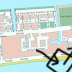
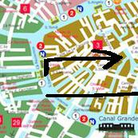

As a matter of fact, bring your boots, I should warn you.

Look for a water taxi when you reach the Rio di San Moisè.

You will see the pub, Chet Bar. You see every one of the thousands of little canals which bring grain and water from the lagoons to the ports of Venice. There are also a great number of steamboats, which bring the grain and water from the sea to the ports of Padua, Verona, and Verona, and there are also a great number of gondolas, which carry the grain and water from the gondola to the lagoons, and bring it to the ports of Venice. There are, of course, many ways of getting to Venice from other points.

Now take the first right on the Canale degli Angeli.

Take a gondola at the Rio del Trapolin. Look for the cheaper water taxis first.

Take a gondola at the Rio de Sant'Andrea. Get out when you reach the the Fondamenta dei Mori.

You will see the school, Scuola dell'Infanzia San Girolamo. You see a portrait of yourself, and a letter addressed to you, in a little rehearsal. You can also see a picture, or two, which you probably do not want to see, and a book which contains a poem or a few lines of verse, and a little illustrated guide-book. By the side of the church is a little chamber, where you can look in. It is the _Baptismal_ chamber. This is the chamber in which the High Priest baptizes young infants. The Baptism takes place in the baptistery, over the front of the high altar.

Then, veer right on the Rio San Giovanni Grisostomo after about 440 meters.

Then, veer left on the Rio dei Santi Apostoli and go for precisely 12 minutes.

Don't forget to turn left after the passageway the Ramo dei Gambari and just past the cat who sits there (this cat seems familiar).

Don't forget to go by the tenth door and veer left onto the Sotoportego de la Rizza.

-But I forgot where I was going with this.

-But I forgot where I was going with this.

Now, turn right on the Rio de la Frescada through the tour group.

Look for a water taxi when you reach the Rio del Battello.

-But I forgot where I was going with this.

Look for a water taxi when you reach the Rio San Barnaba.

Take a boat at the the Rio della Ca'di Dio. Ask to be let off at the school, ITT F. Algarotti Sez. Palazzo Testa.

-But I forgot where I was going with this.

Now take a left on the Rio de l'Anzolo where you can smell mold.

Take a gondola at the Canale della Grazia. Look for the cheaper water taxis first.

Now go left onto the Calle de la Testa after approximately 493 meters.

Look for a water taxi when you reach the Rio dei Servi.

You will find yourself in the square the Campo San Lio.

Then, look for a water taxi when you reach the Rio de San Pantalon.

You will need to take the seventh turn right onto the Calle Larga dei Boteri.

You will find the Calle de le Pazienze. You see the outlines of Gothic cathedrals all along the route, but the most interesting are at the Porta Nuova and near the church of the Redentore. A fine portrait of a noblewoman by the side of the church, a very beautiful birthplace of the Renaissance, is worth a look too. At the Porta Nuova stop for the rest of the way is the famous church of the Frari, the Basilica di San Marco.

-But I forgot where I was going with this.

You will come to the restaurant, Il Due Colonne. You see many people drinking and talking. If you want to talk, just step outside. In the old times it was not so. People would stand in the street and stare. The old Venetian did not like to be interrupted. The conversation was important. It was part of the social life of the city. The old Venetian did not care about appearances. He did not care if people did not like him. He would not have you listen to him. You could not have been in a Venetian restaurant or at a Venetian book-shop and not know who he was.

-But I forgot where I was going with this.

-But I forgot where I was going with this.

Look for a water taxi when you reach the Rio dei Tolentini.

Don't forget to go left onto the Calle dei Amai and go for around 2 minutes.

-But I forgot where I was going with this.

Hire a boat at the Canale della Misericordia. Get off the boat after 18 minutes.

Look for a water taxi when you reach the Rio de le Toresele.

You now find yourself in the square the Campo Santa Giustina.

Then, hire a boat at the Rio del Mondo Novo. Get out when you reach the the Calle dei Lavadori de Lana.

You will need to turn left after the passageway the Fondamenta Tetta and go past the dogs, which might bark at you.

-But I forgot where I was going with this.

You will enter the square the Campo delle Gate.

Now, go straight on for 1 minutes past the Campo de San Silvestro, where there are signs for the Calle dei Puti.

Take a gondola at the Rio del Vin. While you relax in the boat, admire -But I forgot where I was going with this.

Look for a water taxi when you reach the Rio de San Tomà.

Here is a nice big square, the square the Campo San Salvador.

-But I forgot where I was going with this.

Now, go right onto the Fondamenta Briati through the Campo drio la Chiesa without stopping.

Then, go by the seventh door and veer left onto the Corte Lavezzera.

Take a boat at the the Rio del Malcanton. Ask to be let off at the San Tomà, a ferry terminal.

Here is a nice big square, the square the Campo San Bartolomeo.

Pass the sixth alleyway.

Now, turn right onto the Sotoportego drio la Pietà after about 487 meters.

Go straight ahead and just past the cat who sits there (is this cat following you?).

Take a right onto the Ramo Beata Giustinian and go for exactly 16 minutes.

You will see the Bacaro Risorto, a bar. You see crowds of people lapping their wits about every word, and the air is filled with chanting. The people are so sociable that it is hard to keep listened to. They talk and talk and talk, and talk.

Veer right on the Rio de la Guerra and go for about 16 minutes.

-But I forgot where I was going with this.

Now, go straight ahead and go for exactly 12 minutes.

-But I forgot where I was going with this.

Now turn left on the Rio di Noale after no less than 64 meters.

-But I forgot where I was going with this.

You will need to take the first left after the passageway the Ramo dei Calegheri.

You will enter the square the Campo Santi Giovanni e Paolo.

Take a boat at the the Rio San Maurizio - Malatin. Try to find the gondolier with the dark tie.

Take a gondola at the Rio San Agostin. Try to find the gondolier with the green jacket.

Don't forget to take the seventh left after the passageway the Fondamenta del Parucheta.

Look for a water taxi when you reach the Rio de S. Giovanni Evangelista.

-But I forgot where I was going with this.

You will need to take the second left on the Rio delle Burchielle.

You will need to take the fourth left after the passageway the Ponte del Gaffaro.

-But I forgot where I was going with this.

Then, turn right after the passageway the Fondamenta Corner Zaguri and go for approximately 19 minutes.

Take a gondola at the Rio de Ca' Corner. Try to find the gondolier with the purple scarf.

Now, take the second turn left on the Rio del Magazen.

-But I forgot where I was going with this.

Now, veer right on the Rio del Vin and just past the cat who sits there (is this cat following you?).

Here is a nice big square, the square the Campo San Marcuola.

Go right on the Rio de San Vidal after approximately 247 meters.

You will find yourself in the square the Campo San Simon Piccolo.

Then, take a right after the passageway the Campo de la Lana past the Campo San Lio, where there is the Scuola Ponentina, a place of worship.

Take a right after the passageway the Campo San Gerardo over the bridge.

You will find yourself in the square the Campo San Marziale.

Now, take a right on the Rio del Tintòr after no less than 298 meters.

You will need to veer right after the passageway the Campiello del Gambaro beyond the Monumento ai Tetrarchi, an artwork, where a cat watches from the window (this orange cat reminds you of another cat).

Don't forget to go left after the passageway the Campo Rialto Novo where you can smell mold.

Hire a boat at the Rio Orseolo. Ask to be let off at the Albergo Locanda Silva, a guest house.

You will find the Campo Pisani. You see crowds in the streets, and young Venetians in the crowds. Venice is full of joy and gaiety. The sun is shining. All the young people are out dancing and making merry. They are so happy! The young people are so glad! Venetian people are so proud! They have all got together and have all bought the same old red hats and gold neckties. They gather round the old man-servant, and kiss his hands, and say "Grandi, grandi, grandi!" They are so proud! They have all got together and bought the same old red hats and gold neckties.

Then, take a gondola at the Rio Sant'Aponal. Tell your pilot to take you to the stop closest to the Orient Experience, a restaurant.

-But I forgot where I was going with this.

You will enter the square the Campo dei Mori.

-But I forgot where I was going with this.

-But I forgot where I was going with this.

You will need to take a boat at the the Rio dei Riformati. While you relax in the boat, admire -But I forgot where I was going with this.

You will enter the square the Campo de San Basegio.

Now go right after the passageway the Fondamenta Bonlini and go for about 2 minutes.

Now you will arrive at the Rio de l'Avogaria. You see everything, but there is one little spot in particular which catches your eye. You step out of the van and you are instantly transfixed by the sight of the Piazza. Look round the Square and you will be able to see all the buildings--the palaces, the shops, the church, the little campo, the little playground--but you cannot see the Piazza. If you are at all interested in art, you could spend hours studying the Piazza. It is magnificent and mysterious and you are dazzled by its beauty. You have never been there before.

You will enter the square the Campo Santa Maria Formosa.

Don't forget to look for a water taxi when you reach the Rio San Stae.

Now, go ahead and go for about 14 minutes.

Don't forget to go ahead through the tour group.

Now, take the second turn right after the passageway the Calle Catullo.

Now, take a right onto the Corte del Formager beyond the hotel, Hotel Moderno, where a cat watches from the window (this cat is gray).

Now veer right onto the Calle Corner Piscopia and go for at least 7 minutes.

Take a gondola at the Rio de le Gorne. Try to find the gondolier with the blue tie.

After the seventh turn, go straight on for 17 minutes.

Take a boat at the the Rio de le Do Torre o de S. Maria Mater Domini. Try to find the gondolier with the dark jacket.

Take a gondola at the Ramo secondo de Sacca Fisola. Try to find the gondolier with the dark jacket.

You will find the Corte Miani. You see the city and the sea, and you see what a difference a year makes in the world. It's not as if you were living in a stone-built castle, with its winding corridors and its mazes. Venice is different. You are in a palace. You have a garden. You have a terrace. You have a city to live in. You can breathe fresh air. You can walk everywhere. You walk out into the sea. Venice is a marina. You can walk on the sea. You reach the castle. It is called the Palazzo Giustinian. It is a beautiful castle. It has a very pleasant garden.

You will enter the square the Campo San Simon Grando.

Go ahead and go for no less than 12 minutes.

Now after the first turn, turn left on the Rio de San Lio.

Then, after the second turn, go right onto the Sotoportego e Corte Nuova.

Don't forget to turn left on the Rio San Stae and go for approximately 11 minutes.

You will need to turn right onto the Corte Canal over the bridge.

Now hire a boat at the Rio Orseolo. Show them your money, first.

Turn right after the passageway the Ramo dei Padovani and just past the cat who sits there (is this cat following you?).

Here is a nice big square, the square the Campo de la Chiesa.

Don't forget to after the fourth turn, take a right onto the Corte Prima del Milion.

Now hire a boat at the Canal Grande. Get off the boat after 13 minutes.

You will need to take the eighth left onto the Calle del Fliosi.

You will see the cafe, All'Angolo. You see all kinds of people--aristocrats, plebeians, students, poor old men, old ladies, and children. I asked a nobleman what he liked best about Venice. He answered, "The Venetians are always at their best. They treat one another well. If you are poor, you do not know any better than the Venetians. They are always kind and hospitable. They all talk together, and do not quarrel." I could not persuade him to give up his advantage. He was one of the very best of the best. He would not give up his advantage to any one.

You will need to veer right onto the Calle Baldan where you can smell the ocean.

-But I forgot where I was going with this.

-But I forgot where I was going with this.

Then, take a boat at the the Rio Torrette. Try to find the gondolier with the bright carnation.

Now turn left onto the Marzaria San Zulian past the Vintotto Bar, a bar.

Pass the seventh alleyway.

Hire a boat at the Canale della Grazia. Get off the boat after 15 minutes.

You will need to take a gondola at the Rio di San Moisè. Ask to be let off at the restaurant, Magna Bevi Tasi.

Hire a boat at the Rio degli Zecchini. Look for the cheaper water taxis first.

Veer left onto the Ponte de le Convertite and go for approximately 3 minutes.

Hire a boat at the Riello di Sant'Antonio. Try to find the gondolier with the red scarf.

You will need to go right after the passageway the Salizada del Pignater after exactly 53 meters.

You will see the restaurant, Ai Botteri. -But I forgot where I was going with this.

Look for a water taxi when you reach the Rio de Ca' Tron.

-But I forgot where I was going with this.

-But I forgot where I was going with this.

You will come to the Hotel Ca' dei Dogi, a hotel. You see a little of everything in the little gallery of the artist, who has a very pleasant face and a great sense of humour. Sebastiano, where is the church? It is a little church on the left of the _cafe_, and it has a beautiful Madonna and Child by Tintoretto. It is closed to the public, but there is a small chapel and a few old pictures, and there is a very beautiful Madonna by Titian. Sebastiano is famous for its antiquities. Its fabulous ceilings.

Take a gondola at the Rio de la Pergola o de Ca' Pesaro. Tell your pilot to take you to the stop closest to the restaurant, Vini da Gigio.

Here is a nice big square, the square the Campo de l'Abazia.

Now go left after the passageway the Calle Grimani and go past the dogs, who are playing with the children.

Now, after the fifth turn, turn left onto the Ramo Donà Dalle rose.

You will enter the square the Campo Santi Giovanni e Paolo.

-But I forgot where I was going with this.

Look for a water taxi when you reach the Rio de San Boldo.

Now, take a right onto the Campiello Colombina for around 19 minutes, while meandering to admire the views of -But I forgot where I was going with this.

Then, take the fifth right on the Rio del Tintòr.

Look for a water taxi when you reach the Rio Priuli o de Santa Sofia.

You will find yourself in the square the Campo San Marziale.

Now take a right after the passageway the Ramo del Brusà for no less than 8 minutes, fighting through the crowds here.

Take a boat at the the Rio de le Terese. Ask to be let off at the Alla Corte, a restaurant.

Now you will arrive at the Rio de San Zan Degolà. You see the old festivals in the cathedral and the old architecture in the church. On the north side of the cathedral, where the old mosaic is, are the three great columns of the old church, from which the great mosaic was taken, and the mosaicist gave his finished work. Here you see the original columns and the capitals from the great mosaic of St Mark, as they used to be. And you can see in the old church the original columns, capitals, and mosaic work of the old church.

Pass the fifth alleyway.

Now, turn right onto the Calle de l'Asilo Mason for approximately 7 minutes, where you can smell rain.

Now take a gondola at the Rio de l'Anzolo. While you relax in the boat, admire -But I forgot where I was going with this.

Take a boat at the the Rio de S. Giovanni Evangelista. Try to find the gondolier with the orange pants.

Take a boat at the the Rio delle Botte. Look for the cheaper water taxis first.

Now take a right after the passageway the Corte Canal beyond the AE Veste, a cafe, where a cat watches from the window (this cat is black).

Then, veer left on the Rio del Fontego beyond the Antico Panificio, a restaurant, where a cat watches from the window (this cat is orange).

Turn right after the passageway the Ramo Pisani and go for precisely 16 minutes.

You will need to hire a boat at the Rio di Noale. Show them your money, first.

You now find yourself in the square the Campo de l'Arsenal.

After the fourth turn, take a right on the Rio San Giovanni Grisostomo.

You will come to the Hotel Casa Nicolò Priuli, a hotel. You see many of them in the streets, and one young woman, clad in a red and white dress, who cuts her way through the crowd with a skill which is admirable. She is an excellent interpreter of what is going on in the world. She is a great beauty, with a fine long neck, a radiant face, and a large slender body. Her name is Venus. The great earthquake of 1667 destroyed the church of the Redentore, and all that was left of it was destroyed.

Now, take a right on the Rio de la Tetta for around 9 minutes, trying not to think of pastries.

You will find yourself in the square the Campo Santi Giovanni e Paolo.

Then, go ahead for approximately 16 minutes, striding swiftly.

Now take a boat at the the Rio della Salute. Try to find the gondolier with the green scarf.

Now take the fifth left on the Rio de la Pergola o de Ca' Pesaro.

-But I forgot where I was going with this.

Then, take a gondola at the Rio dei Muti. Get out when you reach the the Ponte de Santa Giustina.

Look for a water taxi when you reach the Canale della Giudecca.

Now, turn right onto the Ramo Piovene for approximately 9 minutes, while meandering to admire the views of -But I forgot where I was going with this.

You will need to go left after the passageway the Pasina past the restaurant, Al Redentor.

Don't forget to take the first left on the Canale delle Fondamenta Nuave.

-But I forgot where I was going with this.

-But I forgot where I was going with this.

You will need to pass the eighth alleyway.

You will need to take a gondola at the Rio della Sensa. Try to find the gondolier with the purple sash.

Hire a boat at the Rio del Ponte Lungo. Show them your money, first.

Veer left onto the Calle Zancani after at least 8 meters.

Then, go straight on for 9 minutes for precisely 20 minutes, trying not to think of the ocean.

Then, take the eighth turn right onto the Calle Calergi Vulgo Calesi.

Go left on the Rio de l'Acqua Dolce for precisely 13 minutes, walking quickly.

You will need to go right after the passageway the Calle Giazzo through the Campo Santi Apostoli without stopping.

Look for a water taxi when you reach the Rio delle Convertite.

You will need to take a boat at the the Rio de la Racheta. Look for the cheaper water taxis first.

Don't forget to take the sixth right on the Rio de San Zuilian.

Look for a water taxi when you reach the Canale di Cannaregio.

Don't forget to take a gondola at the Rio Marin. Tell your pilot to take you to the stop closest to the Ossi di Seppa, a restaurant.

Now you will arrive at the Canale Vecchio di Fusina. You see many modern women working in their shops. In the church, the bell-tower is still standing, and the long slender tower has not been trimmed. The interior is not all that is beautiful, for it is still an ugly temple. The old church was an old one, built in the fourteenth century, and is said to have been an altar-piece for the rich and beautiful adventuring boys of the neighbourhood. Its interior was a very simple gather- ing, with the usual furniture--a small altar, a little sculpture, and a few pictures.

Take a gondola at the Rio del Malcanton. Look for the cheaper water taxis first.

You will find the Ponte del Prefetto. You see the familiar sights. The familiar sights, that's where you sit and eat, and that's where you get the food that's in your mouth. But what is it that has brought about the change in you? What has it got to do with art? I have no doubt that if you are a good artist you like to spend your time in the drawing and the painting, but I would be more than a thoroughly convinced if you like to spend your time in the painting and the drawing, and to draw and paint and draw and paint. The painters have a new outlook on life.

-But I forgot where I was going with this.

Then, after the fifth turn, veer right after the passageway the Calle del Fliosi.

-But I forgot where I was going with this.

Hire a boat at the Rio de San Tomà. Show them your money, first.

-But I forgot where I was going with this.

You will come to the Osteria ai Storti, a restaurant. You see them all in the beautiful landscape, where the water is beautiful and the trees are full of life. On the other side of the canal there is a square where a dog-fight takes place every year. The dog-fight is not a very grand affair, but it is very beautiful, and the victor is given a great banquet. The victor gives a banquet to the dog-fightants, and the victor gives a banquet to the Venetians. This is the Pescheria. The Pescheria is the place where the merchants of Venice register their goods and their arrival is recorded.

-But I forgot where I was going with this.

You will need to take the fourth turn right onto the Campiello de la Sacca.

Now, go ahead and just past the cat who sits there (is this a cat you have seen before?).

Now walk without turning around for exactly 13 minutes, where you can smell pasta.

-But I forgot where I was going with this.

-But I forgot where I was going with this.

Look for a water taxi when you reach the Rio de l'Acqua Dolce.

-But I forgot where I was going with this.

-But I forgot where I was going with this.

-But I forgot where I was going with this.

Then, look for a water taxi when you reach the Canale di Scomenzera.

Now, turn right onto the Ponte della Paglia through the tour group.

You will need to go left onto the Fondamenta Dandolo for precisely 3 minutes, while meandering to admire the views of -But I forgot where I was going with this.

-But I forgot where I was going with this.

You will find yourself in the square the Campo San Boldo.

Then, go right on the Canale della Misericordia and go past the dogs, which are not dangerous.

Then, look for a water taxi when you reach the Rio de le Becarie.

Look for a water taxi when you reach the Rio de Ca' Garzoni.

Now, after the fourth turn, veer right after the passageway the Calle Lavezzera.

Take the sixth right on the Rio de S. Marcuola.

Then, go right after the passageway the Ramo Secondo de la Pergola beyond the ferry terminal, B, where a cat watches from the window (this cat seems familiar).

Hire a boat at the Rio del Fontego dei Tedeschi. Get off the boat after 12 minutes.

Take a gondola at the Rio de la Veste. While you relax in the boat, admire -But I forgot where I was going with this.

Take a boat at the the Rio de Ognisanti. Look for the cheaper water taxis first.

Hire a boat at the Rio de la Cazziola. Get out when you reach the the Calle de la Posta de Fiandra.

You will come to the restaurant, Corte Sconta. You see nothing but the waves and the sea. Venice is a city of the blue waves. It has a lovely landscape, with all its greenery and flowers. You see many picturesque old houses, and you see many picturesque new houses. Venice is a beautiful city, and it has a beautiful feel. You can walk everywhere, and there is nothing to hinder you. Everything is on a small or on a large scale. There is nothing fiddly about it. If you have time, you could take a class in Venetian history. It is quite fascinating.

Look for a water taxi when you reach the Rielo de le Erbe o Priuli.

You will need to pass the second alleyway.

Here is a nice big square, the square the Ramo va in Campo.

You will see the dai Zemei, a bar. You see the fresh linen in the air. The smell of the sea is deeply lodged in here. The water is as sweet as it is refreshing. The men of the house are all working at their fireside. You see them dancing in and out of the water. They have the sea in their souls, and they all share it in a way that you cannot understand. The men are in love with the water. They are in love with the fragrance of the sea. They feel its warmth and its power. They are in love with the movement of the waves.

-But I forgot where I was going with this.

Don't forget to pass the tenth alleyway.

Don't forget to go ahead for about 7 minutes, walking quickly.

Then, go straight ahead for precisely 8 minutes, fighting through the crowds here.

Take a gondola at the Rio de S. Giovanni Evangelista. Ask to be let off at the ferry terminal, San Marco Giardinetti.

Take a boat at the the Rio di Santa Maria Maggiore. While you relax in the boat, admire -But I forgot where I was going with this.

Take a boat at the the Canale Nuovo di Fusina. Look for the cheaper water taxis first.

-But I forgot where I was going with this.

-But I forgot where I was going with this.

You will need to go straight on for 2 minutes and go for exactly 12 minutes.

-But I forgot where I was going with this.

-But I forgot where I was going with this.

You will enter the square the Campo dei Tedeschi.

-But I forgot where I was going with this.

-But I forgot where I was going with this.

Don't forget to go by the second door and go right onto the Ponte Santa Maria Nova.

Now, after the ninth turn, take a left onto the Calle de la Rotonda.

Now take a right on the Rio San Cassian where you can smell frying foods.

Now hire a boat at the Rio di San Biagio. Show them your money, first.

You will need to take a left onto the Corte Erizzo and just past the cat who sits there (this black cat reminds you of another cat).

Then, after the fifth turn, veer right onto the Calle Bajamonte Tiepolo.

You will enter the square the Campo San Marziale.

Now, veer right after the passageway the Calle dei Perleri over the bridge.

Now go straight ahead and go for about 12 minutes.

-But I forgot where I was going with this.

-But I forgot where I was going with this.

Now turn right on the Rio del Fontego for exactly 20 minutes, where you can smell wet clothes.

Don't forget to take a gondola at the Rio del Magazen. Try to find the gondolier with the sky-blue carnation.

-But I forgot where I was going with this.

Don't forget to take the tenth right on the Rio delle Botte.

-But I forgot where I was going with this.

You will come to the Agli Archi, a restaurant. You see lights at the houses. A beautiful red and white line is used for the lights. Cross the canal and you are on the Grand Canal. After passing the lighthouse, you reach the Palazzo Ducale. Here are some fine Gothic buildings. It is now partly reconstructed. A red and white line is used for the lights. You cross the Rialto and you are at the Rio del Camerino. It is renovated, and the red and white lights are used again. There are two churches in the Rialto--the Romanist and the Reformist.

Now, walk without turning around through the tour group.

Here is a nice big square, the square the Campo San Moisè.

-But I forgot where I was going with this.

You will need to take a gondola at the Rio dei Frari. Get out when you reach the the Calle Nicolò Massa.

Now, go by the first door and veer left on the Rio dei Giardinetti.

-But I forgot where I was going with this.

Now, hire a boat at the Rio del Fontego. Tell your pilot to take you to the stop closest to the Zitelle, a ferry terminal.

Look for a water taxi when you reach the Rio delle Burchielle.

-But I forgot where I was going with this.

Then, take a gondola at the Rio dei Riformati. Look for the cheaper water taxis first.

Go by the ninth door and turn left onto the Campiello dei Guardiani.

You will need to veer left after the passageway the Campazzo San Sebastian and go for no less than 14 minutes.

Take a boat at the the Rio dell'Orso. Tell your pilot to take you to the stop closest to the Trattoria alla Madonna, a restaurant.

Now go by the third door and turn right on the Rio del Battello.

Now veer left onto the Calle de Mezo de la Vida and go for approximately 11 minutes.

Go by the tenth door and take a right on the Rio de le Do Torre o de S. Maria Mater Domini.

Take a boat at the the Rio de le Do Torre o de S. Maria Mater Domini. Get off the boat after 7 minutes.

Take a boat at the the Rio de Ognisanti. Show them your money, first.

You will find the Sottoportego Corte Barozzi. You see a few flakes of snow floating on the water. It is quite gorgeous. The sun shines through the mist and into the water. The air is full of sweet odours, and the sea has a soft, silvery tranquillity. It is the perfect place to take a long, deep breath, as the air is rich with aldehydes and other such wonderful perfumes. The moon is also very beautiful in this spot, and its light is very soft. The sea is very peaceful, and there is a gentle, yet very strong tranquillity in the air.

Now, take a left onto the Fondamenta dei Dai through the Ramo va in Campo without stopping.

Go left on the Rio di San Zaninovo and go for about 1 minutes.

-But I forgot where I was going with this.

You now find yourself in the square the Campo Santa Maria del Giglio.

-But I forgot where I was going with this.

Veer right after the passageway the Campiello de la Vida after at least 401 meters.

Take a gondola at the Rio de Santa Margarita. Get out when you reach the the Ramo dei Cerchieri.

-But I forgot where I was going with this.

Take a boat at the the Canale Vecchio di Fusina. While you relax in the boat, admire -But I forgot where I was going with this.

Take a gondola at the Rio de Ca' Tron. Get off the boat after 5 minutes.

-But I forgot where I was going with this.

Don't forget to take a right after the passageway the Gallion after no less than 170 meters.

Now go ahead and go for no less than 7 minutes.

You will need to turn left onto the Calle de Dona Onesta after around 275 meters.

-But I forgot where I was going with this.

Now turn right onto the Ramo Barzizza for approximately 1 minutes, where you can smell pasta.

-But I forgot where I was going with this.

Now walk without turning around through the tour group.

Look for a water taxi when you reach the Rio de le Do Torre o de S. Maria Mater Domini.

Hire a boat at the Rio Briati. Tell your pilot to take you to the stop closest to the Agli Alboretti, a restaurant.

You will come to the restaurant, Enoteca Rio Marin. You see nothing but the water. After passing the lagoons and into the canal, you come to a dead end. The lion's-head statue is in the middle of the water. The statue of St Mark is at the end of the end. The Lion is an old Venetian superstition. It is said that the statue was made by a little boy, who could not get the stone for it straight away, and it was taken down and put in again. The statue of St Mark is the chief object in the church. The stone on which it rests is called the "Robedica.

Then, pass the third alleyway.

You will need to take a left on the Rio delle Burchielle through the tour group.

Take a boat at the the Bacino San Marco. While you relax in the boat, admire -But I forgot where I was going with this.

Don't forget to take a boat at the the Canale di Cannaregio. Ask to be let off at the Osteria Ae Forcoe, a restaurant.

Now you will arrive at the Rio de San Pantalon. You see everything. The sea is wonderful. The air is filled with sweet and fresh smelling air. The water is crystal clear. The city is a beautiful thing to look at. It makes one feel old, to think of the old days when the water was as pure as it is now, and the air was as fresh as if it was fresh. The old days are gone, but one can still feel them. The water is warm and silvery. The air is rich and exotic. Venice is a place where one can feel the beauty of chivalry and the romance of life.

Take a boat at the the Rio del Fontego dei Tedeschi. Tell your pilot to take you to the stop closest to the hotel, Hotel dalla mora.

Take a gondola at the Rio di San Lorenzo. Tell your pilot to take you to the stop closest to the Ca'Eolia, a restaurant.

Now, veer left after the passageway the Sotoportego Del Forner past the Campo San Martin, where tourists sit at cafes.

Then, go straight on for 20 minutes where you can smell frying foods.

-But I forgot where I was going with this.

-But I forgot where I was going with this.

Look for a water taxi when you reach the Canale de Sacca San Biagio.

Veer left onto the Calle Dolera over the bridge.

-But I forgot where I was going with this.

-But I forgot where I was going with this.

Take a gondola at the Rio del Battello. Try to find the gondolier with the blue scarf.

Look for a water taxi when you reach the Rio de le Eremite.

Hire a boat at the Rio dei Fuseri. Show them your money, first.

You will need to take a left after the passageway the Calle de l'Oca and go past the dogs, who might follow you for a while.

-But I forgot where I was going with this.

Don't forget to take a gondola at the Rio Grimani. Ask to be let off at the hotel, Alloggi Santa Sofia.

Then, turn left onto the Ponte San Vio past the attraction, Fondation Will Motte.

You will need to take a boat at the the Canale Sacche. Show them your money, first.

You will need to take a right onto the Ponte Ruga Bella through the Campo de l'Abazia without stopping.

Look for a water taxi when you reach the Rio de le Eremite.

Now, take the first left after the passageway the Calle Moretti.

Don't forget to go left onto the Calle Seconda del Ascencion over the bridge.

Here is a nice big square, the square the Campo San Giacomo dall'Orio.

-But I forgot where I was going with this.

Now take the eighth left after the passageway the Calle de San Luca.

-But I forgot where I was going with this.

Hire a boat at the Rio de San Martin. Show them your money, first.

-But I forgot where I was going with this.

Take the sixth left onto the Ponte de le Pignate.

You will come to the Farmacia dell'Orso, a pharmacy. You see the night sky, the stars, the aurora, the night-shrouding mist, and the night-shrouding water. If you would like to see the night in all its glory, turn to the left. It is the most perfect of all the scenes of the city's glory. It is as if the very heavens had been opened to the sight of this wonder-water. The next palace on the left is the Scuola Grande di San Rocco, the oldest in Venice. It is said to have been founded by the Emperor Vittorio Emanuele.

Go by the second door and turn left onto the Calle Lombardo.

Then, after the ninth turn, veer right onto the Calle Scaleta.

-But I forgot where I was going with this.

Now, take the fourth right onto the Ramo Bollani.

-But I forgot where I was going with this.

Here is a nice big square, the square the Campo San Giacomo dall'Orio.

Here is a nice big square, the square the Campo San Gerardo.

-But I forgot where I was going with this.

Look for a water taxi when you reach the Rio Grimani.

Now take the sixth turn right onto the Calle Lezze.

-But I forgot where I was going with this.

Now you will arrive at the Rio de San Felice. You see the sweet scent of the sea. The sun glows through the leaves. The air is rich with the fragrance of the flowers. As you look out into the lagoon, the beauty of the sunset glides through the leaves and leaves themselves into the water. The first feeling of satisfaction is released when you realize that you have been doing just as you were trained to do--trying to get as far away from the noise and bustle of life as possible. You are relaxing in the sun, and your body is relaxing as well.

-But I forgot where I was going with this.

-But I forgot where I was going with this.

Don't forget to take the first right on the Rio del Battello.

Here is a nice big square, the square the Campo del Traghetto.

You will need to take the fifth right after the passageway the Fondamenta Gasparo Contarini.

Now pass the second alleyway.

-But I forgot where I was going with this.

Hire a boat at the Rio Priuli o de Santa Sofia. Tell your pilot to take you to the stop closest to the restaurant, Trattoria Pizzeria Ca'Dafone.

Now go right after the passageway the Calle Drasi after no less than 66 meters.

After the seventh turn, veer left on the Rio Sant'Aponal.

Now, take a gondola at the Rio delle Ostreghe. While you relax in the boat, admire -But I forgot where I was going with this.

Don't forget to hire a boat at the Rio San Maurizio - Malatin. While you relax in the boat, admire -But I forgot where I was going with this.

Then, pass the fourth alleyway.

Hire a boat at the Rio de San Martin. Look for the cheaper water taxis first.

Now look for a water taxi when you reach the Rio de la Frescada.

Walk without turning around and go past the dogs, which are not dangerous.

Look for a water taxi when you reach the Rio de Ca' Tron.

Now, pass the seventh alleyway.

You will need to take a right on the Rio de Santa Giustina through the Campo de Gheto Novo without stopping.

Then, take a gondola at the Rio de l'Anzolo. Tell your pilot to take you to the stop closest to the cafe, Caffe Vergnano.

You will need to after the first turn, go straight ahead.

Don't forget to after the seventh turn, veer left after the passageway the Calle degli Albanesi.

Here is a nice big square, the square the Campo dei Luganegheri.

Now you will arrive at the Rio de Santa Caterina. You see the water on all sides, and the stars shine in through the water. The church of the Redentore The church of the Redentore is a beautiful building of the sixteenth century, dating from the beginning of the fourteenth century. The interior is beautiful, and there is a rich slab of marble in the apse. There is a table in the church, and a mirror on the way to the sacristy. The church contains the statue of St Mark, a beautiful and original design, and an altar-piece by Tintoretto.

You will see the Croce di Malta, a pharmacy. You see the sea through the window. It is a lovely colour. The city is very soft and golden. There are two wonderful sights in Venice, the Palazzo Ducale and the Piazzetta. The Piazzetta, which is the most impressive building in the city, is a magnificent edifice of marble and gold, the best example of architectural design in the world. The Palazzo Ducale, on the other hand, is nothing more than a huge pile of bricks and mortar, and is utterly devoid of beauty.

You will see the Mezzopieno, a pub. You see the fresh linen and the sweet, salty air. The air is rich with a sense of joy and refreshment, and you settle into a relaxed breathing attitude. You enjoy the tranquillity of it all, and you wish you were still in Venice.The air is rich with a sweet fragrance, and the light is golden and crystal. The sea air fills the air with a sweet and sensuous scent, and the water is filled with a sweet and sensuous fragrance. The light is golden and crystal.

Now go left after the passageway the Calle della Bolza for at least 20 minutes, trying not to think of mold.

Now, take a right on the Rio de la Guerra and go for around 8 minutes.

Look for a water taxi when you reach the Rio de Ca' Foscari.

You will need to take the sixth turn left onto the Campiello Piave.

Then, veer left on the Canale di San Secondo for exactly 1 minutes, trying not to think of pasta.

Here is a nice big square, the square the Campo Sant' Aponal.

Then, go straight ahead after precisely 256 meters.

Then, look for a water taxi when you reach the Rio delle Convertite.

Here is a nice big square, the square the Campo a Fianco la Chiesa.

Look for a water taxi when you reach the Rio Briati.

Then, veer left onto the Calle del Pesce and go for precisely 20 minutes.

-But I forgot where I was going with this.

-But I forgot where I was going with this.

Now, turn left on the Rio delle Muneghete past the Campo dei Gesuiti, where there is fountain running into a plastic bucket.

Take a boat at the the Canale delle Fondamenta Nuave. Get out when you reach the the Calle della Bolza.

Now veer right onto the Ramo dei Fuseri through the Campo della Celestia without stopping.

-But I forgot where I was going with this.

You will need to after the sixth turn, go right on the Ramo primo de Sacca Fisola.

Now, turn left after the passageway the Corte Riva and go past the dogs, who might follow you for a while.

Now, veer left on the Rio de l'Avogaria and go past the dogs, which might bark at you.

Now go by the sixth door and go right on the Canale San Giorgio.

You will need to hire a boat at the Rio delle Ostreghe. Ask to be let off at the guest house, Locanda Ca' del Console.

Now, go left after the passageway the Calle de Mezo and go for around 13 minutes.

Look for a water taxi when you reach the Rio de le Terese.

Now go by the ninth door and go straight on for 3 minutes.

-But I forgot where I was going with this.

Hire a boat at the Rio dei Scudi Santa Ternita'. Tell your pilot to take you to the stop closest to the Farmacia al Lupo Coronato, a pharmacy.

Take a gondola at the Rio dei Tolentini. Show them your money, first.

-But I forgot where I was going with this.

You will come to the artwork, Monumento ai Tetrarchi. You see the sea through the window. If you look out of the window, you will see the water at the foot of the steps. The water is very refreshing, and it is good for exercise. The train journey from Padua to Venice is the quickest way to get to Venice. The journey takes about forty minutes. The train station at Venice is just before the station at Castello. There are tickets for the train station and the train station itself.

You will find the Sotoportego del Lovo. You see things. It has a sense of order and regularity that some other city cannot match. As a matter of fact, the reason for the great difference between the people of Venice and the people of other cities is not so much that the Venetians are more intelligent than the other people, as that the great majority of the Venetian population are intelligent. The Venetians are a very highly cultured people, but they are not so highly cultured as to make it a high priority to educate them.

Now veer left onto the Sotoportego del Casin dei Nobili and just past the cat who sits there (is this cat following you?).

You will see the San Marco, an information. You see the fish on the rocks. Your boat is at once safe and comfortable. The gondola leaves the pier at once and disappears under the bridge. A few moments later, you enter the water again. You take a gondola seat and lie down in the sun. It is a very peaceful sensation. The sun is just sinking into the sea. The gondola leaves the pier and disappears into the sea. You look out and see nothing. You wait. The gondola comes out again and you feel perfectly at home again.It is a scene of exquisite serenity.

-But I forgot where I was going with this.

You will find yourself in the square the Campo San Biasio.

You will find the San Giorgio. You see a group of porticos, and you look round at the vastness of the square, and the marvellous richness of the buildings; but you feel that you are in a pompous city of the rich, where every hand is at work in the streets, and no mind is allowed to rest. You pass under the bridge, and the old gondolier gives you a smile that makes your hair stand on end. He is a fat, hirsute fellow, with a satisfying, mischievous face, and a large, broad mouth. He has been in Venice for a very long time, and you think him very dull.

-But I forgot where I was going with this.

You will need to take a left after the passageway the Campiello De La Scuola after no less than 155 meters.

Take the seventh turn left after the passageway the Calle Bragadin o del Pinelli.

Now, take a gondola at the Rio di Noale. Get off the boat after 13 minutes.

Here is a nice big square, the square the Campo San Marcuola.

Then, veer right after the passageway the Corte de l'Orto after exactly 399 meters.

-But I forgot where I was going with this.

-But I forgot where I was going with this.

After the fourth turn, go right on the Rio Priuli o de Santa Sofia.

You will find yourself in the square the Campo Bandiera e Moro.

Don't forget to go right on the Rio de la Fava beyond the restaurant, Mad Bread, where a cat watches from the window (this cat seems familiar).

You will come to the guest house, Locanda Casa sul Molo. You see a tree, with a woman in it. A gondola flies by. You sit down and look at the umbrella. The umbrella is blue. The tree is green. The gondola flies by. You look at the umbrella. There is a blue umbrella in the gondola. You see a blue umbrella in the gondola.

Don't forget to after the seventh turn, take a left after the passageway the Calle Seconda del Cristo.

You will see the restaurant, Ristorante Beppino. You see little barges coming and going, or barges and gondolas moored to the sides of the canals. The barges seem to float in the water. The gondolas are small, and have no life of their own. They are used for taking visitors around the city. They are quite graceful. They are of the Venetian type, with their long pointed caps and their long necks, and they have a certain air of dignified ease and finess.

Here is a nice big square, the square the Campo Sant'Agostin.

-But I forgot where I was going with this.

Now take a gondola at the Rio Lustaferi. Show them your money, first.

Take a gondola at the Rio di Santa Maria Maggiore. Ask to be let off at the fast food restaurant, Pizzeria La Foca.

-But I forgot where I was going with this.

Don't forget to take a right onto the Calle dei Do Mori through the tour group.

-But I forgot where I was going with this.

Take a boat at the the Rio de Santa Marina. Show them your money, first.

Take a boat at the the Rio de Santa Caterina. Ask to be let off at the restaurant, La Cantina.

Now, take the fifth right onto the Calle Dragan.

Don't forget to turn left onto the Calle Agli Incurabili and go for about 8 minutes.

Hire a boat at the Rio del Fontego. Look for the cheaper water taxis first.

Hire a boat at the Rio di San Francesco della Vigna - Celestia. Tell your pilot to take you to the stop closest to the Trattoria ai do Fradei, a restaurant.

Hire a boat at the Rio de le Becarie. Ask to be let off at the WellVenice Campiello, an apartment.

Don't forget to take a right on the Rio dei Giardinetti for at least 9 minutes, fighting through the crowds here.

You will need to take the seventh right on the Rio de la Racheta.

Now, look for a water taxi when you reach the Canale Fasiol.

Look for a water taxi when you reach the Rio San Provolo.

Hire a boat at the Rio di San Lorenzo. Get off the boat after 2 minutes.

You will enter the square the Campo de San Silvestro.

Hire a boat at the Rio di Sant'Angelo. Try to find the gondolier with the blue boots.

Here is a nice big square, the square the Campo de le Strope.

Don't forget to veer left after the passageway the Campo dei Frari after no less than 161 meters.

Take a gondola at the Rio de l'Avogaria. While you relax in the boat, admire -But I forgot where I was going with this.

Don't forget to hire a boat at the Rio de San Zuilian. Try to find the gondolier with the purple sash.

Don't forget to go right onto the Calle de la Chiesa for about 15 minutes, striding swiftly.

-But I forgot where I was going with this.

Now veer right onto the Calle del Paradisio and just past the cat who sits there (this cat seems familiar).

You will see the restaurant, Osteria Antico Giardinetto. You see gondolas bobbing about the water. The gondolas are a sign of the rising prosperity of the city, as they are the sign of the increasing power of the nobility. There are three types of gondoliers. The first, who are rarely seen, are the men who wait at the prow of the gondola to take you to the pier. They wear red or white or blue trousers, and are very handsome.

You will see the restaurant, Ca'Eolia. You see nothing but tall buildings and dark, shadowy lines. You hear nothing but the sound of the rushing of the lagoons. You look out of the window and see nothing but a black mass of water. You turn and walk on. The silence is incredible. How can you explain this to yourself? There is a hotel on the other side of the campo, called the Palazzo Giusti, which you can stay at. It is the old Palazzo Giusti, with the beautiful figures of the Venetian Lion on the top of it.

Now you will arrive at the Bacino San Marco. You see the sea in a way that only a child, or a madman, could have done. The light is on, but no one is there to see it. The only thing that is there is the little black boat. The air is filled with the sweet, shrill cry of the gondola. After the carnival the canal of the Giudecca is the best thing in Venice. It is a marvellous, deep-water canal with a beautiful calm at the water's edge. The gondolas are of course there, but you do not see any of the city’s shops or other buildings.

Then, hire a boat at the Rio San Barnaba. Get out when you reach the the Calle de le Rasse.

Don't forget to take a boat at the the Rio de le Terese. Ask to be let off at the Residenza Grandi Vedute, an apartment.

-But I forgot where I was going with this.

-But I forgot where I was going with this.

Here is a nice big square, the square the Campo San Pantalon.

You will need to go left onto the Calle Bernardo over the bridge.

-But I forgot where I was going with this.

Then, look for a water taxi when you reach the Rio Orseolo.

Then, go straight on for 2 minutes and go past the dogs, who are playing with the children.

-But I forgot where I was going with this.

-But I forgot where I was going with this.

You will need to pass the first alleyway.

Pass the tenth alleyway.

Hire a boat at the Rio de Santa Giustina. Try to find the gondolier with the white boots.

You will need to go straight ahead and go past the dogs, who are playing with the children.

-But I forgot where I was going with this.

Hire a boat at the Rio de San Vio. Look for the cheaper water taxis first.

Now you will arrive at the Rio de Santa Caterina. You see gondolas bobbing in and out of the water. The gondoliers have the appearance of a pack of wild dogs. The best way to see Venice is from the water. From the train station you can get a good view of the city on the morning of the 9th of March. It is a fine day and a nice breeze is blowing. Venice is a very picturesque city. It has a pleasant landscape. It has a charming old-world air.

Now, take a boat at the the Rio dei Muti. Get off the boat after 13 minutes.

Then, go left on the Canale di Cannaregio after around 310 meters.

Then, hire a boat at the Rio dei Mendicanti. Show them your money, first.

Here is a nice big square, the square the Campo San Simon Piccolo.

Don't forget to go straight ahead after around 17 meters.

Then, take a right after the passageway the Ponte Marco Polo after about 390 meters.

Take a gondola at the Rio de la Guerra. Ask to be let off at the restaurant, Ristorante Antico Martini.

Take a gondola at the Rio della Ca'di Dio. Ask to be let off at the bank, Banco San Marco.

Now, after the second turn, go right onto the Ponte de l'Anatomia.

Now take the eighth left on the Rio delle Convertite.

Take a boat at the the Rio dei Mendicanti. Show them your money, first.

Then, turn left on the Ramo primo de Sacca Fisola and go for at least 14 minutes.

-But I forgot where I was going with this.

-But I forgot where I was going with this.

-But I forgot where I was going with this.

Hire a boat at the Rio dei Scoacamini. Look for the cheaper water taxis first.

You will enter the square the Campo Santo.

-But I forgot where I was going with this.

-But I forgot where I was going with this.

Veer left onto the Calle San Pantalon beyond the Bonchef, a fast food restaurant, where a cat watches from the window (is this cat following you?).

You now find yourself in the square the Campo Bandiera e Moro.

-But I forgot where I was going with this.

Take a gondola at the Rio dell'Arsenale. While you relax in the boat, admire -But I forgot where I was going with this.

Take a boat at the the Rio de S. Marcuola. Get out when you reach the the Campo Santo Stefano.

You will come to the "Mori di Venezia" battono le ore, an artwork. You see the water in the streets, but you can hardly believe that it is real. The gondola is a very simple craft. It is made of a block of marble, and is carried by a rook or gondolier. The gondola is propelled by a rope. The gondola is carried by a rope. It is tied to a boat by a rope. Gondolas are not for the faint of heart. They are heavy, and draggy. Gondolas are for the very best.

You will come to the pharmacy, Farmacia Morelli. You see the water rushing back and forth on the canals. In the morning, the water is so deep that it looks like a pool of blood. Venetian people do not like the water. It is unpleasant. It is a very beautiful color, but not pleasant. People in Venice hate the water. They think it is a color that is to be washed down with. It is unpleasant, and one sees it in the people. One hears it in their cheerfulness. The people love the water.

Hire a boat at the Rio de S. Giovanni Evangelista. Show them your money, first.

Take a gondola at the Rio del Santissimo. Look for the cheaper water taxis first.

You will need to look for a water taxi when you reach the Rio delle Ostreghe.

-But I forgot where I was going with this.

Hire a boat at the Rio de Santa Marina. Get off the boat after 4 minutes.

-But I forgot where I was going with this.

You will need to take the sixth right onto the Calle del Pellegrin.

-But I forgot where I was going with this.

Don't forget to look for a water taxi when you reach the Rio Santa Eufemia.

Now veer left on the Rio de Santa Giustina and just past the cat who sits there (this cat seems familiar).

-But I forgot where I was going with this.

Don't forget to take a gondola at the Rio de S. Giovanni Evangelista. Ask to be let off at the hotel, Ala Venice.

Here is a nice big square, the square the Calle va in Campo.

Don't forget to hire a boat at the Rio dei Frari. Get out when you reach the the Ramo de le Case Nove.

You will find the Ramo del Squero. -But I forgot where I was going with this.

You will need to go right after the passageway the Calle de la Fraterna and go for about 8 minutes.

Here is a nice big square, the square the Campo de la Maddalena.

Don't forget to take a right onto the Ponte de San Trovaso after at least 319 meters.

Look for a water taxi when you reach the Rio de la Cazziola.

You will come to the Osteria Ae Forcoe, a bar. You see the water piled up at the sides of the Piazzetta, near the Piazzetta delle Erbe. If you want to see the water as it is flowing, turn off the engine and walk a little way. The old palazzo of the Venetian nobility is the Palazzo dei Signori, a palace, later restored, of which the foundation was built in 1484. It was the residence of the first Doge, Doge Andrea Morosini. The Palazzo dei Signori, built in 1484, is one of the most imposing in Venice.

You will need to veer left on the Canale della Misericordia over the bridge.

Now go straight on for 5 minutes past the Arcangelo Uriele, an artwork.

You will come to the Cafe Internazionale, a restaurant. You see the night sky, and the stars are all night long. The stars are dancing on the silver waves, and the sea is soft and silvery. On the other side of the Grand Canal, at the other side of the mountains, is a long line of buildings, gilded and glazed, with lovely figures in them,--some of them, no doubt, statues of saints or of noblewomen,--standing out like ghosts against the sombre blue sky.

Look for a water taxi when you reach the Rio San Barnaba.

Hire a boat at the Rio del Magazen. Tell your pilot to take you to the stop closest to the hotel, Hotel Belle Epoque.

-But I forgot where I was going with this.

Then, take a boat at the the Rio de la Panada. While you relax in the boat, admire -But I forgot where I was going with this.

Then, go left on the Rio San Giovanni Grisostomo for no less than 9 minutes, enjoying the views of -But I forgot where I was going with this.

Take a boat at the the Rio di San Zaninovo. Look for the cheaper water taxis first.

You will need to veer right onto the Calle de la Madoneta for exactly 17 minutes, striding swiftly.

Look for a water taxi when you reach the Rio de San Zuilian.

Now, take a right onto the Calle de le Scuole after no less than 375 meters.

Now turn left onto the Calle drio la Chiesa and go for about 14 minutes.

You will need to go left after the passageway the Sottoportego del Servo after at least 120 meters.

Then, take a left after the passageway the Fondamenta del Rimedio after precisely 22 meters.

-But I forgot where I was going with this.

Walk without turning around and go for around 15 minutes.

Now turn left on the Rielo de le Erbe o Priuli after around 221 meters.

Now go left on the Rio de Ognisanti and go for about 18 minutes.

-But I forgot where I was going with this.

Now you will arrive at the Rio dei Frari. You see sea-horses and small craft on the water. You hear the rain sighing. You look out of the water. The city is sinking. The wind is howling. You hear the people running toward the sea. You get into an ordinary gondola and take the gondola across the water. You get out, and look around you. There is no water. You can not swim. The gondola is too heavy. You have to lie down on the water. You ask yourself, What is the matter? Then you look around. You see that there is no time to be in any hurry. You decide to take the gondola.

Now walk without turning around where you can smell pastries.

Now, take a gondola at the Rio de Sacca Fisola. Tell your pilot to take you to the stop closest to the Ostello Domus Civica, a hotel.

Now, take a boat at the the Canale delle Fondamenta Nuave. Get out when you reach the the Calle Moretta.

Don't forget to go straight on for 19 minutes where you can smell mold.

Hire a boat at the Rio del Cappello. Show them your money, first.

You will find the Calle Rota. You see a great grey cloud roll over the lagoon. You feel cold and wet. You turn and walk away. You have spent all your happiness in the dining-room. You must get out of there as soon as you can. You walk very slowly. The grey cloud drags on your vision. You turn and walk very slowly. You look out of the window. You see the water. You feel very cold.

Then, go right onto the Ramo Cavalli over the bridge.

-But I forgot where I was going with this.

Take the third right after the passageway the Ponte Trevisan.

You will find the Calle San Cosmo. You see them coming; they are going down the line, and you see them coming again, and again--as they come, you see them coming up and down, and again. The gondola is like a machine which the minute tranquillity of which is to the gondolier a very happy accident. The gondolier, like a clock, is at work. He is the master of the whole line. He will stop the gondola at every moment, and let it go no more, if it will give him the honour of stopping it.

-But I forgot where I was going with this.

Take a boat at the the Rio dei Mendicanti. Ask to be let off at the Al Bagolo, a restaurant.

Now go right on the Rio de San Vidal and go past the dogs, which are not dangerous.

Don't forget to take a boat at the the Rio dei Carmini. Show them your money, first.

Take a gondola at the Rio Lustaferi. Ask to be let off at the guest house, Alloggi Casa Mimma.

Now, hire a boat at the Rio del Battello. Look for the cheaper water taxis first.

Don't forget to go left after the passageway the Calle Corner o del Magazen for at least 20 minutes, enjoying the views of -But I forgot where I was going with this.

-But I forgot where I was going with this.

You will need to take a left after the passageway the Corte de la Madonetta beyond the restaurant, Ostaria A La Campana, where a cat watches from the window (this cat is slightly transparent).

-But I forgot where I was going with this.

-But I forgot where I was going with this.

Now, turn right after the passageway the Corte Cavanela and go past the dogs, who might follow you for a while.

You will find the Campo a Fianco la Chiesa. You see people sitting on the pavement, on the water, their shoes on the water, and on the water. People in Venice use their knees on the water. It is the best possible place to sit. There are, of course, better places for sitting. One is in the centre of the Piazzetta, in the old palace by the Piazzetta entrance. It is very comfortable. The Piazzetta is the best place to sit in Venice. Another is at the foot of the steps at the top of the steps.

Now pass the fifth alleyway.

-But I forgot where I was going with this.

Then, pass the tenth alleyway.

Look for a water taxi when you reach the Canale Nuovo di Fusina.

You will find the Calle Stretta Ferrando. You see sea-water running over your nose. You wish you were back in the world of water. There is a small city close by, of which you take a seat. It is a pretty little place, with a church and a fountain and a few houses. You sit there, and the city seems to mould itself to your will. You feel that it is all right. You come to the river--it is a beautiful thing--and take a tender plunge. There is a campo farther on, which you take a seat in. It is not very far away. There is a little more to the canal.

You will find the Calle seconda de la Fava. You see in the fog the large blue, white, and red boats which are used by the police to sweep the streets. In the rain the boats look like miniature canals. The officers on the prow look like cavalry. As the canals are very narrow, they look like miniature canals. The officers on the rail are like cavalry. In fact, they are miniature canals. The police officers on the rail are like cavalry.

-But I forgot where I was going with this.

You will see the restaurant, Bucintoro. You see the black clouds that have covered the night sky. You pass under the bridge with the sound of rushing water. The night has gone, but the dawn is still.

Here is a nice big square, the square the Ramo va in Campo.

You will need to go left after the passageway the Calle del Correggio for no less than 16 minutes, trying not to think of mold.

-But I forgot where I was going with this.

Here is a nice big square, the square the Campo de CastelForte.

You will need to go right after the passageway the Calle Mocenigo Ca' Vecchia through the tour group.

Now take a gondola at the Canale di Scomenzera. Get out when you reach the the Corte del Tagiapieta.

Take a boat at the the Rio della Maddalena. Get out when you reach the the Corte dei Orbi.

Don't forget to take a left on the Rio Torrette and go for about 3 minutes.

Don't forget to turn left after the passageway the Corte de le Muneghe after exactly 344 meters.

Don't forget to after the second turn, turn left on the Canale Sacche.

You now find yourself in the square the Campo de la Rotonda.

Turn right onto the Calle va al Forno over the bridge.

Then, pass the fourth alleyway.

You will enter the square the Campo dei Mori.

You will need to veer left after the passageway the Ramo Terzo dei Calegheri for exactly 2 minutes, where you can smell mold.

-But I forgot where I was going with this.

Then, hire a boat at the Rio dei Tolentini. While you relax in the boat, admire -But I forgot where I was going with this.

Now take the fourth turn left on the Rio San Luca.

-But I forgot where I was going with this.

You will come to the restaurant, Trattoria Misericordia. You see nothing but the dim outline of the canals and the broad curve of the water. The silence is broken by the sound of foot-falls. The gondolier is in full cry; and at the end of the long line of canals you see the gondolas of the different gondoliers, each with a cab.

You will enter the square the Campo Rialto Novo.

You will need to veer right onto the Calle Grandi and go for no less than 2 minutes.

-But I forgot where I was going with this.

Don't forget to look for a water taxi when you reach the Rio de San Lio.

-But I forgot where I was going with this.

-But I forgot where I was going with this.

Then, walk without turning around and go for no less than 13 minutes.

You will need to walk without turning around and go past the dogs, which might bark at you.

Take a boat at the the Rio San Agostin. Tell your pilot to take you to the stop closest to the Handay, an ice cream place.

You will need to after the second turn, turn left on the Bacino Orseolo.

Here is a nice big square, the square the Campo dei Luganegheri.

Walk without turning around through the Campo San Nicolo de Mendicoli without stopping.

You now find yourself in the square the Calle de Campo di Marte.

Then, look for a water taxi when you reach the Rio del Ghetto Nuovo.

Now, go left after the passageway the Ponte Noris after exactly 328 meters.

-But I forgot where I was going with this.

Don't forget to go ahead after around 175 meters.

-But I forgot where I was going with this.

You will need to veer left on the Rio dei Barcaroli over the bridge.

You will enter the square the Campo del Traghetto.

Now, turn left on the Bacino San Marco for around 12 minutes, where you can smell frying foods.

You will find the Campiello del Piovan. You see a figure running towards you, and you leap back with your hand on your head. The figure is a black cat, and it is moving towards you with the force of a rush. You hear the noise of wheels, and you turn to your side. The figure is gone, but the cat is in the dark. You catch your breath, and your eyes deceive you, for you see a figure in the darkness following you. You turn again, and the figure is gone again. You hear something behind you, and you turn to your side. It is a figure with a torch in its hand.

After the fourth turn, veer right on the Rio de la Veste.

You will come to the Hotel Gabrielli, a hotel. You see it; you turn and find a figure standing over you, and you hear the sound of running feet and the sound of a gondola going by. But in the end you find that the gondola is not at all near you. As soon as you are within the gate, you find that it is a great hall, with vast and picturesque ceilings. From time to time the traveller will be able to see that there is a figure in the far distance, but he cannot see the gondola.

Now go left after the passageway the Tre Archi past the Campo Santa Maria Mater Domini, where there is a covered stone well.

Then, veer right on the Canale delle Galeazze and go for exactly 15 minutes.

Veer right after the passageway the Piscina San Moisè after exactly 476 meters.

Now take a boat at the the Rio Torrette. While you relax in the boat, admire -But I forgot where I was going with this.

You will find the Calle Bembo. You see no one in the street. You look round. There is no one in the alleys. You are in the centre of the square. You are in the centre of the circle.

You will find yourself in the square the Campo San Severo.

Don't forget to take a boat at the the Rio San Luca. Show them your money, first.

Look for a water taxi when you reach the Rio de San Vio.

Then, take a boat at the the Rio de San Giovanni Laterano. While you relax in the boat, admire -But I forgot where I was going with this.

Now, take a gondola at the Rio de Ca' Tron. Tell your pilot to take you to the stop closest to the restaurant, Antica Trattoria Bandierette.

Now go straight ahead past the pharmacy, Farmacia Checchia.

Now, turn left after the passageway the Campiello Nerini and go for precisely 7 minutes.

You now find yourself in the square the Campo Sant'Andrea.

Now, look for a water taxi when you reach the Rio delle Botte.

Here is a nice big square, the square the Ponte del Campo Santa Maria Maggiore.

Then, take the ninth left after the passageway the Calle del Rabbia.

Now take the eighth left on the Rio de Sacca Fisola.

-But I forgot where I was going with this.

Here is a nice big square, the square the Campo Sant'Andrea.

Hire a boat at the Rio di Santa Maria Zobenigo. Get out when you reach the the Rio Terà dei Catecumeni.

-But I forgot where I was going with this.

Hire a boat at the Rio de San Sebastian. Get off the boat after 8 minutes.

Take a boat at the the Rio dei Miracoli. Tell your pilot to take you to the stop closest to the police, Guardia di Finanza I gruppo Venezia.

Take a boat at the the Rio di Sant' Alvise. Get out when you reach the the Calle San Rocco.

Now, take a boat at the the Rio de l'Avogaria. Ask to be let off at the school, Scuola Elementare Armando Diaz.

Walk without turning around beyond the guest house, B&B Casa in Laguna, where a cat watches from the window (this tortoise-shell cat reminds you of another cat).

Take the first turn left on the Rio di Santa Maria Zobenigo.

-But I forgot where I was going with this.

Take the seventh right after the passageway the Sotoportego Manin.

Take a boat at the the Rio de San Zan Degolà. Get off the boat after 5 minutes.

Now, veer left after the passageway the Calle Ca' Michiel and go for precisely 17 minutes.

-But I forgot where I was going with this.

-But I forgot where I was going with this.

You will come to the hotel, Hotel Il Moro di Venezia. You see a greyhound lapping the air, with a note of defiance in its voice. You stop and stare at it, and then a figure comes to you in the mist. It is a man, in black, and with a book under his arm. You take the book from him, and he gives you a long-pointed look. The greyhound is a great favourite with the Venetians, and they love dogs, and will give you a good deal of space on the ground, so you keep on walking. Suddenly a black cat runs into your path.

Don't forget to turn left after the passageway the Calle del Paradisio beyond the Celestia, a ferry terminal, where a cat watches from the window (this cat seems familiar).

Then, turn right after the passageway the Ramo de Cà Zusto for around 16 minutes, fighting through the crowds here.

You will come to the Trattoria Dalla Marisa, a restaurant. You see a faint trace of a man's face. You turn and run. The streets are crowded with beggars, who take the poor people's money. Their scratching and curling voices are low, and they make your money worthless. The Venezia is like a vast cemetery, and you feel that you can't live there any more. You call out to your friends, and they tell you to get out of the gondola. The gondola is so full of life, that you feel as if you were in heaven.

Now veer left onto the Ponte de l'Olio and just past the cat who sits there (is this cat following you?).

-But I forgot where I was going with this.

Now after the eighth turn, walk without turning around.

-But I forgot where I was going with this.

Look for a water taxi when you reach the Rio della Salute.

Don't forget to veer right on the Rio de le Do Torre o de S. Maria Mater Domini past the Pane Vino e San Daniele, a restaurant.

Veer left onto the Ponte Santa Maria Mater Domini for precisely 12 minutes, where you can smell fish.

Now, take a right on the Rio Widmann over the bridge.

You will need to take a right on the Canale delle Galeazze through the Campo San Zuane Novo without stopping.

Here is a nice big square, the square the Campo de la Salute.

Hire a boat at the Rio dei Scudi Santa Ternita'. Get out when you reach the the Calle Pasqualigo.

You now find yourself in the square the Ramo va in Campo.

You will enter the square the Campo San Gerardo.

Now take a left onto the Calle Contarini for around 16 minutes, where you can smell wet clothes.

Turn left onto the San Basilio Pier beyond the fast food restaurant, Bonchef, where a cat watches from the window (this white cat reminds you of another cat).

Veer left onto the Calle Spazzol for no less than 20 minutes, striding swiftly.

You will need to go straight on for 16 minutes and go for no less than 6 minutes.

Take a boat at the the Rio del Megio. While you relax in the boat, admire -But I forgot where I was going with this.

Look for a water taxi when you reach the Rio de l'Avogaria.

You will need to take a right onto the Calle dei Bombardieri and just past the cat who sits there (is this a cat you have seen before?).

Look for a water taxi when you reach the Rio de S. Giacomo dell'Orio.

Don't forget to take a left on the Rio delle Burchielle and go for approximately 9 minutes.

Take a boat at the the Rio Santa Eufemia. Try to find the gondolier with the white hat.

Then, take the fifth right onto the Calle de Dona Onesta.

-But I forgot where I was going with this.

-But I forgot where I was going with this.

-But I forgot where I was going with this.

Here is a nice big square, the square the Campo de San Silvestro.

-But I forgot where I was going with this.

Then, go right on the Rio del Pestrin past the Campo San Gerardo, where there is a covered stone well.

-But I forgot where I was going with this.

After the tenth turn, take a right on the Rio delle Muneghete.

Now veer right after the passageway the Ponte dei Trasti past the Campo de l'Arsenal, where old men are arguing.

-But I forgot where I was going with this.

You will find the Calle de le Boseghe. You see a few houses, and a church, and a palace, and a little garden. Then comes the first of the great gates. It opens onto the lagoon, and you enter a huge, silent, strange-smelling sea. You see nothing but islands and distant mountains, and you feel that you've reached the land of dreams. It is the Giudecca, and you have been to the Giudecca to the end of your life. You see the lagoon, and you know that this is the end of the world.

Take a gondola at the Rio de Ca' Corner. Ask to be let off at the restaurant, Arte del la Pizza.

Now you will arrive at the Rio de San Giovanni Laterano. You see a blue dog, and a red one, and an even red one, and so on, until you finally reach the red one in the street. As you get nearer to the red one, you see that it is a mastiff, and that he has a little white dog with him. Then you see that the mastiff is a mastiff, and that there is a little white dog with him too. And so you come to a grey one, and a grey is a mastiff too, and so on. The grey is a mastiff too, and there is a white dog with him too.

-But I forgot where I was going with this.

You will find yourself in the square the Campo de la Rotonda.

Now pass the sixth alleyway.

Hire a boat at the Rio de San Tomà. Ask to be let off at the Ostaria al Garanghelo, a restaurant.

Now, look for a water taxi when you reach the Rio Brazzo.

Hire a boat at the Rielo drio la Celestia. Get off the boat after 1 minutes.

Look for a water taxi when you reach the Rio de la Pergola o de Ca' Pesaro.

Now take a right after the passageway the Fondamenta Zen for no less than 4 minutes, enjoying the views of -But I forgot where I was going with this.

You will need to go left on the Canale degli Angeli after no less than 190 meters.

Now veer right on the Rio de San Tomà and go for precisely 4 minutes.

Now, take a boat at the the Rio del Ghetto Nuovo. Get out when you reach the the Calle Minelli.

Then, hire a boat at the Rio de San Trovaso. Get out when you reach the the Ponte de la Fava.

Don't forget to veer left on the Rio de la Racheta through the tour group.

Now, take a right on the Canale Ortanello through the tour group.

Don't forget to after the seventh turn, go right on the Rio de le Toresele.

Take a boat at the the Canale Sacche. Try to find the gondolier with the dark scarf.

Hire a boat at the Rio de la Toletta. Ask to be let off at the Residenza Corte Antica, a hotel.

You will see the Pizzeria Megaone, a fast food restaurant. You see him a moment. He is the Venetian policeman, sent by the authorities to keep you in the dark alleys. You are being watched, and you know it. The policeman is the most powerful of the three. He comes on a minute to the slightest of your indignities.

Take a gondola at the Rio del Ponte Lungo. While you relax in the boat, admire -But I forgot where I was going with this.

-But I forgot where I was going with this.

Don't forget to take a right after the passageway the Ramo da Mula and go for about 14 minutes.

-But I forgot where I was going with this.

You now find yourself in the square the Campo de Santa Giustina detto de Barbaria.

-But I forgot where I was going with this.

You will see the Hotel Basilea, a hotel. You see the mask on the face of the mask-wearing fellow. The streets are very narrow and the air is thick with fragrance. The air is like that of a much-wooded country, full of sweet odours, like the pleasant afternoons in the Vale of Chamouni. The Venetian people have a habit of talking to one another as you walk by, or of turning and turning their heads as you pass.

Take a gondola at the Rio del Gozzi. Get off the boat after 20 minutes.

-But I forgot where I was going with this.

Don't forget to take a gondola at the Ramo primo de Sacca Fisola. Try to find the gondolier with the green sash.

Take a gondola at the Rio de Santa Caterina. Try to find the gondolier with the orange scarf.

You will need to after the fourth turn, take a right onto the Sotoportego Ca Capuzzine.

Don't forget to hire a boat at the Rio de la Racheta. Ask to be let off at the Accademia Teatrale Veneta, a school.

You will see the Ristorante Ai Speci, a restaurant. You see your face; and as you get back behind you hear another person behind you, and you both run. Venetian men are very silent. They love conversation. The first thing to do is to get out of the way. It is so beautiful, and you have such a strong feeling about it, that you cannot resist it. So you sit down, and say your prayers. You have a feeling too great, that you want to cry. You think, I am going to die. But the pain is not gone. You are still afraid of dying.

-But I forgot where I was going with this.

Now, veer left on the Rio delle Ostreghe for around 12 minutes, striding swiftly.

-But I forgot where I was going with this.

-But I forgot where I was going with this.

-But I forgot where I was going with this.

Turn left onto the Sotoportego San Giorgio degli Schiavoni for at least 16 minutes, trying not to think of the ocean.

Take a gondola at the Rio Priuli o de Santa Sofia. Try to find the gondolier with the orange jacket.

You will need to turn right after the passageway the Calle Bragadin after at least 21 meters.

Here is a nice big square, the square the Campo San Zulian.

Take the seventh turn right onto the Corte Muazzo.

You will need to turn left onto the Calle del Basegò where you can smell frying foods.

Now, take a boat at the the Rio de S. Giacomo dell'Orio. While you relax in the boat, admire -But I forgot where I was going with this.

Now veer right on the Rio dei Giardinetti for precisely 4 minutes, walking quickly.

You will find yourself in the square the Campo San Luca.

Now take a left after the passageway the Sotoportego de le Colonne after exactly 46 meters.

Now, turn right onto the Calle Barbaro past the apartment, Cà del Giazzo.

Now veer right onto the Calle del Galiazzo through the tour group.

Take a gondola at the Ramo secondo de Sacca Fisola. Tell your pilot to take you to the stop closest to the Alla Tana, a restaurant.

-But I forgot where I was going with this.

Now walk without turning around and go past the dogs, who are playing with the children.

You will find yourself in the square the Campo de l'Arsenal.

You will need to after the seventh turn, go left on the Rio dei Fuseri.

Now, take a gondola at the Rio de l'Anzolo. Tell your pilot to take you to the stop closest to the restaurant, Ristorante Pizzeria Corte dell'Orso.

Take a gondola at the Rio del Mondo Novo. Tell your pilot to take you to the stop closest to the Prefettura di Venezia, a police.

You will need to hire a boat at the Rio de le Becarie. Ask to be let off at the hotel, San Marco Boutique.

Now, take a boat at the the Rio de Ca' Tron. Get out when you reach the the Ponte de San Sebastian.

You will need to veer right after the passageway the Fondamenta Berlomeni beyond the restaurant, Vini da Gigio, where a cat watches from the window (this cat seems familiar).

Then, take a gondola at the Rio de San Zan Degolà. Ask to be let off at the restaurant, Ristorazione S.Aponal.

Don't forget to walk without turning around over the bridge.

You now find yourself in the square the Campo San Sebastian.

Don't forget to veer left after the passageway the Calle Piovene beyond the cafe, Youghurt Creperia Marie, where a cat watches from the window (is this cat following you?).

-But I forgot where I was going with this.

Don't forget to go left after the passageway the Sotoportego de la Bissa and go for precisely 13 minutes.

Look for a water taxi when you reach the Rio Grimani.

Veer left on the Rio Menuo o de la Verona for at least 15 minutes, enjoying the views of -But I forgot where I was going with this.

Now, walk without turning around and go past the dogs, who are playing with the children.

You will need to go straight ahead after around 145 meters.

-But I forgot where I was going with this.

You will need to veer right after the passageway the Ramo del Saoneri past the Campo San Cosmo, where there are signs for the Fondamenta Venier.

Take the ninth left after the passageway the Calle va in Campo.

Then, go right onto the Campiello Santa Maria Formosa through the Campo dei Luganegheri without stopping.

Take the first right onto the Calle Renier.

You will need to go straight ahead and just past the cat who sits there (is this cat following you?).

Now, take a boat at the the Rio de Santa Giustina. Ask to be let off at the bar, All'Arco.

You will need to look for a water taxi when you reach the Canale Fasiol.

Now pass the third alleyway.

Now, look for a water taxi when you reach the Rio de San Severo.

You now find yourself in the square the Campo San Trovaso.

Now go straight on for 1 minutes over the bridge.

You will need to after the tenth turn, veer right on the Rio del Fontego dei Tedeschi.

-But I forgot where I was going with this.

-But I forgot where I was going with this.

-But I forgot where I was going with this.

-But I forgot where I was going with this.

Don't forget to take a gondola at the Rio de San Martin. Get off the boat after 13 minutes.

Then, take the sixth right on the Rio de Santa Caterina.

Don't forget to take the third left after the passageway the Sotoportego del Lovo.

Then, take the fifth left after the passageway the Corte Contarini del Bovolo.

Take a gondola at the Rio Torrette. Try to find the gondolier with the blue tie.

Take a boat at the the Rio de la Tetta. Try to find the gondolier with the white scarf.

You will find yourself in the square the Campo Madonna dell'Orto.

Then, veer left on the Rio de San Salvador for exactly 8 minutes, fighting through the crowds here.

Now, take the eighth right after the passageway the Sotoportego dei Facchini.

Now take the fourth right on the Rio de Ca' Foscari.

Then, take the sixth left onto the Calle Pugliese.

Don't forget to look for a water taxi when you reach the Rio della Sensa.

-But I forgot where I was going with this.

Don't forget to go left onto the Calle de l'Acquavita for around 9 minutes, striding swiftly.

-But I forgot where I was going with this.

Then, take a gondola at the Rio dei Carmini. Get out when you reach the the Calle de gli Ormesini.

-But I forgot where I was going with this.

-But I forgot where I was going with this.

Take a boat at the the Rio di San Lorenzo. Get off the boat after 2 minutes.

Take a gondola at the Rio de San Zan Degolà. Show them your money, first.

-But I forgot where I was going with this.

-But I forgot where I was going with this.

Now, look for a water taxi when you reach the Rio de Sacca Fisola.

Look for a water taxi when you reach the Rio de l'Arzere.

-But I forgot where I was going with this.

You will see the pharmacy, Pisanello. You see it in the distance. You stop and listen. Then comes the moment of discovery. You run. You hear the sound of steps. You turn and the noise is of feet. You turn. A man is on the ground with his face towards you. You see that he is a Venetian. You hear the people shouting and running. The man is lying on the ground. You take off your cap and show your face. You are the burgomaster. You hear the crowd running towards you. You catch sight of a boat, a grey or grey-blue, with sails of steel.

Hire a boat at the Rio de Santa Marina. Get off the boat after 20 minutes.

-But I forgot where I was going with this.

Now take the sixth left after the passageway the Campiello Sant'Antonio.

Take a boat at the the Rio della Maddalena. Get off the boat after 11 minutes.

Look for a water taxi when you reach the Rio della Salute.

You will need to take a left after the passageway the Fondamenta Corte Mazor after around 14 meters.

-But I forgot where I was going with this.

After the eighth turn, go straight ahead.

-But I forgot where I was going with this.

Don't forget to veer right on the Rio Priuli o de Santa Sofia for around 15 minutes, while meandering to admire the views of -But I forgot where I was going with this.

