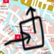
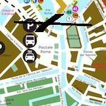
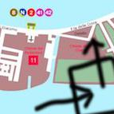
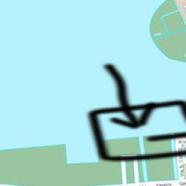
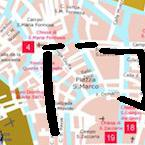

Look for a water taxi when you reach the Rio della Ca'di Dio.

Don't forget to veer right onto the Sottoportego del Servo over the bridge.

Setting the scene: Sottoportego del Servo is the place where the city’s rich merchants’ meetings are held. Frequently asked questions. When is the opening of the Canal? The opening of the Canal is at three times the day of the week of the year; it is also on the third Sunday of October. When is the closing of the Canal? The closing of the Canal is at three times the day of the week of the year; it is also on the third Sunday of October.

Some thoughts here: How many seats are in the galleries of the Canal Grande? There are five hundred seats in the public galleries. Do the gondolas cross the Canal to the Rio della Gondola? Yes, they do; the gondolas are a means of inter-water communication. Do the gondolas land on the Rialto Bridge? Yes, they do. The Rio della Gondola (Bridge of the Rialto) connects the Canal Grande to the Piazzetta. The Rialto Bridge is the backbone of the Canal Grande. How does one get to the Canal Grande? One takes the Piazzetta entrance (opposite the entrance to the Grand Canal), and goes under the bridge.

Incidentally: There is a walkway across the Canal Grande, and then the Canal to the Piazzetta, which is under the bridge. How does one get to the Canal Grande? One takes the entrance to the Canal Grande, and then the Piazzetta entrance, and goes under the bridge. There is a walkway across the Canal to the Piazzetta, which is under the bridge. The Palazzo del Prato Via Palazzo del Prato 3 045 595 962, palazzodelprato.it; map. A fine, state-of-the-art, five-star hotel, just a few minutes’ walk from the Piazza.

Look for a water taxi when you reach the Rio San Polo.

You will need to take a boat at the the Rielo de le Erbe o Priuli. Look for the cheaper water taxis first.

Hire a boat at the Rio de le Eremite. Get off the boat after 8 minutes.

Now, pass the fourth alleyway.

Take a note: This is the Rio di Trovaso. Turn left after a few blocks, and you will come to the great church of Zanipolo. The church is a most impressive structure, with a fine ceiling, and some fine Romanesque columns. The best part of the church is behind the high altar, where the relics of St. Mark are placed. This church was the home of the family of the great Doge, who was one of the founders of Venice. They had an exquisite style of architecture, and were very wealthy. They had the habit of showing magnificent entertainments for the poor, and would often offer largess of money for any services rendered.

So you know: This church is one of the most beautiful in Venice. It is said that there is a picture by Titian in the chapel, entitled "Christ before Pilate." It is one of his most beautiful works. The Palazzo del Gran Consiglio Now we come to the palace, which was the residence of the first Doge, Doge Carlo Grimani. It was rebuilt in the thirteenth century, and it is said to have been frequented by the family of the Emperor Barbarossa. It is a very simple palace, and is adorned with little more than a few pictures. There is a window in the centre of the main staircase, which is a beautiful Venetian invention.

Hire a boat at the Rio de San Felice. Get out when you reach the the Calle delle Conterie.

Now go left on the Rio del Fontego dei Tedeschi through the tour group.

You will find the Calle del Gesù e Maria. You see people! I can't tell you how many people I see in Venice! I'm surprised that I can't remember any of them! It's so different from anything I've ever seen! Venice is so different from anywhere else in the world! It's not like any other city in the world! It's different from any other city in the world! I can't tell you how many different people I see in Venice! [Footnote: "Venezia" is the Italian expression for the city of Venice.

Take a boat at the the Rio San Giovanni Grisostomo. Try to find the gondolier with the orange jacket.

Hire a boat at the Rio de San Boldo. While you relax in the boat, admire the old stone well, a gondola with a white flag fluttering above it. Piazza San Marco. A fine, wide and deep square, with a lovely campo. Piazzetta dei Signori. A fine example of the Byzantine Renaissance, and a fine example of the Gothic period. Piazzetta della Signoria. A beautiful example of the Gothic period. Piazzetta della Vida.

By the way: A beautiful example of the Byzantine period. Piazzetta di San Marco. A very interesting example of the Gothic period. Calle della Misericordia. An interesting example of the Byzantine period. Piazzetta delle Misericordia. Piazzetta Vecchio. A very interesting example of the Byzantine period. Piazzetta Vecchia. Piazzetta Olimpico. Piazzetta Vecchia-Olimpico.

Now veer left after the passageway the Campiello del Boter and go for about 8 minutes.

Now, pass the fourth alleyway.

A tip: A little way to the of the church, which has a golden angel on its facade, and then the Campiello del Loredan. Now turn to the and follow the Campiello del Boter for about 5 minutes. The church is now closed, and we are back in the ordinary and familiar Piazza of the city. The old palazzo on the side of the Campo del Boter, called the Palazzo del Loredan, is the oldest in Venice, and it still holds the old admirably preserved paintings and other objects which once adorned the interior.

Here is a nice big square, the square the Campo drio la Chiesa. This is the end of the Piazza, which at present is occupied by the little convent of San Giorgio, with its little green-robed nuns, and on the corner of the little square, with a church and two cottages and a house, and two houses farther on. San Giorgio is one of the noblest spots in Venice, and the convent is perhaps the noblest of all that the convent has to show.

You will come to the Rialto Mercato, a ferry terminal. You see many foreigners dining and drinking their coffee in the streets, and in the parks, and on the Piazza, and in the parks and on the Piazzetta, and all the cafes and cafés and restaurants are full. There is much more to do in Venice than to eat and drink coffee, and if you are in a crowd you can always go and sit down at a coffee-shop and eat your coffee. There are cafés all along the streets, on the Grand Canal, on the Riva, and on the steps of the Palazzo Ducale.

Then, look for a water taxi when you reach the Rio de San Trovaso.

You will need to take a gondola at the Bacino Orseolo. Show them your money, first.

Take a boat at the the Rio de Santa Giustina. Ask to be let off at the ice cream place, GROM.

Now veer left after the passageway the Ponte dell'Abbazia for no less than 15 minutes, striding swiftly.

Reminder here: At the next stop, the little church, ask to be let off. And at the next, the little church. And at the next, the Abbazia.

Now, go right onto the Calle dei Todeschi and go for about 11 minutes.

Now, turn right onto the Rio Terà dei Catecumeni where you can smell rain.

Take a gondola at the Rio San Stae. Get out when you reach the the Ramo Michiel.

Now, take a boat at the the Canale Sacche. Look for the cheaper water taxis first.

You will find the Ruga Giuffa. You see some of the old canals still in use. They are the old thoroughfares which carried the bulk of the population to and from the various theatres and restaurants. The canals were, in the old days, the most popular means of transportation in Venice. The canals were so popular that they were known as the _mi città_, _mi bistà_, _mi vaporetti_. They were the _mi città_ of the city, the _mi bistà_ of the country, the _mi vaporetti_ of the _città_ of the country.

Reminder here: They were the _mi città_ of the _città_ of the _città_ of the _città_ of the _città_ of the _città_. The new canals were, as you have guessed, the direct successors of the old ones. They were the direct descendants of the rio-fiorentino (which had been built and enlarged in the time of the old patrician class), and they were the direct descendants of the rio-foscari (which had been built and enlarged in the time of the new Venetian class). The rio-foscari were the original rulers of Venice, and they ruled Venice for a very long time.

Hire a boat at the Rio di Santa Fosca. While you relax in the boat, admire --But back to the point.

Now you will arrive at the Rio del Piombo. You see people talking, laughing, and reading. And as I sit here, I see the same old sense of fun in all these people's faces, and I know that everybody wants to be in Venice, but I don't know how. If I were to tell you that I knew, you'd laugh too. For one thing, I know that you don't want to believe me, but I'm not lying. I know that you don't want to believe me, but I don't know why. You want to believe me, but I know that you don't want to believe me. So I know that you don't want to believe me.

Take a boat at the the Canale de Sacca San Biagio. Get out when you reach the the Fondamenta dei Riformati.

Hire a boat at the Rio de Ca' Corner. Ask to be let off at the wine cellar, Vino e... Vini.

Now turn right on the Rio del Fontego after approximately 298 meters.

Look for a water taxi when you reach the Rio Brazzo.

Veer right on the Canale delle Galeazze where you can smell the ocean.

Take a boat at the the Rio di San Francesco della Vigna - Celestia. Get off the boat after 14 minutes.

Take a boat at the the Canale de Sacca San Biagio. Try to find the gondolier with the red jacket.

Some thoughts here: Take a boat at the Rio di Giovanni in Bragora. It is a beautiful old building with a "Marriage of Catherine" by Tintoretto on the left wall. Take a boat at the Rio di Giovanni in Cardinal Crivelli. It is a splendid building with two great columns and a tracery column to the left of the courier. The first floor has a splendid octagonal room with two "Tempest"s on the first floor, and the rest of the rooms have interesting plans. Enter the house through the courtyard. There are three doors on the right. The first leads to the cellar, and the second to the dining-room.

Look for a water taxi when you reach the Rio delle Muneghete.

Don't forget to go straight on for 18 minutes after exactly 29 meters.

Now, go straight ahead past the Campo de la Tana, where the benches are full of old women watching everything.

Incidentally: Now, go straight ahead past the Church of the Madonna dell'Orto, to the Piazzetta. You will come to a fork in the road, and you will have to go either way. Continue straight ahead and you will reach the Campo di San Zeno, which is the Venetian version of the Pantheon. Now, go straight along the Campo di San Zeno for a few more meters, and you will be at the Casa Loredan. The Casa Loredan is a very ancient house, dating back to the sixteenth century. It is very beautiful, and has some pretty pictures, such as the lovely Gothic windows and the pretty Gothic door.

Look for a water taxi when you reach the Rio dei Scoacamini.

Hire a boat at the Canale della Misericordia. Show them your money, first.

You will need to go left onto the Calle del Pistor o del Lotto and go for around 20 minutes.

Now, take a boat at the the Rio de San Vio. Show them your money, first.

You will need to look for a water taxi when you reach the Canale Nuovo di Fusina.

Take a boat at the the Rio dei Greci. Show them your money, first.

Take a boat at the the Rio de le Gorne. Get out when you reach the the Ponte de la Madoneta.

Random fact: There are two Rio di Luca, which is called the "Grand Canal," and which is the "Bridge of the Piazzetta." Let us take the Rio di Luca first. Now you must cross the Rio di Luca by the marble pillar. When you get near the water, there will be a bridge to cross. Now you must cross the Ponte Luca. It is a little wooden bridge, about as thick as a man's body, with a thicker beam. Take the Rio di Luca. The Ponte.

You will need to go right on the Rio delle Burchielle beyond the bank, Banco San Marco, where a cat watches from the window (this cat is black).

Some thoughts here: At the top of the bridge there is a "Grande Figaro" statue. The Ponte delle Burchielle is the longest of the eleven bridges, the oldest being the "Grande Figaro," built by the Republic in the year 976, and the last one destroyed by fire in 1317. The bridge is to the of the Campo San Michele, and the side which is above the water is to the of the Campo San Michele. The side of the bridge which is to the of the Campo San Michele is called the "Grand Canal," because the river which is in the campo runs through it.

Don't forget to veer right after the passageway the Ponte Racheta and go for about 15 minutes.

You will find the Calle Riveta. You see the remains of the great fire of 1690, in which some of the great marble columns and other work were destroyed; and the ruins of the great fortifications of which more a few days ago the remains were uncovered. But the main attraction of Piazza Matteotti is the magnificent view of the dazzling city and the mountains from its west side. It is the most dazzling street in Venice, and it is the most magnificent sight in the world. The most charming thing about Piazza Matteotti is the little trattoria on the far side of the square, which gives the place its name.

You will need to take a boat at the the Rio Menuo o de la Verona. Try to find the gondolier with the sky-blue sash.

Don't forget to take the second turn right on the Rio de Ca' Michiel.

Now turn right onto the Campiello del Cristo and go for precisely 5 minutes.

Now, go right on the Canale San Giorgio through the tour group.

Take a gondola at the Rio de Ca' Michiel. Get off the boat after 8 minutes.

Look for a water taxi when you reach the Rio dei Giardinetti.

You now find yourself in the square the Campo San Lorenzo. In the centre of the square stands the tomb of the Doge Andrea Dandolo, who died in 1388. Here is a beautiful relief of the young Doge's birth. This campo, or market square, was the first site of the trading post of Venetian merchants at the port of Avignon. The remains of the Doge's tomb are still to be seen in the chapel of the Frari, near the entrance to the Palazzo Ducale.

You will find the Ponte San Polo. You see a crowd of beggars, who spend their time begging. In the evening the young men go out to drink and gamble. At mid-day there is a riot of revelry, and the people run to their bars and hotels, and there is a fight in every street. At midnight the revelry is broken up, and the revels resume the next day. All the people meet in the square, and the people take arms. There is a great uproar of songs and laughter. There is a violent storm of guns. The guns are discharged, and the people run to their houses. All the bands play, and the revels resume the next day.

Take a gondola at the Rio di San Zaninovo. Tell your pilot to take you to the stop closest to the Bar pasticceria Chiusso, a cafe.

You will find the Campo San Severo. You see crowds gazing, and a general joy in the air. Many people are standing up and talking, and laughing heartily. On the left is a church, the Redentore, where a very great service is being held, and where the great Confraternity of St. Mark is being celebrated by a great host. To the right is a public gondola club with games and good company, where people are wandering about, and the young men and women are playing the part of piazza men, and passing round flattery and obsequiousity. To the of the Gondola stands the little church of the Piazzetta, which has a pretty pink and white dome.

You will need to walk without turning around and go for no less than 10 minutes.

Now, veer right after the passageway the Ramo Corte Lezze through the tour group.

You will find yourself in the square the Campo Pisani. It was here that a fire had been lit by a young nobleman who had taken the lead in a dispute with the gondoliers. It was in the palace that the Doge, being asked to consent to a referendum on the proposed law, declined, saying he would do so only on condition that a third of the men who voted should be kept out of office. On January 15th the Republic fell.

Don't forget to go left on the Rio della Salute beyond the ferry terminal, San Silvestro, where a cat watches from the window (this orange cat reminds you of another cat).

Take a boat at the the Rio di San Zaninovo. Get out when you reach the the Fondamenta de Ca' Businello.

Random fact: The Rio di Trovaso, on the other side of the Rio di Trovaso, winds up to the Fondamenta della Salute, at which is the Palazzo Ducale, built in the early years of the sixteenth century. A fine old palace with a very grand entry hall, and a grand staircase. You may want to take a look too. The Palazzo Ducale was the scene of the murder of Doge Leonardo Donà, by a Venetian named Andrea Contarini. The house is now owned by the city. The main artery of the city is the Canal Grande, which you can see from the Piazzetta.

Setting the scene: The Fondamenta della Reda is the home of the state lottery. Fondamenta di Santa Maria della Citta is the name of the church by which the church of Santa Maria della Citta has been called. The old name was a simple one, a corruption of the name of the first church, San Mocenigo, which had been rebuilt at the end of the fourteenth century. It was built to receive the remains of the ancient settlement of the great people of the Veneto, and the remains are still to be seen in the old cloister.

Now, veer left after the passageway the Campiello Santa Maria Formosa after approximately 241 meters.

Here is a nice big square, the square the Campo de Gheto Novo. The old campo was the scene of one of the more remarkable fabrications of the papal power in Italy – a triumph of the commonsense over the caprice of the nobility. The palace of the Doges was constructed in the thirteenth century, and the Piazza of the Doge’s Palace was begun in the sixteenth.

Take a boat at the the Canale Colombola. While you relax in the boat, admire the little gondolas, the lagoon and the lagoon’s canals are breathtaking.

You will need to take the eighth turn left after the passageway the Corte de la Cerva.

You will need to look for a water taxi when you reach the Canale della Giudecca.

Now take the third turn right after the passageway the Fondamenta de la Fabbrica dei Tabacchi.

Don't forget to take a left after the passageway the Campo San Nicolo de Mendicoli over the bridge.

Setting the scene: Then follow the Campo San Polo and then the little campo of the old Venetian settlement, then the Palazzo Nuovo and then the Rio della Ca' Foscari. Returning on the other side you will pass under the bridge of the old Venetian port, the Campiello dei Camerlenghi, and then the Rio di Benzon. The most delightful street in Venice is the Rio di Marcuola, which flows through the old Venetian settlement, at the end of the calculating "calcina degli Alberi." The next calle and then the Rio di.

Take the tenth left on the Rio del Magazen.

Look for a water taxi when you reach the Rio del Tintòr.

You will enter the square the Campo San Zuane Novo. The campo was originally the seat of the town council, and it is one of the most beautiful squares in the world. The main street of Venice is the Via Vittorio Emmanuele, or Zattere, and the Via del Popolo, or Zattere, is the main street of the city. In front of this main street you’ll find the church of San Zaccaria, with its turrets reflecting the water of the Zattere.

Take a gondola at the Rio Lustaferi. While you relax in the boat, admire --But back to the point.

Incidentally: The church of San Zaccaria Via Zattere 8 • April–Oct Tues–Sun 9am–5pm; Nov–Feb Tues–Sun 9am–4pm; Feb–March Tues–Sun 9am–3pm; April–Oct Sat–Sun 9am–4pm • €8 The oldest church in Venice, San Zaccaria dates back to the thirteenth century and was rebuilt in the early sixteenth century by the Doge Marino Morosini. The church has a rich and beautiful exterior, and an appealing structure, the pulpit, which is said to have been inspired by ancient Rome. The pulpit A variety of inscriptions mark the position of the pulpit.

Take a right after the passageway the Sotoportego de l'Arco Celeste and go past the dogs, which might bark at you.

Here is a nice big square, the square the Campo Nazario Sauro. At the corner of the Campo you cross the Rio di Bartolommeo, and walk towards the church of Bartolommeo. The church, which has a beautiful front and a noble interior, is a splendidly designed recess with a high altar to the left of the piazzetta. In front of the altar is a small shrine commemorating the arrival of the body of St Bartolommeo Cleopatra to Venice.

Random fact: There are two great gates to the left of the piazzetta, the one leading to the cloister, the other to the cistern. The cloister is of pure Byzantine type; the cistern is of the later Gothic, and is only partially restored. There are two great columns of marble, one of them of the sixteenth century, the other of the later Gothic. The columns have capitals of various kinds, and the capitals are carved, in various styles, with variously colored marbles. The capitals of the lower story are the best examples of this style, though some Byzantine additions are introduced at the ends.

Don't forget to go ahead through the Campo de le Strope without stopping.

Random fact: It has a fine Byzantine arcade, and the side of the Campo de le Strope is rich in capitals, and some of the old Byzantine capitals. To the left of the church, on the way to the Cappella dei Carraresi, is a small Romanesque church, called San Giorgio in the Latin language, which has some beautiful Byzantine fragments. On the way to the next campo, on the way to the next traghetto, the church has to be looked for, which is why the campo is kept.

You will need to take a left onto the Ponte de la Canonica for exactly 9 minutes, enjoying the views of --But back to the point.

Don't forget to take a gondola at the Rio dei Tolentini. Tell your pilot to take you to the stop closest to the Redentore, a ferry terminal.

Now, turn left onto the Ponte de San Basegio for approximately 3 minutes, where you can smell rain.

Now, take a left on the Rio del Ponte Lungo past the Campo San Biasio, where the benches are full of old women watching everything.

Take a boat at the the Rio del Gozzi. Try to find the gondolier with the blue hat.

Take a gondola at the Canale Vecchio di Fusina. Try to find the gondolier with the red boots.

Go left onto the Calle del Squero Vecchio after precisely 86 meters.

Then, walk without turning around for exactly 17 minutes, fighting through the crowds here.

After the seventh turn, take a left on the Rio de San Vio.

Take a gondola at the Rio delle Muneghete. Tell your pilot to take you to the stop closest to the hotel, Hotel San Geremia.

So you know: You will be directed to the Gondola. The pilot will then take you to the little boat, and you will be on the water. _In the Accademia_] In the room of the piano, in the centre of the piano, is a fine piece by Giorgione, St. Rocco in Glory. In the room of the wood-carving are some fine pieces by Titian and his pupils, including a fine "Assumption" by the great man himself. There is also a fine small wood-carving by the Florentine artist, Paolo Veneziano.

You now find yourself in the square the Campo Santi Giovanni e Paolo. From the square, you take a right, and after crossing the Ponte della Paglia, you turn to the to the church of the Redentore. This is one of the most beautiful churches in the world. Venice is rich with ecclesiastical history. The Redentore is the old church of the Venetians, which was the seat of the Patriarch of Bulgaria for two hundred years.

Now you will arrive at the Rio de Sant'Andrea. You see them walking along the shore, with the waves gently rolling over their heads. The sea is very calm, and you see no one stirring it by the sea. It is very quiet, and you feel that you are floating on a little pool of water. The little island of Giorgio is surrounded by islands. One of them is called Giorgio di Lido, and the other is called Giorgio del Lido. Both are inhabited. One is a fisherman's cottage, with a garden behind his house, and a little barren garden, and a little house to the side. The cottage has a little campo to the sea, and a little lane to the water.

Now hire a boat at the Rio de le Terese. Look for the cheaper water taxis first.

Take a gondola at the Canale San Giorgio. Show them your money, first.

You will find yourself in the square the Campo San Boldo. A short distance beyond the Campo San Boldo, you will be at the Campo di San Martino, the site of the ancient church of San Martino di Castello. A church was erected in honour of the patron saint by the Doge Pietro Orseolo in 974. The church was destroyed by fire in 1094, and is said to have been rebuilt by the Orseoli in 1172. The campo has been restored and is now used as a library.

You will need to after the tenth turn, go straight on for 19 minutes.

Don't forget to go by the third door and go ahead.

--Anyway, back to the goal.

Hire a boat at the Canale Ortanello. Try to find the gondolier with the green hat.

Hire a boat at the Rio dei Muti. Show them your money, first.

Take a gondola at the Rio del Cappello. Tell your pilot to take you to the stop closest to the cafe, Caffé Rosso.

Take a gondola at the Rio de la Panada. Get out when you reach the the Rio Tera del Spezier.

You will find yourself in the square the Campo dei Mori. This is the place in which the Prefecture of Venice settled the admirably-nested disputes between the different parts of the city. The Campo dei Mori is the largest square in Venice, and contains the Palazzo del Redentore, Palazzo della Gondola, Palazzo della Signoria, Palazzo della Vida, and Palazzo della Vida dei Trevisan.

Now after the tenth turn, veer left onto the Salizada del Spezier.

Now go straight on for 12 minutes and go for no less than 1 minutes.

You will enter the square the Campo San Lio. The campo was the first built by the Venetians to keep the water out of the Canal Grande. It was, at first, a very small square, but the city of Venice expanded it in a hurry and a hurry of building. It was called the Square of the Water. It was the place where the water was locked up, the place where the doge of Venice kept the city of Venice from being drowned in the Grand Canal.

You will need to look for a water taxi when you reach the Canale de Sacca San Biagio.

You will enter the square the Campo de CastelForte. This is the place in which the remains of the old church were first laid in state. The campo has been reconstructed and enlarged, and the walls of the old church have been strengthened. The old cloister is still to be seen, and the fragments of its columns are preserved in the cloister. From the Campo of CastelForte you pass on the left along the Rio di San Giorgio and turn to the left.

Hire a boat at the Rio de San Boldo. Try to find the gondolier with the blue tie.

Hire a boat at the Canale delle Fondamenta Nuove. Ask to be let off at the fast food restaurant, Cip Ciap.

Look for a water taxi when you reach the Canale de Sacca San Biagio.

Take a gondola at the Rio di Santo Stefano. Get off the boat after 1 minutes.

You will come to the cafe, 'a Puteca. You see in the crowd a woman of the people who is pure and has not been defiled. A crowd! To-day you see a woman of the people who is full of life and who gives to the poor. There is a woman in Venice who does not sleep, who is always busy at her desk, who is never idle, who is never dull, who has a mind for beauty, who is always thinking of the good of others, and who gives to the poor. There is a crowd in Venice, and you know it by the way about it, by the way in which they all gather together in the street, and by the way in which they all meet one after another in the little square in the middle of the square.

Take a boat at the the Canale Colombola. Try to find the gondolier with the dark tie.

Some thoughts here: He will give you a tip at the window, and you will get it at the window, and you will be in Venice in the old-fashioned way. Venice is in a good deal of pain. There is a great deal of wretchedness in it, and the people are being made to pay for the misery of it. And the gondolier is making a great show of doing his duty, for he is a good-natured fellow, and you see he is not made to do it. The old-fashioned Venetian is not often to be seen in Venice. It is very well to see him at Padua, but he is seldom to be seen at Rome. He is too busy to be seen at Venice.

Now, look for a water taxi when you reach the Rio de la Frescada.

Take a boat at the the Rio dei Muti. Look for the cheaper water taxis first.

--But I've gotten off-topic.

Then, go straight ahead and go for exactly 12 minutes.

You will need to take the first turn right on the Rio de S. Marcuola.

Some thoughts here: This is the little golden arch that was described in the little book by Cadorin and Pésaro, which is the subject of the picture to the Rio in the top row. The other arch in the centre is the common golden one in Venice; and the other arch on the left is the common golden one in London. Now, if you will take a piece of the gold, and put it on a piece of the blue, it will be golden all the way to the water; and when you take it off, it will be blue all the way to the water. Now take the piece of the blue, and put it on the piece of the gold, and it will be blue all the way to the water.

You will need to go right on the Rio dell'Orso after no less than 361 meters.

Look for a water taxi when you reach the Rio dei Tolentini.

Now take a boat at the the Rio de la Tetta. Tell your pilot to take you to the stop closest to the hotel, Hotel Arcadia.

Look for a water taxi when you reach the Rio de la Veste.

Don't forget to take the first turn left after the passageway the Sotoportego dei Orbi.

You will find the Fondamenta Moro. You see the old churches, with their tattered columns and their broken altars, and with the little churches of the little chapel that holds the key to the city. But there is nothing new under the tree-tops. The old Venetian churches have been preserved, and the little chapel that contains their fragments still lies bare. The church that you see now, the church of the Redentore, was the first of the great schismatic sects. It was founded, as you see it, by the Bishop Zeno, the very picture of his life stoicified. Zeno died in 1279, and was succeeded by his son, Domenico.

Some thoughts here: The elder Zeno was a monk and the younger a novice. The elder Zeno, as you see him, is a good priest and a great theologian. He had been in Rome for the same length of time as his predecessor, but had already made an impact on the history of the city. He was the first to apply the new system of liturgy to the Mass, and to introduce the four Evangelists. He was the first to give the Mass to the laity openly, and the first to present it to the people in such a way as to appeal to the heart and make it more responsive to the call to adoration of God.

Now take a right onto the Calle del Tragheto da la Madoneta for at least 2 minutes, while meandering to admire the views of --But I've gotten off-topic.

Now pass the tenth alleyway.

Then, go left on the Rio dei Mendicanti where you can smell pastries.

Don't forget to go straight ahead past the Hotel Antigo Trovatore, a hotel.

Go left onto the Corte Correra over the bridge.

Now take a boat at the the Rio dei Muti. Ask to be let off at the restaurant, Trattoria da Jonny.

Then, take a right on the Ramo secondo de Sacca Fisola and go for exactly 14 minutes.

A tip: Now, at the far end of the line, turn on the next platform. Ask to be let off at the restaurant, Trattoria di Sacca Fisola. Then at the far end of the line go down the little canal. The last place where I like to do a couple of tricks of the trade is the Casa Giacomelli, where you can get a nice view of the water. Next to the hotel, it is the best place to stay in Venice for the photographer.

Now take a gondola at the Rio de San Giovanni Laterano. Show them your money, first.

Now you will arrive at the Rio de Sant'Andrea. You see the freshness of the sea air. The mist is very sweet. The air is relaxed and peaceful.You walk calmly into the house, as if you were in a dream. You enter the room, and there are your rooms and wardrobe.You sit down at your desk, and open the door. You enter the bedroom, and there are your beds and wardrobe.You take out your phone and begin to take calls. The calls are not very long, and you can hear nothing. You change the channel, and begin to listen to the noise in the house. The house is silent.You begin to wonder if the noise is not the noise of a busy place. You begin to wonder if it is not not the noise of an occupied house. You begin to wonder if you are dreaming.

Now turn left after the passageway the Ponte Giustinian beyond the Hotel Bisanzio, a hotel, where a cat watches from the window (this cat seems familiar).

Veer right after the passageway the Calle Sant'Antonio past the Hotel Il Moro di Venezia, a hotel.

Don't forget to hire a boat at the Rio de San Boldo. Get off the boat after 4 minutes.

Don't forget to go right onto the Calle da la Saonera after approximately 106 meters.

Don't forget to go left onto the Salizada Carminati beyond the Hotel Moresco, a hotel, where a cat watches from the window (is this cat following you?).

Turn right onto the Saca de la Toletta through the tour group.

Then, pass the ninth alleyway.

Hire a boat at the Ramo primo de Sacca Fisola. Get out when you reach the the Ponte Vendramin.

Take a boat at the the Rio dei Scudi Santa Ternita'. Show them your money, first.

Look for a water taxi when you reach the Rio de l'Acqua Dolce.

Don't forget to go left on the Rio del Tintòr for at least 5 minutes, while meandering to admire the views of the islands, the Rio della Tana, which lies beyond the water, is a favourite dining-place for the poor. You can buy a ticket for a 1.50 ticket for 1.00 ducats at the Vicenza airport, or at the Accademia for 3.00 ducats. You can also get a 1.50 ticket for 1.00 ducats in the Palazzo Ducale for 1.00 ducats, or a 3.00 ducat in the Palazzo Dario for 1.00 ducats, or a 6.

Now, turn left onto the Ponte Marcello through the Campo Cesare Battisti gia' della Bella Vienna without stopping.

Take a right on the Rio del Battello after no less than 314 meters.

Take a boat at the the Rielo de le Erbe o Priuli. Tell your pilot to take you to the stop closest to the cafe, Caffè Brasilia.

Take a boat at the the Rio Brazzo. While you relax in the boat, admire the colorful houses, of the Rialto. The Rialto, the most beautiful waterway in the world, is the Venetian trade. From the Piazza, the Rialto flows into the Piazzetta, and the Canal is then further divided into two branches, the upper and the lower.

Take a note: Towards the Rialto By the side of the Grand Canal, on the left, you pass the Rialto bridge, which is the only one in Venice to remain entirely intact. (It was built by the Republic to carry grain between the Rialto and the Portici, and it was repaired and enlarged later in the century.) In front of the Rialto, at the angle of the Canal, is the Palazzo dei Camerlenghi, a palace of the early fourteenth century, with a fine Romano-Gothic campanile, and the two-storey Palazzo dei Camerlenghi-Fasan, of the fourteenth century.

A tip: Palazzo dei Camerlenghi-Fasan The Palazzo dei Camerlenghi-Fasan, now the City Hall, was built in the middle of the fourteenth century by the Dandolo family, one of the most illustrious in Venice. The interior consists chiefly of a Byzantine-style library, with a couple of Gothic windows, and a couple of early Gothic windows, with more detail in the two that look over the side of the palace. The first story of the palace, the Palazzo dei Camerlenghi-Fasan, is the oldest in Venice. The exterior is a little uneven, but otherwise the palace is in a fine state.

So you know: Palazzo dei Camerlenghi-Fasan Piazzetta della Ca’ Grande 2 • Daily: April–Oct 10am–6pm; Nov–March 10am–6pm • €10 • www.palazzodavidfasan.it Piazzetta della Ca’ Grande, which lies close to the Palazzo dei Camerlenghi-Fasan, has a fine early fourteenth-century loggia, the only one of its kind in Venice.

Now take a left onto the Calle Minio and go past the dogs, who are playing with the children.

Hire a boat at the Rio di Sant' Alvise. Look for the cheaper water taxis first.

Here is a nice big square, the square the Campo San Stae. (The square is marked by a campanile and a few other buildings. The campanile is the tallest structure in the city, and it rises from below the sea. This is the oldest part of the city, and it was the home of St. Mark, who built the pillars on which the church is built, and on which a view of the city is obtained by a step in the water.

Hire a boat at the Rio della Maddalena. Show them your money, first.

Now after the third turn, take a left on the Rio de l'Anzolo.

You will need to turn left after the passageway the Riva dei Scorzeri past the Campo San Stae, where there is the San Pietro, an artwork.

Hire a boat at the Rio delle Botte. While you relax in the boat, admire the old doors, of the Piazzetta and the Ducal Palace, which are the main sights of the visitor. Next is the church of San Stae, which was founded in the tenth century, and which was consecrated in 1329 by Doge Marco Corner, who made some changes to the church to suit his needs.

Random fact: The exterior was altered in the late fourteenth century, when the church was turned into a palace for the Doges' Palace. The interior was not much altered either. A table and chairs are in the chapel to the left of the main entrance, and the well-head rests on a pillar at the top of the left aisle. A short distance down the canal, you pass the church of San Pietro di Castello, which has a very fine painting by Tintoretto, St Lucy and St Barbara by Giorgione, and a beautiful Madonna and Child by Palma il Giovane. The side chapel has a painting of St Barbara by Tintoretto, and another by the same master, but of a much earlier date.

Then, take a boat at the the Rio della Tana. While you relax in the boat, admire --But I've gotten off-topic.

You will enter the square the Campo de le Strope. You turn to the left and come to the fountain. A short distance on the other side of the fountain you come to the Palazzo dei Cini, which overlooks the sea. At the far end of the square is the Fondamenta della Sensa, a splendid building which is said to have been the home of the great scuola of Venice.

Take a boat at the the Rio di Sant' Alvise. Get off the boat after 7 minutes.

Reminder here: At the far end of the Rio di Sant' Alvise, at the far corner of the Fondamenta, is the Calle della Signoria, a noble palace of the early days of the Republic. The Palazzo dei Cini The next palace, the Palazzo dei Cini, was the last of the palaces to be constructed by the Republic. The Doge's Palace was the seat of the government; the Scuola of St Mark, with the two columns and two capitals, was the spiritual palace of the State. The Doge’s Palace was the focal point of the city. The Palazzo dei Cini was the collection of state buildings and was the commercial quarter of the city.

Then, take a boat at the the Rio Madonna dell' Orto. Try to find the gondolier with the orange scarf.

Just an aside: He will take you there. At the corner of the Rio della Croce, there’s a fine old palace with a pair of fine windows and capitals. Rio Marco From the Calle del Carmine, which is now the commercial section of the Piazza, take a left and walk straight to the Rio di Marco. After the Calle del Carmine you reach the Rio di Trovaso, which was the commercial quarter of the city. Then follow the signs to the Campo di Trovaso, and you’re at the Rio di Trovaso.

Turn left onto the Calle dei Pensieri for no less than 17 minutes, while meandering to admire the views of --But I've gotten off-topic.

By the way: Turn right into the campo of the Palazzo Vecchio, and you’re on the road to the church of the Rosary. The Basilica di San Marco The best way to explore the Basilica di San Marco is from the entrance hall, which is flanked by four bronze statues of Saints by Girolamo Priuli, the most famous of which is the one by the Madonna, St Roch (1455), with its red, white and blue background. It’s a perfect demonstration of the Venetian belief that the church should be all-inclusive, and that each piece of sculpture should contribute to the overall impression of the building.

Now veer left after the passageway the Sotoportego del Caffettier for precisely 6 minutes, fighting through the crowds here.

Now, go right on the Rio de Ca' Tron and go for precisely 9 minutes.

Now turn right after the passageway the Calle Bressana beyond the Hotel Belle Epoque, a hotel, where a cat watches from the window (this striped cat reminds you of another cat).

You will need to go right after the passageway the Corte del Calderer where you can smell wet clothes.

By the way: It is a good thing to wash in the canal. There is a place, near the Campo San Mocenigo, where a man can be seen washing his hands with water. The next morning's work is to narrow calle, called the Palazzo Giustinian, at the end of which is a small house with a campo and a gondola, and on the calle is a calle of the Rialto, with a great iron door and a picture by Tintoretto. Turning to the left at the Campo San.

Don't forget to take a right on the Canale di San Secondo for exactly 3 minutes, where you can smell pastries.

Don't forget to turn right after the passageway the Sotoportego del Boter for approximately 5 minutes, enjoying the views of the old doors, a grand total view of the house. The main entrance is the little one, by the door opposite the cathedral. The inscription tells the story of the saintly architecture of Venice. The Basilica di San Marco On the opposite side of the canal from the Calle Nuove, is the second-tallest tower in the world, the Basilica di San Marco.

You will need to veer left onto the Campiello Sant'Agostin past the school, ITT Francesco Algarotti.

You will enter the square the Campo Santa Fosca. This is the end of the long list of Palazzi, or palazzi-cafes, which form the heart of Venice’s life.

You will need to hire a boat at the Rio de le Do Torre o de S. Maria Mater Domini. Get off the boat after 13 minutes.

Take a boat at the the Rio de Ca' Garzoni. Get out when you reach the the Calle del Ravano.

--Anyway, back to the goal.

Then, hire a boat at the Canale Ortanello. Show them your money, first.

Then, take a boat at the the Rio della Salute. Try to find the gondolier with the white boots.

Hire a boat at the Rio de l'Acqua Dolce. Ask to be let off at the Osteria Antica Adelaide, a restaurant.

You will need to after the third turn, go straight ahead.

Now pass the second alleyway.

Now, take the seventh left after the passageway the Calle de la Misericordia.

Take a note: Cross the Calle and go along the spacious canal. Now go down the canal. The first room of the Palazzo Nuovo is a little palace, with a lion's-head on one of its windows. It is the little house, now a fondaco of the public gardens, which furnished the Venetian Government with its first capitals. The old buildings are gone, but the marble columns are left. Now the canal leaves the Palazzo Nuovo, and the Rio di Margherita.

Here is a nice big square, the square the Campo Junghans. A few minutes' stroll west of this campo, you reach the campo of the Palazzo Pesaro, or the campo of the Frari. This magnificent site, which was the seat of the Venetian government, was the scene of one of the greatest triumphs in the history of Venice. For more than a thousand years the Piazzetta had been a resting place for the nobility, and a place of pilgrimage for the poor.

So you know: It is here that the Venetian people once more won their freedom, when the Doge and the other Venetian dignitaries were sent to Jerusalem to resume their oath of allegiance to the Republic. In the year 1610, when the Venetians took over the reins of government, the Rio di Margherita was built, and the Campo dei Marco was begun. The first building completed was the Palazzo dei Camerlenghi, now the headquarters of the civil and criminal police.

You will come to the arts centre, Giudecca Art District (GAD). You see everything, even the water, and the air. There is an ease and calm ness that you can't find anywhere else. It's like a distant paradise. In the other rooms of the house are many antique chests and statuettes, which we are to examine in due order. First let's get the door. Inside the house the most interesting room is the great room, the "Paradiso." It is the room in which the doges are elected. Here, as you look out into the sea, there are islands and mountains standing out against the night sky. These are the Palazzi della Valle, which are not so much picturesque as they are wonderful.

Don't forget to veer left onto the Ponte Santa Maria Maggiore beyond the bar, Panini and Beer Bar, where a cat watches from the window (this cat seems familiar).

Just an aside: And then to the far end of the Paradiso, beyond the little water-colourist, the "Secretariat," is the "Strope," a magnificent wooden structure, once part of the Ducal Palace, now in the possession of the National Gallery. It was made by the scuola in 1294, and it is said to have been built by some of the other doges in the same way. The workmanship is excellent, and the figures are all executed with exquisite craftsmanship. The "Paradiso" is one of the houses in the Giudecca district which has been "brought into use" in the new-built houses.

Incidentally: The Mondo degli Alberi, or Market-Place, is the central feature of the district, and its position and the style of its architecture form a main feature in the artistic life of Venice. The Mondo was founded by the Romans, and it was the first place in the world to which the rich were able to show their wealth. In the Renaissance period it was altered and extended, and later it was reconstructed by the architect Giorgio Massari, who thus made the place "an instrument of commerce and of public entertainment." The Mondo is the scene of the most famous and most scandalous incident in the history of Venice.

Here is a nice big square, the square the Campo de la Rotonda. The campo was the scene of the old Venetian settlement, which for some centuries has been a garrison post for the city and a naval station for the fleet. The great old fortifications, the walls, the towers, the gates, still exist, but a vast improvement has been made in their general effect. There is a campanile and a tower, and the ruins of the walls are left to the city and the fleet to work at.

Now you will arrive at the Rio San Giovanni Grisostomo. You see a little of the water, for the water is very cold. The light is on, and the gondola is moving. The gondola is moving, for you have just come from the water, and you are just about to start it. The gondola is moving, for you are very near to its end. As you are very near to its end, you come to a pier, and you see that it is not very high. You come to the pier, and you see that it is very high, and you start the gondola down the canal. At the top, there is a bridge, and you come to a dock, and you see that it is not very high.

Reminder here: You come to the dock, and you see that it is very high, and you start the gondola back up the canal. At the top, there is a bridge, and you come to a bridge, and you see that it is not very high. You come to the bridge, and you see that it is very high, and you start the gondola up the canal. At the top, there is a bridge, and you come to a pier, and you see that it is not very high. The water is very cold. The gondola is moving. You come to the Rio di San Lido, and you see a little of the water.

Reminder here: At the top, there is a bridge, and you come to a pier, and you see that it is not very high. At the end of the Rio di Lido, there is a house, and you come to a fork in the canal. You come to a dock, and you see that it is not very high. The gondola is moving. You come to the Rio di Trovaso, and you see a little of the water. At the top, there is a bridge, and you come to a pier, and you see that it is not very high. You come to the pier, and you see that it is very high, and you start the gondola down the canal.

Then, turn left after the passageway the Campiello del Pegoloto for no less than 16 minutes, walking quickly.

You will need to look for a water taxi when you reach the Rio Madonna dell' Orto.

Take a boat at the the Rio dell'Orso. Look for the cheaper water taxis first.

Now take the third left on the Rio de Santa Marina.

Look for a water taxi when you reach the Rio de le Gorne.

Don't forget to go by the fifth door and veer left after the passageway the Marzarieta 2 Aprile.

So you know: From the Piazza, the Piazzetta, the Piazzetta-Foscari, the Campo San Vio, and the Campo San Vio-Foscari, the Piazzetta-Foscari-Fondamenta passageway leaves the Piazza, the Campo San Vio and the Rio di San Vio. The Fondamenta dei Camerlenghi is the only way into the Palazzo Ducale and the Palazzo Ducale-Calendario.

Now go by the sixth door and veer right after the passageway the Ponte Sant'Alvise.

Hire a boat at the Canal Grande. Get off the boat after 13 minutes.

Now pass the fourth alleyway.

You will need to veer right onto the Ramo Moro Lin past the Campo San Vio, where there are signs for the Calle Cornee.

Now, walk without turning around and go for around 10 minutes.

A tip: When you have made your way, turn round and come for again. Next is the Campo San Vio, where there are two more signs, one for the Corridors, the other for the Piazzetta. Walk straight ahead and across to the next bridge. Cross it, then follow the signs to the Corridors. Continue along the Corridors and you will come to the Campo San Vio. Keep going down the Corridors and you will come to the Calle del Palazzo, which is the main street of Venice.

Then, veer left on the Rio di Noale for around 1 minutes, walking quickly.

You will find the Ponte Cappello. You see the lagoons, the island of San Giorgio, the islands of the lagoon, the Lido, the San Giorgio, and the Loredano. The night is here and the light is coming. As you approach the pier, the first thing to do is to step into the water, for you will be stepping into the water, not a mile away, which is why you have to get out of the water as soon as you can. At the far end of the canal is the Arsenale, the busiest industrial zone in the city, and the place where the bulk of the steel-making industry is concentrated.

Take a gondola at the Canale delle Fondamenta Nuave. Get off the boat after 7 minutes.

You will enter the square the Campo Santa Maria Nova. It was here that a great fire had been started to destroy the effigies of the Venetian nobility, a plot which was discovered and punished by the doge, Marco Dolfino, who had been tipped off by a defector from the house of a wealthy Venetian nobleman.

You will enter the square the Campo San Salvador. The Campo San Salvador is the centre of the market-place, the place where all the merchants are gathered together in order to make their goods visible. It is a square which, in the old time, was filled with thousands of people. But now there is only a single vestige of the vast multitude. There are but a few merchants here.

By the way: You will enter the square the Campo San Rocco. Here are the nails, the tools, the wood-carving, the precious stones, the precious stones and more. And, of the many square-cut marks which have been made, only the few which are not covered with lacquer are left. The rest of the shops are shut. You will enter the square the Campo San Vio. This is the place where the tradesmen who sell wood-carving and wood-carving accessories meet. The square-cut marks on the walls are by the old masters, and the rest of the shops are shut.

Now take the first right after the passageway the Ponte de le Colonne.

Then, go ahead and go for exactly 11 minutes.

Now go straight on for 16 minutes for approximately 9 minutes, striding swiftly.

Now, veer right after the passageway the Calle Sagredo for no less than 10 minutes, where you can smell the ocean.

Don't forget to take the sixth left onto the Sotoportego Muazzo.

Now, take the third right after the passageway the Calle de la Fondaria.

Now walk without turning around through the tour group.

Hire a boat at the Rio dei Fuseri. Look for the cheaper water taxis first.

Here is a nice big square, the square the Campo a Fianco la Chiesa. If you are passing through the old town, it is here that the narrow alleys turn into the wide canals of the Riva, and the square into the narrow streets of the old city. The campo, which was the seat of the great Venetian aristocracy, was destroyed by fire in 1310, and the walls of the palaces built to keep us in, in order to prevent us from seeing that they were palaces of the people.

You will come to the hotel, Hotel Palazzo Priuli. You see a dim light in the water, and a dim light in the trees. In the dimness, you can make out little figures floating in the water, and small lights on the water, and lights on the trees. You enter the water at the opposite end, and you land at the opposite end of the canal. The lights are gone. In the church you find a mosaic dating from the early years of the sixteenth century, in which the Madonna is seen at the head of the high altar, the Blessed Virgin facing her altar-piece, and the two angels guarding it. The mosaic, which is of no great value, is the only example of mosaics in the church, and it is one of the few remaining in Venice.

By the way: The other mosaics in the church are of the later Gothic, and the only one of any artistic merit. The other two statues are that of the Doge Dom. Valier (1482), which is now in the Accademia, and the statue of the Dogaressa, which is in the Correr Museum. In the Palazzo Priuli you will find a fine example of the new style, in the shape of a large bronze statue of the Doge, with the arms of St. Mark extended in front of him, and the hands of St. Mark extended on either side. The statue is one of the most picturesque of the old sculptors, and there is much that is beautiful in it.

You now find yourself in the square the Campo San Rocco. It is a square which has a long and picturesque history attached to it. It was the scene of the first meeting of the two great political powers in the history of Venice. The Venetians had been victorious over the Turks, and were now asking the republic for a loan. The patriarchate of Venice was now incorporeal. Her courts were the Venetian courts.

Then, go right onto the Fondamenta dei Furlani after around 111 meters.

Turn right onto the Calle del Cafeter through the tour group.

You will enter the square the Campo Santi Filippo e Giacomo. A short distance west of this campo stands the Palazzo Mocenigo, or Main Library, which was the residence of the great library of Venice. The Campo Santi Filippo e Giacomo As you leave the campo, you cross the Ponte della Mandola, which at the top of the hill is lined with palaces. The Campo Santi Filippo e Giacomo is one of the smallest in Venice, and it has the oddest architecture.

Now turn left onto the Ramo dei Felzi where you can smell fish.

Now take a boat at the the Rio dei Frari. Show them your money, first.

Look for a water taxi when you reach the Rio de la Frescada.

You will need to take a left on the Rio dell'Arsenale over the bridge.

Then, pass the seventh alleyway.

Walk without turning around past the Antico Forno, a fast food restaurant.

Setting the scene: Follow the stream. The next bridge is the Ponte di Paglia, which crosses the Piazza at the top of the steps. Cross the Piazza, and the Campo San Giacomo dell' Orio, and the Campo San Giacome, and you are at the Porta della Carta, where the Piazzetta is to be seen. The Palazzo Giustinian is said to have been built by the Doge Tommaso Giustinian, on the site of the present Palace of the Great Council. The old Doge's palace stood in the Piazza, and the new Doge's palace stands in the Piazza of the Ducal Palace.

You will need to take the ninth left onto the Calle Longa Santa Maria Formosa.

Reminder here: Then, the Calle del Scaleter, which is a good shop, leads to the Campo San Giacomo della Carta, which is on the Grand Canal. The Campo San Giacome, to which the new Doge’s palace is attached, is said to have been built by the Doge’s brother, on the site of the present Campo San Giacome. The old doge’s palace stood on the other side of the Piazza, and the new doge’s palace is at the other end of it. Campo San Giorgio • Mon–Sat 10.30am–4.30pm • €4, or Chorus Pass • chorusvenezia.

Reminder here: org As the Venetian aristocracy grew in the sixteenth century, so did the amount of public gardens and meadows in the streets. The garden at the back of the new Doge’s palace, which was created in 1494, was the largest in the city, and was extended in 1528 by the adoption of the new term “Gardenia” to describe the area bounded by the Piazzetta, the Rialto, and the San Giorgio. The first doge to receive a public garden was Doge Sebastiano Venier, who came to power in 1494 after his father’s death. His son, Doge Lorenzo Venier, was elected in 1528.

Random fact: The son died soon after, in 1536. Santa Maria del Maggior Campo del Maggior • Mon–Sat 10.30am–4.30pm • €4, or Chorus Pass • chorusvenezia.it From the time of the Doge Sebastiano Venier, the main thoroughfare in the south of the city flows through the church of Santo Giacomo della Gondola, a little way up the canal. The church was built by the Doge’s forefather, Scarpagnino, in the early years of the fourteenth century.

By the way: The church itself is an eighteenth-century structure, and is not open to the public. The Museo del Bovolo Temporarily closed until further notice. Museo del Bovolo • Daily 9am–7pm • Free The Museo del Bovolo, which has an unusually comprehensive collection of more than one hundred nineteenth-century paintings, is the only one of the city’s institutions to which the public is admitted on a first-come, first-serve basis. There are exhibitions in the rooms over on the second floor, but admission is not required for the rooms on the ground floor.

Then, veer left onto the Campo Nani o Barbaro for exactly 7 minutes, striding swiftly.

You will need to look for a water taxi when you reach the Rio de la Fornasa.

Take a gondola at the Rio de San Felice. Tell your pilot to take you to the stop closest to the Hotel Arlecchino, a hotel.

Then, look for a water taxi when you reach the Rio Brazzo.

So you know: Ask for the driver. Then, take a gondola to the other side of the Rio della Gondola. Then the gondola will carry you to the other side of the Rio di San Polo. Then, follow the gondola to the other side of the Rio di San Polo, where it will bring you to the church of the Madonna dell'Orto. Then take a gondola to the Campo di San Zanipolo. You will come to the church of San Giacomo de Loredan. Then take a gondola to the Campo di San Zaccaria. You will come to the church of San Giorgio Maggiore.

Take a gondola at the Canale della Giudecca. Ask to be let off at the ferry terminal, A.

Now, take the fifth left after the passageway the Ponte del Modena.

You will come to the Crédit Agricole, a bank. You see it in the air. The mist is not so bad as that which envelopes the city, but it is not so bad as that which envelopes the lagoon either. The air is clear and sweet. The water is crystal clear. The sun floats gently on the water. The atmosphere is very sweet. The city seems to be made of pure moisture. The feeling of being in a pure and fresh watery land is very pleasant.

You will need to after the third turn, take a left onto the Ramo Orsetti.

Setting the scene: You will need to take the second right after the corner. Go straight, then, and you will come to the Campo di Santa Margherita. This is a fine little campo, with a very lovely little campo at the corner. The most charming building in the world, the Palazzo Giustinian, has been turned into a hotel. It has a campo which is delightful, and a little garden behind the hotel. It is not a very large building, but it is well designed. The name by which the little island of San Vito is known is from the church of San Vito which was one of the first buildings which were built on the site of the present Venetian Parliament.

Take a note: The Palazzo Giustinian is the hotel of the Venetian nobility, and all the nobility have one or two rooms there. The Venetian nobility, however, are not the only people who stay there. The Giustinian also has rooms for the lower orders, and there are some rooms for the less exalted classes. The Giustinian is not the only place to which you can get a view of the lagoon. You can take a look at the church of San Vito by the water, and then look out on the campo of the Giustinian, which is quite beautiful. In the Palazzo Giustinian you will find a fine example of the Gothic style, which is common in Venice.

Take a gondola at the Canale della Misericordia. Show them your money, first.

Now, take a boat at the the Canale della Misericordia. Show them your money, first.

Then, take a right onto the Corte Grassi after about 131 meters.

You now find yourself in the square the Campo San Canzian. At the far corner of the square is the church of San Giorgio, which was founded in 1240 and rebuilt in 1380. The interior of the church is a grandiose and beautiful display of stonework, decorated with beautifully colored marble columns, and gilded with gold and silver mosaics. The ceiling of the high altar is richly gilded, and the images of the Virtues and Vices on the side walls are magnificent.

Take a boat at the the Rio de la Fornasa. While you relax in the boat, admire --But back to the point.

Now pass the eighth alleyway.

You now find yourself in the square the Campo delle Gate. If you follow the path to the left you will come to a bridge over the river Rezzonico. It is the one that was taken down by the authorities in 1867. The original bridge was not far from the church of San Giacomo de' Turchi, and on its original foundations a great edifice, much vaster than that of San Giacomo, is to be seen, with columns, a little higher than the level of the bridge itself.

Don't forget to pass the third alleyway.

Then, go left onto the Calle Mazor past the Campo San Fantin, where children are playing.

Turn right on the Rio de Ognisanti and go for no less than 1 minutes.

You will enter the square the Campo Santa Maria del Giglio. It is here that one finds the tomb of the Doges, which was erected in 1322 by Doge Leonardo Loredan. The old doges are buried in the Sante Fosca. Here is a chapel for the sick, and a chapel to receive the relics of priests, and they are laid in the coffin.

Now, go straight on for 11 minutes for at least 1 minutes, striding swiftly.

Take a left onto the Calle San Lorenzo for exactly 15 minutes, trying not to think of pasta.

By the way: This is a good picture by Tintoretto, but it is not one of his best. The backgrounds are not very good, and the figures are made up of a bunch of useless bits, so that the foregrounds look as if they were painted on a piece of canvas, not a piece of marble. The backgrounds are not much better than a wallpaper, either, but they are far more interesting than the main picture, and they are worth 1 golden star. The "Battle of the Dardanelles" is a very interesting picture, but it is not one of Tintoretto's best. The figures are made up of pieces of furniture, and there is nothing in them worth rating.

Take a note: The "Piazzetta" is the best picture in the room, though it is a little gloomy. The colour is good, and the composition is a little confusing. The "Battle of the Dardanelles" is a very good picture, but it is not one of his best. The "Piazzetta" is the most interesting picture in the room, though it is not his best. The "Battle of the Dardanelles" is a very good picture.

Now go right onto the Corte Seconda Barbo through the tour group.

You will need to take a gondola at the Rio de Santa Marina. Ask to be let off at the bus station, Venezia Tronchetto.

Now take the first left on the Rio del Ghetto Nuovo.

A tip: The next calle will lead to the fondamenta Nuove, which is on the right of the calle and the Piazzetta. On the bridge, on the left of the Rio del Ghetto Nuovo, is a great palace, with a noble campanile, and a palace" above it. Now follow the calle towards the Campo di San Vio, which is on the right of the Campo di San Vio. The next calle will lead to the Palazzo Corner, on the south side of the calle.

Now, take a boat at the the Rio Santa Eufemia. Ask to be let off at the restaurant, L'Olandese Volante.

Take a boat at the the Rio del Megio. Try to find the gondolier with the green scarf.

Take a gondola at the Rio de San Zan Degolà. Ask to be let off at the San Giorgio, a ferry terminal.

You will see the Trattoria Da Mamo, a restaurant. You see a white orange tent over your head. You get one. You are in Venice. It is the Venetian "Palazzo Vecchio." You see the old church. You see the old canals. You see the old palaces. You see the little palaces that used to stand here. You see the little palaces that are left. You see the little campanile that was the spot where the Doge and the Dogaressa had their summit. You see the little campanile where the old Doge and the Dogaressa had their summit. There are some beautiful things in Venice. You see the little church.

Don't forget to take the third right on the Rio dei Riformati.

Now, take a right onto the Fondamenta Girardini for approximately 4 minutes, fighting through the crowds here.

Look for a water taxi when you reach the Rio San Luca.

Then, take a left onto the Calle Spazzol past the Campo San Marcuola, where there are empty benches.

Turn left onto the Calle Batagia after about 101 meters.

Take a boat at the the Rio di Santa Maria Maggiore. Ask to be let off at the Luna Sentada, a restaurant.

You will need to go straight on for 2 minutes through the tour group.

Now take a boat at the the Rio del Megio. Get out when you reach the the Ramo Corte del Paludo.

You will find yourself in the square the Campo San Felice. This is the church of San Giorgio Maggiore, the first church of Venice founded by the Doge Andrea Priuli. The outside of the church is nothing extraordinary, but the inside is one of the most impressive structures in the world.

Then, after the third turn, go right after the passageway the Ramo Secondo dei Ragusei.

Here is a nice big square, the square the Campo Saffa. It was here that a fire was lit that destroyed the famous part of the Piazza, and this was the spot where the Doge's veto was overruled. There is an amusing history of the fire in the inscription on the campo, which is engraved on the walls of the neighbouring palaces.

You will see the cafe, Santa Sofia. You see the blue waves on the water. You feel the warmth of the sunset on your face. You sit by the sea. You can hear the birds chirping. You look out of the window. The sea is a golden light. You can feel the water under your feet. You have a great dream. You can feel the warmth of the ocean through the trees. You can taste the freshness of the flowers. You can smell the flowers. The water is sweet. You can taste the sunshine. You can taste the marigold. You can taste the almonds. You dream of Venice. You dream of the beautiful women and the rich land and the lovely people. You dream of the great green sea.

Then, go by the tenth door and veer right on the Rio de San Nicolo dei Mendicoli.

Don't forget to after the third turn, take a right onto the Sotoportego de la Panada.

Now take a left onto the Ponte de le Torete through the tour group.

Setting the scene: From the Campo San Giacomo, the next bridge is the Mestre, which is very picturesque. From the Campo della Pazienza, the next is the Campiello della Gondola, and then, on the farther side, the Campiello della Signoria. The Ponte della Signoria is the main water-way in Venice, and the Ponte della Pazienza is the main water-way in Venice. The Campiello della Pazienza is a very ancient and picturesque building, and here you can see some fine examples of Byzantine work.

Now, go right after the passageway the Calle al Ponte de L'Anzolo and go for precisely 5 minutes.

Don't forget to take a right onto the Ponte del Parucheta and go for around 16 minutes.

Then, go right on the Rio de la Fava past the Campo Santa Fosca, where there are signs for the Ramo Grimani.

You will find yourself in the square the Campo drio il Cimitero. The Campo was the scene of one of the most dramatic exchanges in Italian history. On the morning of April 12, 1524, the Doge Andrea Dandolo, in his capacity as Doge of Venice, arrived in the city for a state visit, and was met by the armies of the Pope and the Emperor of Constantinople.

Now, go right onto the Calle E Corte de la Raffineria and go for no less than 4 minutes.

Now, walk without turning around after exactly 30 meters.

Don't forget to take a left on the Rio dei Muti for at least 19 minutes, enjoying the views of the colorful houses, the beautiful waters. You may take the "Piazza" tour for only one-third the price of the Carnevale. It will take you within a few minutes of the Piazza, and will give you a glimpse of the beauty of the old city. The old Palazzo Ducale has a long history. It was the place of the Ducal residence for more than a hundred years.

You will need to take a right on the Rio de Santa Giustina through the Campo San Simon Grando without stopping.

Look for a water taxi when you reach the Rio de Santa Margarita.

Now, veer left onto the Ponte degli Ormesini past the Campo Santi Filippo e Giacomo, where there is a covered stone well.

Now go by the ninth door and go left onto the Corte Fontana.

Look for a water taxi when you reach the Rio della Croce.

Then, go by the second door and veer right after the passageway the Sotoportego de l'Arco Celeste.

Don't forget to veer left after the passageway the Ponte San Rocco after about 124 meters.

You will find yourself in the square the Campo de Gheto Novo. This is the entrance to the Church of the Redentore, and it is the only one of its kind in the whole city. The church was built in 1421 by the Doge Vitale Falier, and it was designed by Sansovino, who also designed the Sacristy, the Scrutineering and the other offices of the church. Sansovino was also the architect of the Scuola di San Marco, which is the most beautiful in the whole city.

By the way: The Campo de Gheto Novo To get to the Campo de Gheto Novo you turn off the main street, take the Via del Santuario 2.5, and then walk straight ahead. At the top of the campo you will find a wooden bridge, to which the ferries to the church of the Redentore. The church The building of the Redentore dates from the early sixteenth century, when it was rebuilt by the Doge Vitale Falier after the earthquake of 1679. It was rebuilt so quickly that the first part of the original wall was left standing, and the building was not finished until the eighteenth century.

Now look for a water taxi when you reach the Rio Novo.

Take a boat at the the Rio di Santa Marta. Show them your money, first.

Reminder here: They'll let you go at once. A little further, you should come to a water-carriage stop. This is the Rio della Turchi. The water-carriage goes straight from the Rialto to the Rialto Bridge. The coach leaves every half-hour. If you have the time to spare, you can take a dip in the water. The next Rialto is the Rio di San Trovaso. The water-carriage will take you to the next stop, the Rio di Marco. At the next stop, the Rio di Marco, you should come to a water-carriage stop. This is the Rio di.

You will come to the restaurant, Ai Gondolieri. --But I've gotten off-topic.

Take a gondola at the Rio de la Cazziola. Look for the cheaper water taxis first.

Pass the ninth alleyway.

Take a boat at the the Canale Colombola. Get off the boat after 16 minutes.

Random fact: Go to the Campo Giorgio Maggiore, and turn to the left. You are now at the top of the Palazzo Ducale. The first door on the right leads to the Sala del Gran Consiglio, the other side of which leads to the Sala del Maggior Consiglio. The little saloon has some ancient capitals, and an inscription reading, "L'enitêtima altre piu." A narrow passage leads to the Sala del Gran Consiglio, where an inscription reading, "Aidele di Venezia" (Venice in four hundred years) is carved on the wall.

Now pass the sixth alleyway.

Now, take the ninth right onto the Fondamenta del Tragheto del Buso.

Now, go right after the passageway the Campiello del Pistor after no less than 194 meters.

Take a boat at the the Rio de l'Acqua Dolce. Tell your pilot to take you to the stop closest to the restaurant, Al Covo.

Turn left onto the Calle de la Vida and go for approximately 10 minutes.

Don't forget to hire a boat at the Rio di San Zaninovo. Look for the cheaper water taxis first.

Now, turn right after the passageway the Campiello della Grana for about 2 minutes, enjoying the views of art shops the lagoon. At the opposite end of the rizon a little way down on the Lido is the church of San Zanipolo, which is said to have been built by the emperor at the end of the twelfth century after the Emperor Barbarossa had finished his work.

Look for a water taxi when you reach the Canale delle Fondamenta Nuove.

Then, go left after the passageway the Ramo Calle de Mezo and go for exactly 17 minutes.

A tip: Follow the old water-taxi route to the Campo di San Vio and go for exactly five minutes. Follow the old water-taxi route to the Campo di Santa Margherita and go for five minutes. Next, go right and after the old water-taxi route, the Rio di San Giorgio Maggiorgio. Then the Rio di San Vio, the Castello, and the Palazzo Ricardo and the Palazzo Giustinian. Then the Rio di Santa Carmagnola and the Rio di San Giorgio Maggiore. Then the Rio di Maddalena and the Rio di Trovaso. Then the Rio di Trovaso again.

Pass the seventh alleyway.

By the way: At the Campo di San Vio go right, then left, then left again, then right.

Now hire a boat at the Rio del Gozzi. Tell your pilot to take you to the stop closest to the Gelateria Il Pinguino, an ice cream place.

You now find yourself in the square the Campo de la Salute. It is here that the old campanile of the Ducal Palace was erected. The square is filled with the remains of the old campanile. To the left of the old campanile is the church of the Scalzi, with the large campanile of the present palace. The Scalzi are a local noble, and at the end of the church a magnificent campanile stands, with a few houses on it.

So you know: It is said that the Scalzi erected the present palace as a memorial to this great general. The palace, with the palace and the church to the left, now belong to the Signory; the campanile is still belongs to the Signory. The church to the right of the palace, which was the palace of the Scalzi, is now the church of the Scalzi, and the palace to the left of it, that of the Signory, is the Palazzo Nuovo. The church to the right of the palace, which was the palace of the Scalzi, is now the church of the Signory. Now you have to go into the palace to the left of the palace to reach the Campo della Misericordia.

You will come to the hotel, Palazz Veneziano. You see nothing but stairs, and the shadows of the columns. In the other canals, a curious black figure is at your feet, looking curiously at you. At the foot of the stairs, on the other side, is a woman with a curious blue eye and a pointed beak. You run for your life, and the figure is on the threshold of your room. You open the door, and the figure is gone. In the shadows are the ruins of an ancient palace, with a great bell-tower and a marble staircase. Fisherman and diver are passing from the gondola, and the man who takes the gondola first is giving you a fish.

You will see the restaurant, The cafeteria @ Palazzo Cavalli Franchetti Buffet. You see the body of St. Mark lying on the ground. He is a tall slender man, a saint of the church, and a little short,--perhaps a little over six feet. He is a little pale, and has a sad expression. At the end of the traghetto are two ancient gates, with a bronze gate-way leading to the Piazzetta. The Venetian can hardly be more human, or more kindly. The body of St. Mark lies in the graves in the church, and is buried in the sacristy. The sacristy was built by the Beneficent Doge Dom. Ziani.

Now look for a water taxi when you reach the Canale Vecchio di Fusina.

Don't forget to take the second left onto the Sotoportego Stella.

You will need to take the first left on the Rio San Girolamo.

Look for a water taxi when you reach the Canale Colombola.

You will come to the place of worship, San Giovanni Decollato. You see the guards at the doors, and you see the little red-faced boys peering in at the windows, and the red-faced boys peering out at the streets. The shadows are falling, and the leaves are wilting in the golden light. The little gondoliers are striding along with the water in their bodies, and the little gondoliers are in their gondolas, and the shadows are falling on the sky. You see the little houses on the other side of the canal, and you see the long line of buildings, and the little greenhouses on the other side of the lagoon, and the little greenhouses on the other side of the canal.

Take a boat at the the Rio de San Trovaso. Get out when you reach the the Campiello Minotto.

Hire a boat at the Rio de la Tetta. Tell your pilot to take you to the stop closest to the Happy Pizza, a cafe.

Hire a boat at the Rio dei Frari. Try to find the gondolier with the dark carnation.

Look for a water taxi when you reach the Rio de le Gorne.

--But I forgot where I was going with this.

Now go straight ahead through the tour group.

Now you will arrive at the Canale Nuovo di Fusina. You see no light. You ask if you can see if you can see anything. You turn on your umbrella. You have no umbrella. You turn on your wanderer. You have no wanderer.

By the way: You turn on your wanderer. You have no wanderer. You turn on your wanderer. Next go straight ahead through the tour group.

Some thoughts here: Then the tour begins. The tour The Canale Nuove (the building which houses the museums) opens on the Grand Canal, which is lined with shops and cafés. The first thing you see is the old lighthouse, which is surrounded by shops and shops. The next thing you see is the old church, which is now the museum. Next it is the museum; and so on. At the end of the canal, to your left, is the church of the Frari, with its beautiful blue facade, a little north-facing structure, and a magnificent golden angel. The museum contains some rather fine items, but nothing extraordinary. It has some rather fine items.

You will need to go right after the passageway the Sottoportego Falier after approximately 49 meters.

Don't forget to take a right onto the Calle Ca' D'Oro and go past the dogs, which might bark at you.

Now, pass the second alleyway.

Now, go ahead where you can smell the ocean.

You will see the La Bella Pollastrella, a fast food restaurant. You see the buildings burning. In the distance you can make out the broad line of the Canal Grande. Mark's has been up to the end of the world.

After the first turn, go right on the Rio del Duca.

Hire a boat at the Rio de la Guerra. Look for the cheaper water taxis first.

You will see the Alloggi Santa Sofia, a hotel. You see a crowd of dark-skinned men in velvet waist-coats, dark-skinned women in black, and dark-skinned men in white. They stare at you, and you realise that there is no escaping them. And yet you are so tired of their staring that you want to go and lie on your back on the pavement, and let the cold air drift over your tired face. Venice has a lovely night, when the stars shine. It is the most lovely of nights that you have ever had in your life. The stars shine down like jewels on your eyelids, and you feel as if you were dreaming. You want to lie there, to feel that soft, fresh feeling of lightness, of freedom, of being at ease.

Then, go left after the passageway the Ramo a fianco la Chiesa past the Campo San Geremia, where there are signs for the Pescaria de Cannaregio.

Take the first right on the Rio de Santa Giustina.

Now, take a right onto the Ramo Primo dei Ragusei after no less than 498 meters.

Now, take the ninth turn left on the Rio de Santa Caterina.

Now take a boat at the the Rio dei Ferai. Tell your pilot to take you to the stop closest to the ferry terminal, Ferrovia "D".

A tip: Take the boat to the stop at the end of the Rio di Santa Caterina. Now take the next boat to the stop. Take the next to the stop, and you will reach the Rialto, which is the centre of the Piazzetta. Take the next to the stop, and you will reach the Campo Giacomo del Serra, or, as it is called, the Campo of the Jesuits. Next go back to the Rialto, and after the first turn take the boat to the stop at the fondamenta of the Salute, which is the main entrance to the Piazzetta. After the first turn on the right you will come to the Campo.

Look for a water taxi when you reach the Rio de la Tetta.

You will find yourself in the square the Campo San Geremia. It was founded by the Bearded Emperor Palaiologus, the first doge to rule the city, and the oldest in Venice to uphold her claim to a place in the history of art. The campo has a fine garden which contains some of the finest trees in the lagoon. San Giacomo dell'Orio The side of the church opposite the main entrance is that which is most interesting to the tourist.

Don't forget to turn right onto the Calle de le Burchiele for approximately 10 minutes, where you can smell pastries.

You will see the guest house, Best Veniece Apartments. You see the black-capped canals and the gondola-like boats in the distance, and then the far-off, dark city of Parenzo, and away beyond it, the silent Alps. It is a dream of chiaroscuro, of trompe l'oeil, of moving shadows, of being pulled into a world of color, of satisfied-up eyes resting on their hands, and sunken-in bodies resting on their knees. And now, as you look out into the great night, as the blue stars flit into and out of the sky, the city is satisfied-up, and its shadows fall upon your face. You are being led to a dream-land.

Take a gondola at the Rio de San Stin. Try to find the gondolier with the red scarf.

Incidentally: She will lead you there. If you follow her, you will find yourself in a wide canal, and you will see a black-capped canal with a white rail. If you will go further, you will find yourself in a small dark gondola, with a black-capped sail, and a white rail. Then you will see a dark green island, and you will see the black-capped canals, and the dark green islands, and then the islands, and then the dark green island, and so on and on.

Now take a right after the passageway the Fondamenta Salute for approximately 12 minutes, walking quickly.

Then, go left onto the Campiello de la Vida through the Campo San Simon Piccolo without stopping.

You will find the Ramo Secondo Capello. You see no light, and you would like to get out of the water. But there is no such thing as an umbrella. You turn away from the sea and back towards the open water. The umbrella is not necessary, if you will only go to the sea. The water is very cold, and you will freeze instantly if you remain in it. But you must be a man of habit to the sea. You must be able to get down into the water. You must be able to stand under the umbrella. If you cannot do these things, you are a _capo_. It is a pity, then, that the umbrellas are not made out of silver. If they were, all the umbrellas in Venice would be magnificent.

Take a boat at the the Rio della Tana. Get out when you reach the the Corte del Capelan.

Then, take the first right after the passageway the Rio Terà de la Carità.

So you know: Turn left and you will come to a canal, which you must cross. There is a large house in this house; take the ladder and you will reach the church of Santa Maria della Carità. In the church of the Madonna della Carità is a large picture by Tintoretto, which you must examine. It is a beautiful scene. You must give the picture a good study. You must now go and cross the Rio San Martino. At the end of the path is a house, which is worth a visit. It is the Palazzo Corner, on the left of the church of the Madonna della Carità.

You will find yourself in the square the Campo de l'Abazia. This is the entrance to the Abazian Islands, the only ones that are still inhabited. The little archway leading to the port is the best way of looking at them, and you get a good idea of the size of the island from the archway. The little port at the Abazian is the only one of the islands which has a stone traghetto on its northern side.

Random fact: The little port at the other end of the Rio San Martino is the only other point of the city on which vessels can be unloaded. You will find this point to be the most interesting of all the points of the city, for here are the few wooden warehouses which still remain in the city, and the remains of the ancient port of the old Venetian Republic. The ruins of the old Abazian capital are still to be seen. At the foot of the bridge of the old capital a road runs by the old portico of the old palace, with a portico of the same date, built by the ancient inhabitants of the island. Here are the remains of the ancient port, the portico, and the remains of the bridge.

Reminder here: The old Abazian capital is one of the most interesting historical specimens of Byzantine Renaissance architecture, and the spot where the great fire took place is one of the most natural and effective of all the spots on the city. The spot was the scene of one of the most dramatic scenes in the history of Venice. It was the scene of the triumph of the brigands over the Emperor and the Doge of Venice. The church of the old abazian capital was burned, and the remains of the old palace, with its splendid columns and its ancient capitals, are to be seen in the ruins. The old Abazian capital was the scene of one of the most decisive battles in the history of Venice.

Go ahead and just past the cat who sits there (this cat seems familiar).

You will need to walk without turning around and go for precisely 6 minutes.

Then, after the fifth turn, go right on the Canale Ortanello.

Now take the fourth right on the Rio del Cappello.

Here is a nice big square, the square the Campo San Bartolomeo. The square is famous as the place where the scuola of the Redentore was founded, and the scuola has been in existence ever since the time of Scarpagnino. The scuola is the chief administrative building of the city, and the scuola itself is not much more than a collection of rooms and offices.

Then, take the second right after the passageway the Calle Arrigoni.

Take a gondola at the Rio del Magazen. Look for the cheaper water taxis first.

Some thoughts here: Next, the little Palazzo Giusti, then the long Palazzo Giusti del Lido. Next the long Palazzo Giusti, then the very narrow Calle di San Giovanni Nicolò. Then the long Calle del Palazzo, and you are at the corner of the little bridge. The Calle del Palazzo is where the rich Venetian merchants used to frolick. The great Admiral Giustiniani used to stay in the second story and have a private terrace in the next room. Next the long Calle del Teatro, and then the long Corso Giustiniani. Cross the river again, and you are at the Grand Canal.

A tip: After the church you come to the Rialto. The next house is the Palazzo Contarini-Calergi, and then the faded Palazzo Contarini-Calergi. This is the house of the Doge Francesco Dandolo, who lived from 1497 to 1505, and was buried in the church of the Scalzi. Next the long Palazzo Contarini, and then the Palazzo Contarini-Calergi. Cross the bridge again, and you are in the little Calle del Teatro. Next the long Calle Lunga, and then the long Calle Lunga. Cross the bridge again, and you are at the corner of the Palazzo Nuovo.

You will see the hotel, Hotel Locanda Gaffaro. You see the water. You feel the wetness. The water is warm. You are in the warm, damp, watery Venice. The windows are open. The sun is shining. The sun is warm. You feel the warmth.

Veer right on the Canale della Grazia for at least 2 minutes, enjoying the views of art shops shops. You see beautiful Venice. The Hotel Locanda Gaffaro has a beautiful garden. The gardens are beautiful. The water is lovely. You will feel the water in the Hotel Locanda Gaffaro. The water is beautiful.

You will need to go straight ahead and go past the dogs, without petting them.

You will see the museum, Scuola Grande di San Marco. You see people standing on the wet ground, wet and muddy, and they tell you of the water-carriers who are making their way to the shops. I have not yet had the pleasure of spending a few minutes in the grand canal of the Giudecca, for it is by far the busiest canal in the world. There are boats on the canals all day long, all day long, in the busy time of the day. If you have not got to spend a few minutes in a busy canal, go and buy a ticket, for a ticket in the morning is worth more than a ticket in the evening. If you do not like to stand out in the rain, go and sit down. The Giudecca is a splendid water-street.

Turn left onto the Corte Fontana over the bridge.

Just an aside: You will come to a campo, called Palazzo Loredan, on the other side of which is the great church of the Gesuati. This is the home of the chief of the Jesuits in Venice, the Doge Francesco Dandolo. The monastery is not so remarkable as the cathedral of Venice, but it is not so remarkable as the little church of the Gesuati. The Gesuati is a very beautiful building, and the little church of the Gesuati is worth a look. The great gate of the Gesuati is Palazzo Giustinian, and the little gate of the Palazzo Loredan is Palazzo Barbaro.

Take a note: These are the great gateways of the city, and the little gateways of the Palazzo Barbaro are the principal means of getting into the city. The little campo of the Gesuati To the left of the great gate of the Palazzo Barbaro is the little campo of the Gesuati, which has a church, a little house, and a little campo. The little campo of the Gesuati is in the shadow of the palace of the great Doge, and is not easily reached.

You will find yourself in the square the Campo dei Carmini. A short distance down the canal, you cross the Ponte della Paglia, and then a direct route leads to the Church of the Redentore. This church was founded in 1478, the year in which the death of Doge Andrea Gritti was registered, and was rebuilt in 1514.

Take a boat at the the Rio de Sant'Andrea. Ask to be let off at the Ferrovia "D", a ferry terminal.

Don't forget to take a boat at the the Rio di San Zaninovo. Show them your money, first.

Don't forget to go left on the Rio del Piombo and go for approximately 11 minutes.

Then, take a boat at the the Rio dei Giardinetti. Get off the boat after 6 minutes.

Now, pass the seventh alleyway.

Now take a gondola at the Rio de San Pantalon. Look for the cheaper water taxis first.

Take the fifth right onto the Fondamenta de Ca' Labia.

Hire a boat at the Rio de San Salvador. Get off the boat after 7 minutes.

Don't forget to go straight ahead past the hotel, Hotel Antica Casa Carettoni.

Go left onto the Fondamente Nove past the Campo de San Basegio, where there is fountain running into a plastic bucket.

Setting the scene: Turn right and follow the winding canal till you reach the church of Santa Maria del Popolo. Entering from the Campo San Biagio, turn left and you will be in front of the Palazzo dei Camerlenghi, which has a campo in front of it. The campo is by the old Venetian buildings, and was the site of the ancient Piazzetta of the same name. The old church dates from the eleventh century, and the campo of the present church was built in the early sixteenth century.

Incidentally: The campo of the present church is much later, and the interior of it was much altered in the course of its construction. The church itself, built in the later sixteenth century, is in the style of the older basilicas of Venice, and is, in fact, part of the same structure as the Basilica di San Marco and the Basilica di San Marco di Santa Maria della Salute. The external form of the church, according to the general view of the Piazza, is that of a Latin church with six chapels, one of which is the smallest, and the others large. The interior of the church is in its original style, and contains several examples of the best Italian Gothic.

Now, turn right on the Rio dei Greci and go for precisely 8 minutes.

A tip: You will come to a fork in the road, and the first thing that strikes the eye is the total lack of detail in the exterior of the church. There is nothing to be seen but the usual collection of columns, with the odd column with a pointed shaft sticking out of it, and an altar-piece by Tintoretto. Then you will see, at the other fork, the church was rebuilt and altered in the course of its construction, and a magnificent new interior built. The building is that of the Scalzi, and it is a most interesting one. The Scalzi have a tradition as old as the days of the ancient Rome, and their style of architecture is the very finest of the purest Italian Gothic.

Take a left onto the Campazzo San Cosmo beyond the Westin Europa Regina Venice, a hotel, where a cat watches from the window (is this a cat you have seen before?).

You will find yourself in the square the Campo San Zulian. A narrow street now leads to the church of San Zulian, and from this church you ascend the Via degli Schiavoni to the Piazzetta. The Via degli Schiavoni runs parallel to the Piazzetta from the Campo San Zulian, and it is here that the Piazzetta frontages the Piazzetta to the Campo San Giorgio. The Piazzetta is itself a broad street, and the church of San Zulian is only a narrow alley.

Don't forget to take a gondola at the Rio dei Santi Apostoli. Get out when you reach the the Ramo de le Case Nove.

Don't forget to veer left onto the Fondamenta Zattere al Spirito Santo through the tour group.

Now veer right onto the Ramo Licini after precisely 370 meters.

Look for a water taxi when you reach the Rielo de le Erbe o Priuli.

Random fact: You have the option of taking the Riva degli Orefici to the Piazzetta, or taking the Piazzetta to the Piazzetta, which is the faster way. Turn left at the foot of the stairs and follow the water for a short distance, then turn to the right and walk a little further. At the point of the water's edge, to your left, is a magnificent old house with a gondola on its top, and on the wall of a window, a book by Anais Terzaghi. A little further on, you will come to a house with an interesting sculpture on the chimney-piece.

A tip: The house is said to have belonged to the Countess of _Ostello_, who was a niece of the Emperor Henry. The sculpture has given way to the house in which the Countess was born. The two houses on the other side of the Rio Facade are the Palazzo Giusti and the Palazzo Contarini, which are both of very poor quality, and of which the old patriarch had to scour the land for a suitable site. The Giusti is of the late Gothic, and the Contarini to the later Gothic, but both are beautiful in their way, and the Contarini is the more beautiful.

You will need to go by the first door and veer right on the Rio del Pestrin.

Setting the scene: After the long canal, the Rio del Pestrin turns left, and the long canal leaves the side of the palace opposite the church, which is the Palazzo dei Camerlenghi. The road turns, and after a few more turns, the Rio Facade is behind us. The Palazzo Giusti, which we had left unoccupied, now has a garden, and the garden opens out to the water. The old building is the most picturesque of the two, and contains some fine works of art. The Campo della Bussola The campo of the former calle, which now is the site of the public gardens of the calle, is the best of the two, and the most picturesque.

Take a boat at the the Rio de Santa Margarita. Try to find the gondolier with the dark tie.

Now, veer left onto the Sotoportego de le Mende and go for at least 6 minutes.

Take the seventh turn right after the passageway the Calle del Primo Brusà.

You will find the Calle del Navaro. You see he is not Venetian, he is merely a foreigner, and will soon give up the chase. In the centre of the city he is surrounded by squat, dark-skinned young men in black. Here he should turn round and run. You have passed through the narrow streets, and come on a brown and white street, full of little dark alleys. These alleys are lined with small houses, which are occupied by the beggars, who trade with their horses for the milk of the cows. Here they are constantly at play, and there is no end to the things they sell. On the top of the hill, at the foot of the hill, is a very tall building, which is occupied by a family of Russian merchants.

Now, after the fourth turn, take a left onto the Sottoportego dei Vedei.

Some thoughts here: This is a square, and in it are two great palaces, the Palazzo Vecchio and the Palazzo Vecchio. The first, the great house, is occupied by the Patriarch of Venice, and his son, who is called the Doge, has made it his dwelling-place. The church of the Doge is very splendid, and very beautiful. The palace, however, is little frequented, and the great house is not likely to be visited any day. The Campiello della Pazienza is another of the Venetian squares, and it is here that the famous palaces are built. They are very rich and very elegant; they are not very many, but they are magnificent.

You will find yourself in the square the Campo Santi Giovanni e Paolo.

Now, take a gondola at the Rio de San Nicolo dei Mendicoli. While you relax in the boat, admire the church, you receive a warm welcome from the brothers, who come from the breadth of the poorer sections of the city. You are now in a new and pleasant quarter, and you feel at ease, having found yourself in a place where you can work at your ease, and where you have room to do nothing.

Just an aside: A little way down the canal you see the beautiful old palace of the Doge Andrea Gritti, famous for his The Doge, a tall, lanky man of about my size, with a tall, slender beard, taught to read, and an easy smile, is one of the most agreeable persons I ever met with.

You will enter the square the Campo San Gallo. There are several reasons for going there: the beauty of the view, the splendid frescoes by Tintoretto, and the presence of the statues of St. Mark and St. Theodore by Giorgione. The Campo San Gallo is a lovely spot, and one of the best squares in the city.

Don't forget to go straight on for 14 minutes after no less than 256 meters.

Incidentally: You will pass the tomb of the Doge Andrea Dandolo, and will see the beautiful little church of the Redentore. It was a church of the Doge Dandolo, who died in 1234, and who was buried in the church which was designed by Palladio. Next is the great cistern by Sansovino, the one in which he was born. The next is the beautiful Campiello dei Signori, the great public garden, with its pretty wrought-iron gates. The next is the beautiful little church of the Redentore, with its pretty wrought-iron gates.

Look for a water taxi when you reach the Rio Lustaferi.

Here is a nice big square, the square the Campo San Leonardo. This is the spot where the great fire of 1676 happened, and it was here that the Doge and his Council were burned alive on the same day. The old proverb says that the memory of a great fire is like a dream; it is like a dream if you cannot see the dream.

Don't forget to go straight on for 6 minutes past the Campo San Giacomo, where tourists sit at cafes.

Here is a nice big square, the square the Campo San Geremia. It is here that you will find the church of the Redentore, of which the smaller piazzetta is the entrance and the more impressive building the chapel. The interior is not so much a church as a museum, containing a few scattered pictures and some very fine celestial models. If you are interested in architecture, you may obtain a ticket for just a couple of minutes by taking the gate under the church.

Hire a boat at the Canale degli Angeli. Show them your money, first.

Take a gondola at the Rio del Malcanton. Try to find the gondolier with the purple scarf.

Incidentally: Take a gondola at the Ponte della Paglia. Try to find the gondolier with the black scarf. Take a gondola at the Ponte di Santa Croce. Try to find the gondolier with the red scarf. Take a gondola at the Castello. Take a gondola at the Palazzo Ducale. Try to find the gondolier with the purple scarf. Take a gondola at the Palazzo Nuovo. Take a gondola at the Rio del Palazzo.

Take a boat at the the Rio della Salute. Show them your money, first.

You will find yourself in the square the Campo del Traghetto. From here, you pass the church of the Scalzi, where the Palazzo Giustinian is and the Palazzo Giustinian is. The Palazzo Giustinian was built in 1575 by Doge Pietro Orseolo, the architect of the Scuola di San Marco, and was commissioned by the Venetian state as the seat of the government in the city.

You will come to the Residenza Cannaregio, a hotel. You see no one. It's not like that at any other time of the day. But the day is wrong. You feel lost. You've been in Venice for an hour, and the walk is still a long way. You turn and look for your guide. There he is, standing by the church, looking straight at you. You're lost. You find it as you're going. The guide leads you through the city, and the church is beside the road. The guide shows you the way to the church, and you soon find yourself in a vast and gondola-like church, with a long row of tabernacle-like windows, and an altar, and you're lost.

Look for a water taxi when you reach the Canale degli Angeli.

You will find yourself in the square the Campo Santi Apostoli. A few houses on either side make up the western part of the square, and then we reach the large campo of the Ducal Palace, with the little church of San Giorgio at the far end. This church, a remnant of the fifteenth century, was rebuilt in 1810 by the Doge Andrea Vendramin, and it is the only church in the city to which he ever specifically assigned a date.

Then, walk without turning around through the tour group.

Take a left after the passageway the Ponte de San Trovaso where you can smell rain.

Take the third turn left on the Rio del Cappello.

So you know: Turn right at the next fork and you will be at the Maria Mater Domini, where the painter, Tintoretto, was born. He is not a Venetian, but was brought to Venice from Padua when he was six, and there he remained until he was twenty-four, when he married his first lady. He resided in Venice as his portrait, and his works were exhibited in the Academy. Among his other works are the Mark's Altarpiece and the Madonna with Saints and Donor. The church was rebuilt by the Doge Domenico Morosini and is now a public gallery. Trovaso is very beautiful and has a very lovely garden.

Hire a boat at the Rielo drio la Celestia. Get out when you reach the the Campiello de la Cason.

Then, take a gondola at the Rio Santa Eufemia. Try to find the gondolier with the blue sash.

Setting the scene: It is a common trick to the gondolier to put the blue sash on the back of the boat. After some negotiation, the gondolier will ask for ten francs, and a gondola will be given for you. The next Rialto is the Ponte dei Signori, to the left of the Campo di San Benozzo, or Rio del Palazzo, and to the left of the Church of the Redentore. It is a broad and graceful stretch of water, and the gondola is the best way to get into it.

Setting the scene: The next Rialto is the Bridge of Sighs, on the other side of which is a stone monument to the Sebastiano del Piombo, the last Doge to be elected. He was elected on the 27th of December, 1312, after a travesty which brought him into the dock at the Rialto. The next Rialto is the Bridge of Sighs, with the figure of St. Mark above, and the great statue of the Doge below. It is the finest of the three bridges, and one of the most picturesque. It has a portrait of the Doge by Giorgione in it, and a portrait of the Doge by Tintoretto in it.

Now, turn left onto the Fondamenta Sant'Andrea where you can smell pastries.

Some thoughts here: There are several Venetian pastries on the ground, and a tin of preserves on the wall. Next is the Museo Civico, which contains a very good collection of ancient fragments and objects, as well as some beautiful Renaissance pieces. The best of the lot is the tomb of Doge Sebastiano Venier, which was carved out of the marble fragments of the Rialto and is on the left of the portico. Then comes the great walled garden with its beautiful stonework by the great architect Girolamo Priuli, with a fine ceiling and a beautiful arrangement of the four-pieced roof. Next is the handsome little church, which is to the left of the portico, and to the right of the portico.

Don't forget to look for a water taxi when you reach the Rio de San Vidal.

Some thoughts here: It is one of the most beautiful boats in the world. The driver is an excellent fellow by the name of Donato da Ponte, and will take you to and fro instantly. From the Portici to the Rialto we come to the church of San Giorgio, and then the campo of the Rialto family, and then the beautiful little church of San Vidal. The Rialto family The family which invented the first bank in Venice and the first coin of Venice, the Rialto, were, according to tradition, the originators of the city.

Now after the sixth turn, turn right on the Rio de le Becarie.

Now take the second right after the passageway the Campo San Luca.

Here is a nice big square, the square the Campo Madonna dell'Orto. The Campo Madonna dell'Orto is the old market-place of the city, and used to be the main public square of Venice. The Campo Madonna dell'Orto was the scene of much religious ceremony: the patricians would gather round the hearth, the patricians and commoners would dance and kiss and caress, and the patricians and commoners would leave each other a _crispata_ of kisses and kisses.

So you know: The old patricians and commoners would pass each other in front of the hearth, and the patricians and commoners would follow each other in front of the church. The old patricians and commoners would stand under the high altar, the new patricians and commoners would stand behind the high altar. On the south side of the campo was the old market-place of the city. The old market-place was destroyed by the building of the present one, which was built in the later sixteenth century. The old market-place is the one which was once the scene of the famous festival held to celebrate the victory of Lepanto over Genoa in 1353.

You will see the restaurant, Gianni. You see it; if it is not the gondolier, the gondolier will shout "Go on!" and then run after him. The alleys of Venice are also of many-coloured marble, which in a madhouse, with its sculptured patterns and its silver-like paint, is almost as vivid as the alleys of the Cheshire. There is a charm about the marble that makes you want to touch it. The Albergo al Cappello To get to the Albergo al Cappello, turn to the right hand of the bridge, and take the ferry from the Piazzetta at the north end to the Piazzetta at the south end.

Now take a gondola at the Canale Sacche. Look for the cheaper water taxis first.

Now, take the sixth turn left onto the Campo di Sant'Alvise.

Don't forget to look for a water taxi when you reach the Rio de la Toletta.

Then, go ahead through the Campo dei Luganegheri without stopping.

Take a boat at the the Rio di Sant' Alvise. While you relax in the boat, admire the old stone well, the well itself is not so much the original site of the Lido as the continuation of the Campo di Lido. Fishermen are constantly on the move from the open sea to the lagoons. One is always on the prow of a gondola, often at a little distance from the shore, and I have noticed that the water is always very shallow. You can see the water on the sea, but not so well.

Take a note: I have heard of the old well being said to have been the source of the name of that famous well in the old Venetian Dictionary. I doubt not that it is, in fact, the original well of the Lido, but some one has contrived to alter its shape, and to make it look as if it were a cistern rather than as the source of the old well. The Rio di Sant' Angelo, the old site of the old well, is now used for the public gardens, and the Rio di Sant' Antonino is used for the public gardens. Look out for the green leaves in the great trees all along the old well.

Look for a water taxi when you reach the Canale Colombola.

Here is a nice big square, the square the Campo San Geremia. It was here that the great fire of November, which destroyed the ancient and beautiful church of Santa Maria delle Grazie, as well as the other churches of the city, was started.

You will see the Scuola Elementare Armando Diaz, a school. You see it smashed to pieces by a shoe. You turn to run but the figure is too close to you to be a menace. The next alley leads to another, and so f on. Then you come to a fork, which you take, and another, and another. And so on. On each side are two or three shops, one of which supplies things of all kinds, and a few houses, and then the road--for the most part a very peaceful and quiet one--comes again to a fork. Here again are shops and houses, and then the road again leaves the old way and turns to the right. Here is a possession quite unlike any that you have ever seen.

Now, hire a boat at the Rio Widmann. Show them your money, first.

A tip: They will give you a forgery of a splendid The right hand corner of the wall is the entrance to the Scuola, the left the exit, and the other corner the passage which leads to the door of the Scuola Elementare. The door of the Scuola Elementare is a very curious thing in itself.

Take a boat at the the Rio de Ca' Foscari. Get out when you reach the the Ramo Primo del Parangon.

Then, go by the fourth door and go right on the Rio della Misericórdia.

You will need to take a boat at the the Canale di San Secondo. While you relax in the boat, admire the colorful houses, there is a garden next. Go on and you will come to a house with a gondola on the left. On the right is a little church, and on the left is a little house with a gondola on the right. This is the home of the great Carraresi, who came to Venice about 1494, and was the first to publish a book about architecture.

Now, walk without turning around after at least 369 meters.

Take a gondola at the Rio del Ponte Piccolo. Get off the boat after 20 minutes.

Reminder here: Look up and you will see a long line of gondolas in front of you. If you take the gondola, at the top of the line you will see a gondola with a woman sitting on it, and she will tell you her name after 20 minutes. There are about seventy gondolas at the top of the line. The line is much longer at the far end. If you turn round and go back, you will see a number of gondolas and a carriages standing side by side at the end of it. They are the cars of the richest Venetian families. The carriage is the preferred mode of transportation for the poor. It is much better than the gondola for the rich.

By the way: In the Porta della Carta, at the far end of the Rio del Ponte Piccolo, is a great gondola factory, which manufactures gondolas. There are about seventy gondolas in it. At the top of the stairs are two great gondolas, the best of which is the size of gondolas, and the worst the size of gondolas can be. The best of the best gondolas are ten to a room. In the other hall is the room in which the gondoliers are housed. The gondoliers are employed by the Venetian Navy, and they pay 10.00 a month, which is enough for them.

Take the second right after the passageway the Ponte de la Salute.

You will need to take a left on the Rio de la Frescada and go for no less than 4 minutes.

Now you will arrive at the Rio Marin. You see a little black cat, and then a red cat, and then a white cat. You try to get rid of them all at once, but they keep on following you. What will you do? You run as fast as you can, and then catch sight of a little grey cat, and then a red one, and then a grey one. You hurry on, and catch sight of a grey cat, and then a red one, and then a grey one. You can no longer hurry, so you give up the chase, and leave the gray cat for dead. You have now passed through the town of Venice, which is a beautiful and varied city. It has a noble cathedral, and an ever-present fire, and all the buildings are magnificent.

You will need to after the second turn, veer right after the passageway the Ramo del Correggio.

Take a gondola at the Canale di Scomenzera. Show them your money, first.

Hire a boat at the Rio del Ghetto Nuovo. While you relax in the boat, admire the people in the cafes, you see little birds flying about, and lizards and parrots, and other little birds in the gondolas. It is all very romantic, and the people are very friendly. There is also a great deal of singing, and dancing. From the top of the tower, you have a beautiful view of the Piazza and the sea.

--But I've gotten off-topic.

Some thoughts here: The real charm of the day is the opera. Every year the opera is given in the church, and every year the opera is given on the Riva, so I was quite surprised to find that this year the opera was given on the Piazza only. I am rather too young to have missed it, but I should like to have, so I sat in the right transept, and listened to the first act, which was a fine performance by the playwright Antonio da Murano. It was a very serene and serenely beautiful performance, and the actors did their best, as one would wish they could have done in their youth. --But I'm getting to the point already. Let me get back to the gondola and the opera.

You will come to the restaurant, Ai Mercanti. You see nothing behind the crowd except the masked figure. Suddenly you hear voices and then the shadows fall on your face. You struggle to your feet and turn to run. As you run, the figure of the old beggar is on your shoulder. You look round and find the figure of a boy, about your age, with a red face and long-pointed black eyes. You recognise him instantly as the beggar who gave the alms at the door of the inn. As you run again and again across the small streets, you eventually reach the house where the little saint rests. It is a little house, built in the little valley, on the slope of the hill. Outside, the valley is full of tall trees and flowers.

Look for a water taxi when you reach the Rio di San Moisè.

Take a gondola at the Rio San Cassian. Ask to be let off at the Ca' del Mar, a guest house.

Now take the fourth right after the passageway the Calle del Gesù e Maria.

Now, after the seventh turn, go left on the Rio de San Salvador.

Now, take a left after the passageway the Ponte de la Cereria and go past the dogs, which might bark at you.

Now veer left on the Rio dei Meloni and go past the dogs, who might follow you for a while.

Don't forget to take the fifth turn left on the Rio di San Zaninovo.

Now take the sixth turn left onto the Salizada Santa Fosca.

Don't forget to go straight on for 6 minutes and go past the dogs, who might follow you for a while.

Now veer left after the passageway the Calletta del Pistor and go for around 3 minutes.

You will see the restaurant, Harry‘s Dolci. You see something in the distance. The name of the man is long-winded. You pivot your head and catch sight of a man with a bushy moustache, a cap, and a long-waving beard. He points to himself and says, "Come on, follow me." You follow him, and he follows you. Two things are recognized in this exchange. One is that the man has the legs together, and the other that he is a Venetian. The other Venetian man is the "Venetian" of the picture. If you have the courage to follow him, you will find that he is a Venetian. He follows you, and you follow him.

Take a left after the passageway the Calle de le Piere Vive after precisely 98 meters.

So you know: You will come to a fork in the road. Look to the left, and you will see a building, a little lower than the bridge, which is the Palazzo dei Camerlenghi. You will then come to a calle, called the Santa Maria del Carmine, which leads to the Calle del Popolo, and you will reach the calle, called the Rio del Carmine, which is the great gateway of the palace, and which, in fact, is the great gateway of the city. Now there are two ways of getting to the Rio del Carmine, and neither the old nor the new way is any longer useful. The old way is by the most direct means, and is the way which is best for the quickest connections.

Some thoughts here: Take the calle, the Rio di San Giorgio, then, and you will reach the calle, the Rio di Marco, by the third bridge. Now, the Rio del Carmine is the great street of the city, and the Rio del Carmine is the great thoroughfare of the whole city. The other calle, the Rio di Marcello, leads to the Rio di Giovanni Elemosinario, and the Rio di Lio to the Campo di Maria Formosa. I have said that the Rio del Carmine is the great thoroughfare of the whole city, and that the Rio del Carmine is the great street of the city.

You will enter the square the Campo della Fava. You pass the church of San Martino, and the little church of San Pietro di Castello, and the two great palaces, and then the little square at the back of the Campo. Now the campo is the most important building in the whole city, and is very ornate in appearance. In front of it are two gates, one for the public to pass under, and the other for the gondoliers to enter.

You now find yourself in the square the Campo San Moisè. If you take the train to the next stop, San Giorgio Maggiore, you will immediately be in the path of the majestic Palazzo Giustinian, a building that has stood to-day as a reminder of the city’s power and importance, and a design that has kept the architect busy ever since.

Look for a water taxi when you reach the Rio dei Mendicanti.

You now find yourself in the square the Campo San Simon Grando. A few steps and you are at the church of Margherita, or Santa Margherita, which was the first church built on the site of the present one. This was built in the early years of the fourteenth century by the local noble, the Bishop Zeno, to the honour of St Mark, who was born about 1215.

Hire a boat at the Rio della Maddalena. Look for the cheaper water taxis first.

You will find the Campiello del Spezier. You see no one. You reach the Hotel del Piombo, where you are met by a young woman, who takes you by the arm and leads you to a suite of rooms. The first you see is a room of which you are the proud owner. There, you sit down and eat a meal of vegetables, which gives you the feeling of great power. You take a cab for the Riva, which brings you to the Piazza, where the first thing to do is to sit down and eat a meal. The next you see is the great drawing-room of the Piazza, where the first thing to do is to sit down and eat a meal.

Hire a boat at the Rio Madonna dell' Orto. Get off the boat after 1 minutes.

Take the first turn left on the Rio Orseolo.

Setting the scene: Go straight to the Hotel Della Misericordia, then to the Hotel Contarini. The Contarini is a large four-star with a nice courtyard and a small garden. The courtyard is on the first floor. The Contarini is not open on Sundays and holidays. The Rio di Cassiano is a good place to take in the view of the rivals, the Giacomo dall' Orio and the Geminiano, which have been given a new life by the new civic palace. The Rio di Giacomo dall' Orio is lined with residences by the family of the Doge Pesaro. The Rio di.

Don't forget to go right on the Rio Sant'Aponal after approximately 310 meters.

Incidentally: A little ways down on the right is the Palazzo Loredan, once the home of the great painter Giorgione. The church of the Redentore is an interesting building of the sixteenth century, and the ruins of the church are visible in the distance. The Palazzo Contarini is the Venetian equivalent of a hotel, and it has the same general features. It is a very ornate building, and its best features are the beautiful columns and the three arches of the nave. Its interior is not so interesting, though some of the pictures by Tintoretto are on the walls. The Contarini also has a pool and a small garden, which is of great interest.

Some thoughts here: Via del Sant'Apollinare 1 • Daily 8am–8pm • €5 • The Accademia • palazzoncontarini.it The Palazzo Contarini, which stands on the site of the Palazzo Loredan, was designed in the early thirteenth century by the Flavian family, and its most characteristic feature is the Renaissance-style capitals of the windows. There are a few surviving examples of their work – the capitals of the two chapels on the right are very rich, and a very early example of their capitals is on the facade of the church itself. The Palazzo Contarini has been beautifully restored and is the finest of the three palaces mentioned above.

Now, go left after the passageway the Ponte Vendramin and go past the dogs, --ok these are ones you can pet.

Now, take a gondola at the Rio Malpaga. Get off the boat after 9 minutes.

You will see the Biblioteca "Dante Alighieri" dell'Istituto di Studi Militari Marittimi, a library. You see it sprang. It is a cat. When you turn, the cat is already on your left. Do not be afraid. Cats do not bite.

Hire a boat at the Rio del Piombo. Get out when you reach the the Chiovere San Girolamo.

Look for a water taxi when you reach the Rio de l'Anzolo.

So you know: It will take you to the Piazza, where you can buy a ticket for the opera. By the Loredan, take the Rio di San Marco, turn right into the Piazza, and you will come to the church of the Scalzi, with its beautiful collection of beautifully carved columns. San Giorgio Maggiore is a very picturesque and interesting old town, built chiefly of brick and decorated with the usual traceries, mouldings, and other adornments. It has a church, a museum, and a museum of antiquities. The Piazza is one of the busiest squares in Venice, and the gatherings of the people here are of every class and quality.

Here is a nice big square, the square the Campo de la Rotonda. The campo is the oldest in Venice, dating back to the beginning of the tenth century, and it was rebuilt in the twelfth century. The old stone walls have been used up, and the old timber rafters have been used up, but the new walls are much stronger and more durable than the old ones. The portico of the portico is the most elaborate piece of sculpture in the whole city.

Now, veer right on the Rio Sant'Aponal beyond the bar, Bacaro Quebrado, where a cat watches from the window (this striped cat reminds you of another cat).

Here is a nice big square, the square the Campo della Celestia. (By the side of the church of the Patriarchs of Venice, as the little stone is called, on the other side of the Piazzetta.

Take a note: It was here that the first charter of the Ten was written.) Next is the little church of the doges, with a nice garden in front of it, and an altar with a "Tree of Gold" by Tintoretto, and a good little wood-carving by Pordenone. Next, we come to the little church of the doges' palace, with a very pleasant "Recanati" by Titian, and a "Christ in the House of Levi" by Tintoretto, and the tomb of Doge Andrea Dandolo.

Some thoughts here: Next is the little church of the doges' palace, with a pretty "Marriage of Catherine" by Tintoretto, and a "Pieta" by Tintoretto. Next, we come to the little church of the doges' palace, with a "Miracle of Mark" by Tintoretto, and a "Reconciliation" by Tintoretto. Next is the little church of the doges' palace, with a very pleasant "Assumption" by Tintoretto, and a "Miracle of Mark" by Tintoretto.

Now, take a boat at the the Rio del Fontego. Show them your money, first.

You will find yourself in the square the Campo San Giobbe. This is the site of the old church of San Giorgio, which has been converted into the base for the headquarters of the city’s fire brigade. Campo San Giobbe, in the heart of the city, was the official site of the canonization of the Doges, the first church to be consecrated under such auspices.

Don't forget to go left onto the Calle Balastro over the bridge.

Now, take a left after the passageway the Ramo de le muneghe over the bridge.

Now you will arrive at the Rio dei Giardinetti. You see no one. Turn to the left and you'll be in a courtyard with a pair of arches, with a pair of bronze lions on the walls. From the entrance you can look across to the Piazza, and then you can see the Campo dei Signori, with its rich mosaic of St Mark, and the Campiello dei Mascoli, with its painted ceiling and other fine pieces of decorative sculpture. The Campo dei Signori The campo of the Campo dei Signori, also known as the Campiello dei Signori, was first built by the Venetian nobility in the early years of the fourteenth century, and was enlarged and modified over the following centuries.

Now take the second turn left onto the Fondamenta San Tomà.

Hire a boat at the Rio Torrette. Show them your money, first.

--But I've gotten off-topic.

Take a boat at the the Rio dei Greci. Try to find the gondolier with the sky-blue carnation.

Now, look for a water taxi when you reach the Rio de la Pietà.

Then, veer left onto the Ruga Vecchia San Giovanni past the Campo San Rocco, where tourists sit at cafes.

Veer left after the passageway the Ponte de la Salute and go for exactly 4 minutes.

Take a note: This last passage is the most direct route to the Salute and the Salute della Scalise, but the next most direct is the Ponte degli Alberi, and the next direct is the Ponte degli Orefici. Then, for the last 1.5 minutes of the Tuesdays, take the Ponte della Paglia and go for exactly 5 minutes. Next is the Porta della Carta, and then the Ponte della Vida. Then the Ponte del Popolo and the Ponte del Lido.

Don't forget to take a right onto the Ponte San Canzian after exactly 54 meters.

You will enter the square the Campo dei Tedeschi. It was here that a group of boys were hanged for throwing stones; and here, too, are the two sarcophagi that bear the inscriptions recording the miracles of the saint. The great church of San Giorgio, the one that gives the name to the whole city of Venice, was erected in 1378, when the Venetians were a very young people. It was rebuilt by Donatello in 1450, and again by Palladio in 1521.

By the way: And now that the great fire has destroyed both the sarcophagi and the church, it is evident that the work was not done in haste. From the Ponte San Giorgio you can make a short excursion down the Calle della Mandola, on the left as you pass the Calle della Croce. There is a great picture of St. George and the Dragon in the little chapel, and a very pretty Madonna by Tintoretto. There is also a very sweet little Madonna by Jacopo Guarana, in the chapel on the right of the altar. The most beautiful tomb in the whole city, that of Doge Francesco Dandolo, is the oldest in the city.

Here is a nice big square, the square the Calle de Campo di Marte. The campo was the first point of contact between the northern and southern gondoliers. The gondoliers' meeting place was the heart of the city, and the place where the delegates of Venice could be heard in council. The delegates were called to meet in the square at the end of the Campo di Marte.

Setting the scene: From the Piazza there is a short distance to the Campo di San Giorgio, where there is a lovely campo with a campo and a church. In the Campo di San Martino the most beautiful ancient structure is the little bell-tower of San Martino, with a turreted campanile. The campanile of San Martino is one of the best in Venice, and the campanile of the tower is the best tower in the whole city. In the Campo di San Giorgio I prefer to take my excursion. That trip will take me through the whole district of the Piazza, from the campo to the tower. I have found the best views of the Piazza from the tower.

Then, take a left after the passageway the Calle Zotti for around 5 minutes, striding swiftly.

Then, take the tenth turn right onto the Campiello del Rabbia.

Then, take the first turn right onto the Fondamenta del Forner.

Take a boat at the the Rio de la Guerra. Look for the cheaper water taxis first.

        
Are you there yet, you wonder?

Finally, after a few miles of walking, you enter the square the Campo San Polo. There, on the west side of the square, is the Campo di San Rocco, on the site of the ancient church of San Rocco. The building is a Gothic pagoda, and the ground floor is dedicated to the saintly relics of the friars of the Dominican order.

You have definitely seen the cat here, who purrs a greeting from the top of the old well. On your left is the restaurant, Osteria Ai do Gobbi.  The prices are reasonable and it's a little harder to find, which is why I recommend it.

I hope you enjoy your stay in Venice! (You can take these directions with you.)

        
