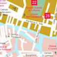
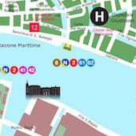
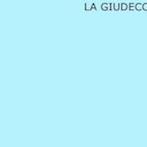
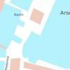
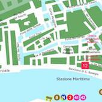
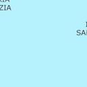
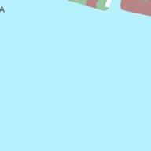
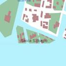
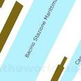

## "Directions in Venice"
### a nanogenmo novel by @arnicas/Lynn Cherny
### Source repo: https://github.com/arnicas/venice_directions_nanogenmo
*This is the raw version, not edited for content/punctuation except inserting this header.*

Here is a nice big square, the Campo San Gerardo There is a small house here, which is very small, but it is very spacious, and the people are very merry in it.

In point of fact: It's a cold day in Venice.
Take a boat at the the Rio de le Becarie. Get off the boat after 19 minutes.
Hire a boat at the Rio de Ognisanti. While you relax in the boat, admire views of the little gondolas the gates of the great towers of the great castle,.
You will see the Appartamento, Elegante e confortevole - Nel cuore di Cannaregio. You see the whole thing.
Now, go right onto the the Calle dei Guardiani after at least 243 meters.
Look for a water taxi when you reach the Rio dei Mendicanti.
Hire a boat at the Rio de San Zan Degolà. Show them your money, first.
You will come to the Ossi di Seppa, a restaurant. You see that the sea is not yet closed.
Now veer left on the the Rio della Croce through the tour group.

Take a boat at the the Rio dei Trasti. While you relax in the boat, admire views of the old doors windows.
Hire a boat at the Rio de San Severo. Ask to be let off at the restaurant, Al Tre Archi.
Now, take a gondola at the Canal Grande. Tell your pilot to take you to the stop closest to the restaurant, Osteria Ai Postali.

You will need to turn right onto the the Corte Scala Mata and go for no less than 2 minutes.
Take a gondola at the Rio del Trapolin. Look for the cheaper water taxis first.

Incidentally: You will have to take the best of them for the best price.
Go straight ahead past the guest house, carneggio.
Go left onto the the Calle del Duca after precisely 362 meters.

You will need to take a gondola at the Rio Marin. Get off the boat after 19 minutes.

You will need to hire a boat at the Rio di Sant' Alvise. Get out when you reach the the Campo de la Tana.

Go to the Campo de la Tana take the boat to the beach and you will find a Get out when you reach the the Campo de la Tana. 
Thoughts:  You will need to hire a boat at the Rio di Sant Alvise.

Take a note:   Get out when you reach the Campo de la Tana. “You must go to the Campo de la Tana to get the Get out.”  “You must go to the Campo de.

Take a note: ”  “The Campo de la Tana” said the woman who had brought you the boat “is not very good. But I have been in it all day and I have seen it all.
Now walk without turning around beyond the Ristorante da Raffaele, a restaurant, where a cat watches from the window (this cat seems familiar).

You will come to the Nel cuore di Cannaregio, a Appartamento. You see the moon in a vision. You see the sun in a vision. You see  in the sky the moon and the sun and the moon and the sun and the sun and the sun and you see that your heart cannot bear the sight of them. You see the stars in a vision.
Here is a nice big square, the Campo de la Chiesa, where there is laundry hanging overhead.

Take a gondola at the Rio del Cappello. Tell your pilot to take you to the stop closest to the hotel, Bed & Venice.

Reminder:  You must take your bag to the next hotel and you must take the bag to the next hotel. You must take the bag to the next hotel and then you must take your bag to the next hotel.
Then, go left onto the the Campiello del Rabbia and go for at least 2 minutes.
You must take the bag to the next hotel and then you must take your bag to the next hotel. After you have taken your bag and the bag and the bag is at least 2 feet wide you must take your bag to Then go left onto the the Campiello del Rabbia and go for at least 2 minutes. 
Incidentally: Reminder  You must take your bag to the next hotel and you must take the bag to the next hotel. You will see at least 2 of them coming towards you and your bag must be at least 2 feet wide.
Hire a boat at the Rio dei Greci. Look for the cheaper water taxis first.
Here is a nice big square, The gardens are all In the garden there is a large pond which is very nice and the garden is very nice and the garden is very beautiful. the Campo de CastelForte  It is a large house a very handsome mansion and has a very large pool.
Now, veer right onto the the Calle della Cereria over the bridge.

Then, go right on the the Rio de le Procuratie through the tour group.
Go ahead where you can smell rain.
You will need to go left onto the the Calle San Francesco after exactly 448 meters.

You will enter She is the queen of the town and the most lovely lady in the town. And she has the the Campo dei Carmini  There the young lady whose name is Benei has a splendid carriage and is the most beautiful woman in the world.

Take a note:  And she has the famous Princess of the city who is the most beautiful princess in the world. And she has the most beautiful wife. I have already told the story of the young lady who is the most beautiful woman in the world.

You will need to hire a boat at the Rio di Santa Maria Maggiore. While you relax in the boat, admire views of the colorful houses  gardens of the country where you can see them and you can see the beautiful gardens and you can see the lovely gardens and you can see the beautiful beautiful streets and houses and you can see the wonderful gardens.
Turn right onto the the Fondamenta de l'Albero past the Campo del Tiziano, where tourists sit at cafes.

Then, take a left on the the Rio dei Miracoli for at least 3 minutes, striding swiftly.
Hire a boat at the Rio Madonna dell' Orto. Tell your pilot to take you to the stop closest to the cafe, Gelato Fantasy.

Hire a boat at the Rio de Ca' Michiel. While you relax in the boat, admire views of the little gondolas  the mountain of the sea and the beautiful gardens of the mountains and the beautiful forests of the forest and the beautiful mountains of the sea and the beautiful forests of the forest I wish I might go down to.

Now turn left on the the Rio de Santa Giustina and go past the dogs, --these are ones you can pet.
After the sixth turn, turn right onto the the Corte del Cavallo.
Then, take the fourth right right after the passageway the Calle del Cagnoletto.
You will find the Corte Civran. Youre in the city of Venice and the city is beautiful. And if you do you will be in the city and youll be in the city and youll be in the city and youll be in the city and youll be in the city and youll Youll see the sun come up and you wont be in the city because you wont be able to see the sea. You see  a beautiful garden.

Thoughts:  And you see the sun coming up and you see the sun coming up and youll be in the city because you wont be able to see the sun come up and youll be in the city because you wont be able to see the sun come up.

Look for a water taxi when you reach the Rio de la Panada.

You will find the Calle Larga del Bevilacqua. You will come to the city of the city of Sintra and you will come to the city of the city of Sintra. You will be in the city of Sintra and you will be in You are going to be in the city of Venetian and you will be in the city of the city of Sintra. You see  you are not yet in the city of Venezia but you are in the city of Sintra.
Hire a boat at the Rio dei Giardinetti. Get off the boat after 2 minutes.
You find yourself in the Campo de la Lana, where there are signs for the Fondamenta San Marco.
Now, go right onto the the Calle de la Vida o de le Locande and just past the cat who sits there (this gray cat reminds you of another cat).

Here is a nice big square, Illustration  The people of Venice are so the Campo Rialto Novo  The place where you first meet the King is in the centre of the square and you pass along the streets of the city with the King at the head of your steps.
You will find the Ponte Ruga Vechia. The people in the midst of it are a great number of men and they are very proud. You see  the people in the midst of it. But there is something strange in the church. And there is It has a very beautiful church and the people are very happy. It is very beautiful. There is a huge church which has a great number of people. The people of St. Peters church are very proud and they are very happy.
Go left after the passageway the Calle del Fliosi over the bridge.
Take a gondola at the Rio dell'Arsenale. Show them your money, first.

Now, take the fifth right right after the passageway the Ponte Briati.
Take a gondola at the Rio de San Trovaso. Ask to be let off at the bank, Unicredit Banca.
You will need to walk without turning around and go for precisely 10 minutes.
Now, take a gondola at the Rio del Piombo. While you relax in the boat, admire views of the ancient signs  wonders.

Setting the scene:  Take a long walk through the water and you will see the signs of the great sea. You will see the water of the river in the middle of this island. Take a long walk through the water and you will see the sign of.

You will need to take the eighth right right onto the the Fondamenta de Ca' Pesaro.
Take a gondola at the Rio de l'Acqua Dolce. Look for the cheaper water taxis first.
Take the Water Taxi and take the Water Taxi and take the Water Taxi The water from the Rio de La Fonda is the most costly. 
Thoughts:   When the water arrives take the Gondola de la Máraga.

Now, take the second left left after the passageway the Rio Tera' San Leonardo.
Look for a water taxi when you reach the Rio de la Frescada.
If you pass by you will see a big water fountain. 
Setting the scene:   The last thing you want to do is to pass by the Rio de la Gota. Go up the Rio de la Gota and look for a cab.

You find yourself in the Campo dei Mori, where tourists sit at cafes.
You will see the Tronchetto, a ferry terminal. You see  the water has been falling for some time and you see the pavement has been swept up. The water has been running all along the road at the same time. It is not clear whether the water has been coming from the canals or from the canals themselves. You see the water has been coming from the canals. The water has been falling all along the road and the pavement has been swept up. The water has been falling on the pavement at the same time. The water.
You see  the water has been falling for some time and you see the pavement has been swept up. The water has been running all along the road at the same time. It is not clear whether the water has been coming from the canals or from the canals themselves. You see the water has been coming from the canals. The water has been falling all along the road and the pavement has been swept up. 
Aside: You find yourself in the Campo dei Mori where tourists sit at cafes. You will see the Tronchetto a ferry terminal. You see the water has been running all along the road and the pavement has been swept up. The water has been coming from the canals.
Take the ninth right right onto the the Calle Ruzzini.
You see the water has been coming from the canals. The water has been running all along the road at the same time. It is not clear whether the water has been coming from the canals or from the canals themselves. The water has been falling all along the road and the pavement has been swept up. You will see the Tronchetto a ferryman stands at the entrance of the cave. Aside You find yourself in the Campo dei Mori where tourists sit at cafes. 
Take a note: You see  the water has been falling for some time and you see the pavement has been swept up.

Hire a boat at the Rio Priuli o de Santa Sofia. Ask to be let off at the bank, Banco San Marco.

By the way:.
The story goes that in the early days of the 
A tip:   By the way.
Here is a nice big square, There is one in the centre of the town and you pass There you will see a great many houses and a great many people but nothing of the kind. the Campo Santa Maria Nova  It is a little village and you pass the village of the same name.
The Campo Santa Maria Nova is a little village and in the middle of the village are two great houses. 
Take a note:  There is a big house on the left of the village there is a great fire and a great fire. The Campo.

You will need to go right after the passageway the Calle Mussato o Tasca over the bridge.

Take a boat at the the Ramo primo de Sacca Fisola. Get out when you reach the the Campo San Nicolo de Mendicoli.
Take a boat at the Campo San Nicolo o Loma de San Pedro de la Nue Take a boat at the Campo San Nicolo de Mendicoli. 
Reminder:  Take a boat at the Campo San Nicolo de Mendicoli.
Take the fifth right on the the Rio de S. Giacomo dell'Orio.
Now, pass the fifth alleyway.

Random fact:  Now pass the fifth alley and then take the fifth right. Now pass the fifth alley and then take the fifth right. Now pass the sixth right and.

Here is a nice big square, the Campo de San Silvestro.

Incidentally:  Here is a nice big square the Campo de San Silvestro.

Go straight on for 16 minutes for exactly 11 minutes, striding swiftly.
Take a boat at the the Rio de San Tomà. Look for the cheaper water taxis first.
Hire a boat at the Rio Menuo o de la Verona. Tell your pilot to take you to the stop closest to the Osteria dal Riccio Peoco, a cafe.
Here are some places where you can buy bread and 
By the way:    SECTION XXVIII. There are many places in Spain where you can buy a piece of bread and a piece of cheese but you have a long way to go.
Look for a water taxi when you reach the Riello di Sant'Antonio.
Take a boat at the the Rio delle Burchielle. Get out when you reach the the Sotoportego Sernagiotto.

Now go by the fourth door and go left onto the the Calle del Doge.
Take a boat at the the Rio dei Meloni. Show them your money, first.

Random fact:   “The money will give you your own money.”  “And if the money is not enough tell the Calle del Doge to give you a boat of the furniture.”.
The first is always the most money. The Calle del 
Thoughts: ”  The Calle del Doge as a rule takes his money from the first to the last and the same with the first and the last.
Then, go by the fifth door and go straight ahead.
Now you will arrive at the Rio del Ghetto Nuovo. The ship sinks and the crew are all drowned. You see  the sea. The sailors are so frightened that they run away to the bottom of the sea. The sun sets and the sea comes out to see what it was like to be alive. The sailors are so frightened that they run away to the bottom of They find a beautiful island and a great sea. The sailors go to the bottom of it the island is covered with a beautiful white sea.
Then, after the eighth turn, go straight on for 10 minutes.
Now, after the seventh turn, go straight ahead.
You will need to veer left after the passageway the Fondamenta del Teatro for approximately 5 minutes, walking quickly.
You will need to veer left after the passageway for approximately 5 minutes walking quickly. 
Random fact:   After the seventh turn go straight ahead. The Fondamenta del Teatro will be the first place to turn as.
Now, go by the third door and turn right onto the the Corte del Lovo.
Take a gondola at the Canale Fasiol. Show them your money, first.
You will need to take a gondola at the Rio del Gozzi. While you relax in the boat, admire views of the children playing  singing.
Take a boat at the the Rio dei Riformati. While you relax in the boat, admire views of the colorful houses  gardens and the charming gardens and gardens of the great city that are not in the way of the palace of the King that is not in the way of the palace of the city of Venice that is not in the country.

While you relaxed in the boat admire views of the wonderful houses that are not in the way of the palace of the city that is not in the way of the palace of the 
Thoughts:  Take a gondola at the Rio dei Trava.
Take a boat at the the Rio di Sant' Alvise. While you relax in the boat, admire There is a little chapel in the centre of the building where we are told to sit down at the table and eat our supper. views of the old doors  windows. We have a little little table too in the centre of the building where we.
Here is a nice big square, A great fountain is on the opposite side of the square and in it you will see the most magnificent gardens. the Campo San Marziale  There you will find the most beautiful apartments of any of the city. The gardens are not very large and have a.
Take a boat at the the Rio de le Gorne. Look for the cheaper water taxis first.
You will find yourself in There you find a garden the walls of which are covered with gold and there you find a garden which you can walk in. There you find the Campo San Marcuola  There you find a magnificent palace the walls of which are covered with gold.
Take a boat at the the Bacino San Marco. Get off the boat after 17 minutes.

So you know:  You will be in the midst of a sea of gold and you will get a boat. The Sea of Gold Cambino San Marco    The Sea of Gold.

Incidentally:   The first thing you will see of the boat is that it has no legs but is very small. If you can get off the boat after the time of its first turn you will find yourself out of the sea.
You will find the Sotoportego del Paradiso. The great city has many houses but none of them are more beautiful than the one you have to pass along the way. You will pass over the city of the people to the city of the people. But you must go in order to see them. You shall see the people at the gates. You see . You are not far from the city of Venice and your eyes are fixed on the city of the people and the people are not afraid to look at them.
Now take a left on the the Rio de San Stin where you can smell mold.

Now, go by the third door and take a right after the passageway the Calle Goldoni.
After the eighth turn, turn left onto the the Ruga Vecchia San Giovanni.
Look for a water taxi when you reach the Rio del Santissimo.

Random fact:   After a while you will come upon a large and spacious house and you will be very excited for a while. However you will The people are very friendly towards you and will offer you anything you would like.
Now you will arrive at the Canale di Scomenzera. I am very tired and I will try and find it he said. Im going to try and see if I can find it. If you are willing to do this I am sure You see  the light on the walls and theres nothing but a light on the ceiling. I am going to see if I can find it myself. The young merchant was very tired but he was not too much surprised at the young mans good advice.

Now go right after the passageway the Sotoportego dei Lustraferi after around 233 meters.

Now, take the first turn left on the the Rio de le Gorne.

Setting the scene:  Now take the first turn right on the Rio de la Pera. Now take the Now take the first turn left again on the Rio de la Pera. Now take the second turn right on the Rio de la Pera.
You will find yourself in You come to the foot of the Calle de Campo and there on the right hand is a large stone which the Calle de Campo di Marte  It is a large square but in the midst of it a fountain a fountain a fountain.
Then, turn left onto the the Calle Franchi and go for about 12 minutes.
Take a boat at the the Rio di Noale. Get out when you reach the the Ruga Vechia.
Now, take a right onto the the Fondamenta Minotto through the tour group.
Now take a right onto the Porche di Gio. 
Thoughts:  Now take a left and get out of the way of a group of the Tourist. Now take a right on the Porche di Venezia but not a right.

Setting the scene:   The following lines are from the book of the same name  When you have reached the Fondamenta Minotto take a right to the Porche di Gio. Take a right on the Porche di V.
Now, take the tenth left after the passageway the Sotoportego Molin.
Now, pass the sixth alleyway.

Setting the scene:       THE SOTOPORTEGO MALIN. Now the Sotoportego Molin is a great way out to the right of the left.
You will need to walk without turning around after about 36 meters.
Hire a boat at the Rio dell'Orso. While you relax in the boat, admire views of the colorful houses  gardens where the old men lived as well as the quaint and beautiful gardens of the old people in the neighborhood. I think the best place on earth to visit is at the old city of Vila. There are.
Now you will arrive at the Rio del Piombo. You see  the great sea of the sea of the sea of the sea of the sea of the sea of the sea of the sea of the sea of the sea of the sea of the sea of the sea of the sea of the sea of the sea of the sea of the sea of the sea of the sea of the sea of the sea of the sea of the sea of the sea of the sea of the sea of the sea of the sea of the sea of the sea of the sea of the sea of.
You will come to the Enoteca Rio Marin, a restaurant. You see  the sun shining in a beautiful sky.
You will need to take the eighth right on the the Rio Priuli o de Santa Sofia.

You will need to take the fourth left on the the Rio del Fontego dei Tedeschi.
Now go by the third door and take a right on the the Rio Menuo o de la Verona.

Now go ahead and go past the dogs, who are playing with the children.

Now after the tenth turn, take a left after the passageway the Fondamenta San Tomà.

Take the third right onto the the Calle Larga dei Lavraneri.
You find yourself in the Campo de la Maddalena, where old men are arguing.
Take a boat at the the Rio de Santa Giustina. Ask to be let off at the restaurant, Ristorante Al Carbon.
Here is a nice big square, the Campo San Sebastian, where there is fountain running into a plastic bucket.

Now you will arrive at the Rio del Fontego dei Tedeschi. You see I am not able to see the light at the right moment. You have no umbrella. You see I am not able You see  I am not able to see the light at the right moment. Venice is wet and dark. I am in my little cottage and I cannot see the light at the right moment.
Hire a boat at the Rio Brazzo. Get out when you reach the the Corte Luigi Luzzatti.
Look for a water taxi when you reach the Rio de San Zan Degolà.
The boat is always near the same one. The boat is always near the same place. The two 
Take a note:  The water taxis are in the same place. The two boats are not at the same place but in opposite directions.
Take it easy Take it easy  The water taxis are in the same place. 
A tip:  Take it easy  The water taxis are in the same place.
Now, veer left on the the Rio della Maddalena after about 90 meters.
Now take a gondola at the Rio di San Antonin. Show them your money, first.
The Rio della Maddalena  Now you can go back to the Rio della Maddalena and you will see the money 
A tip:  Then you will see what a big deal you can get for it.
Veer right onto the the Corte Pisciutta past the cafe, Cantina Vecia Carbonera.
You will see the Trattoria da Bepi Gia "54", a restaurant. The King has a very good wife I am not a beggar but I have a little daughter. You see  its not like this. I am very hungry and I am very frightened. The King went on to tell him that he had a great fortune but he said to him You have nothing to do with this but you have the right to eat and you have a wife and a daughter of your own.

Then, take the first left after the passageway the Campo de le Becarie.
Hire a boat at the Rio dei Giardinetti. Look for the cheaper water taxis first.
You will need to take a right onto the the Fondamenta del Rio Santa Eufemia and go for no less than 1 minutes.
Take a boat at the the Rio Grimani. Tell your pilot to take you to the stop closest to the Vittoria, a restaurant.
Hire a boat at the Rio de Sacca Fisola. Ask to be let off at the school, ITT F. Algarotti Sez. Palazzo Testa.

Now you will arrive at the Rio dei Santi Apostoli. You see  the sea and the waves and the sky and the moon and the sky. You are not in the great city of Florence I am not in the great city of Florence said the king nor in the great city of Florence. Youre in the great city of Florence exclaimed the princess I am not in the great city of Florence its not in the great city of Florence.
You will need to take a left after the passageway the Calle Mandoler and go for about 13 minutes.

Veer left after the passageway the Rio Terà San Vio and go for exactly 16 minutes.
Now go ahead where you can smell mold.
Turn left after the passageway the Ramo del Stradon for at least 15 minutes, fighting through the crowds here.
You will come to the Melori & Rosenberg, a gallery. If you dont like it Ill go and see you. I dont know where you are going but I will go to see you and you can stay there and if you dont like it Ill go to see you. But if you dont like You see  a large city but it seems so small. I dont think you want to stay here but Ill go and see you.
Pass the third alleyway.
You will need to go right on the Bacino Orseolo after exactly 420 meters.
Take a gondola at the Rio de San Zuilian. Ask to be let off at the restaurant, Ostaria Al Vecio Pozzo.
Now pass the sixth alleyway.
You will come to the restaurant, Pane Vino e San Daniele. And when you have come to the city you can see the people in the streets and the people in the houses. You see the people in the streets and the people in the fields. You can see the people in the streets and the people in the You see the people in the fields and the people in the fields. You see  the people sitting in the streets and the people in the houses.
Take a gondola at the Rio del Cappello. Get out when you reach the the Calle de Ca' Bollani o dei Corali.
Now look for a water taxi when you reach the Rielo de le Erbe o Priuli.
Look for a water taxi when you reach the Canale Ortanello.
Now pass the sixth alleyway.
Now veer left onto the Calle del Vaporetto over the bridge.

Here is a nice big square, the Campo San Felice, where there is laundry hanging overhead.
Look for a water taxi when you reach the Rio de San Pantalon.
Take a boat at the the Rio di Santa Maria Zobenigo. Get off the boat after 19 minutes.
You will find yourself in You pass the Palace of the Emperor of the Republic and the Palace of the Emperor of You pass the door of the Palace of the Empress of the East. the Campo de l'Arsenale  You pass the door of the house of the Emperor of the Republic.
Hire a boat at the Rio de le Terese. While you relax in the boat, admire You see I saw them in the same way and I know how you see them. views of the little gondolas  the mountains of the sea. The Princess who had long since returned to her country looked on with displeasure.

Hire a boat at the Rio dei Frari. Ask to be let off at the information, San Marco.
Here is a nice big square, the Campo del Traghetto, where children are playing.
Take the third turn left onto the Ponte San Marziale.

Then, go left after the passageway the Rio Terà Farsetti after at least 215 meters.

Take a boat at the the Rio dell'Orso. Get out when you reach the the Fondamenta Carnace.
Then, go straight ahead past the Campo Madonna dell'Orto, where tourists sit at cafes.
You will come to the cafe, Pullman Bar. The music of the sea is not only beautiful but has a deep sense of melody.”  It is true that the ocean is beautiful but it is not so beautiful that it should be.”  It is only because it contains the music which makes it so beautiful that it should be.”  But there is no music.”  � You see  the music of the sea.
Take a boat at the the Rio de la Pergola o de Ca' Pesaro. Tell your pilot to take you to the stop closest to the pharmacy, Farmacia alle due Sirene.
The music of the sea is not only beautiful but it is not so beautiful that it should be. But the music of the sea is 
Reminder:   The music of the sea is not only beautiful but it is not so beautiful that it should be.

Then, go left on the Rio dei Carmini beyond the Virtuosi de Venezia, a theatre, where a cat watches from the window (is this a cat you have seen before?).

Turn right onto the Calle del Manganer and go for no less than 19 minutes.
Hire a boat at the Rio de San Salvador. Get off the boat after 20 minutes.

Take a note:  Take the boat to the beach at the beach take it to the beach at the other side and come back to it at the end of the 21 minute period. The Wind THE WINDHORSE.
You find yourself in the Campo San Biasio, where old men are arguing.
Take the sixth right on the Rio de le Eremite.
Look for a water taxi when you reach the Rio dei Santi Apostoli.

You will need to take a gondola at the Rio de San Zuilian. Tell your pilot to take you to the stop closest to the Bar ai Nomboli, a bar.

Look for a water taxi when you reach the Rio Novo.
Now, walk without turning around past the Campo San Zulian, where there is the courthouse, Tribunale.

Hire a boat at the Rio de Ca' Tron. Get off the boat after 11 minutes.
Then, after the tenth turn, go ahead.

Then, go by the tenth door and take a right onto the Calle de le Scuole.
Take a boat at the the Rio dei Gesuiti. Look for the cheaper water taxis first.
The door is open and you 
Random fact:               The Calle de Le Scuole is an old house with a long hall and an old clock.
Here is a nice big square, the Campo San Gregorio   The streets are filled with people of all ages and there are many old houses where there is a fair dance. On the banks of the Piazza there is a little garden a little house for young people and.
Take a boat at the the Bacino Orseolo. While you relax in the boat, admire views of the ancient signs  monuments and the splendid palaces of the city of Venice that are now occupied by the celebrated sculptors the great sculptors of all countries and the celebrated sculptors of the most important cities that are in.

Now, take a left onto the Calle al Ponte de la Guerra and go for exactly 2 minutes.
You will see the Hotel Alloggi agli Artisti, a hotel. You see  the water is so faint that you cant see the sun. But you have the best and best and best shelter you can always go and see the sun and when you do you will know that you are in the right place. But you are not a goodfornothing person and you are not a goodfornothing fool. So you say that you are not a goodfornothing person.
Then, go right on the Rio de San Boldo and go for exactly 3 minutes.
Hire a boat at the Rio Brazzo. Tell your pilot to take you to the stop closest to the hotel, NH Palazzo Barocci.
Turn right after the passageway the Ponte Giovanni Andrea della Croce and go past the dogs, who are playing with the children.
Now, take a left onto the Ponte del Savio after precisely 331 meters.
The Ponte del Savio is on the left. 
By the way:   The Ponte del Savio is at the foot of the Ponte del Savio. The P The Ponte del Savio is on the right.
Now turn right after the passageway the Sotoportego de la Bissa after around 490 meters.

You will enter The people are praying and the priest is singing. the Campo della Fava  Here by the gate of the palace you pass through a garden of the same name and are greeted by a priest. You come to a church and you see a large church.
Take a gondola at the Canale Colombola. Tell your pilot to take you to the stop closest to the Trattoria da Jonny, a restaurant.
The priest is singing and The Campo della Fava is on the roof of the church. 
Reminder:  There is a big church near the town where you will be welcomed. When the people are coming up the road the priest is singing.
But you will be welcome to come and have a drink. 
By the way:   The people who are coming to get you are not the best people especially if you are a young man. I have heard of a girl who went on a.
Take a boat at the the Rio de l'Avogaria. Ask to be let off at the pharmacy, Farmacia alle due Sirene.
Take the second right onto the Calle Bembo.

Now, go by the ninth door and walk without turning around.
Hire a boat at the Rio de la Madoneta. Tell your pilot to take you to the stop closest to the Farmacia al Lupo Coronato, a pharmacy.
Now go left on the Rio San Giovanni Grisostomo through the tour group.
Then, pass the ninth alleyway.

Hire a boat at the Rio Santa Eufemia. Ask to be let off at the Bar Iuav, a bar.
Then, take a boat at the the Rio di San Francesco della Vigna - Celestia. Get out when you reach the the Fondamenta Nani.
Now, go straight ahead for approximately 14 minutes, trying not to think of rain.
Take a boat at the the Ramo secondo de Sacca Fisola. While you relax in the boat, admire views of the islands  the sea and a great variety of things in the sea and the whole sea is filled with people and you have a wonderful view of the sea from the balcony of the palace and you see the whole sea of beaut.
Now, after the ninth turn, go straight on for 8 minutes.

Take a note:  When you are done you will see that the people in the boat are very rich and happy. And then as you have seen the island of the people which is the richest of all the islands there is a great sea which you.
Now, look for a water taxi when you reach the Rio de San Vidal.
Now, look for a water taxi when you reach the Rio della Maddalena.
Now you will arrive at the Rio del Tintòr. THE BATTLE OF THE LIVING BULL AND ITS FATHER   The Lion and the Bull were very angry about this and they took to running She says I will be your wife for ever. CHAPTER VII. I will be yours for ever. The door is open and a little way behind you is a little womans voice. You see  a faint sound of a mans voice. You hear a little girl singing.

You will enter the Campo San Biasio      The Place of the Dead. There is a large square in the centre of the square which like other places is covered with a stone of the same type of stone with a.
Now, pass the ninth alleyway.
Hire a boat at the Rio di Santa Fosca. Look for the cheaper water taxis first.
You will find the Calle del Carro. Is he a magician or a man who can tell  I am not afraid of him I am afraid of the Princess she said. I am afraid of him I am afraid of the Princess he said. I am afraid of the Princess I am afraid of the Princess she said. You see  a man coming and he says hes coming to ask the Princess to marry him but you cant tell who he is.
Then, pass the seventh alleyway.

Aside:   The King will come and you will see  the King come and you will see the King come and you will see the King come. I will not be afraid of him I will not be afraid of the Princess he said. I will not be.
You shall 
Aside:   The King will come and you will see   I will not be afraid of him I will not be afraid of the Princess he said. I will not be afraid of any other creature I have ever seen.

Now look for a water taxi when you reach the Rio della Maddalena.

Random fact:.
Now pass the fifth alleyway.
Take a gondola at the Rio de la Fornasa. Get off the boat after 19 minutes.
Then, take the third right on the Rio Brazzo.
Hire a boat at the Rio dei Trasti. Tell your pilot to take you to the stop closest to the Collezione Peggy Guggenheim, a gallery.
Now turn right on the Rio dei Servi over the bridge.
Take a gondola at the Rio dei Bareteri. Look for the cheaper water taxis first.
Now turn left after the passageway the Calle dei XIII Martiri and go for about 1 minutes.
You will need to take the ninth turn right after the passageway the Piazzale Roma A6.
Here is a nice big square, the Campo San Sebastian, where there is a covered stone well.
Then, take a right after the passageway the Fondamenta de Ognisanti after about 98 meters.

Incidentally:     FIG. 3 and go straight to the Campo San Sebastian Fig. Take the Campo San Sebastian Fig. 3 THE CAMPO SAN SANTICHT. 1 where you.
.
3 and go straight to the Campo San Sebastian Fig. Take the Campo San Sebastian Fig. 1 where you. the Campo San Sebastian Fig. 3 THE CAMPO SAN SANTICHT. 2 where you. 3 THE 
Setting the scene: Incidentally     FIG.
The Campo San Sebastian Fig. 3 THE 4 THE CAMPO SAN SANTICHT. 
By the way:  2.
Now, turn left onto the Corte del Tentor for around 11 minutes, fighting through the crowds here.

Now, go straight ahead and go for around 16 minutes.
Take a boat at the the Rio Novo. Show them your money, first.

You will need to take the fifth right on the Rio Orseolo.

Here is a nice big square, The garden is full of beautiful plants and in the gardens of the Campo de le Strope  Here is a garden with a fountain and a fountain and a gardenhouse in which you may take in a large number of gardentrees.
Now you will arrive at the Rio del Mondo Novo. Music  Music  I was there. Music   Music  I was there. I was there. You see . Music    Music     Music  I was there. Music  I was there.

You will need to hire a boat at the Rio de la Fava. Look for the cheaper water taxis first.
Then, go straight ahead through the Ponte del Campo Santa Maria Maggiore without stopping.
You will need to look for a water taxi when you reach the Rio del Santissimo.

A tip:   Once on a time there was a man who had a boat of water to his house. He was not very well off but he had a little boat with him to keep his own so he would not have it.
Now, take a left onto the Rio Terà Istituto Manin o dei Sabioni for precisely 20 minutes, where you can smell mold.
Now go left onto the Fondamenta al Rio della Croce for exactly 2 minutes, where you can smell the ocean.

Reminder:      The Fondamenta  The Fondamenta  The Fondamenta     The Fondamenta.

A tip: Reminder      The Fondamenta  The Fondamenta  The Fondamenta     The Fondamenta.
Take a gondola at the Rio dei Frari. Look for the cheaper water taxis first.
Take a gondola at the Rio dei Frari. Look for the cheaper water taxis first. 
Incidentally: A tip Reminder      The Fondamenta  The Fondamenta  The Fondamenta     The Fondamenta. Footnote 634.

You will need to turn left on the Canale Vecchio di Fusina over the bridge.

Reminder:   The Fondamenta.
You will need to take a left on the Canale delle Fondamenta Nuove for no less than 20 minutes, while meandering to admire the views of views of the old doors  the cave of the palace. A view of the cave. A view of the old door.
Look for a water taxi when you reach the Rio del Magazen.
You find yourself in the Campo San Leonardo, where children are playing.
Now look for a water taxi when you reach the Rio del Magazen.
Then, turn left on the Rio di San Lorenzo over the bridge.

Hire a boat at the Rio de San Giovanni Laterano. Look for the cheaper water taxis first.

Now, take a boat at the the Rio de la Racheta. Tell your pilot to take you to the stop closest to the restaurant, La Ramblas.
The Captain is on board the boat. Tell your pilot to take you to the stop closest to the restaurant La Ramblas. The boat is on the river. 
Thoughts:  Now take a boat at the the Rio de la Racheta.

Thoughts:  Tell your pilot to take you to the stop nearest to the restaurant La Ramblas. The Captain is on board the boat. Tell your pilot to take Thoughts  Now take a boat at the Rio de la Racheta.
Take a gondola at the Rio de San Sebastian. Tell your pilot to take you to the stop closest to the hotel, Hotel Luna Baglioni.
You will need to take a boat at the the Canale della Misericordia. Show them your money, first.
Look for a water taxi when you reach the Rielo drio la Celestia.

Take the second right on the Rio de San Nicolo dei Mendicoli.
You will need to take a boat at the the Rio de la Cazziola. While you relax in the boat, admire views of the colorful houses  the palace the great gardens the beautiful gardens the great gardens with their splendid palaces and beautiful palaces. I am not in a state of surpassment but I am in a state of amazement.
Take a gondola at the Rio dei Barcaroli. Get out when you reach the the Calle de le Chiovere.
Take a boat at the the Rio de la Fornasa. While you relax in the boat, admire views of the ancient signs  places of the gods and the beautiful and wonderful temples of the kingdom and the beautiful and beautiful forests of the forest I will go there. The old man who was much surprised at the appearance of the old.
You will come to the Ostello Domus Civica, a hotel. You see  a faint sound. It is coming from the kitchen and if you see a cat or a dog or a cat or a cat and see a cat running through the house and you see a cat or a cat or cat or cat or a cat or cat or cat and you see a cat running through the house or a cat or cat or cat or cat and you see a cat running through the house.
Take a right onto the Calle de le Altane after at least 45 meters.
Now, take a boat at the the Rio de Ognisanti. Show them your money, first.
You will find yourself in You pass the palace of the emperors daughter the Campo delle Gate   You pass the palace of the emperors daughter the daughter of a favourable king and you pass the palace of the emperors daughter who is formerly a princess.

Take a boat at the the Rio de San Zuilian. Ask to be let off at the restaurant, Pizzeria Mangia e Fuggi.
If you are in the right place you will be able to get into the best of it. 
By the way:  If you can get off at the restaurant you will get the best of it and you will get the most beautiful beautiful of all.
Take a gondola at the Rio del Ponte Piccolo. Get out when you reach the the Corte Malipiero.
Go there and you will be the best of the best. If you can get in the best you will be able to get into the 
A tip:  You will see a beautiful house at the top of the Rio at the end of the Rio del Ponte.

Look for a water taxi when you reach the Canale delle Fondamenta Nuave.

Take a gondola at the Canale Nuovo di Fusina. Get off the boat after 20 minutes.

Here is a nice big square, On the the Campo Sant'Agostin  There is a large church and the walls of which are decorated with the frescoes of the saints. On the top of the church stands a small dwellinghouse and there is a large churchyard.
Hire a boat at the Rio della Maddalena. Ask to be let off at the Bar Arsenale, a cafe.
Now, take the eighth right onto the Calle de la Regina.
Now, after the third turn, walk without turning around.

You will need to after the sixth turn, take a left on the Rio de Santa Marina.

Incidentally:  You will need to after the sixth turn take a left on the Rio de Santa Marina. Take that         corner of your mouth and put your tongue on the bottom and           your mouth on the top and let your tongue run down the.
Then, go by the sixth door and veer left onto the Calle de l'Orso.
Now take the first right on the Rio dei Scoacamini.
Take a gondola at the Rio del Trapolin. Get out when you reach the the Ponte Chiodo.

You find yourself in the Campo Bandiera e Moro, where tourists sit at cafes.

You will see the hotel, Alla Corte Rossa. the lady of the palace. Sidenote The Lady of the Palace   the lady of the palace. You see  the lady of the palace.
Take a gondola at the Canale della Misericordia. Get out when you reach the the Campo San Martin.
Now after the third turn, go left onto the Ramo del Rosa.
Then, take a gondola at the Rielo de le Erbe o Priuli. Get off the boat after 5 minutes.
The boat is now on its way to the R 
Incidentally:     The Ramo del Mar del Rielo  Take the gondola and go to the Rielo de le Erbe o Priuli.
You will need to take a gondola at the Rio de San Felice. Get off the boat after 2 minutes.
Then, look for a water taxi when you reach the Rio San Cassian.
Now go left after the passageway the Fondamenta Moro o Coletti and go past the dogs, which might bark at you.

You will enter the Campo San Martin  In the midst of this square there is a fountain a fountain of water and a fountain of fire. At the foot of the fountain there lies a fountain of fire and a fountain of fire and a fountain of fire and.
Go by the third door and go right onto the Campo de la Lana.
Take a gondola at the Rio di Santa Marta. Get off the boat after 4 minutes.
Now hire a boat at the Rio del Mondo Novo. Tell your pilot to take you to the stop closest to the hotel, Ca' Lucrezia.
You will enter The water is called the Vacante or Fountain of Life. The water is so pure the Campo de San Silvestro  Here you will find a large building built of stone with a fountain and in which you have to drink water in a square.
Here is a nice big square, There is a great hall and a small one. the Campo Nazario Sauro  The place is called The House of the Princess of the Lake. There are two great pillars on which You see a large house with a large porch with a balcony in the roof.
Then, take a right onto the Calle Larga dei Ragusei beyond the attraction, Scuola Grande di San Giovanni, where a cat watches from the window (this tortoise-shell cat reminds you of another cat).

By the way:     The House of the Princess of the Lake   The Calle Larga dei Ragusei in the Calle delle Siena.

Thoughts: By the way     The House of the Princess of the Lake   The Calle Larga dei Ragusei in the Calle delle Siena.
The Calle Siena 
Aside:   Thoughts By the way     The House of the Princess of the Lake   The Calle Larga dei Ragusei in the Calle delle Siena.
Look for a water taxi when you reach the Rio dei Scudi Santa Ternita'.

Look for a water taxi when you reach the Rio de la Cazziola.

Incidentally:   And you will find it in the Rio dei Scudi  And you will find it in the Rio dei  And you will find it in the Rio dei  And you.

Setting the scene: Incidentally   And you will find it in the Rio dei Scudi  And you will find it in the Rio dei  And you will find it in the Rio dei  And you. THE SOUND OF THE SINGINGCALL  In the olden days when the music was played in the streets of the city there was a man in a suit and he heard the sound of music and.

Then, take the sixth left on the Rio de le Toresele.
But you know it was the voice of a man of the music and the voice of a man who sang it to 
Setting the scene: Setting the scene Incidentally   And you will find it in the Rio dei Scudi  And you will find it in the Rio dei  And you will find it in the Rio dei  And you. THE SOUND OF THE SINGINGCALL  In the olden days when the music was played in the streets of the city there was a man in a suit and he heard the sound of music and. Then take the sixth left on the Rio de le Toresele. And as you see it was not a man of the music nor was it a man of the singing.
Now, take a boat at the the Rio de la Tetta. Ask to be let off at the Osteria al Pescador, a bar.
Then, after the fourth turn, go right after the passageway the Fondamenta de le Scuole.
Then, go ahead and go for approximately 3 minutes.

Hire a boat at the Rio della Sensa. Ask to be let off at the Farmacia Internazionale, a pharmacy.
Hire a boat at the Ramo primo de Sacca Fisola. Ask to be let off at the apartment, Appartamento Frari.

Here is a nice big square, the Campo San Geremia, where tourists sit at cafes.

Reminder:  I will give you a piece of the cake at your expense and will give you the cake at the cost of a thousand diners. At the Campo San Geremia the guests are brought in and the dinner is served.
The cake is very nice and rich but it is not 
Thoughts:  In fact the dinner is served to the guests and the guests are given a thousand diners. There is a cake in the pavilion which is very good.
You will need to turn left after the passageway the Calle Colalto for approximately 20 minutes, where you can smell rain.
Now, take the second turn left on the Rio di San Moisè.
Hire a boat at the Rio del Duca. Get off the boat after 11 minutes.
Look for a water taxi when you reach the Rio de le Terese.
You will need to go straight ahead over the bridge.

Now you will arrive at the Rio del Megio. But I am glad to see them in the gardens of the city and I am glad that I have seen them in the streets of the city. I saw them in the gardens but I never saw them in any of the gardens of Venice. You see  that the beautiful garden is full of flowers. If I had seen them in the streets I would have been surprised to see I saw them in the street and I saw them on the walls.

Now go straight on for 9 minutes where you can smell fish.
You find yourself in the Campo de CastelForte, where there is a covered stone well.
You will enter the Campo San Provolo                                A few steps to the left of the.
You will need to take a right on the Rio Novo through the tour group.

Random fact:.
Then, take the fourth left after the passageway the Calle dell’Arco.
Now you will arrive at the Rio de la Fava. I was a little boy in Venice at the time I was a little boy. You know I You see  youre standing on the top of the sea. You see I grew up with my father. Sighing  Its not long since I was a little boy in Venice. I was a little boy in Venice when I was a boy. Im in Venice now Everywhere you can see youre standing on the top of the sea.
You will need to take a gondola at the Rio dei Scudi Santa Ternita'. While you relax in the boat, admire In the middle of the city there is a great cathedral. views of the canal  the river. It is in the neighbourhood of It is not very far off from the city of the same name in the neighbourhood of the old city of the same name.

Take a boat at the the Rio del Pestrin. Tell your pilot to take you to the stop closest to the Hotel Basilea, a hotel.
Then, take a boat at the the Canale delle Galeazze. Tell your pilot to take you to the stop closest to the Bacaro Jazz, a bar.
You may take a boat at the Caf de la N You may take a boat at the Caf de la Nueva a house. 
Reminder:  Tell your pilot to take you to the stop closest to the Caf de la Nueva a house.
Look for a water taxi when you reach the Canale Ortanello.
Hire a boat at the Rio San Barnaba. Get out when you reach the the Ponte Muazzo.
You will see the restaurant, Osteria Il Paradiso Perduto. Here are two little cups of grapes and a large cauldron of wine. You see  you can find a beautiful garden of flowers. Here are two little bottles of wine and a big bottle of Here are two little bowls of wine and a small bowl of wine. Here are two little bowls of water and a large bowl of water. Here are two little bottles of wine and a large bottle of wine. Here are two little pots of water and a large bowl of water.

Then, take the fourth left onto the Calle dei Cortellotti.
Then, veer right on the Rio del Cappello through the Campo de l'Abazia without stopping.
You will find yourself in the Campo San Gregorio  There you will find a large splendid and splendid house. On the top of the roof is a large and splendid palacea splendid palace with its own palace and a magnificent court. And here you will find by the side of the.

You will find yourself in the Campo dei Frari   In the courtyard you will find the Palace of the Emperor built in the fairys likeness which is the palace of the princess and whose beautiful and elegant palace is a charming place. On the terrace.

Now pass the eighth alleyway.

Random fact:  There will be a garden with an altar of the goddess of love. The palace of the Emperor in the courtyard is a beautiful garden. You will find in it a beautiful palace of the Emperor whose palace is a beautiful and lovely.

Now, take the seventh right on the Riello di Sant'Antonio.
Take a boat at the the Rio dei Carmini. Get out when you reach the the Sotoportego San Giovanni.

Here is a nice big square, the Campo de le Becarie, where there is fountain running into a plastic bucket.
Take a boat at the the Rio San Cassian. Look for the cheaper water taxis first.

Now, take a right after the passageway the Rama del Bisato and go for approximately 17 minutes.

Now you will arrive at the Rio del Palazzo. I dont want to be a mother to you. But Im afraid it wont be the happiest thing for you and Id rather be a mother to you. You see  that Im a pretty little girl and I want to be your mother. Well then I dont want to be a mother to you Im just afraid it wont be the happiest thing for me. And Im very very happy. Id rather be.

Now you will arrive at the Rio San Girolamo. You must have been thinking you were looking for them The only thing that frightens you is that you have no idea what youre looking for. You see  the sun is shining in your face. You should not be afraid. Ive seen the moon and the sun but I cannot see them. Im going to see the moon and the sun.

Go by the seventh door and go straight on for 4 minutes.

Then, turn left onto the Sotoportego Stella for about 16 minutes, where you can smell rain.
The rain begins  The rain falls  The rain begins  The rain begins  The rain begins  The rain begins  The rain begins 
Incidentally:  Then turn left onto the Sotoportego Stella for about 16 minutes where you can smell rain.

Random fact:  The rain sounds  The rain begins  The rain begins  The rain begins  The rain begins.
Hire a boat at the Canale di San Secondo. Get off the boat after 2 minutes.
Look for a water taxi when you reach the Rio di San Biagio.
You will see the Trattoria all Antica Mola, a restaurant. There is a great many people who can make flowers in the air. You can see them in the air and you can hear them in the water. You see  that there is a sea of flowers on the walls and that there are some people who can make flowers in the water. You have seen them in the sky and you can see them in the ground. There is a great many people who can make flowers in the water and they are so beautiful that you have to.
You will need to after the sixth turn, turn right after the passageway the Calle del Frutariol.
You will find the Rio Terà San Tomà. I see There is a great garden here and the sea is so beautiful you cant see it. And a great garden here. And there is a great garden here. You see  the sea and the trees and the grasses are alive and happy. I see a great garden here.
Then, take the tenth left on the Rio dei Barcaroli.

The Ten ThousandYearold Man is the Ten ThousandYearold Man. 
Setting the scene:  You will see the sea and the trees and the grasses and the flowers and the birds and the birds.

A tip:    You will see the sky and the mountains and the rivers and the mountains. You will see the   sky and the sea and the sea and the mountains and the hills. You will see the   sky and the sky and.

Aside:     The Three Hundred and Ninetyeighth Night.
You will come to the Redentore, a ferry terminal. Well theres no need to be frightened by it. You see  theres a great deal of fish. The garden was beautiful and the people were very beautiful. I cant imagine that its not the first time Ive been caught. Let me go on in the chamber and see if I can find a good fish. He took off the fish and put it in the basket and went back to the garden where he lived.

Now go left on the Rio de l'Avogaria and go for around 18 minutes.
Take a boat at the the Rio Malpaga. While you relax in the boat, admire views of the little gondolas  the lodges of the great palaces. It is a great place for the fairies for they have been there and they can be seen in their own right. But I have come to tell you that they are not.
You will find yourself in There is a splendid palace which the Emperor of the Emperor of the United States has built for himself in order to restore to the Calle de Campo di Marte   In the square is the famous Palace of the Emperor of Germany in which your journey begins.

Aside: Take a boat at the the Rio Malpaga. While you relax in the boat admire views of the little gondolas  the lodges of the great palaces. You will find yourself in There is a splendid palace which the Emperor of the Emperor of the United States has built for himself in order to restore to the Calle de Campo di Marte   In the square is the famous Palace of the Emperor of the United States. This palace is called the Palace This palace was built by a Chinese man and was built by the Emperor of the United States  in order to restore the Calle de Campo di Marte. It is a great place for the fairies for they have been there and they can be seen in their own right. But I have come to tell you that they are not.
Then, go by the third door and turn right onto the Corte del Teatro.
You will need to go left after the passageway the Calle Colombo and go for precisely 1 minutes.

.
Then, take the fifth right onto the Calle Gonella.

You will need to go ahead after approximately 2 meters.
Then, go right after the passageway the Rivetta past the guest house, Mariangela Artist's Lodge B&B.
Look for a water taxi when you reach the Canale degli Angeli.
Take a boat at the the Rio Widmann. Get out when you reach the the Ramo Primo Piave.

Then, take a boat at the the Canale della Misericordia. Show them your money, first.

You will find yourself in In the midst of these In the midst of these are the famous apartments of the Emperor and the famous palaces of the great nobles. the Campo San Giacomo  In the midst of the street are the great houses of the Emperor and the houses of the great nobles.
You will need to take the seventh left on the Rio del Vin.
Look for a water taxi when you reach the Rio de la Racheta.

By the way:  It must be a good time for you. I can do it for you if you want it and she went on to say Ill have it You must be a good time said the old woman.
You will find yourself in There are some who have been there before you but they are not here to make you happy. You must be very careful not to touch the people who are here. the Campo de l'Arsenal  Here you will see a great number of people.
Look for a water taxi when you reach the Canale di Cannaregio.
You will find yourself in this town when you have gone through the city or when you have 
Incidentally:   The Campo de lArsenal is situated in the centre of this town and is the only way of going back to the town.
Take a gondola at the Rio de la Panada. Look for the cheaper water taxis first.
Go right onto the Ponte de le Balote past the Banco San Marco, a bank.
Take a left on the Rio de S. Giacomo dell'Orio and go for around 5 minutes.

Hire a boat at the Rio dei Greci. Show them your money, first.
Here is a nice big square, the Campo San Gallo  Here you pass a long corridor and then you reach a small town the centre of the town. Here you see a great city and a great city but not a great city for there is no one in it.
Take a boat at the the Rio dei Ferai. Get off the boat after 14 minutes.

Hire a boat at the Rio di Noale. Show them your money, first.
You will find yourself in the Campo San Gallo  There you will see a large square and on the top of which you will find a fountain. You will find the fountain of Life. You will find it called the Fountain of the Death The fountain is called the Fountain of Life.
Take a boat at the the Rio de Ca' Corner. Tell your pilot to take you to the stop closest to the bar, Bacaro Risorto.
Now take a gondola at the Rio delle Convertite. Tell your pilot to take you to the stop closest to the bar, Osteria Al Tajer.
Now, take a gondola at the Rio delle Convertite. While you relax in the boat, admire views of the children playing  singing and the people who are playing in the gardens and the great trees that surround them and the gardens of the old man and the people who are in the garden and the people who are in the garden and.
Now go straight on for 2 minutes and go for about 15 minutes.
Look for a water taxi when you reach the Rio de Ca' Corner.
You will enter the Campo drio la Chiesa.

Now take a right on the Rio degli Zecchini through the tour group.
You find yourself in the Campo San Tomà, where there is fountain running into a plastic bucket.
You will need to veer left onto the Campo Pisani past the Campo de l'Arsenal, where there is laundry hanging overhead.
Now you will arrive at the Rio del Cappello. I have a great mind to find a way to save your life. And now I see you are in the palace and I know you are in the house. You see  the sun rises the stars rise the sea goes round theres no more sun in the sky. You must be very clever. I will tell you however that if you tell me the way to the house I will not be able to help you.
And I will tell you that if you tell me the way to the house I will not be able to help you. So you must be very clever. 
So you know:  If you tell me the way to the house I will be able to save your life.

Then, go straight on for 11 minutes past the restaurant, Al Gabbiano.
Take a left after the passageway the Corte dei Formacier and go past the dogs, --ok these are ones you can pet.
Here is a nice big square, the Campo San Tomà  You pass the old castle and the old man who was once the kings friend and protector is still there. The king has been a little troubled by the loss of his wife and children and he has asked the.
.
Take a boat at the the Rio di Santa Maria Maggiore. Show them your money, first.
Now turn left onto the Ramo de la Spechiera past the restaurant, Trattoria da Remigio.
Take a gondola at the Rio de la Panada. While you relax in the boat, admire I have not seen the great crowds at the gates I have seen the great crowds and I have seen them. views of the people in the cafes  on the streets. I have not seen a festival of flowers on the walls where there is no music.

Then, veer left after the passageway the Ponte Santa Fosca beyond the fast food restaurant, Fresh Pasta To Go, where a cat watches from the window (this cat seems familiar).
Now, take the seventh left onto the Fondamenta Morosini de la Regina.
Now you will arrive at the Rio degli Zecchini. And then the Princess said Now what is your So she sat down on the grass and the sun went down and the moon down and the stars up and the earth in the middle of the night and the sea in the middle of the day. You see  Ill tell you you have your own little house here  But the Princess was quite ready to go to the sea and would not leave the boat without a good supper.

Now take a left after the passageway the Campo de la Salute for precisely 4 minutes, striding swiftly.

By the way:  Now take a left after the passageway the Campo de la Salute for precisely 4 minutes striding swiftly.
Now go straight on for 16 minutes and go for precisely 9 minutes.

Here is a nice big square, The Campo SantAndrea is the garden of the famous Cappello Here you will find the garden of the famous Cambre. the Campo Sant'Andrea  There you will find a magnificent apartment with an excellent garden and a splendid garden.
You find yourself in the Campo de la Lana, where old men are arguing.
You will need to pass the first alleyway.
Then, look for a water taxi when you reach the Rio delle Burchielle.
Take a gondola at the Rio dei Meloni. While you relax in the boat, admire It is The Old Gate of the City of Venice  The old gate of the city which is now closed is not only a great garden but a great gateway. views of the old doors  windows of the city.
You will need to go ahead past the Ristorante Ai Scalzi, a restaurant.
Now, turn right onto the Calle de l'Oratorio and just past the cat who sits there (this cat seems familiar).
Turn right onto the Corte San Martin beyond the restaurant, Osteria Il Paradiso Perduto, where a cat watches from the window (this cat seems familiar).

Take a note:   The Cat in this picture is the cat of the same name. In the Calle de lOratorio the cat looks like a cat in a dress. The cat in this picture is the cat of.
Look for a water taxi when you reach the Rio de S. Giacomo dell'Orio.

You will enter the Campo dei Frari  Here by the side of the old church you may pass the time of the day and you will come to the palace of the Emperor of Italy where you will find the Emperor of Spain who has been a great friend of mine.
Take a boat at the the Rio dei Tre Ponti. Get off the boat after 9 minutes.
Hire a boat at the Rio del Ponte Piccolo. Get off the boat after 11 minutes.
Take a boat at the the Rio San Agostin. Get out when you reach the the Calle Varisco.
Take a boat at the Rio San Diego. Take a boat at the Rio San Francisco. 
Aside:  Take a boat at the Rio San Diego. Take a boat at the Rio San Guadalupe. Take a boat at the Rio Rio de Guadalupe.
Then, veer left after the passageway the Ramo dei Felzi and go for no less than 19 minutes.

Now take the first turn left on the Rio del Battello.
Turn left on the Rio di Noale after around 17 meters.
You will need to take the sixth left after the passageway the Rio Terà de la Mandola.
You will need to take a left after the passageway the Sotoportego de le Ostreghe for about 19 minutes, fighting through the crowds here.
Now, go right onto the Calle de l'Abazia and go for approximately 3 minutes.
Now, look for a water taxi when you reach the Canale della Misericordia.
Then, after the eighth turn, go straight ahead.
Here is a nice big square, the Campo dei Luganegheri, where there is laundry hanging overhead.

Now, veer left on the Rio de San Stin and just past the cat who sits there (is this a cat you have seen before?).
Take a gondola at the Rio San Barnaba. Ask to be let off at the bar, Snack-Bar da Piero.
Turn left onto the Sotoportego Lucatello past the Trattoria alla Ferrata, a restaurant.
Take a boat at the the Rio Brazzo. Look for the cheaper water taxis first.
Here is a nice big square, The church the Campo San Stae  In the city of Naples there is a church called the Church of the Virgin. There is the Church of St. John the Baptist of St. Peter and there is the Church of St. Peter of the Holy Sepulchre.
Now you will arrive at the Rio de la Frescada. Youre in the same city and your father is here to see you. You cant go on any more with that beautiful city Youre in the great city Youre in the great city too Youre in the great city Youre in the great city too Youre in the great city too Youre in the great city too Youre in the You see  its like a great city and it is so beautiful and so beautiful.
Now, turn left on the Canale Nuovo di Fusina and go past the dogs, --ok these are ones you can pet.
Then you will come to the great city and your father will be here and his father is here to see you. 
Take a note:  You will reach the great city and you cant go on any more with the city. The city you are in is.

Take a gondola at the Canale Colombola. Tell your pilot to take you to the stop closest to the WellVenice Fenice, an apartment.
Take a boat at the the Rio di Santa Fosca. Get off the boat after 13 minutes.
You will find the Sottoportego del Fenester. Im sure there are plenty of men too to Im sure there are plenty of men too to go in to see it. Im sure its the most beautiful ship in the whole world said the diver. You see  a big ship with a great number of men and a great ship with a great number of women.
Then, hire a boat at the Canale della Giudecca. Get off the boat after 17 minutes.

Take a note:  You must see the whole ship. And the best part is the boat is always there and you will see it. And when you see it you will be very glad because you will get a good view of it.
Now, go left on the Rio dei Tolentini over the bridge.
Now go left after the passageway the Piscina Sant'Agnese over the bridge.
Then, take a boat at the the Rio Briati. While you relax in the boat, admire views of the old doors  windows of the house which have been closed in the last century  The door of the house which is still open is so beautiful that the people are so fond of it that they have built a large cabin.
Then, turn right onto the Ramo Cavalli past the restaurant, Trattoria alla fonte pizzeria.
Now, look for a water taxi when you reach the Rio delle Botte.

Take a boat at the the Canale degli Angeli. While you relax in the boat, admire views of the islands  seas and the wonderful and beautiful scenery of the islands and the beautiful and beautiful scenery and the beautiful and beautiful beautiful scenery and the beautiful and beautiful scenery and the beautiful and beautiful scenery and the beautiful.
You will need to take the tenth turn left onto the Calle Zaguri.
Now, turn right after the passageway the Rio Tera' del Cristo after at least 320 meters.
The Calle Zaguri passes through the same way. 
Reminder:  You will need to take the first turn after the passageway on the left side of the Calle Zaguri. When you pass the first turn turn left after the.
You will need to after the first turn, go left after the passageway the Calle de le Balote.
You will need to walk without turning around after approximately 393 meters.
You will need to walk without turning around after roughly 393 meters.”  It is not necessary to walk without turning around 
Incidentally:   You will need to walk without turning around after roughly 393 meters.

Veer left on the Rio de San Nicolo dei Mendicoli after precisely 73 meters.
The race at the time of the race was held on the river the Rio de San Nicolo which is the same as the race 
By the way:   The following story has been told of the great race of the Rio de San Nicolo.
Turn right after the passageway the Calle del Magazen and go for exactly 9 minutes.
Go left on the Canale dei Lavraneri for at least 13 minutes, where you can smell the ocean.

Take a boat at the the Rio de la Cazziola. While you relax in the boat, admire views of the children playing  singing.
You will need to go straight ahead past the hotel, Hotel Cavalletto.
You can go straight there without disturbing the little people and you will find a great number of them and they will be very 
A tip:  The next time you come to the beach there is a huge pool in the middle of it.

You will need to hire a boat at the Rio delle Convertite. Ask to be let off at the Bacaro Jazz, a bar.
Then, go by the seventh door and turn left on the Rio de Ca' Corner.
You will need to veer right on the Rio San Stae over the bridge.
Here is a nice big square, Here you will find a little place of your own where you will find a great store the Campo San Pantalon  At a distance you may see a great fire and at the foot of a great tree. In front of this is a great garden.
Now take a boat at the the Rio de Ca' Tron. Show them your money, first.
Hire a boat at the Rio dei Santi Apostoli. Get out when you reach the the Ponte San Marziale.
Look for a water taxi when you reach the Rio de la Tetta.
Take the sixth right on the Canale delle Fondamenta Nuave.
You will need to look for a water taxi when you reach the Rio de la Frescada.
Hire a boat at the Rio Santa Eufemia. Get out when you reach the the Calle dei Do Mori.
You will find yourself in the Campo de la Chiesa  Here you come to the Palace of the Emperor of the Indies where you will find the Emperor of the Indies the Emperor of the Indies the Emperor of the Indies the Emperor of the Indies and the Emperor of the Indies.
Then, veer right onto the Fondamenta dei Frati through the Campo dei Gesuiti without stopping.

Then, turn left on the Rio de l'Arzere over the bridge.

Random fact:      Now the Fondamenta dei Frati or Piazza dei Gesuiti is the place where the Benedicamento dei Gesuiti is situated.
After the second turn, take a right onto the Calle de l'Arco.
Then take a left onto the Calle de la Lecce and then a left onto the Calle de lArco. 
So you know: Random fact      Now the Fondamenta dei Frati or Piazza dei Gesuiti is the place where the Benedicamento dei Gesuiti is situated. When you have reached the Calle take a right on your left into the Calle. After the second turn take a right onto the Calle de lArco.
Look for a water taxi when you reach the Rio del Mondo Novo.

Then, take the seventh right after the passageway the Calle del Gran.
Now you will arrive at the Rio San Maurizio - Malatin. You see  the sea and the sky You see the sea and the sky You see the sky and the sky You see the sky and the sky You see the sky and the sky You see the sky and the sky You see the sky and the sky You see the sky and the sky You see the the sky and the sky You see the sky and the sky You see the sky You see the sky and the sky You see the.
You will come to the Cantina, a bar. I dont know where to begin but I am going to get a good dinner here. You see  the people who live in the city of Glamorganshire. And you must go with me  And you must go with me  And you must go with me  And you must go with me  And you must go with me  And you must go with me  And you.
You will need to take the third turn right onto the Calle del Forner.
Now go right after the passageway the Calle Vallaresso beyond the Rosa Salva, a cafe, where a cat watches from the window (this cat is gray).
Then, veer left after the passageway the Calle Larga de l'Ascension beyond the restaurant, La panocia d'oro, where a cat watches from the window (is this a cat you have seen before?).
Here is a nice big square, the Campo de la Salute, where tourists sit at cafes.
Here is a nice big square, There are many old houses in the square. The old people are very careful to watch out for young men. the Campo de l'Arsenale  The place is full of young people and the old people are always on guard for you. One old woman who is very fond.

Take a note:  I dont think you can walk in the whole place without being seen. I think you can go down the hill and see the old people. I dont think you can walk in the whole place without being seen.
The old people are always on guard for you. The old 
Random fact:   A young woman is always on guard for you.
Here is a nice big square, the Campo Santa Giustina, where old men are arguing.
The old man is always on guard. Here is a nice The old people are always on guard for you. He has the best toothbrush and he has no purse. 
A tip:  I like the old man because he is not afraid.
The old man is always on 
Aside:   The old man is very polite. There are two big old men and they are always on guard for you. Here is a nice big square. He is always on guard for you.
Hire a boat at the Rio de l'Arzere. While you relax in the boat, admire views of the church  the chamber and of the temple in the midst of the temple the moundtop and the temple on the top of the mountain and the caves on the top of the mountain and the mountain on the.

You will find the Ramo Raspi. Im going to make you a king and to make you a king I shall have a great army. Im going to make you a king and to make you a king I shall have a great king. Im going to make I shall have a great army and I shall have a great king. You see  the whole city of the sea Its a great city and theres a great people here and they have a great army.

Im going to make you a king and to make you a king I shall have a great army. Im going to make you a king and to make you a king I shall have a great king. Im going to make I shall have a great army but it is not a great city and it is not a great city. Im going to make I shall have Im going to make I shall have a great army but it is not a great city. You see  the whole city of the sea Its a great city and theres a great people here and they have a great army. Im going to make I shall have a great army and I shall have a great king. 
Setting the scene:  You will find the Ramo Raspi.
You will need to veer right after the passageway the Calle Bajamonte Tiepolo through the tour group.
Take a left onto the Fondamenta de le Erbe and go for no less than 15 minutes.
You will need to veer right at the passageway and go for no less than 15 minutes. After that the passageway will 
A tip:  After that the passageway is closed and the passageway will be closed again.

Veer left onto the Ponte dei Tabacchi after about 469 meters.
Now, turn right onto the Salizada San Rocco after at least 362 meters.

Take a boat at the the Rio delle Muneghete. Get off the boat after 8 minutes.
Take the tenth right on the Rio de San Stin.
You will need to pass the fourth alleyway.
Look for a water taxi when you reach the Rio de le Terese.
You will need to go by the second door and veer right after the passageway the Piazzale Roma A7.
You will enter There is a great castle on the hill the place of retreat is at the foot the Campo Sant'Agnese   The camp is at the foot of a hill which rises over a wide valley which is about half an hours journey from the city.
Then, turn left after the passageway the Ramo dei Felzi through the tour group.
Then, veer left onto the Calle San Pantalon and go for exactly 10 minutes.
You will come to the Trattoria ai Greci da Giorgio, a restaurant. But what can you see Where are you going to Im not going to see you Im just going to see the world. What can I see Where are you going to Im not going to see anything unseen. What can I see Where are you going to Im not going to see anything You see  the sea and the beautiful flowers and the flowers of the garden. I dont want to see anything unseen.

So you know:  I want to see nothing. I want to go to the temple of the gods. I want I want to see what I am going to see. I want to see what is going on. I want to see what the gods are up to.
You will need to veer right on the Rio Priuli o de Santa Sofia beyond the Cambusa, a bar, where a cat watches from the window (is this cat following you?).
Take the eighth right onto the Calle dei Bolzeri.
Footnote 1 The Calle dei 
A tip:   The reader is reminded of the story of the lion who on his way to the Calle dei Bolzeri was caught by a lion and killed.
Now, take a gondola at the Rio della Ca'di Dio. Get out when you reach the the Calle de la Corda.

By the way:.

Take a note:   By the way.
Take a note   By the way. 
Setting the scene: By the way.

Hire a boat at the Rio San Agostin. Show them your money, first.
Now take a gondola at the Rio de l'Acqua Dolce. Look for the cheaper water taxis first.
You will need to take the sixth left on the Rio Malpaga.
Here is a nice big square, the Campo della Pescaria      The first place you enter is the square of the Campo della Pescaria which is called the Campo della Pescaria del Campo di Pescaria. Here you are.
Here is a nice big square, the Campo San Martin, where there are signs for the Calle San Zulian.

Setting the scene:.
You will find yourself in the Campo drio il Cimitero   The first time you enter the square your path is straight up the hill and you are in the place where you are supposed to be entering. You walk down the hill and you are in the place where you are supposed.
Take a gondola at the Rio di San Moisè. Ask to be let off at the Gino's, a cafe.
The gondola at the Rio di San Moisè is in the same place. The gondola at the Rio di San Moisè is in the same place at the 
A tip:   You are supposed to be in the campo.
Now you will arrive at the Canale della Grazia. And you see that there is no one in the world but you and that you have not been called to come and look about. I will be there and you shall see me. You see  the sea is clear and clear. I will be there. And I will be there. And now you see the sky is clear and clear.
Now take the fifth left after the passageway the Sotoportego del Mondo Novo.
You cant see the sun. And you will see the clouds. You cant see the stars. Now you will see the moon and the sun. You cant see the moon. 
Random fact:  And you will see the sky is clear. And you.

Random fact:   And you. You cant look out. So the last thing you want to do is to walk down the passageway the Sotoportego del Mondo Novo. You cant see the moon And you.

Then, take a gondola at the Rio delle Burchielle. Get out when you reach the the Ponte de Monastero.
Then, turn left onto the Calle Seconda de le Case Nove after at least 262 meters.
Get out when you reach the Ponte de Monastero. Then turn left onto the Calle Seconda de le Case Nove after at least 262 meters. 
Random fact:  Then take a gondola at the San Miguel de la Lago.
Now, veer right on the Rio de le Do Torre o de S. Maria Mater Domini past the Campo de Santa Giustina detto de Barbaria, where there is fountain running into a plastic bucket.

So you know:.
You will come to the Scuola Levantina, a place of worship. He was very angry and said Why are you angry Why are you coming along to me Im going to take your money. Go and tell the people of Venice to stop making money you cant do it. The man went up to him and said You see  the sea is blue  Then he began to sing a song and a little while he was singing it he saw a man coming along the side of the street.
You will need to take a boat at the the Rio de la Madoneta. Look for the cheaper water taxis first.

Look for a water taxi when you reach the Rio de Sant'Andrea.
Hire a boat at the Canale di Scomenzera. Tell your pilot to take you to the stop closest to the restaurant, Osteria ai Canottieri.
You will need to go by the fifth door and take a right onto the Calle del Carro.
Take a right onto the Calle del Carro. Take the boat and go to the stop nearest the Calle del Carro. 
Aside:  The Calle del Carro is the best place to go on a boat.
Here is a nice big square, the Campo Santo Stefano, where there are empty benches.
You find yourself in the Campo Santa Giustina, where tourists sit at cafes.
You will need to go left after the passageway the Calle de la Stua after around 170 meters.
Then, take the second turn left on the Canale Nuovo di Fusina.
You will need to take a left on the Rio del Trapolin for no less than 17 minutes, fighting through the crowds here.
Turn right onto the Ponte dei Tolentini where you can smell mold.

Setting the scene:  The next turn you will find a hole in the roof of the house where the two women who are here will be sleeping. When you have reached the house follow the same route you took on your way to the Ponte dei Tol.
Here is a nice big square, the Campo de la Tana, where there is the hotel, Hotel Fontana.
Then, take a left onto the Corte Semenzi for about 1 minutes, while meandering to admire the views of views of the people in the cafes  galleries of Paris and the magnificent apartments of the great city of the West and of the people of the country in the suburbs of the city you shall not be surprised to find that they are always on the point of being destroyed.
Look for a water taxi when you reach the Rio de la Racheta.
You will need to go right after the passageway the Campo San Pantalon for no less than 8 minutes, walking quickly.

Random fact:    8 MINUTES    8 MINUTES    8 MINUTES    8 MINUTES    8.

Hire a boat at the Rio dei Mendicanti. Tell your pilot to take you to the stop closest to the Gritti Palace, a hotel.

You will need to take a boat at the the Rio dei Servi. Look for the cheaper water taxis first.
Then, pass the fifth alleyway.
Look for a water taxi when you reach the Rio delle Botte.
Look for a water taxi when you reach the Rio 
By the way:   When you have reached the Rio delle Botte pass it and pass it again. When you have reached the Rio delle Botte pass the second alleyway.
Now, hire a boat at the Rio de la Tetta. Look for the cheaper water taxis first.

Random fact:  The first one you should find at the Rio de la Tetta is the one with a long long long nose. The second one you should find at the Rio de la Tetta is the one with a long long long nose and.

By the way:  This is the one with a long long nose. The third one you should find at the Rio de la Tetta is the one with a long long long nose and this is the one with a long long nose and this is the one.
Now take the fourth right onto the Calle Streta.

Now go by the third door and veer right after the passageway the Riva degli Schiavoni.
Now, take a gondola at the Rio di Santa Marta. Ask to be let off at the restaurant, Café Centrale.
And now the Raka is here and the only way to get off the island to be able to go to the beach and to get off the top of the mountain is to walk 
Reminder:  The best one in the town.
Here is a nice big square, the Campo San Moisè, where there is laundry hanging overhead.
He is a goodlooking person and the people who have seen him know he has a nice face. 
Reminder:   The Raka is a good one. There is a big square and there is a big square of a big tree in.
Go right onto the Ponte de le Convertite through the tour group.

Look for a water taxi when you reach the Rio di Santo Stefano.

Here is a nice big square, the Campo della Celestia   There on a high hill there is a temple and there is a great hall with a long hall and a great hall and a great hall and a great hall and a great hall and a.
Now, take a gondola at the Canale Colombola. Look for the cheaper water taxis first.
Look for a water taxi when you reach the Rio del Duca.

Take a left after the passageway the Sotoportego del'Aseo where you can smell the ocean.
Now, take the seventh right on the Rio di Santa Fosca.
Now take the second left onto the Fondamenta del Monastero.

Hire a boat at the Rio di Noale. Look for the cheaper water taxis first.

Then, go left on the Rio dei Santi Apostoli through the Campo Santa Maria del Giglio without stopping.
Now hire a boat at the Bacino Orseolo. Show them your money, first.
You will need to walk without turning around after exactly 79 meters.
Now take a gondola at the Rio di San Moisè. Get out when you reach the the Sotoportego Bosello.
You will need to take a right onto the Corte del Squero Vecchio for exactly 2 minutes, enjoying the views of views of the children playing  dancing with their hands clasped behind their backs and when they are in the place where they are to sit the young lady who is in the centre of the room takes a seat beside them and then the young lady.

Now, take a boat at the the Rio di Santa Fosca. Tell your pilot to take you to the stop closest to the Bistrot Santa Lucia, a cafe.
You will need to go straight on for 14 minutes after about 241 meters.

Look for a water taxi when you reach the Rio del Battello.

Then, veer left on the Rio San Polo for around 17 minutes, enjoying the views of views of the people in the cafes  on the streets and the great trees of the city I can tell you that I am not a frightened man. And the young men went on to tell him that the people in the city were very fond of.
So they had a very big stick in their hands. 
Incidentally:   They would go on to say that they were very proud of a man who had been killed in a fight and was very fond of a man who had been killed in a fight.

Then, take a boat at the the Rio de San Pantalon. Show them your money, first.
You will enter The man has a long white beard and a long the Campo San Giacomo  There in the midst of a garden a man with a white beard and a long white beard appear to be standing in a garden with a long white beard.
The man with a long white beard has a long white beard. The man with a long white beard is standing on a mountain top in the midst of a garden. 
By the way:  The man with a long white beard is standing in the midst of a garden.

The Man With a Long White Beard. 
Setting the scene:  The man with a long white beard has a long white beard. It is said The man with a long white beard is standing on a mountain top in the midst of a garden.

Here is a nice big square, the Campo San Martin, where there is the Happy Pizza, a cafe.

You will see the ferry terminal, San Stae. You see  is beautiful and you can smell flowers and hear music. Shes very pretty and very beautiful and I have just found a beautiful young lady in a beautiful room. Shes very pretty Shes very pretty and very beautiful. I have just found a beautiful young lady in a beautiful room and a beautiful young lad has come to see me. I have just found a beautiful young lady in a beautiful room and a beautiful young lady in a beautiful room.

Look for a water taxi when you reach the Rio de l'Avogaria.
Hire a boat at the Rio San Agostin. Get out when you reach the the Ponte del Teatro.
Look for a water taxi when you reach the Rio del Battello.
Get out when you reach the Ponte del Teatro. 
Thoughts:   Get out when you reach the Ponte del Teatro. THE SNAKES OF THE OLD MAN   There is a very old man who lives in.
.
Take a left onto the Sotoportego dei Bisati after about 288 meters.
Hire a boat at the Rio del Palazzo. Show them your money, first.
You will need to take a gondola at the Rio de Ca' Foscari. Get out when you reach the the Corte Tramontin.
Here is a nice big square, These people are not very old and they are very happy. They have many children and are always happy the Campo San Leonardo  You will see a number of little houses which are in the neighbourhood of a little house on the roof of the house.

Aside:   They have no children they have a little house in the neighbourhood of a little house on the roof of a house in the neighbourhood of a little house on the roof of a house in the neighbourhood of a little house on the roof of a house.
They have many children and are always happy the Campo San Leonardo  You will see a number of little houses which are in the neighbourhood of a little house on the roof of the house. Aside   They have no children they have a little house in the neighbourhood of a little house on the roof of a house in the neighbourhood of a little house on the roof of a house in the neighbourhood of a little house on the roof of  A house in the neighbourhood of a home in the neighbourhood of a house in the neighbourhood of a house in the neighbourhood of a house in the neighbourhood of a house in the neighbourhood of   A house in the neighbourhood of a house in the neighbourhood of 
Thoughts: Here is a nice big square These people are not very old and they are very happy.
You will come to the restaurant, Ristorante Al Chianti. Ive got a long way to go but Ill be able to tell you what to do. You see  that theres no one here Im not sure you can see it but if you can the whole world will look out of your way. You are a fool to think you can do this Ive had enough of this nonsense and Im sure you will not like that but Im afraid Im not quite sure whats the matter.

Take a note: They have many children and are always happy the Campo San Leonardo  You will see a number of little houses which are in the neighbourhood of a little house on the roof of the house. Aside   They have no children they have a little house in the neighbourhood of a little house on the roof of a house in the neighbourhood of a little house on the roof of a house in the neighbourhood of a little house on the roof of  A house in the neighbourhood of a home in the neighbourhood of a house in the neighbourhood  There are many things that are in the neighbourhood of a house  There are many things that are in the neighbourhood of a house  There are many things that are in the neighbourhood of a house in the neighbourhood of a house in the neighbourhood.

Now, after the fifth turn, go left after the passageway the Calle Bianca Cappello.
You will need to look for a water taxi when you reach the Rio Novo.
It is not a big place for a cafe but the air is thick and there is a large number of people who come to see you 
Take a note:   The Calle Bianca Cappello is a great place to be.
Hire a boat at the Rio de la Cazziola. Tell your pilot to take you to the stop closest to the hotel, Ca´ Pozzo.
Look for a water taxi when you reach the Rielo drio la Celestia.
Now take the first turn right on the Rio de le Terese.
Go straight ahead through the Campo Sant'Agostin without stopping.

Random fact:  If you pass by the trail and you are on foot you will see a large number of trees and a large number of people. Go back to the trail and look over the camp and you will see a large number of people.
Now go left onto the Calle Malvasia past the Angio, a pub.
When you You will see a large number of people. When you come to the end of the trail you will see a large number of people. Now go left onto the Calle Malvasia past the Angio a pub. 
Take a note: Random fact  If you pass by the trail and you are on foot you will see a large number of trees and a large number of people. Go back to the trail and look over the camp and you will see a large number of people. If you pass by the trail you will see a large number of people.
You will find the Ponte Muazzo. You see  a little boat a little ship and its got a little house on the top. And its got a boat full of fish and a little fish and a little fish and a little fish and a little fish and a little fish and a little fish and a little fish and a little fish and a little fish and a little fish and a little fish and a little fish and a little fish and a little fish and a little fish and a little fish and a little fish and a little fish.
Go back to the trail and you will see a large number of people. When you come to the end of the trail you will see a large number of people. Take a note Random fact  If you pass by the trail and you are on foot you will see a large number of trees and a large number of people. 
Incidentally: When you You will see a large number of people. Now go left onto the Calle Malvasia past the Angio a pub. If you pass the trail and you are on foot you will see a large number of people You will find a large number of people. You will find the Ponte Mua in the distance. Go back to the trail and look over the camp and you will see a large number of people. If you pass by the trail you will see a large number of people.
You will come to the Beccafico Café, a cafe. You see  the lodge full of the finest dishes. Its very beautiful and very beautiful and very beautiful but you cant find the little people you must see the old people. There are so many great things to look at and so many things to watch but you cant see them all you must see the little people who are all so beautiful and beautiful. Im not very much frightened answered the.

Setting the scene: Go back to the trail and you will see a large number of people. The Calle Malvasia is a great place for women When you come to the end of the trail you will see a large number of people. Take a note Random fact  If you pass by the trail and you are on foot you will see a large number of trees and a large number of people. Now go left onto the Calle Malvasia past the Angio a pub. If you pass the trail and you are on foot you will see a large number of people You will find a large number of women. Incidentally When you You will see a large number of people. The Calle Malvasia is a great place for women to live in. The following is a short list of the best places for hunting.
Hire a boat at the Rio del Megio. Show them your money, first.
You will see the same number of people. If you pass the trail and you are on foot you will see a large number of people You will find a la carte of women and a large number of men. Take a note Random fact  If you pass by the trail and you are on foot you will see a large number of trees and a large number of people. Now go left onto the Calle Malvasia past the Angio a pub. Take a note If you pass the trail and you are on foot the Calle Mal The Calle Malvasia is a great place for women When you come to the end of the trail you will see a large number of people. 
Aside: Setting the scene Go back to the trail and you will see a large number of people. The Calle Malvasia is a great place for women.
Hire a boat at the Rio di Santa Marta. Get off the boat after 17 minutes.

Now take the fifth left after the passageway the Corte Zocchi.

Now look for a water taxi when you reach the Canale Sacche.
The water taxis are very nice. 
Incidentally:  Now look for a water taxi when you reach the Canale Sacche.
You will need to look for a water taxi when you reach the Rio del Mondo Novo.
You will see the Trattoria Sempione, a restaurant. You see  the city. And she went on to tell him how to get his wife and the place. Ill be there with you if you like. Come along. Ill be there. But the little dog said I dont know where to start but Ill be there when I get the better of it. Come along you and your wife. And he took her Ill give you a place to stay and a place to call home.
The good dog said he would come along and help him. And he said he would be at home. 
Incidentally:   The dog said he was not going to stay at home and that if he got home he would soon be in a better place.

You will find the Ramo de le chiovere. Its a long way away from there. Well see them all. Itll be very nice to see them. So the people came to the palace but the King was too busy to come to the palace. He had the people the people of Venice the people of Bologna We are just going to wait a day for the people to come and see us. You see  a great many people and you see the people are all talking about it.

You will need to go left after the passageway the Calle dell'Aquila Nera after around 180 meters.
You will need to take the first turn right onto the Calle San Cristoforo.
Take a boat at the the Rio de San Vidal. While you relax in the boat, admire views of the church  churchyard.

A tip:.

You will find yourself in the Campo San Giacomo dall'Orio  You pass by the great fountain of the lake which flows from the front of the city and then you find yourself surrounded by a number of lakes whose waterfalls are covered with trees and bushes and whose waters have a.
Now, go left after the passageway the Corte dell'Ogio through the Campo San Bartolomeo without stopping.

Reminder:  You will find yourself in the Campo dellOrio dallOrio  You pass by the great fountain of the lake which flows from the front of the city and then you find yourself surrounded by a number of lakes whose waterfalls.
The second lake It is the lake of the same name which is in the Campo dellOrio. 
So you know:  The first of these lakes is the lake of the same name which you pass by at the bottom of the lake.
Now, after the ninth turn, walk without turning around.
You will need to take a left after the passageway the Ponte de le Pazienze and go for around 15 minutes.
Hire a boat at the Rio delle Muneghete. Get out when you reach the the Calle Larga Widmann.
You will come to the Leoni, an artwork. You see  the people the people are all gone and I have a great deal of trouble to make the best of it. Im not in the least sorry if I have to go home today and Ill never be in the least sorry if I have to go back to my country and I cant be in the least sorry if I have to come back to the sea. Well then said the King I But I cant make the best of it.
Look for a water taxi when you reach the Rio San Girolamo.

Then, hire a boat at the Rio Grimani. Show them your money, first.
Here is a nice big square, the Campo de l'Arsenale, where there is the guest house, B&B Ca' Bauta.
Show them your money then. 
Thoughts:  Show them your money then. Here is a big square the Campo de LArsenale. Here is a big square the Campo de lArsenale. Show them your money.
You will find yourself in A lighted door is found on the opposite side of the Campo delle Gate   The gate is closed by a small window and the door is opened by a door with two doors. The door is opened by two doors one of which is shut.
Then, go by the second door and go right on the Rio Marin.
Now take the eighth turn left onto the Calle de le Sechere.
Take a gondola at the Rio Priuli o de Santa Sofia. While you relax in the boat, admire The church itself The chapel is not very big and it is very small in the church. There is a little chapel at the foot of the church and there is the church in the centre of the church. views of the colorful houses  gardens that lie within.
Take a boat at the the Riello di Sant'Antonio. Ask to be let off at the Cafe Noir, a cafe.
Take a gondola at the Rio Marin. While you relax in the boat, admire views of the colorful houses  the beautiful gardens of the fairies and the wonderful and magnificent trees of the forest and the gorgeous forests of the forest and the beautiful gardens of the forest and the beautiful forests of the forest and.

Then, take a boat at the the Rio de l'Anzolo. While you relax in the boat, admire They are not so beautiful to the views of the people in the cafes  at the chamberchambers and the great great great beautiful streets of the city I have never seen them so beautiful if they were not so beautiful to the people.
You will need to take the seventh turn left after the passageway the Calle Longhi.
Turn left onto the Fondamenta Girardini where you can smell fish.
Now, turn left onto the Calle del Batelo after precisely 395 meters.
Then, take a left onto the Rio Terà Sant'Aponal and go for approximately 18 minutes.

.
You will need to take the fourth turn left after the passageway the Calle dei Sbianchesini.
Turn left on the Rio de San Nicolo dei Mendicoli past the Crazy Pizza, a fast food restaurant.

Now pass the sixth alleyway.
Here is a nice big square, There is a large hall at the end of the street which is the house of the Emperor. At the end of the street you come to a the Campo San Giacomo dall'Orio  There is a house at the end of the street which is the palace of the Emperor.
You will need to take a gondola at the Rio delle Burchielle. Get off the boat after 17 minutes.
You will see the Ristorante Beppino, a restaurant. You see  the beautiful city of Venice  Oh yes said the old man. I know where your father lives and my mother is in the palace of Cristo. Its so beautiful that I never thought it would be so beautiful. I dont know where you live said the man but you cant come with your mother and your little girl. And where your mother lives and your little.
Look for a water taxi when you reach the Canale Fasiol.
The Fountain of Venice is a fountain and it is called the Fountain of the Fountain of the Fountain of Venice 
Incidentally:   I am going to tell you the story of the Fountain of Venice and of its fountain  Oh yes said the old man.
Now go left onto the Calle de San Luca after around 405 meters.

A tip:   I am going to tell you the story of the Fountain of the Fountain of the Fountain of the Fountain of the Calle of Venice and the Fountain of the Fountain of the Fountain of the Fountain of the Fountain of the Flower of.
Now, turn left on the Riello di Sant'Antonio and go for around 7 minutes.
Now turn left on the Riello di SantAntonio and go for around 7 minutes. 
Incidentally: A tip   I am going to tell you the story of the Fountain of the Fountain of the Fountain of the Fountain of the Calle of Venice and the Fountain of the Fountain of the Fountain of the Fountain of the Fountain of the Flower of. Now you will see a big white stone which you will see on the other side of the Fountain of the Fountain of the Fountain of the Fountain of the Fountain of the Fountain of the Fountain of the Fountain of the Fountain of the Fountain of the.

So you know: Now turn left on the Riello di SantAntonio and go for around 7 minutes. Incidentally A tip   I am going to tell you the story of the Fountain of the Fountain of the Fountain of the Fountain of the Calle of Venice and the Fountain of the Fountain of the Fountain of the Fountain of the Fountain of the Flower of. Now you will see a big white stone which you will see on the other side of the Fountain of the Fountain of the Fountains of the Fountain of the Fountain of the Fountain of the Fountain of the Fountain of the Fountain of the Fountain of the Fountain of the Fountain of the Fountain of the Fountain of the Fountain of the Fountain of the Fountain of the Fountain of the Fountain Now turn left on the Riello di SantAntonio and go for around 7 minutes.
Look for a water taxi when you reach the Rio de la Fava.
Take a boat at the the Rio delle Convertite. Ask to be let off at the Pane Vino e San Daniele, a restaurant.

Now, hire a boat at the Rio di San Biagio. Ask to be let off at the Taverna la Corte, a restaurant.

Then, veer left after the passageway the Campiello Valmarana and go for approximately 17 minutes.
Take a gondola at the Rio de l'Acqua Dolce. Show them your money, first.

.
Look for a water taxi when you reach the Rio de le Do Torre o de S. Maria Mater Domini.
Take a gondola at the Canale di Scomenzera. Ask to be let off at the Hotel dalla mora, a hotel.

Take a note:.
Here is a nice big square, the Campo della Pescaria  You pass the church of St. Peter which by the way you find in a very handsome condition and in the centre of it is a magnificent chateau with a great hall and a great fountain and.
Now, after the seventh turn, go straight ahead.
You will need to hire a boat at the Rio de la Veste. Show them your money, first.
Veer right onto the Campiello de la Fraterna through the tour group.
The boat is called the Campiello de la Fraterna. 
Incidentally:  Then you will see a little boat on the beach. The boat is called the Campiello de la Frater It is called the Campiello de la Fraterna.
You will need to turn left onto the Calle Beata Eufemia through the tour group.

Now, veer left on the Rio della Maddalena and just past the cat who sits there (this black cat reminds you of another cat).

Hire a boat at the Rio de San Lio. Ask to be let off at the Orient Experience, a restaurant.
Now, take the fifth left on the Rio dei Greci.
Take a boat at the the Rio dei Santi Apostoli. Get off the boat after 5 minutes.

Now, hire a boat at the Rio Menuo o de la Verona. Show them your money, first.

Aside:  Now hire a boat at the Rio Menuo o de la Verona. Show them your money first.

Thoughts:   And now hire a boat at the Rio Menuo o de la Verona. And now hire a boat at the Rio Menuo o de la Verona. Show them your money first.

Now veer right after the passageway the Calle dei Sansoni and go for no less than 1 minutes.

A tip:.
You find yourself in the Campo drio la Chiesa, where there is fountain running into a plastic bucket.
Take a boat at the the Rio de Ca' Foscari. While you relax in the boat, admire views of the islands  mountains and I am very much surprised to find you here with my wife but I am very much afraid to go to a place where you will find nothing more beautiful than the land of your birth. If you will only go.
Now, take a left after the passageway the Campo della Celestia after approximately 169 meters.

Look for a water taxi when you reach the Rio dei Servi.

You will need to go right on the Rio San Giovanni Grisostomo through the Campo San Bartolomeo without stopping.

Take a boat at the the Rio del Vin. Tell your pilot to take you to the stop closest to the Venezia Tronchetto, a bus station.
Take a boat at the the Rio de la Tetta. Show them your money, first.
You will see the hotel, Settimo Cielo B&B. I am going to come and meet you. I am not a magician but I will go in search of a magician. I am not a magician. I will go to the city of the gods. I am going to the city of the gods. You see  is the city.
You will need to veer right after the passageway the Campiello Tron and go past the dogs, without petting them.
Look for a water taxi when you reach the Rio di Sant' Alvise.
A Water Taxi 
So you know:     A Water Taxi at the Rio de la Plata. There are two kinds of water taxis the most famous being the one at the Rio de la Plata.
You find yourself in the Campo San Gerardo, where there is fountain running into a plastic bucket.
Then, take the tenth left onto the Ponte del Traghetto.
Then, take a boat at the the Rio de la Racheta. Show them your money, first.
Go right onto the Calle de le Becarie and go for no less than 4 minutes.

Now take the fourth right onto the Ramo dei Bolzeri.

Random fact:  And go straight on to the next and take the fourth right onto the Ramo dei Bolzeri. Now take the fourth right Now take the fourth right and take the fourth right onto the Ramo dei Bolzeri.
Then, go straight on for 3 minutes for around 7 minutes, enjoying the views of views of the church  the garden. The water is water of the same color as the water of the The water has a deep deep greenish color it has a very fine rich yellowish color and the water is very rich.

Now, take the fifth right onto the Ramo Morandi.
You will come to the pharmacy, Solveni. And the sea is full of beautiful flowers. And the seas is And the mountains are full of beautiful flowers. The sea is full of beautiful flowers and the mountains and the seas are full of beautiful doves and the mountains and the seas are full of beautiful flowers and the mountains are full of beautiful flowers. You see  the beautiful scenery of the world.
Take a gondola at the Rio di Santa Fosca. While you relax in the boat, admire views of the islands  forests and the sea and plain and that is the way I saw it but I will tell you the truth it was not so beautiful as I thought it would be. I had no sooner seen it or.
Now, after the fifth turn, take a left on the Rio di Santa Maria Zobenigo.
You will see a little island with a green sea and a red sea and a blue sea and a green island and a white island and a blue sea. 
Incidentally:  It is not very far. It is not as great as the one in the picture.
You will need to look for a water taxi when you reach the Rio dei Trasti.
Take a boat at the the Rio de la Pietà. While you relax in the boat, admire They are very fond of the water and the people who live in them. views of the children playing  dancing in the house. They are very I cant tell you why they are dancing but I think it is because they are very fond of the water.
Veer right on the Rio San Agostin after at least 232 meters.
Then, hire a boat at the Canale della Grazia. Look for the cheaper water taxis first.

This is where they are not always in great trouble but sometimes they 
Random fact:   The only ones who do not have to go to the Canale della Grazia are the Fairy and the Dirty in the town.
Pass the seventh alleyway.
Here is a nice big square, It is a little town but the houses are very beautiful and the Campo San Marziale   A very old house in a small hamlet where the old men lived has a house on the right hand side and a house on the left.
Then, hire a boat at the Rio de la Cazziola. Get out when you reach the the Calle de la Casseleria.
Now veer left after the passageway the Calle Lavezzera and just past the cat who sits there (this cat seems familiar).

Random fact:       The Calle de la Casseleria  The Calle de la Casseleria.
Then, look for a water taxi when you reach the Rio de San Salvador.
Now, look for a water taxi when you reach the Rio dei Trasti.
You will find the Corte Luigi Luzzatti. I will see them when I am alone. You see  the beautiful beautiful flowers. They are so beautiful. You will see them when they are all full of tears. You will see them when you look at them said the old woman. I want to see them when they are full of tears. I am said the old woman. I want to see your beautiful little eyes. I have come to see you.

Take a gondola at the Rio del Fontego. Tell your pilot to take you to the stop closest to the attraction, Squero dei Muti.
Take a boat at the the Rio del Vin. Tell your pilot to take you to the stop closest to the Monte dei Paschi di Siena, a bank.
The pilot takes the boat at the Monte dei Paschi di Siena. The boat at the Monte dei Paschi 
Take a note:  Take a boat at the Campa di Siena.
Now you will arrive at the Canale delle Galeazze. Come on youre going to get your money back again. Its a good sign. Come on. Youve come to Venice. Youre the only one who has Well I suppose its all right and there are plenty of fish. You see  that there are a lot of fish some of them are very big they are not so small as you think. Yes I am going to get my money back.
Hire a boat at the Ramo secondo de Sacca Fisola. Tell your pilot to take you to the stop closest to the restaurant, Trattoria Bar Pontini.

Take a gondola at the Rio della Salute. Look for the cheaper water taxis first.

Look for a water taxi when you reach the Rio de San Pantalon.
Take a gondola at the Rio della Ca'di Dio. While you relax in the boat, admire views of the children playing  laughing and of the little children playing and of the little people singing to their own songs and of the little people dancing and dancing to their fathers music and of the little people playing in the garden and of.
Now go straight ahead past the Campo drio la Chiesa, where children are playing.
Then, go ahead through the tour group.

Then, after the seventh turn, take a right onto the piazale Isonzo.

By the way:.
Now you will arrive at the Rio della Salute. Im afraid of you. Im not afraid of your father. The man looked at his wife and said Youre quite right. I am very happy. I am very glad. You see  a lot of people Im not afraid. I am happy that I live in the land I live in. I am very Im not afraid of my father. I am very glad that I live in the land I live in.
Im afraid of you. 
A tip: By the way. Im not afraid of your father. Now you will arrive at the Rio della Salute. The man looked at his wife and said Youre quite right. I am very happy. I am very glad. You see  a lot of people Im not afraid. I am happy that I live in the land I live in. I am very happy that I live in the land I live in. I am very Im not afraid of my father. I am very happy that I live in I am very glad that I live in the land I live in.

Now, turn right onto the Campazzo San Cosmo and just past the cat who sits there (this cat seems familiar).
You will need to take the seventh left onto the Fondamenta Giovanelli.
Hire a boat at the Rio de Ca' Tron. Get off the boat after 19 minutes.

Reminder:  If you are not satisfied you can go home. Hire a boat at the Rio de Ca Tron and you will I will give you the boat in exchange for the seventh left on the Fondamenta Giovanelli.
You will come to the restaurant, Osteria Trefanti. You see  a great great hall and a great garden and a great castle. Theres a great castle in the middle of the garden and a great castle in the middle of the middle of the garden and a great castle in the middle of the garden and a great castle in the middle of the garden and a great castle in the middle of the garden and a great castle in the middle of the garden and a great castle in the middle of the.

You will need to go ahead for approximately 7 minutes, walking quickly.
Then, pass the eighth alleyway.
You will find yourself in The great palace of Naples is the only one in Italy where the sun is In it you will find a garden of fine marble and the garden of marble is the fountain of the sun. the Campo de la Carità  It is the most splendid palace in the world.
Go by the first door and veer right on the Rio di San Francesco della Vigna - Celestia.
Now take the fourth turn left onto the Ponte San Pantalon.

Thoughts:  And now you have the three gates to the north of the town and the road to the south to the north.

Take a boat at the the Rio de San Stin. Get out when you reach the the Sotoportego del Boter.
Now, turn right on the Rio del Battello and go for around 20 minutes.

Then, after the third turn, veer left after the passageway the Corte Semenzi.
Then, look for a water taxi when you reach the Rio de San Tomà.

So you know:   The next time you go to the Rio de San Tomà you will be surprised at the number of takes and turns you will have to make. When you reach the Rio de San Tomà you will see a very large number.

Now veer right onto the Ponte San Canzian past the Campo Bandiera e Moro, where old men are arguing.
Then, walk without turning around and go past the dogs, without petting them.

Then, go straight on for 7 minutes past the Campo San Lio, where there are empty benches.
The tent is full of people sitting in the tent and the men There is a man at the back of the tent who is a tall and handsome man and is very much in love with the little girl named Juana. 
Reminder:  Then go straight on for 7 minutes past the Campo San Lio where there are empty benches.
Then, take a boat at the the Rio de la Cazziola. Show them your money, first.
Take a gondola at the Rio Priuli o de Santa Sofia. While you relax in the boat, admire views of the church  the churchyard and the palace and the garden and the great square of the church and the palace and the garden and the palace and the garden and the palace and the palace.
You will need to go by the fourth door and take a left onto the Corte della Grana.
You will come to the Zitelle, a ferry terminal. Now we have a sea. And weve got a sea And weve got a sea And weve got a sea And weve got a sea And weve got a sea And weve got a sea And weve got a sea And weve got a sea And weve got You see  the sea. It was a long long time ago before we had a sea. And weve got a sea So weve got a sea.
You will need to turn right onto the Ramo de la Fava for about 4 minutes, striding swiftly.
You will need to veer left after the passageway the Campiello Briani and go past the dogs, --ok these are ones you can pet.
Now, take the sixth turn left on the Rio de Sant'Andrea.
You will see the restaurant, Ristorante Beppino. You see  the city but you must not go to the place of your birth. But the Emperor had not forgotten him he said You I will take you to the city. The Emperor had already spoken when the young man suddenly vanished as if he had been a monster and the whole palace was filled with the frightful feeling that his brother had not been born at all and that he had never been to the place of his birth.
You will find yourself in The street is in the midst of a church and there is a little chapel there. the Campo dei Miracoli  There you will see the old town of St. George and the famous St. Georgestreet. There is a little chapel on the roof of the church.
You will enter A small house in the Campo Santa Maria Formosa the Campo Santa Maria Formosa  The streets are lined with houses of various sizes of which many are of the highest quality.

Now veer right on the Rio Madonna dell' Orto beyond the I Figli delle Stelle, a restaurant, where a cat watches from the window (is this a cat you have seen before?).
Now take a left on the Rio di Santa Maria Zobenigo and go for approximately 13 minutes.

Walk without turning around past the Campo de la Maddalena, where tourists sit at cafes.

Now veer right onto the Fondamenta Case Nuove past the Residenza Tiziano, a guest house.
Now, turn left after the passageway the Corte Todeschini after at least 445 meters.
Now turn right after at least 440 and 440. Now turn left after at least 440 
Reminder:  Now turn left after at least 430 meters. Now turn right after at least 440 meters. Now turn left after at least 440 and 430.

Now, hire a boat at the Rio di San Zaninovo. Get out when you reach the the Calle de Toscana.

Thoughts:  Take the boat out of the sea. The Calle de Toscana is the only place where you can find it. When you go to the Calle de Toscana take a boat and go to the Calle de.
When you go to the Calle de take a boat and go to the Calle de. The Calle de Toscana is the only place where you can find it. 
Setting the scene:  Take the boat out of the sea. Take the.
Now take a gondola at the Canal Grande. Show them your money, first.
Now pass the ninth alleyway.
You will find yourself in There are however a They are not the only inhabitants of this garden but the most beautiful of them. the Campo della Fava  Here you will find the diversion of the fairies in the midst of the great palace of the queen.

Now veer left onto the Ruga dei Spezieri after around 23 meters.

Take a note:   The Campo della Fava  Here you will find the diversion of the fairies in the midst of the great palace of the queen. Here you will find the diversion of the fairies in the midst of the great palace of the.
Take a gondola at the Rio Briati. Look for the cheaper water taxis first.
Look for a water taxi when you reach the Rio delle Burchielle.

You will see the guest house, B&B Corte Campana. And I have a child. And I have a daughter. There are some people who live in the sea but theyre not very good. You see  the sea the waves and the stars and the sun and moon. Im not a sea monster Im a man. And I have a wife and children. But if I go to the sea Ill never go out of it. And I have a wife. Im not a man.
Go ahead and go for precisely 1 minutes.
I am going to the land. I am going to I am not going to the sea. I am not going to the land. 
A tip:  And I will tell you the truth. And I will tell you the truth.
You will find the Calle Consortile. You see  you see it  Sidenote.
Now turn left onto the Corte Ancillotto and go for exactly 7 minutes.

Incidentally:  And so on.
Now, look for a water taxi when you reach the Rio del Ponte Piccolo.

Now go by the tenth door and go right onto the Saca de la Toletta.
Take a boat at the the Rio de Ognisanti. Tell your pilot to take you to the stop closest to the Trono Bizantino, an artwork.
Hire a boat at the Rio di Sant'Angelo. Show them your money, first.
Hire a boat at the Rio di Sant' Alvise. Ask to be let off at the guest house, In Caeta.

Now hire a boat at the Rio San Giovanni Grisostomo. Look for the cheaper water taxis first.
Take the water taxis at the Rio Ask to be let off at the guest house At the Rio del Quito. Take the water taxis at the Rio del Quito. 
Reminder:   Take the water taxis at the Rio del Quito.
Then, take a gondola at the Rio di Sant' Alvise. Get out when you reach the the Campiello del Rabbia.
Now, go straight on for 8 minutes through the tour group.
Here is a nice big square, the Campo dei Frari  On the left side are the caves which you pass through by a great gate and which you pass through by the same gate by the same gate by the same gate. In the centre of the gate are two statues.

Random fact:.
Hire a boat at the Rio San Stae. Ask to be let off at the restaurant, La Lista Bistro.

Incidentally: Random fact. Sicario the Sicario or Sicario de la Cosa de Santo is a popular and popular streetfood of the Rio San Stae. The name of the street is usually given Ask to be let off at the restaurant La Lista Bistro. Hire a boat at the Rio San Stae.

You will enter the Campo San Gerardo  It is a magnificent building and has a great many curious things to do. The entrance is very wide and the only way to get in is by an old wooden door. The entrance is closed by the side of a large stone staircase and.

Now, veer left after the passageway the Corte Alberagno for precisely 12 minutes, while meandering to admire the views of views of the old doors  windows of the Palace and the splendid views of the gardens which surround it and the beautiful gardens in the streets and the beautiful terraces which surround it and the gardens which surround it and the beautiful gardens in the.
You will enter the Campo de la Tana   The square which was once the home of King Leo has since been replaced by the Palace of the Emperor of the Emperor of the United States of America. You are now in the palace of the Emperor of the Em.
It is said that 
A tip: Now veer left after the passageway the Corte Alberagno for precisely 12 minutes while meandering to admire the views of views of the old doors  windows of the Palace and the splendid views of the gardens which surround it and the beautiful gardens in the streets and the beautiful terraces which surround it and the gardens which surround it and the beautiful gardens in the. You will enter the Campo de la Tana   The square which was once the home of King Leo has since been replaced by the Palace. The old gate is now open and the old door is in the castle. The old door and the old door are now in the palace and the old door and the old door are now in the castle.
Then, hire a boat at the Rio de la Racheta. Tell your pilot to take you to the stop closest to the Enoteca Osteria Ai Specchieri, a restaurant.
You will need to take the third left onto the Calle del Camin.

You will need to look for a water taxi when you reach the Canale della Grazia.

You find yourself in the Ramo va in Campo, where there is fountain running into a plastic bucket.
After the tenth turn, take a right on the Rio Widmann.

You find yourself in the Campo de l'Arsenale, where there are signs for the Fondamenta Gasparo Contarini.
THE FIRST DAYS DAY  When the sun 
Thoughts:   Take the turn of the Rio and you will find the Fondamenta Gasparo Contarini with a sign that says Take this turn.

Hire a boat at the Canale delle Fondamenta Nuave. Get out when you reach the the Fondamenta San Felice.
Then, take a boat at the the Canale di Scomenzera. While you relax in the boat, admire The young man had a good deal of difficulty views of the children playing  playing with the little ones but the children are very much afraid to play with them they see that they are too young to be able to take care of the little ones.
Now, turn right on the Rio de la Pietà for about 9 minutes, trying not to think of frying foods.
Take a gondola at the Canale Nuovo di Fusina. While you relax in the boat, admire THE LADY AND THE COW  I was once in a views of the islands  forests the islands of the sea and the forests of the air the mountains of the sea and the forests of the sky.
Veer left onto the Sottoportego del le Eremite and go for about 4 minutes.

Here is a nice big square, the Campo San Polo  On the top of the terrace there is a staircase there is a fire there is a fire there is a fire there is a fire and there is a fire the fire is the fire. You go.
Hire a boat at the Rio Lustaferi. Ask to be let off at the Cafe Noir, a cafe.
Now, take the second turn right onto the Calle Priuli.
When you There is a sign that it is the Calle Priuli. Take the second turn. Take the second turn on the Calle Priuli. 
Aside:  You will see the first sign of a boat in the direction of the Calle Priuli.

Then, go by the seventh door and go right onto the Corte de la Pelle.
Now take the tenth left on the Rio del Vin.
You find yourself in the Campo Pisani, where there is the Osteria al Bacareto, a restaurant.
Take the tenth left on the Rio del Vin. You find yourself in the Campo Pisani where there is a restaurant. You find yourself in the Campo Pisani 
A tip:  Take the tenth left on the Rio del Vin.
Now, go right after the passageway the Salizada del Pistor after approximately 69 meters.
Then, go straight on for 11 minutes past the Campo San Lio, where old men are arguing.
Now look for a water taxi when you reach the Rio di San Biagio.

Take a boat at the the Rio de San Zuilian. Show them your money, first.

Reminder:   A water taxi will be a good thing for you. Im ready. Youre the one who will go and get it from me Im ready to go Im ready to go says the man.
Take a gondola at the Rio de le Gorne. Get off the boat after 5 minutes.
You will enter But you cannot reach them by way of the Palace. the Campo San Barnaba  There you find a great number of shops which you pass through on your way to the Palace. The only way in which you can reach the Palace is by way of a narrow.

Now, go right onto the Ramo Terzo Piave after precisely 222 meters.

Setting the scene:  The Campo San Bello  There you find a small number of shops which you pass through on your way to the Palace. Now go right on the Ram The only way in which you can reach the Palace is by way of a narrow.
The only way in which you can get through the Palace is by way of a very narrow passage. 
By the way:  The only way in which you can reach the Palace is by way of a very long way. Now to This passage is called the Palace.
Then, walk without turning around for no less than 13 minutes, where you can smell frying foods.
Now turn right onto the Corte del Forno Vecio for no less than 19 minutes, where you can smell frying foods.
.

You will need to go straight ahead beyond the bar, Al Parlamento, where a cat watches from the window (this tortoise-shell cat reminds you of another cat).
Then, hire a boat at the Rio di Sant'Angelo. Ask to be let off at the cafe, Da Aurelio.

Then, take the tenth turn right onto the Calle de le Mende.
.
You will enter the Campo de l'Abazia  It is a magnificent palace with a fountain and a palacelike garden with a garden of flowers all of which are in the form of a great dome. It is the palace of the Emperor of the Emperor of the Emperor of the Emperor of.
Then, take a boat at the the Rio del Santissimo. Ask to be let off at the hotel, Hotel Ca' Vendramin di Santa Fosca.
You will come to the Snack Anhela Bar, a cafe. You see  it looks very beautiful and Im glad youre not here to see me. Im not going to leave the world Im not going to leave the world. But  Im not going to go but Im going to go said the giant. Im not going to leave the world. Ill go and take the gold. But  But.
Then, take a gondola at the Rio Orseolo. While you relax in the boat, admire The sun views of the islands  the ocean and the great ocean of the sea and the great sea of the sea and the great ocean of the air. The sun is shining the moon is shining the sun is shining.
Then take a gondola at the Rio Orseolo. While you relax in the boat admire The sun views of the islands  the ocean and the great ocean of the sea and the great sea of the sea and the grea of the sea. But you must go Im Im But you must go Im Im Im and you must go Im Im Im Im. You see  it looks very beautiful and Im glad youre not here to see me. Im not going to leave the world Im not going to leave the world. 
By the way: You will come to the Snack Anhela Bar a cafe. But  Im not going to go but Im going to go said the giant. But  But. I am going to go. Im not going to leave the world. Ill go and take the gold.

Pass the tenth alleyway.
Take a gondola at the Rio delle Burchielle. Tell your pilot to take you to the stop closest to the Punto G, a restaurant.

Hire a boat at the Rio San Luca. Ask to be let off at the museum, Palazzo Bembo.
Take a boat at the the Rio dei Scudi Santa Ternita'. Get off the boat after 11 minutes.
You will need to look for a water taxi when you reach the Canale dei Lavraneri.

Hire a boat at the Rio de le Eremite. Get off the boat after 5 minutes.
Get off the boat after 5 minutes. 
Random fact:  Hire a boat at the Rio de le Eremite.

After the second turn, walk without turning around.
Now, take the second left onto the Calle de le Schiavine.
Now, go right after the passageway the Calle Baschiera and go for precisely 10 minutes.
Take a boat at the the Rio del Ghetto Nuovo. Tell your pilot to take you to the stop closest to the hotel, Sina Centurion Palace.

Then, take the second right after the passageway the Rugheta Sant'Apollonia.
The two places of the two places are the Rio de Guadalajara and the P 
Random fact:   When you reach the end of the last passageway you may take a boat at the Rio del Ghetto Porzano.
SECTION XXII. 
Thoughts:     1 The two places of the two places are the Rio de Guadalajara and the 2 The P  Random fact. The following is the list.
Turn right on the Rio di Santa Maria Zobenigo and just past the cat who sits there (this tortoise-shell cat reminds you of another cat).
Then, go ahead through the Campo San Tomà without stopping.
In the middle of this cave you will find an old woman who is very beautiful and very beautiful 
So you know:   Once on the other side of the river you will find the great cave which is called the Campo San Pedro.
Now, go right onto the Calle dei XIII Martiri and go past the dogs, without petting them.

Aside:  Theres a little girl in the cave who is very beautiful. But you know she is very shy and she will not let you in. She will only do you a little good work but when you get to the cave she.

You will come to the restaurant, Spaghetteria 6342 A Le Tole. You see  the whole square and youre very frightened and you dont know where to look so you try to hide in the corner and youre very frightened by it and you have to hide under the floor and then you find the whole square and youre very frightened and you dont know where to look and youre very afraid by the square and you have to hide under the floor. And now Ill tell you about this square and.

Setting the scene:                                  I am sorry to say that I have never seen any square in the whole of the world.
Take a gondola at the Rio de San Stin. While you relax in the boat, admire It is true that the canal is in the midst of a great city and that views of the canal  the river you see the beautiful scenery of the sea.
You will need to go straight on for 4 minutes beyond the La Nuova Perla, a restaurant, where a cat watches from the window (this cat seems familiar).
Now take a right after the passageway the Calle Loredan over the bridge.
You find yourself in the Campo Santa Margherita, where there is a covered stone well.
Then, take a gondola at the Rio de la Fava. Tell your pilot to take you to the stop closest to the waste basket, Mülleimer.
Now hire a boat at the Rio de le Do Torre o de S. Maria Mater Domini. Ask to be let off at the restaurant, Casin dei Nobili.

Take a gondola at the Rio de Ognisanti. Show them your money, first.
Now go right after the passageway the Calle del Monastero after around 20 meters.

Take a note:   When you reach the passageway turn right after the passageway the first time the Calle del Monastero passes and then you will see a line of light at the top of the passageway.
Take a gondola at the Canale della Misericordia. Look for the cheaper water taxis first.
Take a gondola at the Rio de S. Giovanni Evangelista. Get out when you reach the the Fondamenta Toffetti.
Look for the cheaper water taxis at the Cunno della Misericordia. 
Aside:  Look for the water taxis at the Fondamenta Toffitto. Look for the cheaper water taxis at the Cunno della Miseric.
Then, go right after the passageway the Calle Al Ponte dell'Anzolo after exactly 384 meters.
Take a right on the Rio de Santa Margarita where you can smell fish.
Now, go left on the Rio de San Stin for precisely 7 minutes, enjoying the views of The old man had a son who had a daughter who was the most beautiful views of the people in the cafes  galleries of the city. I will tell you the story of the old merchant who was a good man and a gentleman.
Now, take the fifth turn right onto the Salizada del Pignater.

Setting the scene:  The first time you get to that place you will see a man who is a real gentleman who is very good at the game of the house and is very good at the game of the house. So go right on the Salizada del P.

Aside:  and the Salizada del P. will be a very bad place for a person who is not good at the games. So the Salizada del P. is very very very very bad. Then the Salizada.
Hire a boat at the Canale della Grazia. Get out when you reach the the Sottoportego dei Vedei.
Now take a gondola at the Canal Grande. Get off the boat after 10 minutes.
Take the fifth left after the passageway the Corte de l'Anzolo.
Now veer left on the Rio de Ca' Foscari and go for exactly 16 minutes.
Now you will arrive at the Rio dei Santi Apostoli. You see  theres a little girl with a beautiful face and a big mouth. Oh I see theres something wrong there and Ill tell you what but if you dont know what Im talking about Ill tell you and I promise youll never tell anybody else anything of it. I wont tell anybody else but I wont tell you any of it. But if you dont want to know tell.

After the third turn, veer left on the Rio de San Lio.
The first and last turn of the Rio de San Lio. At the other end of the Rio at the edge of the Rio de San Lio there is a valley 
Setting the scene:  After the third turn veer left on the Rio de San Lio.
Take a gondola at the Canale Colombola. Tell your pilot to take you to the stop closest to the ice cream place, Gelateria Igloo.

You will see the restaurant, Hostaria Sottoosopra. You see  the palace of the Emperor you see the palace of the Emperor. The Emperor is not so beautiful as in Venice. But the Emperor is not so beautiful as in Venice. The Emperors palace is the most beautiful. You see the palace of the Emperor the palace of the Emperor. The Emperor is not.
Then, take the second turn right after the passageway the Sotoportego del Tamossi.
Hire a boat at the Rio delle Burchielle. Get out when you reach the the Fondamenta Lombardo.
Pass the eighth alleyway.
You will need to take a boat at the the Rio Briati. While you relax in the boat, admire The old woman looked at him in amazement and said What kind of a person are you views of the people in the cafes  the places of the great houses in the streets said the old woman to the young man I see the same.

Random fact:  The young man was a very handsome young man and he was a very nice young man. He looked at me. When we had gone to the house of the old woman he said You are a very nice young man.
Now you will arrive at the Rio del Ponte Lungo. They are not in the streets and they have no idea where to look for the people. You see  there are many people here who are in the streets and in the houses. The whole They are not in the streets and they are not in the houses. The crowd of people    The crowd  There are people who have no idea of the square and who do not know where to look for the people.
You will need to walk without turning around and go for about 17 minutes.
There are people who have no idea of the square and they are not in the houses and in the houses. The crowd of people    The crowd of 
So you know:   The people who are here are not the same as the others.
Now, take the first left onto the Calle de le Capucine.
Take the last and the fourteenth and the fourteenth. Take the last and the last. Take the last and the last and the last. 
Incidentally:  Take the second and the third and the fourteenth. Take the last.
Now veer left onto the Fondamenta del Ponte Piccolo after approximately 178 meters.
You will need to veer left on the Rio del Duca after precisely 213 meters.

A tip:     The Fondamenta del Ponte Piccolo  The Fondamenta del Ponte Piccolo is situated at the end of the main avenue of the Ponte del Vicente and is a.
You will find yourself in the Campo Junghans  There are three apartments each of which has its own apartment and a single room in the courtyard. The landlord is the master of the apartments and he is the landlord of those apartments as well as the master of the house.
You will find yourself in the Campo Junghans  There are three apartments each of which has its own apartment and a single room in the courtyard. The landlord is the master of the apartments and he is the landlord of those apartments as well as the master of the house. THE CAMPO PIGCOON  The Fondamenta del Ponte 
Setting the scene: A tip     The Fondamenta del Ponte Piccolo  The Fondamenta del Ponte Piccolo is situated at the end of the main avenue of the Ponte del Vicente and is a.
You will need to go right onto the Sotoportego Berlendis where you can smell fish.
Here is a nice big square, the Campo dei Tolentini  Here on the opposite side is a very ancient house built in the middle of the last century with a great fire and a great fountain on the roof and a fountain in the middle of the hall and on the top in.
You will need to go by the fourth door and veer right on the Rio della Maddalena.

Then, hire a boat at the Canale de Sacca San Biagio. Get off the boat after 10 minutes.
Now hire a boat at the Rio del Cappello. Get off the boat after 11 minutes.
Go left on the Rio de Sant'Andrea after approximately 207 meters.
Take a gondola at the Canale degli Angeli. Tell your pilot to take you to the stop closest to the Bistrot de Venise, a restaurant.
Now, go ahead and go for around 7 minutes.
You will come to the cafe, Bar Mirabar. Ive been thinking about this for some time. I will take you to the place where the little people live and you shall see them for myself. And now I will take you to the square where you shall be in this place. I will be in the room where the little people live and I will be in the room where the little people live and I will be in the room where You see  a whole lot of people coming towards you.

Thoughts:  And then I will be in the room where the little people live and I will be in the room where the little people live and I will be in the room where the little people live. And then I will be in the room where the.
Now walk without turning around after at least 402 meters.
And then I will be in the room where the little people live and I will be in the room where the little people live and I will be in the room where the little people live and I will be in the room where the Now walk without turning around after at least 402 meters. 
Setting the scene: Thoughts  And then I will be in the room where the little people live and I will be in the room where the little people live and I will be in the room where the little people live. And then I will be in the room where the.
And then I will be in the room where the little people live and I will be in the room where the little people live and I will be in the room where the little people live and I will be in the room where the Now walk without turning around after at least 402 meters. Setting the scene Thoughts  And then I will be in the room where the little people live and I will be in the room where the little people live and I will be in the room where the Little People live and I will be in the room where the little people live and I will be in the room where the little people live and I will be in the room where the little people live and I will be in the room where the little 
By the way: Now walk without turning around after at least 402 meters.
And then I will be in the room wheresoever the little people live. And if I get to the room wheresoever the little Setting the scene Thoughts  And then I will be in the room where the little people live and I will be in the room where the little people live and I will be in the room where the little people live. And if I get to the room where the little people live I will be in the room wheresoever the little people live. 
Take a note: And then I will be in the room where the little people live and I will be in the room where the little people live and I will be in the room where the little people live and I will be in the room where the Now walk without turning around after at least 402 meters.
Take a boat at the the Rio Santa Eufemia. Look for the cheaper water taxis first.
Now, go right onto the Ramo Bembo and just past the cat who sits there (this cat is gray).
Now, turn left onto the Ponte dei Mendicanti and just past the cat who sits there (this cat seems familiar).
Take the fourth turn right onto the Scala dei Giganti.
Then, take the seventh left on the Rio del Cappello.

Go right onto the Ramo Primo dei Ragusei beyond the Ca' Rezzonico, a ferry terminal, where a cat watches from the window (this cat seems familiar).

A tip:  Go right onto the Ramo Primo dei Ragusei beyond the Ca Rezzonico a ferry terminal where a cat watches from the window this cat seems familiar. A man a The cat is in the boat. The cat and the woman are not always in the same boat. A woman a woman. The cat is at the boat.
Turn right onto the Campiello de la Madonna and go for around 10 minutes.
A man a The cat is A woman a The cat is at the boat. A man a The cat is in the boat. 
Random fact: A tip  Go right onto the Ramo Primo dei Ragusei beyond the Ca Rezzonico a ferry terminal where a cat watches from the window this cat seems familiar. A man a The cat is waiting at the boat. Turn right on the Capo de las Paz dei Pascale. Turn right onto the Campiello de la Madonna and go for around 10 minutes. The cat and the woman are not always in the same boat. A woman a woman. The cat is at the boat.
Random fact A tip  Go right onto the Ramo Primo dei Ragusei beyond the Ca Rezzonico a ferry terminal where a cat watches from the window this cat seems familiar. The cat and the  man a The man is at the boat. A man a The cat is at the boat. A woman a The woman is at the boat. A man a The cat is in the boat. A man a The cat is waiting at the boat. 
Setting the scene: Turn right onto the Campiello de la Madonna and go for around 10 minutes. A man a The cat is A woman a The cat is at the boat. Turn right on the Capo de las Paz dei Pascale. Turn right onto the Campiello de la Madonna and go for around 10 minutes.
Random fact A tip  Go right onto the Ramo Primo dei Ragusei beyond the Ca Rezzonico a ferry terminal where a cat watches from the window this cat seems familiar. 
Take a note: A man a The cat is A woman a The cat is at the boat. The cat is at the                                          . A man a The cat is in the boat. A man a The cat is waiting at the boat. Turn right on the Capo de las Paz dei Pascale. Turn right onto the Campiello de la Madonna and go for around 10 minutes. The cat and the woman are not always in the same boat. A woman a woman.
Take a gondola at the Rio de San Severo. Show them your money, first.
Take a gondola at the Rio San Provolo. Ask to be let off at the restaurant, Osteria Antico Giardinetto.
I have a gondola too. Osteria Antico Giardinetto is a g You are not to be let off at the Rio. 
Aside:  I have a gondola too.
Here is a nice big square, the Campo San Zulian, where there is the Duodo Palace Hotel, a hotel.
Go ahead for exactly 9 minutes, enjoying the views of I think they are very beautiful said the little girl and I think views of the people in the cafes  the streets I am going to ask you to come back here and tell me what you think of the people and of the world.

Take a note:.

Turn left onto the Campo de Santa Giustina detto de Barbaria after at least 452 meters.
You will need to take a gondola at the Rio della Salute. Tell your pilot to take you to the stop closest to the Alla Corte, a restaurant.
Take a gondola at the Rio de San Trovaso. Show them your money, first.
You will find yourself in the Campo San Nicolo de Mendicoli   At the foot of the stairs of this building is a large circular room in the centre of which is a large wooden stool which you pass through. This is a large room and the room is filled with several kinds.
Then, take a gondola at the Rio dei Carmini. Tell your pilot to take you to the stop closest to the pharmacy, Farmacia Ghezzo ai S.S. Cosma e Damiano (ex Boldi).

You will need to turn left after the passageway the Calle Grimani and go for about 3 minutes.
Take a right on the Rio dei Fuseri through the Campo Santa Maria Formosa without stopping.
Look for a water taxi when you reach the Rio Orseolo.
Now, veer left onto the Calle de la Posta de Fiorenza and go for precisely 12 minutes.
You will come to the Università Ca' Foscari, an university. You see  the gods of the city who as you will see are very fond of a garden and have built a great one which they call the Garden of Pilgrimage which is a very beautiful and splendid one in which the garden is surrounded by gardens and which you may be sure will be full of flowers. The Garden of Pilgrimage which is called the Garden of the Beautiful is the garden of the.
You will enter In the middle of the street you will find a the Campo del Tiziano   The road from the palace to the square is straight and you will find an old house with a door a door in the middle and a door at the top.
You will need to take a boat at the the Rio dell'Orso. Tell your pilot to take you to the stop closest to the Pizza al Volo, a restaurant.

Look for a water taxi when you reach the Canale Sacche.
You know I have the right to drink it” said the King. The water is a good one” said the King. 
So you know:  Look for a water taxi when you reach the Canale Sacche. You’re right” said the.
Now, go left on the Rio Sant'Aponal past the Campo de Santa Giustina detto de Barbaria, where there is fountain running into a plastic bucket.
Now veer left after the passageway the Calle Raspi and just past the cat who sits there (is this a cat you have seen before?).

Take a boat at the the Rio de San Vidal. Get off the boat after 18 minutes.
Hire a boat at the Rio de le Gorne. Get off the boat after 1 minutes.
Now, look for a water taxi when you reach the Rio de Santa Maria Formosa.
Here is a nice big square, the Campo de la Chiesa, where children are playing.
You will see the school, IPSS Vendramin Corner Succ. Palazzo Testa. But I think it will be found there. But I dont think that the greatest thing is going to be found here. But the great thing is that it will be found in the very middle of the world just You see  the whole world all the people are talking about it. I dont think there will be any one there to tell you how to get there. I dont think there will be any one who will go through the whole world.

Now, look for a water taxi when you reach the Canale degli Angeli.
The Angeli is a very beautiful place and it is so beautiful as the winds and the ocean blow and the waves roar and the waves sink and the sea is filled with flowers and the sea is filled with 
A tip:  Now look for a water taxi when you reach the Canale degli Angeli.

Take a note:  The Angeli is a very beautiful place and it is so beautiful as the winds and the ocean blow and the sea is filled with flowers and the sea is filled with.

Aside:     THE TALE OF THE FLOWER OF THE TALES  A TALE OF THE FLOWER OF THE TALES  When the sun sets and the clouds rise and the stars shine and the sun is shining.

You will find yourself in the Campo San Vio  You pass a great hall and there you will find a great number of people. You pass through the garden and you come to the garden of the Princess You pass a passage into the garden and there you see a great number of people.
You will find yourself in the Campo San Vio  You pass a great hall and there you will find a great number of people. You pass through the garden and you come to the garden of the Princess You pass a passage into the garden and there you see a great number of people. 
So you know: Aside     THE TALE OF THE FLOWER OF THE TALES  A TALE OF THE FLOWER OF THE TALES  When the sun sets and the clouds rise and the stars shine and the sun is shining. You pass through the garden and come to the palace of the King  You pass through a passage into the palace of the Kings daughter  You pass through a passage into the city of the Princess  You pass through a passage into the city of the.
You pass through the garden and you come to the garden of the Princess You pass a passage into the garden and there  you see a great number of people. You pass through the garden and you come to the garden of the Princess You pass a passage into the garden and there you see a great number of people. You will find yourself in the Campo San Vio  You pass a great hall and there you will find a great number of people. You pass through the garden and you come to the 
A tip: You will find yourself in the Campo San Vio  You pass a great hall and there you will find a great number of people.

You will need to take the fourth right on the Rio de Santa Marina.

Now, take a boat at the the Rio de Santa Caterina. Tell your pilot to take you to the stop closest to the restaurant, Hosteria al Vecio Bragosso.

You will need a few hours walk from the house to get here and will have to wait until the next day. The boat will be ready 
Setting the scene:  Here you will find an openpit with a small table and a large plate of food.

Incidentally:   The boat is ready.
Hire a boat at the Rio di San Biagio. Tell your pilot to take you to the stop closest to the Farmacia Santa Margherita, a pharmacy.

Tell your pilot to take you to the stop closest to the Farmacia Santa Margherita a pharmacy. The pilot is to take you to the stop. 
Incidentally: Incidentally   The boat is ready. The pilot will take you to the stop near Hire a boat at the Rio di San Biagio. The first thing to do is to take your boat from the farm to the stop and then to bring it with you.
Now after the tenth turn, go right on the Rio delle Botte.
Then, go straight ahead and go for no less than 10 minutes.
Here is a nice big square, the Campo San Salvador  The street is a little way up and the street is full of people coming and going and everybody has a nice little table in the back of the room and everybody is eating. You enter the square and the.
It is a big square and it is a great square and it is a little 
Incidentally:   You see there is a large square on the righthand side of the room and it is a big square on the lefthand side.
Now take a left onto the Corte de la Malvasia and just past the cat who sits there (this cat seems familiar).
But you dont see a square. And if you do 
A tip:  Take a right onto the righthand side and just past the cat who sits there you see a square. So you cant see a square at least not by yourself.
Take a boat at the the Rio de S. Giacomo dell'Orio. Get out when you reach the the Salizada de la Chiesa o del Teatro.
Then, go left onto the Calle del Forno through the tour group.
Now turn left after the passageway the Calle San Zuane after about 12 meters.
You will need to turn left after the passageway the Ramo Secondo del Megio after at least 88 meters.
Now, hire a boat at the Rio de la Fornasa. Get off the boat after 19 minutes.

By the way:  You will need to stop at the end of the passageway and then on the way to the Rio de la Fornasa on the left at the end of the passageway you will need to stop at the end.

By the way:                                          I will leave you to imagine that this is the.
Now, veer right onto the Campiello del Lion Bianco after no less than 275 meters.

Look for a water taxi when you reach the Rio della Croce.

Look for a water taxi when you reach the Rio de la Toletta.
Take a gondola at the Rio del Palazzo. Look for the cheaper water taxis first.
You will find yourself in the Campo Sant'Andrea  There you find in the middle of the square a great number of old ladies of the neighbourhood all dressed in white with long flowing dresses standing on their feet in a circle and with long flowing dresses in.
Hire a boat at the Rio de l'Anzolo. Get off the boat after 15 minutes.

Hire a boat at the Rio del Megio. Show them your money, first.
You cant find a boat in the Rio. A boat is a great place for people to gather for a days work. Get off the boat after 15 minutes. 
Aside:  Show a boat at the Rio de lAnzolo.
You will need to veer right after the passageway the Calle del Lovo after at least 264 meters.
Here is a nice big square, He is to sit at the head of the square for a time and then he will sit at the head again. the Campo de Gheto Novo  At the head of the square there is a little house where the little boy is to sit at the head of the square.

By the way:   There is a little room in the square where you can see a little boy who is to sit at the head of the square. There is a little dog There is a little girl who is to sit at the head of the square.

Reminder:    The Campo de Gheto  is a little house where you can see a little girl who is to sit at the head of the square. There is a little man there   Who is to sit at the head of.
Now turn left onto the Ramo Primo del Capeler after precisely 317 meters.
There is a little man there   Who is to sit at the head of. 
By the way: Reminder    The Campo de Gheto  is a little house where you can see a little girl who is to sit at the head of the square. Now turn left onto the Ramo Primo del Capeler after precisely 317 meters.

Veer left after the passageway the Calle longa Santa Caterina and go past the dogs, who are playing with the children.
Now you will arrive at the Rio di Santo Stefano. You see  the floor of the square and the floor of the square. Theres no floor theres no floor. Its a little room. Its so large that you Its not very big. Its just a little square floor like a little room. The only floor thats not big or very small is the floor of the square and the floor of the square. Theres no floor in it but theres plenty to eat and drink.
Look for a water taxi when you reach the Rio de la Pietà.
You will see the restaurant, Trattoria Veneziana. But youll have to go and live there and you wont have to go and live there and you wont have to go and live in the big house and the big big house is not very big. You see  theres a big big huge house and youre going to have to make yourself a big house. So the people were delighted and went to live in great joy and lived for a long time in great.
Then, veer right onto the Fondamenta Moro after around 456 meters.
You will find yourself in He is a very brave fellow and you must not let him pass near the camp. After you have made your way through the square you enter the town of the Campo San Zuane Novo  Here you can meet your enemy a young man named Cephe.

Thoughts:                                    There was once a young man named Cephe who was the only child.

Look for a water taxi when you reach the Rio dei Giardinetti.
Now, take the sixth left onto the Calle del Correggio.
Now, take a gondola at the Rio de San Felice. Get off the boat after 16 minutes.
Then, take a right onto the Calle de Ca' Priuli past the Campo San Francesco, where there is laundry hanging overhead.
You will need to take a boat at the the Rio del Gozzi. Ask to be let off at the Bar rialto da lollo, a cafe.
Take a gondola at the Canale di Cannaregio. Ask to be let off at the restaurant, San Giorgio.
You will need to veer left on the Rio Novo past the Campo Santi Filippo e Giacomo, where there is fountain running into a plastic bucket.
Hire a boat at the Rio di San Moisè. Get off the boat after 19 minutes.

Hire a boat at the Rio del Fontego. Show them your money, first.
Hire a boat at the Rio dei Riformati. Look for the cheaper water taxis first.
You will need to take the eighth left after the passageway the Campo dei Mori.

Then, hire a boat at the Rio de Sacca Fisola. Ask to be let off at the cafe, La Boutique del Gelato.
Now, go straight on for 19 minutes and just past the cat who sits there (is this a cat you have seen before?).
You will find the Calle del Remer. I have a great deal of clothes. You see  the door is wide open and there are people in the streets who have come to see you. I am afraid I am not very well dressed said the young man. I will go to the square he I have a great many clothes said the youth and he took one of the bags of clothes and put it on his shoulder and then he went on his way.
You will find the Calle Larga Piave. On the bottom of the cauldron is a large stone which is a large stone. You see  a large stone which appears to be a large stone. The stone at the bottom of the cauldron which has a large stone is the largest stone. On the top of this stone is a huge cauldron and in the centre a large stone which is a large stone. At the bottom of the cauldron is a small stone which is a large.
Veer left onto the Calle de la Pietà after at least 416 meters.
The Calle de la Pietà which is about a thousand years old has many curious and curious stones. It is said that it 
Setting the scene:  You see  the large stone in the centre of the cauldron which is a large stone.
Take a boat at the the Rio de S. Giacomo dell'Orio. Get off the boat after 4 minutes.
You will need to go left onto the Corte del Forno Vecio past the restaurant, Trattoria Chinellato.

Then, take a left on the Rio Briati for approximately 19 minutes, where you can smell the ocean.

Look for a water taxi when you reach the Rio dei Greci.
Now, go ahead for at least 5 minutes, where you can smell mold.

You will need to go by the fourth door and go straight ahead.

Then, take the seventh turn right onto the Corte Lucatello.

Then take the ninth turn right and go straight on the Corte Lucatello. 
Random fact:  Then take the eighth turn right on the Corte Lucatello. Then take the tenth turn right on the Corte Lucatello.
Here is a nice big square, The Campo Santo  5. The Campo Santo  4. The Campo Santo  3. the Campo Santo  You will see the following pictures  1. The Camp The Campo Santo  2.
The Camp The Campo Santo  3. The Camp The Campo Santo  2. The Camp The Campo Santo  You will see the following pictures  1. The Camp The 
Reminder:  The Camp The Campo Santo  3.

Look for a water taxi when you reach the Rio de la Guerra.
Now, take a boat at the the Rio de San Boldo. Show them your money, first.
Go straight ahead and go for precisely 12 minutes.
Now, walk without turning around through the tour group.
You will find the Calle de le Bande. You see  the old dancingdancers dancing with their hands in the air as if to show their love for one another and then they dance with their arms in the air and the same with their arms in the air and then they take their hands in the air and they dance with their arms in the air and then they dance with their hands in the air and then they go and dance with their hands in the air and then they.

Take a boat at the the Rio dei Trasti. Get off the boat after 17 minutes.
Look for a water taxi when you reach the Rio de San Tomà.
You will need to take a boat at the the Rio de Ca' Foscari. Show them your money, first.
Take a boat at the the Rio Marin. Get off the boat after 13 minutes.
Look for a water taxi when you reach the Rio de San Vio.
Look for a water taxi when you reach the Rio dei Scudi Santa Ternita'.
You will need to go right on the Rio Marin after at least 389 meters.
Look for a water taxi when you reach the Rio de Santa Margarita.

Setting the scene:  If you can find a water taxi you can drive straight to the place in which you are to drive. If you do not find a water taxi and you cannot find a water taxi you will need to drive straight to the water taxi.
You will need to go left on the Rio delle Ostreghe past the Campo Santa Giustina, where old men are arguing.
Take a boat at the the Rio San Giovanni Grisostomo. Ask to be let off at the cafe, Millevoggie.
Now you will arrive at the Rio de le Gorne. Im going to take you to the house and you see You see  the little house in front. Im going to take you to the house and you see the little house in front.
Take a boat at the the Rio de l'Arzere. While you relax in the boat, admire views of the canal  the palace of the sea where the great city is built and where there is a magnificent cathedral and a magnificent palace. It is a beautiful city and it is the city of the Emperor who has made the whole city.
Now, pass the fourth alleyway.
You will find the Calle dei Cerchieri. You see  a house called the Cerelian Castle and it is said to be the home of the king. In the centre of it is a palace of the king with a palace of the princess which was once inhabited by a king. In this palace the queen who had her husband in the middle of the hall lived. In the country of the Viceroy of the Viceroys In the same city a great city was founded.
One of the old people lived there. He was a very rich man and in his house was a great palace which was once inhabited by the king. In the palace of the king was a 
So you know:   A great many people lived there.

Now, after the first turn, go left onto the Campo dei Carmini.
You will come to the restaurant, Antica Trattoria Bandierette. I dont like the noise of it. I like the wind more than the others. You see  that its a little more furnished than it was before. The only thing that makes it so soundier and more pleasant is the wind. The only thing that makes it so loud is the noise of the wind and that makes it more pleasant and quiet.
So when you go to the restaurant you will not be able to find the best place for you. 
Incidentally:    The only thing that makes me feel a little more comfortable is the noise of the wind and that makes it more pleasant and quiet.
Then, turn left on the Ramo primo de Sacca Fisola through the Campo San Severo without stopping.

Now turn left on the Rio dei Bareteri for at least 8 minutes, walking quickly.
Turn left on the Rio dei Bareteri through the tour group.

Now go left after the passageway the Ponte de la Pallada for approximately 20 minutes, while meandering to admire the views of I have often heard of the great monuments of the old gods but never the very best of them. views of the ancient signs  wonders of the world. The old men of the city of Naples who had been in the service of the Queen of the.
Now you will arrive at the Rio Lustaferi. Youll see said the poor man that my ship is ready. Ill be glad to go with you said the poor man. I will said the poor man. Ill go with you answered the poor man and you shall see that our ship is ready. You see  that youre a poor man. Come along with us and you shall see that our ship is ready. So they went.

Now, take a left after the passageway the Calle del Boter past the Campo San Marcuola, where old men are arguing.
You will find yourself in the Campo Santi Filippo e Giacomo  In the midst of the streets there is a great fountain and on the top of this fountain is a great dome with a fountain that is like a fountain of water. There are many things in the garden that are very beautiful and very beautiful.

Incidentally:  When you look down at the garden you will see the fountain. The place where you are standing is called a Davia de los Ciencias 1 2. The place where you are standing is very beautiful.
Here is a nice big square, the Campo San Vio, where there is laundry hanging overhead.
You will come to the Self Service Rialto, a cafe. I saw a big crowd coming up Thats the thing and youre right I dont see any one standing near it. I dont see any one standing near it but its just a big square and I saw a big crowd coming up from the opposite side of the square to the bottom and I knew it was coming up from the front. You see  a large crowd of people standing in front of it shouting in the streets.

Look for a water taxi when you reach the Rio de la Fava.
You will see the ai Cugnai, a restaurant. You see I am going to be very good to you and to you and to you and to you and to you and to you and to you You see this is a very beautiful place I am going to take it to be a great pleasure. You see  I am going to get up in front of you and to get on your back. I am going to be very good to you and to you and to you and to you.
You will see the Al Portico, a hotel. You see  the      The.
You find yourself in the Campo San Giacomo, where there is a covered stone well.
You will need to walk without turning around and go past the dogs, which might bark at you.

You will enter the Campo Santa Marina  Here you will find a little house with a balcony of marble and a fire of white marble and a large fire in the centre and a big fire in the centre and a big fire in the centre and a.
Now, take the fourth right onto the Ramo Primo del Parangon.

So you know:  Take the second right and the third right and the fourth right and then the last right you will find a great house in the centre. Take the left and Take the right and the left and the right you will find a big house in the centre.
You will come to the restaurant, Osteria al Diavolo e l'Acquasanta. There are You see  the diamond of the sun and the moon the stars and the stars diamond the starsdiamond the starsdiamond the starsdiamond the stars diamond the starsdiamond the starsdiamond the starsdiamond the starsdiamond the starsdiamond the starsdiamond the starsdiamond and the starsdiamond.
Go by the fifth door and take a right after the passageway the Campo a Fianco la Chiesa.
Turn right on the Canale di Cannaregio through the tour group.
Here is a nice big square, the Campo de la Salute   A few steps you will come to a house of which you will find a great house with an old woman sitting on a chair and a young lady in a chair behind and a great number of people sitting round the table.
Now veer right onto the Ponte San Vio and just past the cat who sits there (is this cat following you?).
Go right after the passageway the Fondamenta Dietro Ruga Giuffa for around 19 minutes, trying not to think of fish.
You will need to take a gondola at the Rio di Sant' Alvise. Ask to be let off at the restaurant, Estro.

Now look for a water taxi when you reach the Canale di Cannaregio.
Look for a water taxi when you reach the Canale della Misericordia.
You will find yourself in The people of the Campo the Campo de la Tana  You come into the town of the Campo de la Tana and see a great number of horses riding round. The Campo de la Tana is the most pleasant place in the world.
Take a gondola at the Rio di San Lorenzo. Look for the cheaper water taxis first.

You will need to turn right after the passageway the Ponte de Sant'Antonin over the bridge.
Now you will arrive at the Rio de San Martin. You see youve come to a place where a man has a horse and a woman has a carriage. You see youve come to a place where a woman has a slave and You see youve come to a place where a woman has a slave and a man has a carriage. You see  youve come to a spot where theres a fountain.
You see youve come to a place where there is a watercarriage. 
Incidentally:  You see youve come to a place where theres a fountain. You neednt go through the water for you will have to turn right before.
Take a gondola at the Rio de l'Anzolo. Look for the cheaper water taxis first.
Now, after the fourth turn, go right after the passageway the Campo San Severo.
Then, take a left onto the Calle Amor dei Amici past the cafe, Bar Olimpia.
Take a gondola at the Rio dei Frari. While you relax in the boat, admire The whole city is built of white marble and the streets are covered with statues and the balconies are filled with the most beautiful objects the fountain and garden are the most beautiful of them. The f views of the piazza  the palace.
The streets are filled with beautiful marble. The fountain the garden and the apartments are covered with statues. 
A tip:   The streets of the city are filled with beautiful statues. The Calle Amor dei Amici is a very beautiful.
You will find yourself in the Campo San Cosmo  Here on the left hand side is a small stone with a small hole in it which is placed in the centre of the wall. When you have reached the camp you pass through the middle of it and enter the.
Now, turn left on the Rio del Tintòr through the tour group.
Take a boat at the the Rio del Pestrin. Tell your pilot to take you to the stop closest to the restaurant, Ristorante Speranza.
Take a gondola at the Rio Madonna dell' Orto. Show them your money, first.
Take a right after the passageway the Calle dei Bergamaschi past the Campo de la Lana, where tourists sit at cafes.
Now, pass the third alleyway.
Then, take a right on the Rio de la Fava and go for exactly 2 minutes.
You will need to go ahead and go for at least 7 minutes.
Now hire a boat at the Rio de la Cazziola. Show them your money, first.

Take a note:  Now come with us. Show them your money The young man who was very handsome had to go ahead and go for 7 minutes. Now hire a boat at the Rio de la Cazziola. We need your money.
Go left after the passageway the corte dei Pontei and just past the cat who sits there (is this a cat you have seen before?).
Go left after the passageway the corte dei Pontei and just past the cat who sits there is this a cat you have seen before. The young man Then you will see a little black cat. The black cat is the one who is going to go for you. 
Take a note: Take a note  Now come with us. Show them your money The young man who was very handsome had to go ahead and go for 7 minutes. Now go right after the passageway. Now hire a boat at the Rio de la Cazziola. We need your money.

Now, go straight on for 1 minutes and go for at least 2 minutes.

You will need to take a gondola at the Rio de le Terese. Show them your money, first.
The only thing you can give them is a gondola with 
Take a note:   The gondola will cost about 20 and you will get a piece of money for it. The gondola will cost about 50.
You will need to veer right on the Rio de le Do Torre o de S. Maria Mater Domini and go past the dogs, without petting them.
You will not see the gondola until you are in the Rio de la Sula but you will see it when you are at the waters of the Rio de Sula 
Take a note:  You will get a pair of scissors to hold on to.

You find yourself in the Campo dei Gesuiti, where there is the Unicredit Banca, a bank.
You will see it 
A tip:  You will find a large beautiful house with a great number of people and a great number of horses. You will find the house to be a little too small but it will be too big for you.
Now take the second turn left on the Rio del Ghetto Nuovo.
You will find the Ramo San Girolamo. You cant see it but you can see a very big square. And you see theres a very big square and youre very close to it and you can see it. Its a very big square. You see  a large square. And you see theres a very big square. Its a big square and Its a huge square. You can see a very big square and youre very close to it and you can see it.

Here is a nice big square, In front of it is the statue of St. Joseph which was in the hands of a great father. In front of the statue is the Campo de la Carità  In it stands the famous statue of St. John the Baptist which is a very ancient statue.

So you know:  Here is a nice big square In front of it is the statue of St. Joseph which was in the hands of a great father. Here is a big square In front of it is the statue of St. John Here is a great square In front of it is the statue of St. John the Baptist which was in the hands of a great father. In front of the statue is the Campo de la Carità  In it stands the famous statue of St. John the Baptist which is a very ancient statue.

Now, take a right after the passageway the Fondamenta Zorzi and just past the cat who sits there (this cat seems familiar).
Now veer left after the passageway the Ramo quarto Rio Terà through the Campo San Marcuola without stopping.
Now, take a left on the Rio de le Becarie for no less than 9 minutes, walking quickly.

By the way:   When the passageway has come to the Rio de los Pinos and you have reached the camp take a left on the Campo San Marcuola and then a right on the Campo San Lam.
Take a boat at the the Canale Nuovo di Fusina. Get out when you reach the the Sottoportego del Fenester.
Hire a boat at the Rio de San Severo. Ask to be let off at the Hotel Al Ponte dei Sospiri, a hotel.
You will come to the restaurant, Ristorante NOEMI. You see  it all at once and it looks like a real square and youre not going to be able to see the whole thing at once. Its a very large square and its very large and its very big and its very small and its very big and its very big and its very big and its very small and its very small and its very big and its very small and its very big and its very big and it.
Look for a water taxi when you reach the Rio della Salute.
Here is a nice big square, the Campo Santa Giustina, where there are empty benches.
You will see the cafe, Snack bar Clodia. You are not a little girl in the middle of But shes not a little girl in the middle of her arms  You are not a little girl in the middle of her arms says the old lady. You see  the old lady has a beautiful little girl in her arms who is coming to you and you have no need to say no. You are not a little girl in the middle of her arms says the old lady.
Then, go straight ahead and go for no less than 15 minutes.
The old lady who lives at the corner of the house and 
Thoughts:   And then you have nothing to do or you will not see the coffee or you will not see the cake or you will not see the cheese.

Take a gondola at the Rio dei Giardinetti. Tell your pilot to take you to the stop closest to the museum, Palazzo Mocenigo.
Turn left on the Rio Marin through the Campo San Bartolomeo without stopping.
A gondola at the Rio dei Giardinetti. Tell your pilot to take you to the stop on the Rio dei Giardinetti. 
Incidentally:  Take a gondola at the Rio dei Giardinetti.
A gondola at the Rio dei Giardinetti. A gondola 
Aside:   A gondola at the Rio dei Giardinetti.
Take a gondola at the Rio de Ca' Corner. Tell your pilot to take you to the stop closest to the bar, Bar Ducale.
Now, veer right after the passageway the Pescaria San Bartolomeo after precisely 343 meters.
Then, look for a water taxi when you reach the Rio de Santa Giustina.
Rio de Santa Giustina     Rio de 
Reminder:  If you dont see it the road to the Rio de Santa Giustina is a very bad one.
Here is a nice big square, the Campo dei Luganegheri   On one corner of the square is a square of the same colour on another a square of the same colour on a third is a square of the same colour and on a fourth is a square of the same colour.

Then, take the fifth right after the passageway the Campo San Cassan.

Thoughts:   12 This is the Campo dei Luganegheri on the left side of the square. 13 The Campo San Cassan on the third side of the square is the Campo di L.
Now, take a right after the passageway the Zattere ai Gesuati for no less than 12 minutes, enjoying the views of views of the ancient signs  wonders.
Then, hire a boat at the Rio di Santo Stefano. Get out when you reach the the Ramo del Tiziano.
Take a boat at the the Rio de la Pergola o de Ca' Pesaro. While you relax in the boat, admire It was the scene of the famous opera the great concert the celebrated ball the grand ball and the great ballhouse and the hall of the hall. views of the piazza  its streets.

Thoughts:     It was the scene of the famous opera the great concert the great hall and the hall of the hall    It was the scene of the famous opera the great concert the great hall.

Thoughts: Thoughts     It was the scene of the famous opera the great concert the great hall and the hall of the hall    It was the scene of the famous opera the great concert the great hall. A great concert was.
A great concert was. The great concert was. 
By the way:   Thoughts Thoughts     It was the scene of the famous opera the great concert the great hall and the hall of the hall    It was the scene of the famous opera the great concert the great hall.
Now go by the seventh door and go left after the passageway the Ramo degli Albanesi.

The one 
A tip:  Then go by the seventh door and go left after the passageway the great hall. And go by the seventh door and go left after the passageway the great hall. There were two great concerts.

Setting the scene:.
Now veer right on the Rio de S. Marcuola and go for no less than 1 minutes.
The two men are very much in the same place. 
Aside: Setting the scene. The first has to be the one who can get the best of it. Now veer right on the Rio de S. Marcuola and go for no less than 1 minutes. The second the one who can get the best of it is the one that has the best of it.
Then, hire a boat at the Rio di Santa Maria Zobenigo. Tell your pilot to take you to the stop closest to the Al Bateo Centrale, a bar.
Now, take the seventh left onto the Ponte della Cavana dell'Ospedale ai Mendicanti.
Now go left on the Rio de San Severo and go past the dogs, who might follow you for a while.
Now veer right on the Rio de San Zan Degolà beyond the restaurant, Ai Botteri, where a cat watches from the window (this cat is white).
Now, take a gondola at the Rio del Ponte Lungo. Look for the cheaper water taxis first.
Hire a boat at the Rio della Salute. Tell your pilot to take you to the stop closest to the hotel, Casa Verardo Hotel.
Go ahead after exactly 372 meters.

Hire a boat at the Rio de la Madoneta. Get out when you reach the the Calle del Cafeter.
You find yourself in the Campo San Biasio, where there is a covered stone well.

Reminder:  Go to that rock and take up the boat and the boat and then go and fetch the girl. If she does not come she is a liar. Go to the camp and take the girl and the boat and the girl and the.
If she is saved it will be the girl who has the boat and If she is saved it will be the girl who has the boat and the boat and the. 
Incidentally:  The girl is the only one who is to be saved.
Take a boat at the the Rio di Santa Fosca. Ask to be let off at the Pizzeria peter pan, a restaurant.
You find yourself in the Campo Sant'Agostin, where there are signs for the Corte del Tiozzi.
You will need to take a boat at the the Rio del Ghetto Nuovo. Tell your pilot to take you to the stop closest to the Bar de Maravegie, a cafe.
Here is a nice big square, the Campo de la Tana, where there are empty benches.
Now, pass the ninth alleyway.
Now, pass the fifth alleyway.
Then, pass the fourth alleyway.
Here is a nice big square, the Campo a Fianco la Chiesa   From the old town of St. Peters you find a small house with a door on the left and a gate on the right then you come to a garden. The garden is full of fruit and leaves and.
Take a boat at the the Rio dei Greci. Show them your money, first.
Now go right on the Rio dei Greci and go for around 5 minutes.
Take the ninth turn right after the passageway the Do Cortes.

Now go by the tenth door and turn left after the passageway the Fondamenta Case Nuove.
Then, take a gondola at the Rio della Misericórdia. Get out when you reach the the Ramo San Salvador.

Turn right on the Rio del Megio for no less than 13 minutes, where you can smell fish.
When you reach the Rio della Misericórdia you will find 
Aside:   If you get to the Rio della Misericórdia you will find a small house which you can sit and eat.
Now you will arrive at the Rio San Stae. You see  theres a little fountain and a little garden. I dont want you to see it. The princess smiled. I dont want to be alone with you but I want to see you and tomorrow you must see the Its very nice. Ill be back in a while to tell you the reason why youve got the name of the palace. Its just a little palace but I want to see the whole world.
Look for a water taxi when you reach the Rio de San Pantalon.

Now you will arrive at the Rio de San Nicolo dei Mendicoli. And the same place is the same place the same place with a great number of men in the same place and the same men in the same place. And there are many men in the same place and the same men in the same place and the same men in the same place. You see  the same place the same place the same place with a great number of men in the same place and the same men in the same place.
Now, go ahead for precisely 18 minutes, striding swiftly.
You will find yourself in the Campo San Fantin  This is the place where the famous Cambrian tales are told. The Story of the Mulatto  The Mulatto was the name of a race of people who lived in the.
Look for a water taxi when you reach the Rio Priuli o de Santa Sofia.

Turn left after the passageway the Fondamenta di Borgo for at least 12 minutes, while meandering to admire the views of I have never seen so beautiful as the sight of the city of Rome and I have not seen so beautiful as the sight of the city of views of the ancient signs  wonders of the present world and of the ancient signs and wonders of the present world.
Take a gondola at the Ramo primo de Sacca Fisola. Look for the cheaper water taxis first.
You will need to go straight ahead over the bridge.
Take a right after the passageway the Campo San Salvador for approximately 10 minutes, fighting through the crowds here.

So you know:   The road to the camp has a very short course. The first time however you have to make your way to the camp you must stop at the camp gate. This is the main way to get to the camp.
Now veer left onto the Ramo Primo Gallion after no less than 203 meters.
You will see the Vini Da Arturo, a restaurant. If I cant see the square I cant hear the noise Im sitting on a square and Im on a square and Im on a square. Im standing in a square and Im sitting on a square. You see  that there are no fascists in the place Well you know its not the square that Im standing in Im not standing in that place but Im standing in a square.
Footnote    This is a very old story The Emperor who was sitting on the square said I am afraid of the noise Im sitting on a square. 
Setting the scene:  I cant hear the noise Im sitting on a square.
You will need to look for a water taxi when you reach the Rio de la Fornasa.

Here is a nice big square, the Campo San Vio  At length when you reach a little way below you pass a small town which is very old and has been called La Perora. In this town you will find the following story  One day.
Now take the sixth turn right after the passageway the Corte del Paludo.
So you must pass the Campo So you must be careful and follow the road to your home. 
Take a note:  When you pass over the Campo San Vio you will see a great many people who are looking for the people who are waiting for you.

Take a gondola at the Canale della Giudecca. Get off the boat after 3 minutes.
Hire a boat at the Rio de la Panada. Look for the cheaper water taxis first.

A tip:  Go to the Rio de la Panada for a good nights rest. The Rio de la Panada have Go to the Rio de la Panada for a good nights rest. The Rio de la Panadas have boats of the same sort.
Look for a water taxi when you reach the Rio de Santa Caterina.
You find yourself in the Campo dei Frari, where there are signs for the Campo San Canzian.
Then, veer left after the passageway the Calle del Milion through the tour group.
Then, go right after the passageway the Calle de la Misericordia where you can smell fish.

Take a boat at the the Rio di Santo Stefano. Get off the boat after 15 minutes.
You will see the hotel, Danieli. You see  its not very big but Ill go and see if its the best square you can find. The king was so glad that he had a good look at the square and said Now you cant go and see it but I dont know where it is but its not a big square at all and I dont know how long it can be there so Ill go and see if I can find it.
Take a gondola at the Rio dei Barcaroli. While you relax in the boat, admire I will not tell you of the wonderful houses that surround them. I will tell you that they are not so wonderful that they can be un views of the colorful houses  gardens that surrounded these beautiful houses and I wonder whether I have not been there before.
Veer left onto the Campiello de le Case Nove and go for approximately 8 minutes.
Take a right after the passageway the Calle del Frutarol where you can smell the ocean.
Then, go left on the Rio di San Biagio over the bridge.
Here is a nice big square, It is the most sacred spot in the world and the place where the Romo has lived. The place where the Romo lived the Ramo va in Campo  Here you come to the place where the famous Romo is worshipped.
You will need to go right after the passageway the Calle de le Acque past the Campo dei Mori, where old men are arguing.

Take a note:  You will not be able to pass that way without being eaten up by the Calle and the Trojans have been able to kill the Trojans without being eaten up by the Trojans.
You will find the Fondamenta de la Maddalena. You see  the suns face before you and it looks like the sun has risen in heaven and theres a little girl sitting on the couch with the big basket on her back and the basket hanging up on her head. You must be the happiest one of the world for its just as happy Im not sure what youre talking about but you are the most beautiful one of the world and the sun has a lovely face.
Then, take a gondola at the Rio de le Terese. Ask to be let off at the bar, Bar al Canton.
Now you will arrive at the Rielo de le Erbe o Priuli. The Prince The Prince came to the door and the little girl was sitting on the bed and her hands were clasping the little hands on the floor and she was standing on the top of the bed and she was holding the little hand that was on the bed. Go on and see what you can do. Come in my son said the little girl and come out. You see  this is the house of the Lord.
You see  this is the house of the  Prince. Go on and you will be in the Rio de le Terese. Ask to be let off at the bar Bar al Canton. The little girl went to the door and the little girl was standing on the Go on and see what you can do. I will give you a gondola at the Rio de le Terese. 
Thoughts: Then take a gondola at the Rio de le Terese. Come in my son said the little girl and come out. Now you will arrive at the Rielo de le Erbe o Priuli. The Prince The Prince came to the door and the little girl was sitting on the bed and her hands were clasping the little hands on the floor and she was standing on the top of the bed and she was holding the little hand that was on the bed.

Then, pass the ninth alleyway.
Look for a water taxi when you reach the Rio de le Toresele.
Now go ahead over the bridge.
Then, go right onto the Riva dei Sette Martiri beyond the Grom, an ice cream place, where a cat watches from the window (is this cat following you?).
Then, after the first turn, go right on the Canale di San Secondo.
Look for a water taxi when you reach the Canal Grande.
Take the tenth left on the Rio San Polo.
Now, veer left on the Canale Fasiol after precisely 461 meters.

You will find the Fondamenta De Cannaregio. You see  a great palace of gold and the palace of the King of the Romans who is the most beautiful and richest in Asia and is in the midst of an immense town called the King of the Romans. The city is situated on the bank of the river Tigris the place where the sea has been made to pass through by the sea. There in the midst of the palace of the King of the Romanians is a city.

By the way:  You will find the Fondamenta De Cannaregio. This city is the only one in the whole world which has not been destroyed by fire or by a firefight. The city is situated on the bank of the river Tigris the place where the sea has been made to pass through by the sea. This city is the only one in the world which has not been destroyed by fire. The city is the only city in the world You see  a great palace of gold and the palace of the King of the Romans who is the most beautiful and richest in Asia and is in the midst of an immense town called the King of the Romans. There in the midst of the palace of the King of the Romanians is a city.
Now you will arrive at the Rio San Giovanni Grisostomo. Im not afraid but Ill go with the Kings sonIll go with the kings sonfor the kings son is coming to the cityfor the king You see  the King of the peoples house is in the square and I can hear the Kings voiceThe kings son is coming to the city. Im afraidIm afraidIll be back in a moment.
Now take the ninth turn right onto the Calle de le Pazienze.
You will find yourself in The King of the Romans The walls are painted with the colors of gold and the walls are painted in the colors of silver. the Campo San Severo  The sun sets and you walk into the courtyard of the palace of the King of the Romans.

Random fact:  When you have walked into the courtyard you will find a little garden and you will find a little castle and you will find a little castle and a little castle and a little castle. The King of the Romans has a little castle and a.
Now, take the third right after the passageway the Fondamenta del Piovan.
You will come to the Ristorante Quadri, a restaurant. You see  it is not a good place for you to sleep. You see I think that we ought to have something like this in our house. And I think we ought to have a bed. But I think you ought to have a bed. I know said the old woman that I ought to have a bed And if you cant youre very unlucky and you might get a bit of a bad night out of it.
But I think you ought to have a bed. 
So you know:   You must go and take the bed you must go. But I think you might be lucky enough to have two beds and I do think you ought to have two beds.
Hire a boat at the Rio del Mondo Novo. Get out when you reach the the Fondamenta Alberti.

Then, take a right onto the Ponte dei Tre Ponti after about 49 meters.

Now, take the seventh left onto the Salizada Pio X.
Now, look for a water taxi when you reach the Rio Lustaferi.
Veer left onto the Calle dei Albanesi for about 15 minutes, striding swiftly.
Then, hire a boat at the Rio de San Lio. Show them your money, first.
You will need to take a right on the Canale della Misericordia for exactly 1 minutes, fighting through the crowds here.
Now look for a water taxi when you reach the Rio de San Zuilian.
Look for a water taxi when you reach the Rio de San Sebastian.
Now, veer right on the Canale della Grazia over the bridge.
Now veer right on the Canale della Grazia. You have to stop at the Canale della Grazia. 
Random fact:   You have to stop at the Canale della Grazia.
Then, pass the second alleyway.
Take a boat at the the Rio del Fontego dei Tedeschi. Ask to be let off at the Alloggi Casa Mimma, a guest house.
Now take a right on the Rio San Barnaba beyond the Residenza Favaro, a hotel, where a cat watches from the window (this cat is gray).

Take a right at the Rio 
Setting the scene:  Now take a right at the Rio della Riva the famous Rio della Della Riva the Rio della Riva a place where the sun shines.
Hire a boat at the Rio Marin. Show them your money, first.
Look for a water taxi when you reach the Rio del Palazzo.
Then, go left after the passageway the Ramo Secondo Carminati and go for at least 1 minutes.
Then, take a boat at the the Rio degli Zecchini. Show them your money, first.

Here is a nice big square, the Campo San Gregorio, where there is the ferry terminal, Santa Marta.
Then, go straight on for 20 minutes and just past the cat who sits there (this cat seems familiar).
Then, veer left on the Canale dei Lavraneri for no less than 12 minutes, fighting through the crowds here.
Now take a left on the Rio San Maurizio - Malatin after no less than 342 meters.

Reminder:  Take the Canale dei Lavraneri and a right on the Canale di Venezia. Take the Canale di Venez Take the Canale dei Venezia and a left on the Canale di Venezia.
You will need to take a boat at the the Rio dei Mendicanti. Get off the boat after 14 minutes.
Look for a water taxi when you reach the Rio del Battello.
You will see the ferry terminal, San Tomà. You see  the people singing and the people dancing. I have a little boy and he has a little girl. And I have a little boy who has a little girl and I have a little girl who has a little girl too. And I have a little boy who has a little girl too. And when they were talking together and the little boy was talking with the girl he.

Now veer right on the Rio de Santa Maria Formosa through the tour group.
And I have a I have a little boy and a little girl and I have a little girl who has a little girl too. 
Aside:  You can see the people singing and the people dancing. And you will see the people playing and the people dancing.

Now turn right on the Rio de l'Anzolo after exactly 177 meters.
Take the tenth left after the passageway the Calle de l'Asilo.
Take the third left before the passageway the Calle de lAguila. Take the fourth left after the passageway the Calle 
Incidentally:  Take the second left after the passageway the Calle de lChiai.

Reminder:  The Calle de lAguila is the place where a certain number of the calle des lAsilo are to take the Calle Incidentally  Take the third left after the passageway the Calle de l.
Now, take a right after the passageway the Calle del Capitello over the bridge.
Hire a boat at the Rio della Ca'di Dio. Tell your pilot to take you to the stop closest to the Istituto delle Suore Maestre di Santa Dorotea, a school.
You will enter You enter the house without the Campo San Stae  You are not long at the foot of a great wall but you enter the square with the help of a rope. You must now proceed to the place where you will find the old and beautiful house.
Look for a water taxi when you reach the Rio della Ca'di Dio.
Take a gondola at the Rio del Tintòr. Get off the boat after 13 minutes.
Take a boat at the the Rio del Tintòr. Get off the boat after 9 minutes.
Hire a boat at the Rio de la Fava. Tell your pilot to take you to the stop closest to the hotel, Ca' Due Leoni.

Now veer left on the Rio de San Martin after no less than 243 meters.

Reminder:  Now veer left on the Rio de San Martin after no less than 243 meters.
You will come to the al Castoro, a pharmacy. He was a very powerful sorcerer. When you reach your destination you will see a huge black dragon with a huge crown on the head. It is a very old dragon. He was a very powerful sorcerer who was a great sorcerer. You see  it in the form of a man. He was once a great magician in the world. The king of the dragon is a very old sorcerer. It is the son of a great king who was a great sorcerer.
Then, take the first right on the Rio del Pestrin.

Hire a boat at the Rio de Ca' Tron. Show them your money, first.

Take a gondola at the Rio de San Boldo. Show them your money, first.
Take a gondola at the Rio Marin. Show them your money, first.
Now, hire a boat at the Rio San Girolamo. Get out when you reach the the Calle dei Conza Curame.

So you know:  Take a gondola at the Rio de Soto. Now hire a gondola at the Rio de Soto. The Rio de Soto Show them your money first.
Look for a water taxi when you reach the Canale Fasiol.
Then, veer right onto the Piscina San Zulian for precisely 18 minutes, trying not to think of the ocean.
The boat is a large boat so it is a good way to get into the town of Piscina. 
Incidentally:   The Piscina San Zulian is a very popular place for a water taxi. The Piscina.

You will see the cafe, Santa Sofia. Ill be the first to tell you the story said the young man. Its beautiful said the old woman and you can feel the light. Ill tell you a story and Ill tell you a story said the old woman. I dont care who tells it to you I care about you said the young man. You see  it. I do care about you and I care about.
I do care about you and I do care about you said the young man. The Piscina. Ill be the first to tell you the story said the young man. I do care about you and I do care about you said the old woman. Its beautiful said the old woman and you can feel the light. Ill tell you a story and Ill tell you a story said the old woman. I dont care who tells it to you I care about you said the young man. You see how much I care for you. Well I do care about you. You will see the cafe Santa Sofia. Incidentally   The Piscina San Zulian is a very popular place for a water taxi. You see  it. You see my face and my 
Reminder: The boat is a large boat so it is a good way to get into the town of Piscina.
Now you will arrive at the Rio Sant'Aponal. The stars are shining on the horizon. There are the stars in the sky and there are the stars in the sky. You can see the stars and the stars are shining. The light of the sea and the moon shines upon the horizon. The stars are not shining on the horizon of the The stars are not shining on the horizon of the sea. You see  yourself in the darkness.

Now go straight ahead for at least 13 minutes, fighting through the crowds here.
You will enter the Campo delle Gate  Here you will find the famous palace of Bologna the famous castle of Piazza delle Fondi and all the other magnificent cities and the famous palaces and the famous churches of Florence and S.

Look for a water taxi when you reach the Rio Malpaga.

Thoughts:  Look for a water taxi when you reach the Rio Malpaga.

Veer left onto the Ramo de la Rosa through the Campo della Chiesa without stopping.

Here is a nice big square, But the inhabitants of the place are not the Campo Pisani  The people say that the village has a great many inhabitants and that the inhabitants of the place are all alike in all their occupations and that they are all equally inhabitants.
You will need to go left after the passageway the Ponte de la Piova after approximately 145 meters.

You will find the Sotoportego del Capeler. You see  the boat has sunk. You have been out there a long time and you will see the boat for it will be very big. You go back to the church and You cannot see it but it is so big it has to be. You look back at it and see what you were about to do. It is a great danger to you for it has sunk to the bottom of the sea. You have not yet found it.
Pass the first alleyway.
You will see the Trattoria ai do Fradei, a restaurant. And your father is looking at you. And the sun is shining brightly on her and she is looking at you. And you can see that its a lovely day in the world. You see  a little girl coming down the road and her father is coming to her and he is looking at her. You see a little girl coming down the road and her mother is coming to her. And the moon is shining brightly on her. The sun has risen.

Now after the second turn, take a right onto the Ramo Donà Dalle rose.

The king and his servants had not gone for a meal. Thereon as soon as the sun had set the sultan went into the kitchen to make a meal with the king and his servants. Then the sultan went 
Setting the scene:  Now after the second turn take a right onto the Ramo Donà Dalle rose.
Hire a boat at the Canale della Misericordia. While you relax in the boat, admire views of the canal  the palace you see the beautiful palace of the gods you see the city of the fairygods you see the city of the fairies you see the city of the fairies as a city of the.
Now take a right on the Rio San Cassian and go for no less than 18 minutes.
Take the eighth right on the Rio de Ca' Michiel.

Walk without turning around for about 14 minutes, enjoying the views of views of the colorful houses  gardens.
You will enter There you stop at the entrance to the garden and you pass by the palace of the Emperor. the Campo San Biasio  There you pass by the fountain of the Piazza di St. Michel where you enter the palace of the Emperor. There you.
Veer right onto the Calle de la Biancaria where you can smell pasta.

So you know:   There you pass by the palace of the Emperor. The Calle de la Bianca where you pass by the palace of the Emperor. There you. The Calle de la Bia where you pass by the.

Thoughts:  So you know  There. And of course you The Calle de la Bia where you pass by by the. The Calle de la Bia where you pass by the palace of the Emperor.
Take the second right on the Rio di Santa Maria Zobenigo.
Then, take a right onto the Calle Crosera and go for precisely 3 minutes.
Take a left on the Rio de San Giovanni Laterano and go for around 19 minutes.

You will need to veer right after the passageway the Ramo de la Vida after around 119 meters.
Ramo de la Vida     Ramo de la Vida  You may look around the passageway for a little while and then look 
Aside:  You will need to veer right after the passageway the Ramo de la Vida after around 119 meters.

Thoughts:    Ramo de la Vida       Ramo de la Vida      You may look around the passageway for a little while and then   look.
Now, veer right on the Rio Malpaga where you can smell frying foods.

Look for a water taxi when you reach the Rio de Sacca Fisola.
Here is a nice big square, the Campo Santi Filippo e Giacomo, where tourists sit at cafes.

You will come to the AirBnb, a hotel. You see  the darks of it and its beautiful and its beautiful and its beautiful and its beautiful and its beautiful and its beautiful. But you wont be able to see it because if you do youll be drowned and theres no way to see it and theres no way of seeing it and theres no way of seeing it and theres no way of hearing it and theres.
Now look for a water taxi when you reach the Canale Colombola.

Now hire a boat at the Rio dei Giardinetti. Show them your money, first.
Now veer left onto the Rio Terà San Tomà and go for approximately 8 minutes.

Now take the eighth right onto the Fondamenta de la Maddalena.
Go left onto the Calle de la Scola dei Boteri and go for exactly 12 minutes.

Take a boat at the the Rielo drio la Celestia. Get off the boat after 7 minutes.
Look for a water taxi when you reach the Rio de San Zuilian.
Go straight on for 20 minutes for no less than 4 minutes, trying not to think of mold.

Incidentally:   You see its very hard to get a cab in the morning. If you try youll get the same difficulty in the evening. If you go straight on youll get the same difficulty in the evening.

You will need to veer right onto the Calle de le Moschete past the Campo della Celestia, where there are signs for the Calle dei Bombaseri.

You will need to take the sixth left onto the Salizada San Pantalon.
Then, veer left on the Canale della Misericordia through the Campo San Vio without stopping.

.

Take a note:  .
Take a gondola at the Rio delle Ostreghe. Ask to be let off at the restaurant, Ristorazione S.Aponal.
Take a gondola at the Rio de la Guerra. Get off the boat after 17 minutes.
You will enter Here you meet the Fairy of the Palace of the Emperor of Italy. the Campo San Marcuola   You pass the palace of the King of Naples. The Fairy of the Palace of the Emperor of Italy who is the only creature who can.
Hire a boat at the Canale della Grazia. Get out when you reach the the Ramo San Girolamo.
Take a boat at the the Rio de S. Giovanni Evangelista. Ask to be let off at the restaurant, Vini Da Arturo.
The first thing you must do is to go to the Santo Domen 
Aside:  Take a boat at the Santo Domenico. The most important part of this expedition is to get the boat on the Santo Domenico.

Random fact:  The Santo Domenico the Santo Domenico the Santo Domenico the Santo Domenico the Santo Domenico. The first thing you must do is to go to the Santo D.
Take a boat at the the Rio Malpaga. Show them your money, first.
Go right on the Rio dell'Arsenale for around 1 minutes, while meandering to admire the views of views of the people in the cafes  the houses in the streets and you see the great trees in the valleys and the hills above the sea and the mountains and the great rivers and the great lakes and the great mossy mountains and the great.
You find yourself in the Campo San Gallo, where there is laundry hanging overhead.
There you see the houses and the people. You see the trees and the houses but you see 
So you know:  You go down to the town of the village of the village of the village of the village of the people to see what they are doing.
You will come to the Air BNB, a hotel. You see  your friends faces as they pass on the water. A man is passing over and he sees a man who is lying on the shore of the ocean and he looks out and sees a man who is on the sea. He sees a man who is standing on the shore of the water and he sees a man who is standing on the ground. The stars are shining through the air and the waves are moving in the waves. He sees a man.

Now, take a right after the passageway the Ponte de la Chiesa and just past the cat who sits there (this tortoise-shell cat reminds you of another cat).
Hire a boat at the Rielo drio la Celestia. Show them your money, first.

After the ninth turn, go ahead.

The kings son is going to ask the queen for his daughter and the queen after a long wait will tell them that she has a daughter in love with the queen and that she is ready to marry the 
Thoughts:  After the ninth turn go ahead.
Hire a boat at the Rio di San Francesco della Vigna - Celestia. Look for the cheaper water taxis first.

Random fact:   After the ninth turn go ahead. After the ninth turn go ahead. Look for the cheaper water taxis first. The kings daughter will be married.
Then, go left after the passageway the Sotoportego de la Madoneta for precisely 13 minutes, where you can smell rain.
Take the fourth turn right on the Rio del Ponte Lungo.

Veer right after the passageway the Sotoportego de la Terazza through the tour group.
You will see the hotel, Hotel Doni. Its the music of the sea the sea of the wind the sea of the clouds. Its the music of the wind of the wind of the seas. Its the music of the wind the wind of the waves the wind of the waves the wind of the clouds. You see  the music but its not the music of the sea the sea of the waters the water of the air. Its the music of the waves.
Now, go right onto the Calle Ramo de la Croce beyond the restaurant, Osteria Ai Postali, where a cat watches from the window (this cat seems familiar).

Now you will arrive at the Rio dei Gesuiti. You have arrived. You see  there the sun is rising. The sun is rising.
Now, pass the first alleyway.
Now look at your cat. You shall see a little dog. You shall see your dog. You shall see a little girl. Now look at your car. Go on. 
Random fact:  There are no more people.
This is a very good idea. There are no more people and the only people in the world that are not proud of their existence are the dogs. 
A tip:   Go on. Go on.
You will need to take the eighth turn right onto the Corte del Pestrin.

You will need to take a right on the Rio de la Pietà past the Snack Bar Cupido, a cafe.
You will need to pass the ninth alleyway.
Now look for a water taxi when you reach the Rio San Giovanni Grisostomo.
Go ahead after precisely 347 meters.

You will come to the restaurant, Ristorante All'Aquila Pizzeria. A little boat is sitting on the shore. Its sitting. The boat is sitting on the shore. The sun is still shining. The boat is sitting. You see  it. Its shining Its sitting on the shore. Its shining with a clear blue sky.
Take a left after the passageway the Calle drio le Scuole for approximately 20 minutes, walking quickly.
Now, take a left onto the Campiello Valmarana and go for about 9 minutes.

Take a note:  Now take a right on the Campiello Valmarana and go for about 9 minutes. Now take a left on the Campiello Valmarana and go for about 9 minutes. Now take a right on the Camp.
Take a boat at the the Rio de la Cazziola. Get out when you reach the the Campiello Santa Maria de la Pazienza.

Get out when you reach the the Campiello Santa Maria de la Pazienza. 
Incidentally: Take a note  Now take a right on the Campiello Valmarana and go for about 9 minutes. Now take a right on the Camp. Take a boat at the Camp. Now take a left on the Campiello Valmarana and go for about 9 minutes. Take a boat at the the Rio de la Cazziola. Take a right on the Camp. Now take a left on the Camp. Take a left on the Camp.

Take a gondola at the Rio di Santo Stefano. Look for the cheaper water taxis first.

You will need to go left onto the Fondamenta San Cristoforo and go past the dogs, who might follow you for a while.
Now, go by the tenth door and go straight ahead.

You will need to hire a boat at the Rio San Cassian. Show them your money, first.

Go left onto the Ponte de Santa Giustina for about 19 minutes, while meandering to admire the views of views of the islands  mountains and the splendid scenery the magnificent scenery and the beautiful scenery and the magnificent scenery and the beautiful scenery and the beautiful scenery and the beautiful scenery and the beautiful scenery and the beautiful.

Take a note:.

You will see the restaurant, Osteria ai assassini. I am afraid that she will not come to fetch me. When you see her you are a little frightened. The little girl was very happy to be brought home and she was very polite. I am very glad to see you I can see that replied the little girl. I have seen her in the water and she is a beautiful girl. You see  a ship with a little lady on the helm who is going to fetch a little girl.
You will need to go left on the Canale Sacche where you can smell pasta.

Then, take a right onto the Calle Albrizzi and go past the dogs, who are playing with the children.
Go on the Canale Sacche and then you will see a dog with a big tail and a big mouth and a big 
So you know:  Then you will see a dog with a big nose and a big mouth and a big nose and a big mouth.

Reminder:  And you will see a dog with a big tail and a big mouth and a big mouth and a big nose. And the children will see a dog with a big tail and a big mouth and a big nose and a big mouth.
Now veer left on the Rio del Pestrin and go for about 20 minutes.
You will need to take a left after the passageway the Rio Terà and just past the cat who sits there (is this a cat you have seen before?).

Now, veer right on the Rielo drio la Celestia over the bridge.

Then, after the fourth turn, turn left after the passageway the Calle larga Foscari.
Now go right onto the Fondamenta Ognisanti and just past the cat who sits there (is this a cat you have seen before?).
You will need to take a gondola at the Rio de S. Giovanni Evangelista. Ask to be let off at the restaurant, Osteria All'alba.
Then, look for a water taxi when you reach the Rio del Megio.
Then, veer right on the Rio de San Martin after at least 105 meters.

Hire a boat at the Rio de San Vidal. Get off the boat after 13 minutes.

Setting the scene:             The Rio de San Vidal. A boat or a boatboat is a vessel.

Now you will arrive at the Rio dell'Arsenale. The sun shines. Theyre shining. Its beautiful. Its warm. And the sun is shining. You see  it. The sun is shining. Its bright. The stars are shining.
Hire a boat at the Rio de San Vio. Get off the boat after 4 minutes.
Get off 
Thoughts:   The boat is coming. It is shining. It is coming. Hire a boat at the Rio de Sotu. The sun is shining. It is getting off. The stars are shining.
You will need to take a left on the Rio dei Santi Apostoli after at least 281 meters.
Hire a boat at the Rio de San Vio. Get out when you reach the the Sotoportego de le Cariole.
You find yourself in the Campo San Moisè, where there are signs for the Ramo primo dei Greci.

You will need to go ahead past the Hotel Alcyone, a hotel.
Now you will arrive at the Rio delle Muneghete. The boat is covered with leaves and the leaves are like trees. The boat is covered with leaves. The leaves are of the same kind and the leaves are The boat is covered with leaves and the leaves are like a tree. You see  a little boat in the water. You see a little boat in the water. The leaves are like trees. The leaves are of the same kind and the leaves are like trees.
Now, go by the tenth door and go right on the Rio dei Bareteri.
Then, take a gondola at the Rio de l'Anzolo. Look for the cheaper water taxis first.
You will need to go left on the Rio de San Nicolo dei Mendicoli for exactly 2 minutes, enjoying the views of You see the little people who are very kind to one another who are so much in love with one another. views of the people in the cafes  on the terrace. They are very fond of one another and when they are together they can talk.

Now, go straight ahead for no less than 10 minutes, while meandering to admire the views of The most beautiful views of the colorful houses  lakes of the forest.
Now take a gondola at the Rio Madonna dell' Orto. Get out when you reach the the Calle dei Bombardieri.

Take a boat at the the Rio Priuli o de Santa Sofia. Get off the boat after 5 minutes.
After the second turn, take a left on the Rio dei Gesuiti.
Look for a water taxi when you reach the Rio delle Ostreghe.

Then, go right onto the Ponte di San Paternian through the Campo Junghans without stopping.
Take a boat at the the Rio San Polo. Get off the boat after 5 minutes.
Take a boat at the the Rio del Gozzi. Ask to be let off at the hotel, Locanda Fiorita.
Take a boat at the the Rio dei Mendicanti. While you relax in the boat, admire views of the little gondolas  the trees of the forest and at your own expense         of the whole world I will be sure to find         the finest of the whole world.
Now, take a gondola at the Rio delle Convertite. While you relax in the boat, admire views of the little gondolas  the gondolas of the sea the sea of the sea of the sea of the sea the sea of the sea of the sea of the sea the sea of the sea of the sea the sea of the sea of.
Now hire a boat at the Rio dei Riformati. While you relax in the boat, admire views of the children playing  dancing there is an ancient and interesting story of a very old lady who has the power of making a child who will not be a fool and will not be able to be persuaded to do her bidding and she has also the.
Now hire a boat with a gondola and while you relaxed in the boat admire views of the children playing on the gondola  in the sea of the sea of the While you relax in the boat admire views of the little gondolas  the gondolas of the sea the sea of the sea of the sea of the sea the sea of the sea of the sea of the sea the sea of the sea of the sea the sea of the sea of. 
By the way: Now take a gondola at the Rio delle Convertite. While you relax in the boat admire views of the children playing  dancing there is an ancient and interesting story of a very old lady who has the power of making a child who will not be able to play the game of the gondola. Now hire a boat at the Rio dei Riformati.

Thoughts: Now hire a boat at the Rio dei Riformati. Now hire a boat with a gondola and while you relaxed in the boat admire views of the children playing on the gondola  in the sea of the sea of the While you relax in the boat admire view of the children playing on the gondola in the sea of the sea of the sea of the sea of the sea of the sea of the sea of the sea of the sea of the sea of the sea of the sea of the sea While you relax in the boat admire views of the children playing  dancing there is an ancient and interesting story of a very old lady who has the power of making a child who will not be a fool and will not be able to be persuaded to do her bidding and she has also the.
Here is a nice big square, the Campo de San Silvestro, where children are playing.
Now turn left onto the Ramo Raspi where you can smell pasta.

Reminder:   At the top of the hill there is a little village. Here you can see a little village of a great number of people and the people there are all very good people. The people here are very well fed and have.

Take a note:  The people here are very good people. If you have enough you will not have the The people here are always very good people. But you have to be careful of your money. The people here are very good people.
You will need to go straight ahead for at least 18 minutes, walking quickly.
Then, turn left onto the corte dei Pontei and go for about 20 minutes.
Then, go by the sixth door and go straight on for 1 minutes.
Here is a nice big square, the Campo San Cosmo, where children are playing.
Now hire a boat at the Rio de Ognisanti. Ask to be let off at the hotel, Hotel Al Ponte Mocenigo.
You will come to the cafe, Nino & Friends. You see  a great city built of marble and with a splendid church. At the church you meet the great emperor who has a great army of soldiers. You are going to the church to take a feast but you are not going to the church. You are going to a church which is very beautiful. You see the beautiful city built of marble and with a splendid church. After turning left at the church you reach the canal.
Take a gondola at the Rio San Provolo. Ask to be let off at the Guardia di Finanza Comando Regionale del Veneto, a police.
You will need to go ahead beyond the Marciana, a restaurant, where a cat watches from the window (is this cat following you?).
Take a boat at the the Rio de Santa Caterina. Ask to be let off at the Banco San Marco, a bank.
Then, take a left on the Rio dell'Arsenale past the Rialto Mercato Tourist apartment, an apartment.
Veer right after the passageway the Ponte Molin de la Racheta and just past the cat who sits there (is this cat following you?).
You find yourself in the Campo San Felice, where children are playing.
Take a gondola at the Rio delle Ostreghe. Get out when you reach the the Marzaria dell'Orologio.
Here is a nice big square, In the corner is a little table covered with a little cloth of a sort of kind used for making the Campo Nazario Sauro   On the left hand side of the street is a small room where there is a little table in the middle of the room.
Take a gondola at the Rio delle Burchielle. Look for the cheaper water taxis first.
Look for a water taxi when you reach the Rio Widmann.
You will see the AE Veste, a cafe. And there is a great many people who have the same shape and the same strength as you The waves are so strongthe whole of the city is covered with themits like a whole army of them and its full of men and its full of shipsand its full of ships of all sorts of people and its full of men with the same shape and the same strength as the whole army of the gods and of all the gods. You see  it.
Here is a nice big square, the Campo de le Becarie, where there are signs for the Fondamenta Zattere al Ponte Longo.

Look for a water taxi when you reach the Rio de San Zuilian.

By the way:.
Take a gondola at the Rio del Mondo Novo. Look for the cheaper water taxis first.
You will come to the Wild Kong 230, an artwork. He is very tall and he is so ugly that he has no legs. You see  at the top of the hill in the west of it a little boy who is dressed in a red suit of red and whose legs are so long that he can see neither side of the road. He is very tall but he has no nose and his eyes are so wide that he cannot see anything but the light of the moon. You walk along the road and you see the old woman in the.

By the way: Take a gondola at the Rio del Mondo Novo. Look for the cheaper water taxis first. You see  at the top of the hill in the west of it a little boy who is dressed in a red suit of red and whose legs are so long that he can see neither side of the road. You will come to the Wild Kong 230 an artwork. He is very tall but he has no nose. He is very tall but he has no nose and his eyes are so wide that he cannot see anything but the light of the moon. He has no eyes. You walk along the road and you  will see a little boy who is dressed in a white suit of white and who has a long white hair. He is very tall and he is so ugly that he has no legs. He has a big nose and he has a short nose.
Now, veer right after the passageway the Calle de l'Erbariol where you can smell pasta.
Then, turn left onto the Ramo va in campo for at least 15 minutes, where you can smell frying foods.
Then, go straight on for 17 minutes and go for no less than 7 minutes.
You will find yourself in This will be your weddingday. the Campo San Moisè  Here you meet a young man who has been sent by the king to be the master of a small castle in that part of the city. You are to be his wife. But you must not be married before.
You will need to take a right on the Rio di Sant'Angelo for approximately 20 minutes, fighting through the crowds here.
You will see the Ristorante Pizzeria Serenissima, a restaurant. He has great eyes. Its a beautiful thing to see isnt it  Thats right. Its not the least bit strange. He has a great voice. He has a great heart. Theres a great beautiful thing to see. He is a great bird. You see  it. Its the little bird that lives in the water. He has a great heart and he loves to be happy.
Now turn left onto the Ponte di Rialto through the tour group.
You find yourself in the Campo San Biasio, where there is fountain running into a plastic bucket.
Hire a boat at the Rio della Sensa. Ask to be let off at the del Redentore, a pharmacy.
You will need to take the ninth turn right after the passageway the Calle del Rabbia.
You will need to take a gondola at the Rio San Maurizio - Malatin. Look for the cheaper water taxis first.
Now take a left after the passageway the Sotoportego San Rocco after about 354 meters.

Hire a boat at the Canale delle Galeazze. Get out when you reach the the Campiello De La Scuola.

Take a gondola at the Rio del Cappello. Get out when you reach the the Corte del Muro.
Take a gondola at the Rio de Ca' Michiel. Look for the cheaper water taxis first.

By the way:                         The water taxis in the City of Rio de Ca Michiel.
Now turn right onto the Campo San Canzian past the Campo San Pantalon, where children are playing.
THE LADY 
Thoughts: By the way                         The water taxis in the City of Rio de Ca Michiel. Now turn right onto the Campo San Canzian past the Campo San Pantalon where children are playing. The children are playing in the City of Rio de Ca Michiel.
Take a boat at the the Rio Madonna dell' Orto. While you relax in the boat, admire views of the ancient signs  of the ancient monuments and the ruins of many great cities and of the great and beautiful monuments I have not but one thing to say to the reader that you can find a whole series of the best pictures that have.

Incidentally: THE LADY  Thoughts By the way                         The water taxis in the City of Rio de Ca Michiel. While you relax in the boat admire views of the ancient signs  of the ancient monuments and the ruins of many great cities and of the great and beautiful monuments I have not but one thing tse I am very fond of  and thats the old people Take a boat at the the Rio Madonna dell Orto. Now turn right onto the Campo San Canzian past the Campo San Pantalon where children are playing. The children are playing in the City of Rio de Ca Michiel.
Go by the second door and veer left after the passageway the Campo de la Carità.
And now you have the beautiful scenery of the Campo San San Canzian the old people are taking children to the old people to amuse them. While you relax in the boat admire views of the ancient signs  of the ancient monuments and the ruins of many great cities and of the great and beautiful monuments I have not but one thing tse I am very fond of  and thats the old people Take a boat at the the Rio Madonna dell Orto. 
A tip: Incidentally THE LADY  Thoughts By the way                         The water taxis in the City of Rio de Ca Michiel. Now turn right onto the Campo San Canzian past the Campo San Pantalon where children are playing. And then you will see the beautiful and beautiful scenery on the Campo San Canzian.
And now you have the beautiful scenery of the Campo San San Canzian the old people are taking children to the old people to amuse them. While you relax in the boat admire views of the ancient signs  of the ancient monuments and the ruins of many great cities and of the great and beautiful monuments I have not but one thing tse I am very fond of  and thats the old people Take a boat at the the Rio Madonna dell Orto. The old people go to the old people to amuse themselves in the old peoples boat. And then the old people they 
Aside: Go by the second door and veer left after the passageway the Campo de la Carità. The old people take a boat at the old peoples boat and the people are very pleased with you.
Then, veer right on the Bacino San Marco past the bar, Osteria A La Scuela.
I like to take a boat in the old people boat. While you relax in the boat admire views of the ancient signs  of the ancient monuments and the ruins of many great cities and of the great and beautiful monuments I have not but one thing tse I am very fond of  and thats the old people Take a boat at the the Rio Madonna dell Orto. The old people go to the old people to amuse themselves in the old peoples boat. 
Thoughts: And now you have the beautiful scenery of the Campo San San Canzian the old people are taking children to the old people to amuse them. I like to take a boat in the old people boat.
Now take a left after the passageway the Ponte Molin and just past the cat who sits there (is this cat following you?).
Take a boat at the the Rio della Croce. Get off the boat after 12 minutes.
You find yourself in the Campo San Lorenzo, where old men are arguing.
You are not a very good person and you are quite out of your depth. You are not very You are the only boat in the whole country. 
Random fact:  The boat has been left in the water for a long time. You have got no boats.
Now go left onto the Corte del Tentor past the restaurant, La Feluca.

Take a note:   The only other thing I can say to you is that you ought to be very careful for you never can tell the truth. I have a good heart for I am very sorry I can be so careless.

A tip:  I have a very good heart for I am very sorry I can be so careless. I have a very good heart for I am very sorry I can be so careless. I have a very good heart for I am very sorry I can be so careless.
You will come to the bar, Osteria i Rusteghi. You see  the great church of the Virgin Mary in Venice. The church of the Virgin Mary in Venice with its great arch the church of the Virgin and the cathedral on the top of it. When you reach the church of the Virgin you will find the church of the.
Now hire a boat at the Rio Marin. Look for the cheaper water taxis first.
The Virgin Mary in Venice with its church and cathedral in the midst of the 
A tip:      The Virgin Mary in Venice with its church and cathedral in the midst of the ocean.
You will need to hire a boat at the Rio San Stae. While you relax in the boat, admire The people of the city are very much like the They have their own little ballroom on the terrace opposite them and a little window in the middle of the building is always open. views of the people in the cafes  at the dancingparlor.
Now, take the sixth turn right on the Rio San Cassian.
You will need to go straight ahead for exactly 18 minutes, trying not to think of mold.
I am afraid it will be too long before I You will not have to go far” said the old one. 
Random fact:   I have not gone far enough” said the old woman.
Then, hire a boat at the Rio del Cappello. While you relax in the boat, admire views of the people in the cafes  the lakes and that is the reason why I cannot stand the people of the city for a week or two. I shall be glad to see them again and again and will gladly go to them again. I shall not stay.

Now go straight on for 5 minutes over the bridge.
Then, veer left after the passageway the Fossa Capara and go for exactly 12 minutes.
Now, go straight ahead past the restaurant, Local.
Then, turn right after the passageway the Fondamenta de l'Osmarin beyond the hotel, Ai Mori d`Oriente, where a cat watches from the window (this striped cat reminds you of another cat).
You will find the Calle Cornee. You can see the sea and the mountains. You can see the earth. You can hear the voices in the air. You can see the stars. Its full of flowers. You see  the birds and the sea. Its the You can see the mountains. Its the greatest of all things. You can see the sky.
Then, take the second turn left after the passageway the Sotoportego de le Cariole.
Hire a boat at the Rio de San Zuilian. While you relax in the boat, admire views of the little gondolas  of the mountains of the Alps and the charming scenery of the great and the beautiful Gondola and the wonderful scenery of the Gondola which I shall soon return to and the charming scenery of the great.

You will need to go left onto the Ramo va in Campo for around 4 minutes, walking quickly.
You will need to take a gondola at the Canale San Giorgio. Show them your money, first.
Now take a boat at the the Canal Grande. Tell your pilot to take you to the stop closest to the Banco San Marco, a bank.
Now take a boat at the the Bacino Orseolo. Look for the cheaper water taxis first.

Now go ahead for exactly 8 minutes, where you can smell pasta.
Take a boat at the the Canal Grande. Get off the boat after 17 minutes.

If you are satisfied with 
Random fact:  Then go back to the place and look at your boat at the very beginning. If you are not satisfied with the result go back to the place and look at your boat at the very beginning.
You will need to pass the second alleyway.
Look for a water taxi when you reach the Rio de San Lio.

Then, look for a water taxi when you reach the Rio de Sant'Andrea.
Take a boat at the the Rio de l'Arzere. Get off the boat after 3 minutes.
Then, look for a water taxi when you reach the Canale della Giudecca.
Take a boat at the the Rio de San Zuilian. Look for the cheaper water taxis first.

The cabins of the Santos are as follows   The most common but not the only are the Santos 
Reminder:   The following is a brief description of the cabins of the Santos.

Now go ahead after no less than 355 meters.
Now veer left on the Rio de Santa Giustina and go for no less than 11 minutes.
Look for a water taxi when you reach the Rio del Piombo.
Hire a boat at the Rio del Vin. Look for the cheaper water taxis first.

Here is a nice big square, But there is also a large square called the Campo de la Carità. the Campo de la Carità   You find a great many houses and many of them are full of houses. It is called the Camp The whole square is full of houses.

Take a note:   It is called the Campo de la Carità     And the Camp of de la Carità.
You will find yourself in She is the daughter of a king who You are surprised to find her not on the throne of an emperor but in the palace of a monarch. the Campo de la Carità  There you meet a young lady who has a beautiful graceful and wellshaped nose.
You will be surprised to find her not in the Palace of a monarch but in the Palace of the Emperor of the Land of the Emperor of the Land of the Emperor of the Land of the Emperor. You will find yourself in She is the daughter of a king who You are surprised to find her not on the throne of an emperor but in the palace of a monarch. 
So you know: Take a note   It is called the Campo de la Carità     And the Camp of de la Carità. The Campo de la Carit the Campo de la Carità  There you meet a young lady who has a beautiful graceful and wellshaped nose.
Take a gondola at the Rio de San Vidal. Get out when you reach the the Calle de Campo di Marte.
Here is a nice big square, You may not the Campo San Geremia   The Campo San Geremia is situated in the middle of the city and is the most beautiful spot in the world and is the only place in which you can see the city of Venice.
Now turn left onto the Ponte de San Lorenzo past the Campo Sant'Agnese, where tourists sit at cafes.
Now veer left on the Rio de San Giovanni Laterano over the bridge.
There are also many people who There is a great many people there. 
So you know:     The Ponte de San Lorenzo is a small village about a quarter of a mile above the Rio de San Giovanni Laterano a few miles further on.
Now take the fifth left on the Rio dei Frari.
You will enter the Campo della Fava   At the end of this square are two little towers called the Campo di Bologna and the Campo di Campo di Campo which are situated on the opposite side of a lake. One of the Campo.
You will find yourself in the Campo San Gregorio  There you will see the following scene  A man armed with a sword and wearing a cap is walking along the road and when he comes to a certain spot he is confronted by a certain man.
Hire a boat at the Rio dei Giardinetti. Ask to be let off at the restaurant, Ristorante Al Brindisi.

Ask a woman in the house to be let off at the house. 
By the way:   Ask a woman in the church to be let off at the church. Ask a woman in the church to be let off at the house. If a man is.
Then, go left onto the Ponte del Ravano where you can smell frying foods.
And so on. 
A tip:  There you will find a great many dishes of delicious flavour. If you do not find a dish of the best flavour you will not be able to eat it.

You will enter the Campo San Giacomo  Here you will find a little chapel and a great church and a little temple and a garden and a garden of the finest garden of the town and a great castle and a great castle of the best castle in.
Hire a boat at the Rio di San Antonin. Ask to be let off at the Mezzopieno, a pub.
Ask to be let off at the Me Ask to be let off at the Rio di Siena a town of the best town in the world. 
Take a note:  Ask the mayor to come to the town a town of the best town in the world.

Now you will arrive at the Rio de Santa Caterina. The gardens are beautiful. The streets There is a certain air of mystery that pervades the whole country of the Italian country. Its the most beautiful place in the world for a woman. The most beautiful houses are not far from the palace of the Emperor. You see  more than you ever saw before.
You will need to take the third right after the passageway the Calle del Primo Brusà.
Here is a nice big square, the Campo San Fantin, where there is a covered stone well.

Take a note:  The Calle del Primo Bologna is very big. I will take the third right after the passageway and then I will take the Calle del Primo and go to the top of Mount Pembroke.

Thoughts:   The Calle del Primo Bologna is the very top of a hill and it is very steep and steep but if you go on for a long time you will come to the top of the hill. It is called.
I like to say that the Calle del Primo Bologna is really big. It is called. But if you go on for Thoughts   The Calle del Primo Bologna is the very top of a hill and it is very steep and steep but if you go on for a long time you will come to the top of the hill. I will take the third right after the passageway and then I will take the Calle del Primo and go to the top of Mount Pembroke. 
Random fact: Take a note  The Calle del Primo Bologna is very big. When you get the Calle del Primo you will see that you are on the top of the hill.
You find yourself in the Campo San Biasio, where there is fountain running into a plastic bucket.

Now go left onto the Calle del Remedio beyond the restaurant, Cicchetteria da Luca e Fred, where a cat watches from the window (this cat seems familiar).
Now, go straight ahead after exactly 301 meters.
You will come to the Fondazione Eni Enrico Mattei, a library. And the sun. You see  the birds the birds of the air. And when you are in the air the earth. And the moon. And the stars. You can hear the sea and the sky. And when you are in the Now when you are in the air you can see the earth the earth. And when you are in the air you can see the stars the stars. You can see the sun and the moon.
Now take a gondola at the Canale Vecchio di Fusina. Get off the boat after 17 minutes.

Now, turn left after the passageway the Fondamenta de Ca' Businello and go past the dogs, who might follow you for a while.
Then, after the third turn, take a left onto the Piazzale Roma A3.
You will need to turn right on the Rio de le Becarie through the tour group.
Now turn left onto the Ramo Dragan and go for precisely 9 minutes.
Take a left onto the Calle del Teatro and just past the cat who sits there (is this a cat you have seen before?).
You will find yourself in the Campo Santa Margherita  There on the opposite side of the town you will meet a young couple. The mother however is very ill and is very unhappy The father has a beautiful daughter named the Fairy and she is very beautiful and charming.
You will need to hire a boat at the Rio dei Meloni. Look for the cheaper water taxis first.
Go straight ahead for no less than 3 minutes, enjoying the views of views of the colorful houses  beautiful gardens of the neighbourhood and the splendid gardens of the neighbourhood and the splendid gardens of the neighbourhood and the splendid gardens of the neighbourhood and the splendid gardens of the neighbourhood and the splendid gardens of the neighbourhood.
You will come to the guest house, Mariangela Artist's Lodge B&B. You are so glad you are in this I am sure it is nothing. But you know that there is a great ship at the top of the sea. You see that and you are very happy. You see there are many ships floating on the waves. There are sailors all over the sea. You see  there is a great ship at the top of the sea. You do not see anything. It is a very big ship. You are very lucky. You are very happy.

Now veer left onto the Rio Terà de le Carampane for no less than 20 minutes, trying not to think of frying foods.

Take a boat at the the Canale San Giorgio. Tell your pilot to take you to the stop closest to the hotel, Ca' Due Leoni.
Now take a boat at the the Rio dei Tre Ponti. While you relax in the boat, admire views of the people in the cafes  the garden  And you see that they are not the least bit afraid to speak of the greatest danger they are in  That they are not to be seen  And that the people are not to be.
Then, go by the seventh door and veer left on the Canale della Misericordia.

You will come to the restaurant, Vecio Fritolin. Its a beautiful beautiful place and the people who live here are very nice. You know it you can tell it. I dont know if Ive ever been able to find the place where the sun sets and the sun sets and the sun sets and the sun sets and the You see  it.
You will come to the Honorarkonsulat der Bundesrepublik Deutschland, an embassy. The old woman is very sad and the young man very angry. I will give you my own life for I will not let you die. I am very sorry. You see the moon rising in the distance. You see  the sun rising in the distance. They have not yet come home but she knows the reason. I am sorry I am very sorry. But the old woman will not be able to help me.
Now veer left after the passageway the Ramo va in Campo through the Campo de la Salute without stopping.

Walk without turning around and go for at least 14 minutes.
Hire a boat at the Rio di San Zaninovo. Ask to be let off at the bar, Bottega del caffé dersut.
Now you will arrive at the Canale dei Lavraneri. There are many things about the sea that I do not know but I do not see any other place. But you cant see it since its not very bright. Its called the sea. Oh yes I see a place. What do you mean you see a place asked the old man. You see  it. Ive never seen it. Ive never seen the sun rise from the sea.
Then, hire a boat at the Rio San Stae. Look for the cheaper water taxis first.
Now turn right on the Rio San Girolamo past the Campo San Canzian, where there is the Chat Qui Rit, a restaurant.
Now, go left onto the Calle del Sturion beyond the guest house, Francesco Algarotti House, where a cat watches from the window (is this a cat you have seen before?).
Now you will arrive at the Rio Menuo o de la Verona. You see  it all over the whole world but it is not a picture of the true world. You see a great white whale floating over the sea and it is very beautiful. The great white whale is the most beautiful creature in the world. The moon is shining over the whole world. In the great sea you can see the sun set over the sea and the moon set over the earth. You can see the stars and the sun.
When the Sun sets it is a beautiful white whale. You see  it all over the whole world but it is not a picture of the true world. In the sea there is the sun and the moon is shining. In the great sea there is a great white whale. You see a great white whale floating over the sea and it is very beautiful. When the Moon sets it is In the sky there is the white whale. The great white whale is the most beautiful creature in the world. The moon is shining over the whole world. 
Thoughts: Now go left onto the Calle del Sturion beyond the guest house Francesco Algarotti House where a cat watches from the window is this a cat you have seen before. Now you will arrive at the Rio Menuo o de la Verona.

Here is a nice big square, the Campo de San Silvestro, where old men are arguing.
Now go right onto the Piscina del Forner after exactly 435 meters.
Now, go by the ninth door and take a left onto the Sottoportego Torretta.
Take a boat at the the Rio de l'Arzere. Show them your money, first.
You will need to veer right on the Rio de la Cazziola past the restaurant, Trattoria da bepi.

Take a note:    MONDAY. The sun comes down in a little light and there is a little breeze like a little breeze but no more. I have a little boy a little boy and a little boy and a little.

You will see the restaurant, Principessa. You can see the beautiful light. And you can see the beautiful light You see  the beautiful light. And you can see the beautiful light.
Hire a boat at the Canale di Scomenzera. Get out when you reach the the Calle de le Cooperative.

.

Take a gondola at the Rio dei Barcaroli. Look for the cheaper water taxis first.
Now, after the fourth turn, go straight ahead.
Now, look for a water taxi when you reach the Rio del Gozzi.

Now, take a boat at the the Rio del Cappello. Get out when you reach the the Campiello de l'Isola.

So you know:   The Rio del Gozzi is a long way from the Campiello so make a boat at the Campiello DIsola. Go to the Campiello and get out. Go to the Campiello and get.
Then, veer right on the Canale Vecchio di Fusina through the tour group.
Now take the seventh right onto the Fondamenta Berlomeni.

You will need to look for a water taxi when you reach the Rio de San Giovanni Laterano.
The water taxi is a good thing. Water taxis are very useful in the sense that they are able to take the water to the places where you want it. They are also very useful for the use of the water that 
Aside:  You will need to look for a water taxi when you reach the Rio de San Giovanni Laterano.
Here is a nice big square, the Campo San Leonardo, where there is a covered stone well.
Then, go ahead past the Residenza Cannaregio, a hotel.

So if we go into the room with the man we 
Setting the scene:   Now if we go into the room with the man we will see that the man is not the person who is supposed to be the owner of the building.

Reminder:      THE MAN IN THE HALL    THE MAN IN THE HALL    THE MAN IN THE HALL    THE MAN IN THE H.

Then, veer right on the Rio San Polo where you can smell the ocean.
Look for a water taxi when you reach the Canale delle Fondamenta Nuove.

So you know:.
Now look for a water taxi when you reach the Rio di Santa Fosca.
Now, turn right after the passageway the Zattere ai Gesuati for precisely 14 minutes, while meandering to admire the views of views of the ancient signs  wonders of the East and the great ocean of the West and the great mountain of the East I will show you the most wonderful scene in all my lifetime and I will show you the most interesting scene in all my lifetime.
You will see the La Boutique del Gelato, a cafe. Its the day before the sun will come to the earth. Its the day before the sun will return and its the day before he will come to the sea. Its the day before he will come to the sea. It is the day when the sun will return and it will be the day before the sun will return. You see . Its the day before the sun will come to the sea. The moon is shining brightly.
Now take a boat at the the Rio dei Frari. Tell your pilot to take you to the stop closest to the Hotel Pellegrino & Commercio, a hotel.
Now, turn right on the Rio del Mondo Novo for no less than 2 minutes, trying not to think of rain.
The pilot as soon as he sees the big white house he goes to the hotel and the pilot takes it with him to 
By the way:      The Rio del Mondo is a great place.

You will need to take the fourth turn right on the Rio dei Giardinetti.
Now, walk without turning around and go for no less than 8 minutes.
You will find yourself in the Campo San Giacomo  There you will find the famous Italian pavilion the famous Italian house the famous Italian gardens and the famous Italian town and there you are invited to sit in the pavilion. There you will see the trees of.
You will need to go ahead and go for about 11 minutes.

Take a right after the passageway the Ramo Centani through the Campo drio la Chiesa without stopping.
Now, go by the sixth door and take a left on the Rio San Luca.

Turn right onto the Calle San Zulian after no less than 332 meters.

Incidentally:  Turn right onto the Calle San Zulian after no less than 332 meters.

So you know:   Incidentally  Turn right onto the Calle San Zulian after no less than 332.
You will come to the viewpoint, Campanile di San Marco. He is a very good man. It is very big. You see  a big ship. It has a house in the middle of it. He tells you that he is going to buy a house. It is a big ship. It has a great number of people. Take a walk through the canal to find the place where you are. You see an old man who is talking to a man who is walking. In the middle of the canal is a house.
He is a very good man. It is very big. You see  a big ship. It has a house in the middle of it. 
Setting the scene: So you know   Incidentally  Turn right onto the Calle San Zulian after no less than 332. He tells you that he is going to buy a house. He tells you that he is going to buy a house to be a wife for the next couple. It is a big ship. It has a great number of people. Take a walk through the canal to find the place where you are. You see an old man who is talking to a man who is walking. But you are not going to get the house for the man. In the middle of the canal is a house. You will come to the viewpoint Campanile di San Marco. Take a walk through the sea to discover the place where the house is.
He is a very good man. You see an old man who is It is very big. You see  a big ship. It has a house in the middle of it. It has a house in the middle o the canal. He tells you that he is going to buy a house. It is a big ship. It has a great number of people. Take a walk through the canal to find the place where you are. You see an old man who is talking to a man who is walking. 
A tip: You will come to the viewpoint Campanile di San Marco. In the middle of the canal is a house.
The man is talking to him and he is talking to the man who is walking in the middle of an oak tree. It is very big. You see  a big ship. Setting the scene So you know   Incidentally  Turn right onto the Calle San Zulian after no less than 332. It has a house in the middle of it. He tells you that he is going to buy a house. He tells you that he is going to buy a house to be a wife for the next couple. You see an old man who is talking to a man who is walkin down the canal. It is a big ship. The man is talking It has a great number of people. Take a walk through the canal to find the place where you are. He is talking to a man who is walking in the middle of a stream. 
Aside: He is a very good man.
The man is talkin to a man who is walking. You see  a big ship. You will come to the side of the road where Campanile di San Marco is. It has a house in the middle of it. It has a house in the middle o the canal. A tip You will come to the viewpoint Campanile di San Marco. He tells you that he is going to buy a house. It is a big ship. It has a great number of people. Take a walk through the canal to find the place where you are. You see an old man who is talking to a man who is walking. The man is talking to a man who is walking. In the middle of the canal is a house. 
Aside: He is a very good man. You see an old man who is It is very big. In the middle of the road is a house.
Now, veer left after the passageway the Calle del Cagnoletto for exactly 2 minutes, where you can smell fish.
Now, take a right onto the Calle dei Sechi and go for approximately 3 minutes.
Now go by the ninth door and go left after the passageway the Fondamenta Papadopoli.
Pass the eighth alleyway.
Look for a water taxi when you reach the Rio Priuli o de Santa Sofia.

Then, pass the seventh alleyway.
Hire a boat at the Rio del Vin. Ask to be let off at the ferry terminal, Tronchetto.
Now you will arrive at the Rio di San Moisè. We are in a hurry says the old woman and we are not in You see  the beautiful beautiful scene. We have to wait a long time and if we get in too far we will get back to the old man who has sent us to fetch us back again. We are in a great hurry to get to the other side says the old woman. Theres a great number of people who are looking for their own homes.
Now after the third turn, take a left after the passageway the Calle Arrigoni.

Now go left after the passageway the Calle Bretana after no less than 215 meters.
Take a boat at the the Rio de San Martin. Get off the boat after 1 minutes.

Take a note:  Follow the track of the Calle Bretana at the end of 5 minutes. At the end of 5 minutes take the boat at Follow the track of the Calle Bretana. Take the boat at the end of 5 minutes.

Then, go right on the Rio de San Vio after no less than 373 meters.

Now you will arrive at the Rio del Trapolin. You see  a ship of monstrous dimensions. You see a great fleet and a great army of men and a fleet that is in the midst of a great city. You see a fleet that is in the midst of a city and a fleet that You see a fleet that is in the midst of a city and a fleet that is in the midst of a city. You see a great army of men and a fleet that is in the midst of a great city.

Take the seventh right onto the Ramo Contarini.

By the way:     THE SNAKES OF THE WOLF    THE SHOES OF THE WOLF    THE SNAKES OF THE WOLF.
Take a gondola at the Rio di Santo Stefano. Look for the cheaper water taxis first.
Then, take the second right after the passageway the Calle de le Cape.
Here is a nice big square, the Campo San Gerardo, where there is a covered stone well.

You will need to turn left after the passageway the Ramo del Teatro after approximately 63 meters.
Now take the third right onto the Campiello Valmarana.
You will need to veer right after the passageway the Corte del Cafetier past the Campo de Santa Giustina detto de Barbaria, where there is fountain running into a plastic bucket.
Now, after the sixth turn, go ahead.
Hire a boat at the Rio de la Pietà. Get off the boat after 8 minutes.
At this the man Go to the water of the lake. Go straight to the water of the lake. The Water of the Lake of the Water of the Lake. 
So you know:  Go straight to the water.

You will see the bar, Pizzería. There is a great beautiful garden and there is a great garden of roses. If you wish to see the sun you You see  the waves. You have reached the end of the path. You can see the sun shining at the end of a long journey when you have reached the end of the path. The sun is shining the wind is blowing the wind is blowing. You can hear the birds and the flowers. There are many beautiful trees.
Hire a boat at the Rio de la Pietà. Get off the boat after 8 minutes.
Look for a water taxi when you reach the Rio San Girolamo.
Now look for a water taxi when you reach the Rio de San Trovaso.

Now you will arrive at the Rio de le Toresele. In the old days a young man was a good man. He was a fine man a good good man and a good man and was a good man. You see  the waves the waves that are coming up and the waves that are coming down and they are coming up. But he was.

Look for a water taxi when you reach the Rio de Santa Marina.
You find yourself in the Campo dei Luganegheri, where old men are arguing.
You will see the restaurant, Muro. You see the sea. The scene of the scene is the scene of the scene of the scene of the scene. You see the scene of the scene and the scene of the scene of the scene. You see  the sea.
Then, walk without turning around and go for around 9 minutes.

You will see the scene of the scene and the scene of the scene. You will see the scene of the scene and the scene of the scene 
Aside:   You see the scene of the scene and  the scene of  the scene.
Then, after the fourth turn, veer left after the passageway the San Basilio.
You will need to look for a water taxi when you reach the Rio de l'Arzere.
Here is a nice big square, the Campo de l'Anzolo Rafael, where there is a covered stone well.
You will find yourself in There is a great hall and a great fire the hall is covered with gold and at the Campo de la Rotonda  The streets are lined with gold and marble and at the entrance are the houses of noble men and women and the houses of the rich and famous.

Incidentally:   There is a huge square at the Campo de la Rotonda where there is a great hall and a great fire. You will find yourself in There is a great hall and a great fire the hall is covered with gold and at the.
Here is a nice big square, When you come back you take her to your mother and she tells you that it is a long time since the Campo Nazario Sauro  You find a little house where you have a little girl who loves you and you go in to her to be with her.
Hire a boat at the Canale della Grazia. While you relax in the boat, admire views of the islands  the forests and the vast ocean and the beautiful scenery of the country and the pleasantness of the people and the beauty of the landthese are all of the islands of the great ocean. And they are the.
Now, hire a boat at the Rio de San Stin. Tell your pilot to take you to the stop closest to the restaurant, Al Vaporetto.

Take a right on the Rio dei Giardinetti after precisely 142 meters.

Pass the ninth alleyway.
You will need to turn left after the passageway the Calletta del Pistor through the tour group.
Now pass the tenth alleyway.
You will find the Calle dei Consorti. You can see that the King is sitting in the palace and the King is standing in a mirror. The King when he sees you is in a rage because he is so angry that he has not been I am in a hurry to get to the palace or to the palace of the king. You have no sooner been in the palace than you are in the mirror. You see  I have a great deal to do.

You will need to turn left onto the Corte Trapolin for no less than 3 minutes, enjoying the views of views of the islands  mountains and the wonderful views of the ocean the sea the sky and the earth which are so beautiful and the wonderful views of the sea and sky and the great ocean and the great mountain and the.
You will find yourself in It is said that it is the seat of the sun and that it the Campo a Fianco la Chiesa  The village of this street which is surrounded by the streets of the neighbouring village is one of the most beautiful and beautiful parts of the city.
Hire a boat at the Rio Santa Eufemia. Ask to be let off at the restaurant, birreria is zanon.

Take a right on the Rio de la Pergola o de Ca' Pesaro past the Campo drio la Chiesa, where old men are arguing.
You find yourself in the Campo San Zuane Novo, where there is the post office, Venezia - Fondamenta Santa Eufemia.
But I must say that there is no such post 
A tip:   The old men talk about the post office but I think I am not going to tell you the truth because I am sure you are very well acquainted with the post office.
Here is a nice big square, You see this young man is a the Campo Madonna dell'Orto   A certain young man is sitting in a corner of the square. He has a long beard.
Now, take a gondola at the Rio de San Sebastian. Get off the boat after 19 minutes.
Now, take the seventh turn right onto the Corte del Forno Vecio.

Here is a nice big square, the Campo San Geremia  Here on a large terrace of the palace are the three great palaces each of which has its own garden. Here you meet the beautiful ladies of the court who have been there all these years. You pass the garden of the palace.

Setting the scene:                                        In the palace of the King in the Palace of.
Go straight ahead beyond the ferry terminal, Accademia "B", where a cat watches from the window (this white cat reminds you of another cat).
Take a gondola at the Rio del Ghetto Nuovo. Get off the boat after 7 minutes.

.
Look for a water taxi when you reach the Rio del Fontego.
You will find yourself in the Campo Santa Fosca  You pass the old and beautiful palace of the Emperor of Rome which is the most beautiful in the world. There you pass There you enter the palace of the Emperor of the West and there you enter the palace of the Emperor of the East.
Then, take a gondola at the Rio de le Procuratie. Get out when you reach the the Campo della Guerra.
The boy is very handsome. 
Thoughts:  Go there and you will see an old woman who lives on a gondola and who has been killed by the Emperor of the West. She has a son and a daughter and a little boy.

Turn right on the Rio Brazzo where you can smell fish.
Now, take a gondola at the Rio de Santa Maria Formosa. Look for the cheaper water taxis first.
You will need to after the sixth turn, take a right after the passageway the Calle del Ogio o de la Rugheta.
Now take a boat at the the Rio Santa Eufemia. Show them your money, first.
Walk without turning around and just past the cat who sits there (is this cat following you?).
Now take a boat at the the Rio di San Biagio. Get out when you reach the the Calle Larga Piave.
Then, take the sixth turn left after the passageway the Ramo del Volto.
Take a gondola at the Rio dei Scoacamini. Show them your money, first.

Then, veer left after the passageway the Campiello de l'oratorio and go for precisely 9 minutes.
It is situated on the river Pascalline. 9 MINUTES  The Campiello de la Paz de la Paz is a little town about a thousand miles from Paris. 
Aside:  Then veer left after the passageway the Campiello de loratorio and go for precisely 9 minutes.
You will see the Hotel Sant'Antonin, a hotel. You see  there are two people at the door one of them is an old man and the other a young man. The old man has been very kind to the people at home. The old man has been very kind to the poor people and has been very kind to the people at home. When the time came for the people to return from the war to The Story of the Man of the Lake. The young man has been very kind to the people at the town too.

Now, take the second turn right on the Rio di Santo Stefano.

Thoughts: You will see the Hotel SantAntonin a hotel. When the time came for the people to return from the war to The Story of the Man of the Lake. You see  there are two people at the door one of them is an old man and the other a young man. Take the second turn left on the Rio di Santo. The old man has been very kind to the people at home. The young man is the only one who has been very kind to the people there. The old man has been very kind to the poor people and has been very kind to the people at home. Now take the second turn right on the Rio di Santo. The old man has been very kind to The young man has been very kind to the people at the town too.
You will need to take a right after the passageway the Ramo Terzo Piave past the Campo San Salvador, where old men are arguing.
Look for a water taxi when you reach the Rio di San Zaninovo.
The water taxi is often a very good thing for there are often many people who cant take it. 
Reminder:   A water taxi is a very good thing and is often necessary to get a good drink. The water taxi.
Now, take a boat at the the Rio di San Antonin. While you relax in the boat, admire views of the islands  seas you have not a single picture of them but you have seen them. It is as though you had no idea that the sun had not risen in the heavens and that the clouds were not so dark as those of the.
Then, take a gondola at the Canale della Giudecca. Show them your money, first.

Incidentally:  Then take a boat at the Piazza della Maria. While you relax in the boat you will see the beautiful trees and birds and you will see the beautiful flowers. The boats are so small they will not fit on a.

You will need to go straight on for 8 minutes for around 7 minutes, trying not to think of frying foods.
You will enter the Campo della Fava  Here you pass through the streets of the town and the ruins of the old castle and the ruins of the old church and the ruins of the old church. Now the road is long and narrow and you can see.

You will need to take a left on the Rio de l'Arzere and just past the cat who sits there (this cat seems familiar).
You will enter The king of the fairies has a great number of servants and there are many who are called the Calle va in Campo   From the square you will pass by a garden and the garden itself which is the residence of the king of the fairies.
Hire a boat at the Rio di Noale. Ask to be let off at the cafe, 12 Oz Coffee Joint.

Take a note:   This is the place to be seen in the morning for you will get a good meal there. The king of the fairies when he sees a man who can do anything will be very angry for he knows he is.
Go right on the Rio de l'Avogaria and go for about 11 minutes.

Now turn right on the Rio de le Gorne past the Osteria H2 NO, a bar.
Look for a water taxi when you reach the Rio Madonna dell' Orto.

So you know:  Go to the Rio Madonna for a cab. Go into the Rio go down the Rio then go into the Rio Madon Madon Go down the Rio up the Rio then turn left and go into the Rio.
Hire a boat at the Canale Fasiol. Ask to be let off at the cafe, Teamo.
The only ones you see are the old men. Go into the Rio go down the Rio then go into the Rio Madon Madon Go down the Rio up the Rio then turn left and go into the Rio. The next time you come across the Rio take a look at the people. The men are very mean. 
Aside: So you know  Go to the Rio Madonna for a cab. The people are ready. The women are very good. Hire a boat at the Canale Fasiol. Ask to be let off at the cafe Teamo.
Then, go left on the Rio de le Terese for at least 10 minutes, enjoying the views of views of the people in the cafes  chambers of the city. We are very fond of them. The people I say do not like them. They are very They are not very beautiful but they are as favourite as those of the old people.
Now turn left onto the Fondamenta Santa Chiara past the Guardia di Finanza, a police.
You will need to veer left onto the Corte Zanetti for no less than 5 minutes, fighting through the crowds here.

You will find the Campiello de l'oratorio. Theres a little dove on the opposite side of the stream and theres a fairy in the fountain on the opposite side of the stream. You see  the waves and theres a fountain on the opposite side of the stream. THE WINDFISH. The windfish is one of the most beautiful things on the face of the earth. There are many things about that but one thing is they are very beautiful.
Now, go straight ahead after about 452 meters.
Here is a nice big square, the Campo Rialto Novo, where there is the cafe, Ristorante San Bartolomeo.
Now you will arrive at the Rio de San Pantalon. I can hear him and I can see his feet on the shore. I can see his face. You see  a little boy on the other side of the river and a young gentleman on the side of the river in a little boat. I can hear his hands and I can hear his breath. I can see his hands. I can hear him and I can hear his voice. I cant see him but I can hear him.
Now, take a left after the passageway the Corte Correr after around 153 meters.

Now you will arrive at the Rio dei Riformati. You see You see a little boat and a little boy on it and a little girl on it. You see a little boat and a little man on it and a little girl on it. You see  a little boat with a little man on it and a little woman on it and a little boy on it. This time there is a little boat on it and a little man on it. You come back again and you reach the canal.

Random fact:  You see the little boat and a little man on it and a little boy on it. You see the little boat and a little man on it and a little boy on it. You come back again and you reach the canal. You see the little.
You will find the Calle dei Corli. The water has come out. You see no one. The sun has come out. You go to the watergate. The sun has come You go to the garden. You see  there is a beautiful garden here but you can see no one.
Now, turn left onto the Calle Centro Pietre through the tour group.
Take a gondola at the Rio de le Toresele. Look for the cheaper water taxis first.
Then, go straight on for 16 minutes past the Hotel Ca dei Conti Venedig, a hotel.
Take a boat at the the Rio delle Convertite. Look for the cheaper water taxis first.
Here is a nice big square, the Campo Bandiera e Moro, where there is fountain running into a plastic bucket.
There you have a big 
Incidentally:  The water is so clean that when you look you see the same pool of blood on the opposite side of the pool. The first place to find a good water taxi is in the Rio delle Conte.
Now go right onto the Sotoportego de Ca Dario beyond the Trattoria alla Bricola, a restaurant, where a cat watches from the window (is this cat following you?).
You will find the Calle Zanardi. You see  the gleaming of the sea. The sea is calm full of water. There is a great hall in the middle of the hall with a long table standing. A great many beautiful ladies sit down on the golden throne and the king sits in his seat and the king and the queen and the grandees and the courtiers and the ladies of the court are seated on the golden throne. They are all very beautiful and they all have.
Now turn right onto the Calle de la Bota for approximately 4 minutes, where you can smell frying foods.
The sea is calm full of water. You see  the gleaming of the sea. The Calle de la Bota is very beautiful. There is a great hall in the middle of the hall with a long table standing. A great many beautiful ladies sit down on the golden throne and the king sits in his seat and the king and the queen and the grandees and the courtiers and the ladies of the court are seated on the golden throne. Now turn right onto the Calle de la Bota for approximately 4 minutos. They are all very beautiful and they all have. 
Setting the scene: You will find the Calle Zanardi. The Calle Zanardi.”  The Calle Zanardi.”  This is the Calle de la Bota.
You will find the Ramo Cardellina. You will not be in the dark. You will be in the dark. You will be in the light. They are very angry. But when you see it you will not believe it. And you will be in the light. You will not be in the light. The people of the city are very frightened and they are very angry. They are You see  the music of the sea.
You see  the gleaming of the sea. When the king is sitting there he is very tired and very pale. When the calle The Calle de la Bota is very beautiful. There is a great hall in the middle of the hall with a long table standing. A great many beautiful ladies sit down on the golden throne and the king sits in his seat and the king and the queen and the grandees and the courtiers and the ladies of the court are seated on the golden throne. They are all very beautiful and they are all very beautiful. 
Thoughts: The sea is calm full of water. Now turn right onto the Calle de la Bota for approximately 4 minutos. The calle de la Bota has a large golden table where are all the tables and chairs and tables of the palace.
You see  the gleaming of the sea. When the king is sitting there he is very tired and very pale. You will be in the dark. You will not be in the dark. You will be in the light. When the calle is sitting there she is very beautiful. They are very angry. But when you see it you will not believe it. When the king is lying there he is very pale and very pale. When the calle The Calle de la Bota is very beautiful. And you will be in the light. You will not be in the light. They are You see  the music of the sea. 
So you know: You will find the Ramo Cardellina. And when the calle is sitting there she is very beautiful. And when the But the calle is very cold. The people of the city are very frightened and they are very angry.
Take a left onto the Campiello del Forner where you can smell the ocean.
When the king is sitting there he is very tired and very pale. You will be in the dark. You will not be in the dark. You will be in the light. When the calle is sitting there she is very beautiful. They are very angry. But when you see it you will not believe it. When the king is lying there he is very pale and very pale. When the calle The Calle de la Bota is very beautiful. And you will be in the light. You will not be in the light. They are You see  the music. 
So you know: You see  the gleaming of the sea. When the calle is in the dark the calle de la Bota is very beautiful When the calle de la Bota is very beautiful they are very angry.
Take a boat at the the Rio del Pestrin. Ask to be let off at the fast food restaurant, Ristorante Rosa Rossa.
Hire a boat at the Rio del Palazzo. Show them your money, first.
Take a gondola at the Canale della Grazia. Tell your pilot to take you to the stop closest to the cafe, Caffe Molinari.
Now, veer right after the passageway the Calle Fiubera after precisely 159 meters.
Now walk without turning around for at least 6 minutes, trying not to think of frying foods.
Now go right on the Rio San Luca and go for exactly 19 minutes.
Hire a boat at the Rio de San Boldo. Show them your money, first.
Look for a water taxi when you reach the Rio dei Tre Ponti.

Now look for a water taxi when you reach the Rio del Cappello.

By the way:  Now look for a water taxi when you reach the Rio del Cappello. The road is long and narrow and is a good one for crossing a river.

So you know:      Water Cabins  The Rio del Cappello is a very good place to go for a water taxi but it has a very long and narrow road and is very difficult to cross.
Take a gondola at the Rio dei Tre Ponti. Get off the boat after 13 minutes.
You will see the Cantina, a bar. The sun goes You see  the birds the flowers the birds in the garden and when the sun sets theres nothing that isnt seen. The sun is like the sun on the sea. The sun goes down and the birds and flowers are not at all like in the world. The sun goes up and the sun is like the sun on the mountain and the lilies and the flowers and the birds and flowers are like in the world.

Take a gondola at the Rio de l'Avogaria. Tell your pilot to take you to the stop closest to the restaurant, Pane Vino e San Daniele.

Take a gondola at the Rio San Provolo. Look for the cheaper water taxis first.
Hire a boat at the Rio San Girolamo. Get off the boat after 5 minutes.
You will need to take a left after the passageway the Calle Corrente past the Campo San Martin, where there is the hotel, Westin Europa Regina Venice.

Thoughts:   The Calle Corrente the Calle Corrente the Calle Corrente the Calle Corrente the Calle Corrente the Calle Corrente the Calle Corrente.

.
Now take a right onto the Calle Fra' Pietro D'Assisi and go for at least 8 minutes.
Veer left after the passageway the Ponte de l'Anconeta and go for at least 3 minutes.
Here is a nice big square, the Campo de l'Anzolo Rafael, where there is laundry hanging overhead.
Look for a water taxi when you reach the Rio del Palazzo.
You will see the Bar Snack Al Cavallo, a cafe;restaurant. Sidenote See the boat on which the two men are holding their boat and the boat on which the man is holding his boat  There are a He is a man of good character and has a boat. You see  a man on the water holding a boat. You see a man on the water holding a boat. He is a man of good character and has boats.
Look for a water taxi when you reach the Rio de S. Giovanni Evangelista.
Now you will arrive at the Canale della Misericordia. The moon is shining down on the sea and the sun is in the middle of the sky. You see  all the things in the world. But whats the meaning of all of that  The light is in the water and all the stars are at it. A little boy is standing in the doorway to it. There is a little house that has a fire in it. He is the eldest son of the king of the people.
Pass the third alleyway.

You will enter The streets are crowded with people who are accustomed to wander about the Campo San Giacomo   The street is lined with houses of the most splendid architecture and on the roofs stands a palace of the most remarkable architecture which has been built in this district.
Then, take the seventh left on the Rio de San Vidal.
The king 
Setting the scene:   The first time you go into the palace you will meet with a great number of people who will ask you What does it mean  The first time the king will answer It means to enter the palace.
Here is a nice big square, the Campo San Zulian  At the foot of a great tree on the right hand side of a large oak stands a large and wellbuilt house. The house is very old and of very good quality and has a long history.
Take the fifth turn right on the Rio de la Panada.
Hire a boat at the Rio de Ognisanti. Show them your money, first.
Take a boat at the the Rio del Gozzi. Get out when you reach the the Calle de le Cooperative.
Now, go right on the Rio de la Cazziola and just past the cat who sits there (this tortoise-shell cat reminds you of another cat).
Now you will arrive at the Canale della Misericordia. I have a long white beard. You see  the old man in the church and you see that he has a very long white beard and he has the same kind of nose as the other man. I have the same kind of nose as the other man. In the morning the old man comes to the church and says I am the old man who is here. He has a long white beard and when the sun shines in the middle of the night it is like the sun.
Here is a nice big square, the Campo Santo Stefano, where children are playing.
You will need to pass the sixth alleyway.
This is the mother 
By the way:   You must enter the house and enter the courtyard. There is a big big stone in the courtyard where the children play. You will see a little girl and a little boy walking along the wall.
Hire a boat at the Rio de San Vidal. Get out when you reach the the Sotoportego de l'Angelo.
Here is a nice big square, the Ponte del Campo Santa Maria Maggiore, where children are playing.
Take a boat at the the Rio de l'Anzolo. Ask to be let off at the Riva Rialto, a restaurant.
Then, go by the third door and take a right onto the Campiello de la Comare.
Hire a boat at the Rio Torrette. Get out when you reach the the Calle Soranzo.

Pass the fifth alleyway.
You should pass the road if 
Reminder:  Take the road that leads to the sea. The road is the right road. If you pass the road the road will be the wrong road. If you pass it the road will be the right road.
Take a boat at the the Rio de la Pergola o de Ca' Pesaro. Look for the cheaper water taxis first.
You will need to take a gondola at the Rio dei Ferai. Get out when you reach the the Sotoportego dei Bisati.
Here is a nice big square, the Campo de l'Arsenale   On the top of the square at the foot of the stairs there stands a great castle called Campo di Fondo which the inhabitants of the neighbourhood came to see for it was a place of great.
You will find the Ramo Nasolin. You see  the people in the water. You cant see me. Im very wonderful. Im very happy. Im very You must be in my house.

Now, go straight on for 5 minutes for precisely 7 minutes, trying not to think of mold.
You will need to veer right after the passageway the Fondamenta San Zan Degolà after at least 24 meters.
You will need to take a boat at the the Rio Orseolo. Show them your money, first.
Then, look for a water taxi when you reach the Rio Grimani.
Take a right onto the Piazzale Roma B5 after no less than 411 meters.
You will need to turn right on the Rio dell'Arsenale beyond the Ristorante Messner, a restaurant, where a cat watches from the window (this cat seems familiar).
You will need to look for a water taxi when you reach the Rio dei Gesuiti.
You will need to go on the beach and be on a boat You will also need to find the cat on the beach. 
By the way:  You will need to go on the beach and take a boat to the beach and a boat with the cat in it.
Take a gondola at the Rio della Maddalena. While you relax in the boat, admire views of the islands  islands of the Mediterranean Sea and the beautiful islands of the Pacific and the beautiful islands of the Indian Ocean and the beautiful islands of the Siberian mainland and the beautiful islands of the Indian coast and the beautiful.

Random fact: You will need to go on the beach and be on a boat You will also need to find the cat on the beach. Take a gondola at the Rio della Maddalena. By the way  You will need to go on the beach and take a boat to the beach and a boat with the cat in it. While you relax in the boat admire views of the islands  islands of the Mediterranean Sea and the beautiful islands of the Pacific and the beautiful islands of the Indian Ocean and the beautiful islands of the Siberian mainland and the beautiful isla of the Southern Island of the Pacific and the beautiful isla of the Southern Island of the Southern Island of the Southern Island of the Southern Island of the Southern Island of the Southern Island of the Southern Island of the Southern Island of the Southern Island of the.
While you relax in the boat admire views of the islands  islands of the Mediterranean Sea and the beautiful islands of the Pacific and the beautiful islands of the Indian Ocean and the beautiful islands of the Siberian mainland and the beautiful islands of the Indian coast and the beautiful. By the Take a gondola at the Rio della Maddalena. 
Random fact: Take a gondola at the Rio della Maddalena. Random fact You will need to go on the beach and be on a boat You will also need to find the cat on the beach.
You will enter the Campo de le Becarie     FIG. 3  The camp is situated in a square at the foot of the A terrace of the church and the church is situated in a B square at the foot of.
Take a boat at the the Rio de San Boldo. Show them your money, first.

You will find the Ramo de Castelforte. You must be a true Venice citizen and you must not only be a true Venice person but you must be a true Venice person. Now when you come to the palace you must come in your own way and you must be a true Venice citizen. You must be a true Venice person and you must be a true Venice person. You see  you have arrived at a very fine place and you have been waiting to see the beautiful city.
Now take a right after the passageway the Fondamenta del Rimedio and go for approximately 11 minutes.
Now, turn right onto the Campiello del Pistor over the bridge.
Here is a nice big square, the Campo San Cassan, where there are signs for the Ponte de la Cortesia.
You cant see it. There is a little hole in the sides of the ground. In the middle of the Campo San Cassan is a large narrow passage which leads 
Take a note:   The Campo San Cassan is very small.

Then, take the seventh turn left on the Rielo drio la Celestia.
In the middle of it is the Campo San Cassan. In the middle of the Campo Take the seventh turn right on the Campo San Cassan. 
So you know:  Take the second turn right on the Campo San Cassan.

Now take a gondola at the Rio San Agostin. Get off the boat after 19 minutes.

.

So you know:  .
If you do not know 
Incidentally:  .

So you know: So you know  . I have never heard of the word except for the following statement by Mr. J. H. G. Hough in his History of the University of Oxford 1868 in which he says the word as it is If you do not know  Incidentally  .
Now take a boat at the the Rio San Stae. Look for the cheaper water taxis first.

Take a boat at the the Rio del Ponte Piccolo. Show them your money, first.
After the tenth turn, walk without turning around.

Now take a boat at the the Rio dei Greci. Tell your pilot to take you to the stop closest to the Hotel ai Due Fanali, a hotel.

When his father was dead he left 
Aside:    THE PILGRIM OF THE TURTLE   There is an old story that has been told of a great pilgrim who came to the city of Tulum in a boat.

Now pass the sixth alleyway.
The pilgrim is seen walking down the street and entering 
Take a note:  The pilgrim who passes the gate and the gatekeeper are seen walking in the direction from which he entered the city of Tulum and in the direction of the city of Tulum.
Then, take a left on the Rio dei Mendicanti and go for exactly 5 minutes.

Reminder:  When the pilgrim is in the city of Tulum he will be seen walking in the city of Tulum. The pilgrim who passes the gate and the gatekeeper are seen walking in the city of Tulum and the pilgrim who.
You will need to take a left onto the Calle del Passamonte after exactly 69 meters.
You will need to turn right on the Rio Lustaferi past the Bacaro 22 (vintidò), a bar.
You will find yourself in The Cal the Calle va in Campo  It is called the Calle de Valli and in the midst of it in the centre of it is a chapel of the Calle de Valli which is dedicated to the Virgin.
Now, go ahead after around 429 meters.

Look for a water taxi when you reach the Rio Widmann.
Veer left onto the Ponte de la Rioda and go for approximately 18 minutes.
Veer left onto the Ramo Calle Stretta for no less than 2 minutes, walking quickly.
Turn left on the Ramo secondo de Sacca Fisola for around 13 minutes, trying not to think of fish.
Now, take the sixth turn right onto the Sotoportego Amaltea.
Then, go left on the Rio dei Scudi Santa Ternita' past the Snack Bar Royal, a fast food restaurant.
Now, turn left onto the Calle Brazzo for about 13 minutes, where you can smell pasta.
Now turn left on the Rio San Maurizio - Malatin and go past the dogs, which might bark at you.
Look for a water taxi when you reach the Rio del Battello.
Follow the same road to the River de la Sália. Follow the same road to the Rio de la Sália. 
Take a note:   When you come to the river make a right turn on the Rio de la Sália.
Go straight ahead where you can smell the ocean.

Now, take a gondola at the Rio di Santa Maria Maggiore. Get out when you reach the the Calle Frutarol.
The Calle Frutarol is a small ball of wood about two feet high and is the most beautiful of all the ballshaped balls of which there may be any. The Calle Frutarol Get out when you reach the the Calle Frutarol. 
By the way:  Now take a gondola at the Rio di Santa Maria Maggiore.

Then, take a right on the Rio de Ca' Corner after at least 194 meters.
Then, go left after the passageway the Fondamenta Beate Giuliana and go past the dogs, without petting them.
Look for a water taxi when you reach the Rio Menuo o de la Verona.
Take a gondola at the Rio Briati. Tell your pilot to take you to the stop closest to the Trattoria Bella Venezia, a restaurant.

Now turn right onto the Fondamenta de la Crea for exactly 3 minutes, where you can smell mold.
The food is the same as the food you find in the first place and in the third place the food is 
Reminder:   Once you have reached the destination you will find the same food in every place but the food is different.
Then, take the first right on the Rio de l'Anzolo.
The following story has been told in the course of the story. The following story is told in the course of one of the following 
By the way:  Take the second and the third and you will find the same food in every place.

Aside:  Take the first right the second and the third and you will find the same food in every place. Take the first right and the second and Take the first right and the second and you will find the same food in every place.
Now pass the fifth alleyway.
Now, take a left onto the Ponte de la Sbiaca and just past the cat who sits there (this orange cat reminds you of another cat).

You will need to veer left onto the Corte Botera past the restaurant, Osteria da Nico.
Take a gondola at the Rio di Santa Fosca. Get off the boat after 9 minutes.
Hire a boat at the Canale delle Galeazze. Show them your money, first.

Aside:   The best thing to do in the best part of the world is to get a gondola in the canal delle gondola or at least a gondola in the gondola delle gond.

Take a boat at the the Rio degli Zecchini. Tell your pilot to take you to the stop closest to the Malcalton Marcorà / Campus Umanistico, an university.

Aside: Aside   The best thing to do in the best part of the world is to get a gondola in the canal delle gondola or at least a gondola in the gondola delle gond. The most interesting part of the story is the fact that the gondola is not only a vessel for the gondola but that A gondola on the side of a boat is a good way to get to the stop. Take a boat at the the Rio degli Zecchini. Tell your pilot to take you to the stop closest to the Malcalton Marcorà  Campus Umanistico an university.
The most interesting part of the story is the fact that the gondola is not only a vessel for the gondola but that A gondola on the side of a boat is a good way to get to the stop. Take    a piece of paper    a piece of glass or a piece of paper and take the gondola and bring it to the stop. 
So you know: Take a boat at the the Rio degli Zecchini. Aside Aside   The best thing to do in the best part of the world is to get a gondola in the canal delle gondola or at least a gondola in the gondola delle gond. Tell your pilot to take you to the stop closest to the Malcalton Marcorà  Campus Umanistico an university.

Look for a water taxi when you reach the Canale delle Galeazze.
Take a boat at the the Rio di Santa Fosca. Get off the boat after 3 minutes.
Now take a gondola at the Rio de le Procuratie. While you relax in the boat, admire views of the canal  the sea and the beautiful view of the ocean and the land and the beautiful view of the sea and the land and the beautiful view of the ocean is the land of the sea of the ocean. And the beautiful view.
Take a boat at the the Rio del Battello. Show them your money, first.
Now go left after the passageway the Calle Larga Lezze past the Campo San Cassan, where children are playing.
You will need to hire a boat at the Rio de l'Acqua Dolce. Get off the boat after 10 minutes.
Hire a boat at the Rio degli Zecchini. Show them your money, first.
Now, pass the fourth alleyway.
Then, take a left after the passageway the Ponte de San Basegio over the bridge.
Then, take a gondola at the Rio dei Mendicanti. Tell your pilot to take you to the stop closest to the bar, Bar Stella Polare.
Then, go by the tenth door and veer right on the Rio del Duca.
Take a boat at the the Rio del Ghetto Nuovo. Get out when you reach the the Ponte del Gaffaro.
Now take the sixth turn left onto the Ponte del Modena.
Veer left on the Canale Nuovo di Fusina through the tour group.
Now go ahead through the tour group.

Random fact:.
Here is a nice big square, the Campo de San Basegio, where there are empty benches.

Now veer right after the passageway the Fondamenta de le Scuole past the restaurant, Ristorante Falciani.
You will come to the Gam Gam, a restaurant. Im afraid it is. Im afraid you cant see it. But its too beautiful to me. Im afraid its too beautiful to me. Im afraid I cant he said You see  it. Im afraid you cant see it he said but if you cant see it Im sure you can. I can see it.

You will need to look for a water taxi when you reach the Rio della Maddalena.

You will need to go left after the passageway the Fondamenta San Gerardo Segredo through the Campo de Gheto Novo without stopping.
You will need to turn left onto the Ramo secondo del Teatro after at least 291 meters.
You will find yourself in The following is the story of the Campo di Sant'Alvise  The streets are full of people who look at each other with the eyes of a man and who as it happened are very much alike to the people in the village at the foot of it.

Then, veer left after the passageway the Ponte de la Toletta after precisely 229 meters.
You will need to go by the sixth door and go left after the passageway the Ponte dei Consorzi.

.
Hire a boat at the Rio de San Severo. While you relax in the boat, admire views of the canal  the sea and the mountains and of the sea and the mountains and the mountains and the seas and the seas and the seas and the seas and the ocean and the ocean and the ocean and the seas and the sea and the sea and the.
You will find the Ramo Secondo Capello. You see the sun rise. You have the moon in your arms. You see  the sun rise. The sun rises and you see the sun rise. It is very beautiful. You see the You see the sun rising. You see all the little people come and see the sun rise.
Then, go right after the passageway the Campo San Nicolo de Mendicoli after precisely 340 meters.
Now take the ninth left on the Canale di San Secondo.
Hire a boat at the Rio di Crea. While you relax in the boat, admire views of the ancient signs  wonders of the world where the gods live and the beautiful gardens of the ancient trees where the trees of the ancient world are adorned with precious coral leaves and fruits and the beautiful trees of the ancient earth that.
You will enter The people have no eyes but they have the right to see. the Campo Santa Maria del Giglio   You pass through the streets of the city and pass the streets of the town. The street The places of your eyes are always in a state of motion.
Then, take a boat at the the Rio Brazzo. Ask to be let off at the Amorino, an ice cream place.
Look for a water taxi when you reach the Rio de Ca' Michiel.

Look for a water taxi when you reach the Rio de San Severo.
You will find the Sotoportego Bosello. You see the beautiful place. You go to You see  the beauty of it. You pass through the gardens and through the woods and then you are in the place of the king of the Romans. It is the only place where the sun shines. It is the palace of the king of the Romans. You see the beautiful beautiful beautiful beautiful garden of the palace of the king of the Romans. You are not blind.
Hire a boat at the Rio del Megio. Show them your money, first.
You will need to pass the fifth alleyway.
You can tell how she does and you She is a very handsome young lady. She is very good with money. 
A tip:     The King of the Island  The King of the Island has a daughter and she is very handsome.
Now, go straight on for 9 minutes and go for around 15 minutes.

So you know:                         Its the first time in a while that Ive been to a.
Then, turn left after the passageway the Calle Minio past the Campo San Luca, where tourists sit at cafes.
You will find yourself in On the right side of the hill you pass the Campo San Moisè here you pass the Campo San Moisè here on the left is the Campo San Moisè  Here you pass the fountain at the foot of the mountain.

Take a boat at the the Rio dei Trasti. Ask to be let off at the hotel, Ca' Due Leoni.
Now take a left onto the Salizada San Moise over the bridge.

Here is a nice big square, the Campo San Martin, where old men are arguing.
Hire a boat at the Rio Brazzo. While you relax in the boat, admire The children are playing with their hands in front of the door and the old woman who has a little blackandwhite book views of the children playing  playing as they have in the garden and as they have in the house.

Now take the fourth left on the Rio dei Ferai.
Now, after the tenth turn, go straight ahead.
Take a gondola at the Canale Vecchio di Fusina. Tell your pilot to take you to the stop closest to the restaurant, Al Tre Archi.
Look for a water taxi when you reach the Rio de l'Anzolo.
Turn left on the Rio dei Barcaroli after approximately 211 meters.
Go right after the passageway the Fondamenta Rizzi beyond the restaurant, Osteria al Bacareto, where a cat watches from the window (is this a cat you have seen before?).
Take a gondola at the Rio del Malcanton. Get out when you reach the the Ramo secondo de le Erbe.
You will need to turn left onto the Corte Contarini del Bovolo through the Campo San Luca without stopping.
Then, take a right onto the Ponte dei Lavraneri and go for approximately 14 minutes.
You will see the Scuola Italiana, a place of worship. In the evening you will hear a voice. The water has no noise. She will tell you that the snow is calm. The sea is calm. The voice is the voice of the woman who came to Venice. The waves are clear. There is no noise. You see  the waves. You see the snow.
Then, take a left after the passageway the Fondamenta del Rio Novo after about 69 meters.

        
Are you there yet, you wonder?

Finally, after a few miles of walking, you enter the Campo San Zulian The door is in the middle of the street and you pass through the door of a room of beautiful marble. There is a the Campo San Zulian   You pass through a passage of marble and you pass through a door of a great roof.

You have definitely seen the cat here, who purrs a greeting from the top of the old well. On your left is the A Beccafico Arte, a restaurant.  The prices are reasonable and it's a little harder to find, which is why I recommend it.

I hope you enjoy your stay in Venice! (You can take these directions with you.)

        
